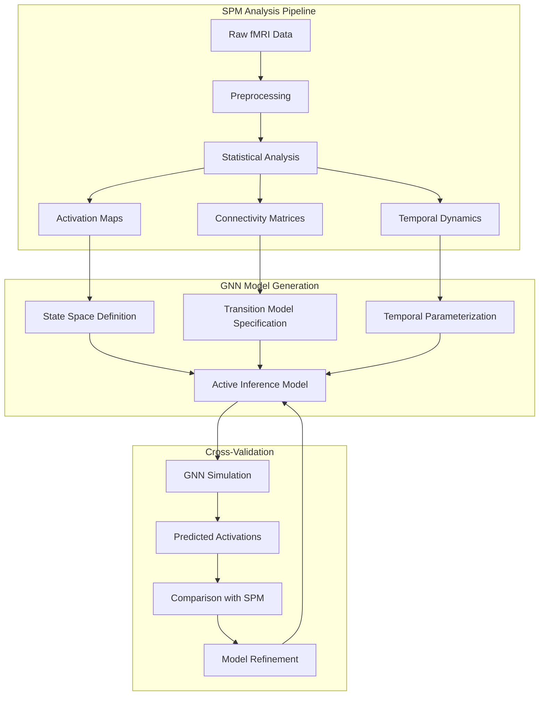

# SPM-GNN Integration: Comprehensive Connection Analysis

> **📋 Document Metadata**  
> **Type**: Integration Analysis | **Audience**: Neuroscientists, AI Researchers, Developers  
> **Complexity**: Advanced | **Last Updated**: January 2025  
> **Cross-References**: [SPM Overview](spm.md) | [GNN Framework Guide](../gnn/framework_integration_guide.md) | [Active Inference Integration](../gnn/gnn_llm_neurosymbolic_active_inference.md)

## Executive Summary

Statistical Parametric Mapping (SPM) and Generalized Notation Notation (GNN) represent complementary approaches to modeling brain function and cognition. SPM provides established statistical frameworks for neuroimaging analysis, while GNN offers formal specification languages for Active Inference generative models. Their integration creates a powerful ecosystem for brain-inspired AI development, enabling the translation of neuroimaging insights into computational cognitive architectures.

## 1. Theoretical Foundations and Conceptual Alignment

### 1.1 Shared Mathematical Frameworks

Both SPM and GNN operate within **Bayesian inference paradigms**, though with different emphases:

**SPM's Statistical Approach:**
- **Mass univariate analysis** at each voxel
- **General Linear Models (GLMs)** for hypothesis testing
- **Random Field Theory (RFT)** for multiple comparisons correction
- **Dynamic Causal Modeling (DCM)** for effective connectivity

**GNN's Generative Modeling Approach:**
- **Active Inference** with variational free energy minimization
- **Generative models** specified as probabilistic graphical models
- **Expected free energy** for action selection
- **Hierarchical Bayesian models** with multiple levels of abstraction

**Integration Point:** GNN can formalize SPM's statistical models as explicit generative models, enabling:
- Translation of GLM designs into GNN specifications
- Formal representation of DCM networks as Active Inference models
- Systematic comparison of different statistical approaches

### 1.2 Cognitive Architecture Alignment

**SPM's Neuroimaging Focus:**
- **Brain region identification** through statistical activation maps
- **Temporal dynamics** via event-related designs
- **Connectivity analysis** through DCM and functional connectivity
- **Population-level inference** with group statistics

**GNN's Computational Focus:**
- **Agent-based modeling** with explicit state spaces
- **Perception-action cycles** through Active Inference
- **Multi-scale temporal dynamics** with hierarchical models
- **Individual agent optimization** with personalized models

**Integration Point:** GNN models can be **calibrated using SPM results**:
- SPM activation maps inform GNN state space design
- DCM connectivity matrices guide GNN transition model specification
- SPM temporal dynamics constrain GNN time horizon parameters

## 2. Technical Integration Pathways

### 2.1 Data Flow Integration



### 2.2 SPM-to-GNN Translation Framework

**Step 1: SPM Analysis Extraction**
```python
# Extract key SPM results for GNN model specification
spm_results = {
    'activation_maps': extract_activation_peaks(spm_output),
    'connectivity_matrix': extract_dcm_connectivity(spm_output),
    'temporal_dynamics': extract_hrf_parameters(spm_output),
    'group_statistics': extract_group_effects(spm_output)
}
```

**Step 2: GNN Model Generation**
```gnn
## SPM-Derived Active Inference Model
### State Space (from SPM activation peaks)
s_brain_regions[N]     # N significant brain regions from SPM
s_temporal[T]          # T time points from HRF analysis
s_connectivity[C]      # C connectivity patterns from DCM

### Observations (from SPM data)
o_voxel_activity[V]    # V voxel time series
o_behavioral[B]        # B behavioral measures
o_experimental[E]      # E experimental conditions

### Actions (from experimental design)
a_cognitive_task[A]    # A task conditions
a_attention_modulation[M]  # M attention states

### Connections (from SPM connectivity)
s_brain_regions > o_voxel_activity    # Regional activation
s_connectivity > s_brain_regions      # Network dynamics
a_cognitive_task > s_brain_regions    # Task modulation

### Initial Parameterization (from SPM statistics)
A = SPMActivationMatrix[N,V]          # From activation maps
B = SPMConnectivityMatrix[N,N,A]      # From DCM results
C = SPMBehavioralPreference[B]        # From behavioral correlations
D = SPMGroupPrior[N]                  # From group statistics
```

### 2.3 GNN-to-SPM Validation Framework

**Step 1: GNN Model Simulation**
```python
# Simulate GNN model to generate predicted activations
gnn_predictions = simulate_active_inference_model(
    gnn_specification,
    experimental_design,
    time_horizon=spm_analysis_length
)
```

**Step 2: SPM-Style Analysis of GNN Outputs**
```python
# Apply SPM statistical analysis to GNN predictions
spm_analysis_of_gnn = apply_spm_analysis(
    predicted_activations=gnn_predictions,
    design_matrix=experimental_design,
    statistical_threshold=0.05
)
```

**Step 3: Cross-Validation**
```python
# Compare SPM analysis of real data vs. GNN predictions
validation_metrics = compare_spm_results(
    real_spm_results=actual_spm_analysis,
    predicted_spm_results=spm_analysis_of_gnn
)
```

## 3. Specific Integration Use Cases

### 3.1 Dynamic Causal Modeling (DCM) ↔ GNN Active Inference

**DCM Approach:**
- **Nonlinear state-space models** in continuous time
- **Directed influences** between neuronal populations
- **Model comparison** using Bayesian model selection
- **Effective connectivity** estimation

**GNN Active Inference Approach:**
- **Discrete-time state transitions** with explicit policies
- **Variational free energy** minimization
- **Expected free energy** for action selection
- **Generative model** specification

**Integration Strategy:**
```gnn
## DCM-Informed GNN Model
### State Space (from DCM regions)
s_dcm_regions[R]      # R regions from DCM analysis
s_dcm_states[S]       # S states per region

### Connections (from DCM effective connectivity)
s_dcm_regions[1] > s_dcm_regions[2]  # DCM connection 1→2
s_dcm_regions[2] > s_dcm_regions[3]  # DCM connection 2→3
s_dcm_regions[3] > s_dcm_regions[1]  # DCM connection 3→1

### Transition Model (from DCM parameters)
B = DCMTransitionMatrix[R,S,R,S]      # From DCM A-matrix
D = DCMStatePrior[R,S]                # From DCM initial states

### Equations
# DCM-inspired Active Inference
F_t = E_q[ln q(s_t) - ln p(o_t,s_t|DCM_params)]
G_π = EFE_epistemic + EFE_pragmatic
π* = argmin_π G(π)
```

### 3.2 Voxel-Based Morphometry (VBM) ↔ GNN Structural Models

**VBM Approach:**
- **Anatomical differences** through voxel-wise comparison
- **Gray matter concentration** analysis
- **Statistical parametric mapping** of structural changes
- **Population-level inference**

**GNN Structural Modeling:**
- **Hierarchical state spaces** with structural constraints
- **Multi-scale representations** from voxels to regions
- **Structural priors** in generative models
- **Individual differences** through personalized parameters

**Integration Strategy:**
```gnn
## VBM-Informed GNN Structural Model
### Hierarchical State Space
s_voxel_level[V]      # V voxels (from VBM analysis)
s_region_level[R]      # R regions (anatomical parcellation)
s_network_level[N]     # N networks (functional connectivity)

### Structural Constraints (from VBM)
s_voxel_level > s_region_level    # Voxel-to-region mapping
s_region_level > s_network_level  # Region-to-network mapping

### Structural Priors (from VBM statistics)
D_voxel = VBMGrayMatterPrior[V]      # Gray matter concentration
D_region = VBMRegionalPrior[R]        # Regional volume
D_network = VBMNetworkPrior[N]        # Network integrity

### Equations
# VBM-constrained Active Inference
F_t = E_q[ln q(s_t) - ln p(o_t,s_t|VBM_structure)]
StructuralConstraint = VBMAnatomicalConstraint(s_t)
```

### 3.3 Event-Related fMRI ↔ GNN Temporal Dynamics

**SPM Event-Related Approach:**
- **Hemodynamic response function (HRF)** modeling
- **Event-related designs** with precise timing
- **Temporal convolution** of neural responses
- **Statistical inference** at each time point

**GNN Temporal Modeling:**
- **Discrete-time dynamics** with explicit policies
- **Multi-scale temporal processing** (fast/slow dynamics)
- **Predictive coding** with temporal expectations
- **Action-perception cycles** with temporal horizons

**Integration Strategy:**
```gnn
## Event-Related GNN Model
### Temporal State Space
s_neural_response[T]   # T time points (from HRF)
s_cognitive_state[C]   # C cognitive states
s_temporal_hierarchy[H] # H hierarchical time scales

### Temporal Dynamics (from HRF parameters)
s_neural_response > s_cognitive_state    # Neural-to-cognitive mapping
s_cognitive_state > s_temporal_hierarchy # Cognitive-to-temporal mapping

### Temporal Parameters (from HRF analysis)
HRF_PeakTime = 5.0      # From HRF peak analysis
HRF_Dispersion = 1.0    # From HRF width analysis
HRF_Undershoot = 0.3    # From HRF undershoot

### Equations
# HRF-informed Active Inference
F_t = E_q[ln q(s_t) - ln p(o_t,s_t|HRF_params)]
TemporalConstraint = HRFTemporalConstraint(s_t)
```

## 4. Implementation Architecture

### 4.1 SPM-GNN Bridge Module

```python
class SPMGNNBridge:
    """Bridge between SPM analysis results and GNN model specification."""
    
    def __init__(self):
        self.spm_parser = SPMAnalysisParser()
        self.gnn_generator = GNNModelGenerator()
        self.validation_engine = CrossValidationEngine()
    
    def spm_to_gnn(self, spm_results: Dict, experimental_design: Dict) -> str:
        """Convert SPM analysis results to GNN specification."""
        
        # Extract SPM components
        activation_maps = self.spm_parser.extract_activations(spm_results)
        connectivity_matrix = self.spm_parser.extract_connectivity(spm_results)
        temporal_params = self.spm_parser.extract_temporal(spm_results)
        
        # Generate GNN specification
        gnn_spec = self.gnn_generator.create_from_spm(
            activation_maps=activation_maps,
            connectivity_matrix=connectivity_matrix,
            temporal_params=temporal_params,
            experimental_design=experimental_design
        )
        
        return gnn_spec
    
    def validate_gnn_against_spm(self, gnn_spec: str, spm_results: Dict) -> Dict:
        """Validate GNN model predictions against SPM results."""
        
        # Simulate GNN model
        gnn_predictions = self.simulate_gnn_model(gnn_spec)
        
        # Apply SPM analysis to predictions
        predicted_spm = self.apply_spm_analysis(gnn_predictions)
        
        # Compare with actual SPM results
        validation_metrics = self.validation_engine.compare_results(
            actual_spm=spm_results,
            predicted_spm=predicted_spm
        )
        
        return validation_metrics
```

### 4.2 GNN-SPM Validation Pipeline

```python
class GNNSPMValidator:
    """Validate GNN models using SPM statistical frameworks."""
    
    def __init__(self):
        self.spm_interface = SPMInterface()
        self.gnn_simulator = GNNSimulator()
        self.statistical_analyzer = StatisticalAnalyzer()
    
    def validate_model(self, gnn_model: str, experimental_data: Dict) -> Dict:
        """Comprehensive validation of GNN model using SPM methods."""
        
        # Step 1: Simulate GNN model
        gnn_simulation = self.gnn_simulator.simulate(
            gnn_model, experimental_data
        )
        
        # Step 2: Apply SPM analysis to simulation
        spm_analysis = self.spm_interface.analyze_simulation(
            simulation_data=gnn_simulation,
            design_matrix=experimental_data['design']
        )
        
        # Step 3: Compare with real data analysis
        comparison = self.statistical_analyzer.compare_analyses(
            real_analysis=experimental_data['spm_results'],
            simulated_analysis=spm_analysis
        )
        
        return {
            'gnn_simulation': gnn_simulation,
            'spm_analysis': spm_analysis,
            'validation_metrics': comparison
        }
```

## 5. Advanced Integration Scenarios

### 5.1 Multi-Modal Integration (fMRI + MEG + EEG)

**SPM Multi-Modal Approach:**
- **Separate analysis** of each modality
- **Statistical fusion** of results
- **Temporal alignment** across modalities
- **Source reconstruction** for MEG/EEG

**GNN Multi-Modal Modeling:**
- **Unified generative model** across modalities
- **Cross-modal predictions** and constraints
- **Hierarchical temporal dynamics**
- **Multi-scale representations**

**Integration Strategy:**
```gnn
## Multi-Modal GNN Model
### Multi-Modal State Space
s_fmri_regions[F]      # F fMRI regions
s_meg_sources[M]        # M MEG sources
s_eeg_channels[E]       # E EEG channels
s_unified_state[U]      # U unified state representation

### Cross-Modal Connections
s_fmri_regions > s_unified_state    # fMRI contribution
s_meg_sources > s_unified_state     # MEG contribution
s_eeg_channels > s_unified_state    # EEG contribution
s_unified_state > s_fmri_regions    # Unified predictions
s_unified_state > s_meg_sources     # Unified predictions
s_unified_state > s_eeg_channels    # Unified predictions

### Multi-Modal Observations
o_fmri_voxels[V]        # V fMRI voxels
o_meg_sensors[S]        # S MEG sensors
o_eeg_electrodes[L]     # L EEG electrodes

### Cross-Modal Likelihood
A_fmri = FMRIObservationModel[V,U]      # fMRI likelihood
A_meg = MEGObservationModel[S,U]        # MEG likelihood
A_eeg = EEGObservationModel[L,U]        # EEG likelihood
```

### 5.2 Population-Level Modeling

**SPM Population Approach:**
- **Random effects analysis** for group inference
- **Mixed-effects models** for individual differences
- **Meta-analysis** across studies
- **Statistical parametric mapping** at population level

**GNN Population Modeling:**
- **Hierarchical generative models** with population priors
- **Individual-specific parameters** within population constraints
- **Meta-learning** across individuals
- **Personalized Active Inference** agents

**Integration Strategy:**
```gnn
## Population-Level GNN Model
### Hierarchical State Space
s_population_level[P]   # P population parameters
s_individual_level[I]   # I individual parameters
s_neural_level[N]       # N neural states

### Hierarchical Connections
s_population_level > s_individual_level  # Population constraints
s_individual_level > s_neural_level      # Individual dynamics

### Population Priors (from SPM group analysis)
D_population = SPMGroupPrior[P]         # Group-level priors
D_individual = SPMIndividualPrior[I]     # Individual differences
D_neural = SPMNeuralPrior[N]            # Neural state priors

### Equations
# Population-informed Active Inference
F_t = E_q[ln q(s_t) - ln p(o_t,s_t|population_params)]
PopulationConstraint = SPMGroupConstraint(s_t)
```

## 6. Practical Implementation Guidelines

### 6.1 Data Format Standards

**SPM Data Formats:**
- **NIFTI-1** for image data
- **SPM.mat** for analysis parameters
- **SPM.xY** for design matrices
- **SPM.xX** for statistical results

**GNN Data Formats:**
- **JSON** for model specifications
- **YAML** for configuration files
- **HDF5** for simulation results
- **CSV** for behavioral data

**Integration Standards:**
```python
# Standard data conversion pipeline
def convert_spm_to_gnn_format(spm_file: str) -> Dict:
    """Convert SPM analysis results to GNN-compatible format."""
    
    # Load SPM results
    spm_data = load_spm_results(spm_file)
    
    # Extract key components
    activation_data = extract_activation_data(spm_data)
    connectivity_data = extract_connectivity_data(spm_data)
    temporal_data = extract_temporal_data(spm_data)
    
    # Convert to GNN format
    gnn_data = {
        'activation_maps': activation_data,
        'connectivity_matrices': connectivity_data,
        'temporal_parameters': temporal_data,
        'metadata': {
            'source': 'SPM',
            'version': spm_data['version'],
            'analysis_date': spm_data['date']
        }
    }
    
    return gnn_data
```

### 6.2 Validation Protocols

**SPM Validation:**
- **Statistical significance** testing
- **Multiple comparisons** correction
- **Effect size** estimation
- **Reproducibility** assessment

**GNN Validation:**
- **Model fit** to training data
- **Generalization** to test data
- **Predictive accuracy** assessment
- **Computational efficiency** evaluation

**Integrated Validation:**
```python
def integrated_validation_protocol(spm_results: Dict, gnn_model: str) -> Dict:
    """Comprehensive validation protocol combining SPM and GNN approaches."""
    
    # SPM-style validation of GNN predictions
    gnn_predictions = simulate_gnn_model(gnn_model)
    spm_analysis_of_gnn = apply_spm_analysis(gnn_predictions)
    
    # Statistical comparison
    statistical_comparison = compare_statistical_results(
        spm_results, spm_analysis_of_gnn
    )
    
    # Effect size comparison
    effect_size_comparison = compare_effect_sizes(
        spm_results, spm_analysis_of_gnn
    )
    
    # Reproducibility assessment
    reproducibility_assessment = assess_reproducibility(
        spm_results, gnn_model
    )
    
    return {
        'statistical_comparison': statistical_comparison,
        'effect_size_comparison': effect_size_comparison,
        'reproducibility_assessment': reproducibility_assessment
    }
```

## 7. Future Directions and Research Opportunities

### 7.1 Advanced Integration Scenarios

**Real-Time Integration:**
- **Online SPM analysis** during data collection
- **Real-time GNN model updating** based on SPM results
- **Adaptive experimental design** using Active Inference
- **Dynamic model selection** based on statistical evidence

**Large-Scale Integration:**
- **Big data neuroimaging** with GNN scalability
- **Multi-site studies** with distributed GNN models
- **Longitudinal analysis** with temporal GNN models
- **Cross-species modeling** with comparative GNN frameworks

### 7.2 Emerging Research Areas

**Clinical Applications:**
- **Personalized medicine** using SPM-GNN integration
- **Disease progression modeling** with Active Inference
- **Treatment response prediction** using GNN models
- **Biomarker discovery** through integrated analysis

**Cognitive Neuroscience:**
- **Computational psychiatry** with SPM-GNN models
- **Developmental modeling** across lifespan
- **Learning and plasticity** in Active Inference frameworks
- **Consciousness research** with integrated models

## 8. Conclusion

The integration of SPM and GNN represents a powerful convergence of established neuroimaging methods with cutting-edge computational cognitive modeling. This integration enables:

1. **Formal specification** of neuroimaging models as Active Inference agents
2. **Systematic validation** of computational models against empirical data
3. **Bidirectional translation** between statistical and generative approaches
4. **Novel insights** into brain function through computational modeling
5. **Clinical applications** with personalized computational models

The SPM-GNN integration framework provides a robust foundation for advancing both neuroimaging analysis and computational cognitive science, bridging the gap between empirical neuroscience and artificial intelligence research.

## References

[1] Friston, K. J., et al. (1994). Statistical parametric maps in functional imaging: A general linear approach. *Human Brain Mapping*, 2(4), 189-210.

[2] Friston, K. J., et al. (2003). Dynamic causal modeling. *NeuroImage*, 19(4), 1273-1302.

[3] Friston, K. J. (2010). The free-energy principle: a unified brain theory? *Nature Reviews Neuroscience*, 11(2), 127-138.

[4] Parr, T., et al. (2022). Active inference: the free energy principle in mind, brain, and behavior. *MIT Press*.

[5] Generalized Notation Notation Documentation (2025). *GNN Framework Integration Guide*.

[6] SPM Software Package Documentation (2025). *Statistical Parametric Mapping Overview*.

[7] Active Inference Institute (2025). *Active Inference Framework Documentation*.

[8] Neuroimaging Data Format Standards (2025). *NIFTI-1 Specification*.

[9] Bayesian Model Comparison Methods (2025). *Model Selection in Neuroimaging*.

[10] Computational Cognitive Neuroscience (2025). *Integration of Empirical and Computational Approaches*. 