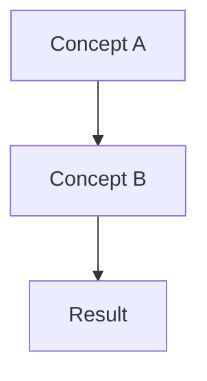

# GNN Documentation Style Guide

> **📋 Document Metadata**  
> **Type**: Style Guide | **Audience**: Contributors, Documentation Team | **Complexity**: Reference  
> **Last Updated: October 2025 | **Status**: Production-Ready  
> **Cross-References**: [Contributing Guide](../CONTRIBUTING.md) | [Development Guide](development/README.md) | [Testing Guide](testing/README.md)

## Overview

This style guide ensures consistency, quality, and accessibility across all GNN project documentation. It covers writing standards, formatting conventions, technical guidelines, and content structure requirements.

**Documentation Philosophy**: Clear, actionable, and scientifically rigorous documentation that serves both beginners and experts.

## 📝 **Writing Standards**

### **Voice and Tone**

**Professional and Accessible**:
- Use clear, direct language
- Explain technical concepts without unnecessary jargon
- Include context for Active Inference and category theory concepts
- Maintain scientific rigor while being approachable

**Examples**:
```markdown
✅ Good: "The GNN type checker validates model syntax and estimates computational resources."

❌ Avoid: "The type checker thing checks if your model is good and tells you how much memory it might use."

✅ Good: "Active Inference agents minimize expected free energy by optimizing their beliefs and actions."

❌ Avoid: "AI agents try to do the right thing by predicting stuff."
```

### **Clarity and Concision**

**Structure for Scanning**:
- Use informative headings and subheadings
- Include tables of contents for long documents
- Provide quick reference sections
- Use bullet points and numbered lists effectively

**Information Hierarchy**:
```markdown
# Document Title (H1)
> **Document metadata block**

## Major Section (H2)
Brief section overview

### Subsection (H3)
Detailed content

#### Technical Details (H4)
Implementation specifics
```

### **Accuracy and Currency**

**Technical Accuracy**:
- Verify all code examples execute correctly
- Test all links and cross-references
- Validate mathematical notation and formulas
- Ensure framework compatibility information is current

**Content Freshness**:
- Include "Last Updated" dates on all documents
- Review and update dependencies regularly
- Maintain version compatibility matrices
- Flag deprecated features clearly

## 🎨 **Formatting Conventions**

### **Document Metadata Block**

**Standard Metadata Format**:
```markdown
> **📋 Document Metadata**  
> **Type**: [Guide|Reference|Tutorial|API|Examples] | **Audience**: [Beginners|Practitioners|Developers|Researchers] | **Complexity**: [Beginner|Intermediate|Advanced]  
> **Last Updated: October 2025 | **Status**: [Draft|Review|Production-Ready]  
> **Cross-References**: [Link 1](path) | [Link 2](path) | [Link 3](path)
```

### **Headings and Structure**

**Heading Hierarchy**:
```markdown
# Document Title (H1) - Only one per document
## Major Sections (H2) - Main content divisions
### Subsections (H3) - Detailed topics
#### Technical Details (H4) - Implementation specifics
##### Notes (H5) - Rarely used, for fine details
```

**Section Formatting**:
```markdown
## 🎯 **Section Title with Emoji**

> **📊 Context Block** | **🔗 Related Topics**

Content overview paragraph...

### **Subsection with Bold Title**

Detailed content...
```

### **Code and Technical Elements**

**Inline Code**:
- Use backticks for file names: `config.yaml`
- Use backticks for variable names: `s_f0`, `o_m1`
- Use backticks for commands: `python main.py`
- Use backticks for GNN syntax elements: `s_f0[3,1,type=int]`

**Code Blocks**:
```markdown
```python
# Always include language identifier
# Add descriptive comments
def gnn_parse_example():
    """Clear docstring with purpose."""
    return result
```

```yaml
# Configuration examples
gnn_config:
  version: "1.1.0"
  features: [validation, visualization]
```

```bash
# Command line examples with clear context
cd src
python main.py --only-steps 1_gnn
```
```

**Mathematical Notation**:
- Inline math: `\( P(s_t|o_t) \)`
- Block math: `\[ G = E_q[\ln q(s_t) - \ln p(s_t|o_t)] \]`
- Use LaTeX notation consistently
- Define variables and notation clearly

### **Links and Cross-References**

**Internal Links**:
```markdown
[Document Title](relative/path/to/document.md)
[Specific Section](document.md#section-anchor)
[Cross-Reference](../other/document.md#relevant-section)
```

**External Links**:
```markdown
[Active Inference Institute](https://activeinference.org)
[GitHub Repository](https://github.com/ActiveInferenceInstitute/GeneralizedNotationNotation)
```

**Reference Citations**:
```markdown
See [FR23] for foundational theory and [SM24] for implementation details.

## References

- [FR23] Friston, K., et al. (2023). Active Inference: The Free Energy Principle in Mind, Brain, and Behavior.
- [SM24] Smith, J., & Miller, A. (2024). Computational Frameworks for Active Inference.
```

### **Visual Elements**

**Tables**:
```markdown
| Component | Purpose | Status | Documentation |
|-----------|---------|--------|---------------|
| Type Checker | Validation | ✅ Complete | [Link](path) |
| Visualizer | Diagrams | 🔄 In Progress | [Link](path) |
| Renderer | Code Gen | ✅ Complete | [Link](path) |
```

**Callout Boxes**:
```markdown
> **⚠️ Important**: Critical information that affects functionality

> **💡 Tip**: Helpful suggestions for better usage

> **🔗 Cross-Reference**: Related documentation links

> **📊 Metrics**: Quantitative information and statistics

> **🎯 Example**: Practical examples and use cases
```

**Status Indicators**:
- ✅ Complete/Working
- 🔄 In Progress
- ❌ Not Working/Deprecated
- 🚧 Under Construction
- 📋 Documentation

## 🎯 **Quality Assurance**

### **Documentation Review Process**

**Pre-Publication Checklist**:
- [ ] **Accuracy**: All code examples tested and working
- [ ] **Completeness**: All required sections present
- [ ] **Consistency**: Follows style guide conventions
- [ ] **Accessibility**: Clear for target audience
- [ ] **Currency**: Information is up-to-date
- [ ] **Links**: All cross-references work correctly
- [ ] **Grammar**: Spell-checked and proofread

**Review Criteria**:
```markdown
## Document Review Scorecard

### Content Quality (40%)
- [ ] Achieves stated purpose
- [ ] Accurate and current information
- [ ] Appropriate technical depth
- [ ] Clear examples and use cases

### Structure & Navigation (25%)
- [ ] Logical organization
- [ ] Effective headings and sections
- [ ] Good cross-reference network
- [ ] Easy to scan and search

### Writing Quality (20%)
- [ ] Clear and concise prose
- [ ] Consistent terminology
- [ ] Appropriate tone and voice
- [ ] Error-free grammar and spelling

### Technical Execution (15%)
- [ ] Working code examples
- [ ] Correct syntax highlighting
- [ ] Proper formatting
- [ ] Valid links and references
```

### **Content Standards by Document Type**

**📖 Guides and Tutorials**:
- Include hands-on examples
- Provide step-by-step instructions
- Anticipate common errors
- Include troubleshooting sections
- Offer multiple difficulty levels

**📚 Reference Documentation**:
- Comprehensive parameter listings
- Complete API coverage
- Cross-reference related functions
- Include usage examples
- Maintain version compatibility

**🎯 Examples and Case Studies**:
- Real-world applicability
- Complete working examples
- Clear setup instructions
- Expected outputs shown
- Extension opportunities

**🔧 Technical Specifications**:
- Precise mathematical notation
- Complete algorithm descriptions
- Performance characteristics
- Implementation constraints
- Validation procedures

### **Maintenance Standards**

**Regular Review Schedule**:
- **Monthly**: Check external links and dependencies
- **Quarterly**: Review accuracy of technical content
- **Bi-annually**: Major structure and organization review
- **Annually**: Comprehensive content audit

**Version Control Integration**:
```bash
# Documentation change workflow
git checkout -b docs/update-integration-guide
# Make documentation changes
git add doc/framework_integration_guide.md
git commit -m "docs: update PyMDP integration patterns

- Add error handling examples
- Update performance benchmarks  
- Fix broken links to API reference"
git push origin docs/update-integration-guide
```

**Deprecation Protocol**:
1. **Warning Phase** (2 releases): Mark as deprecated with replacement guidance
2. **Migration Phase** (2 releases): Provide migration tools and updated examples
3. **Removal Phase** (1 release): Remove deprecated content, keep redirects

### **Performance Standards**

**Documentation Performance Metrics**:
- **Load Time**: Documentation site loads < 3 seconds
- **Search**: Full-text search returns results < 1 second
- **Navigation**: Max 3 clicks to reach any information
- **Mobile**: All content accessible on mobile devices

**Content Effectiveness Metrics**:
- **Completion Rate**: Users complete intended workflows
- **Error Reduction**: Common errors decrease over time
- **Support Reduction**: Documentation reduces support requests
- **User Satisfaction**: Positive feedback on clarity and usefulness

## 🌟 **Advanced Documentation Patterns**

### **Interactive Documentation**

**Executable Examples**:
```markdown
## Live Example

```python
# This example can be run directly
from src.gnn import GNNModel

model = GNNModel.from_file("example.md")
print(f"Model has {len(model.state_space)} state variables")
# Expected output: Model has 3 state variables
```

Try it yourself:
[🚀 Run in Colab](link) | [📝 Edit on GitHub](link)
```

**Progressive Disclosure**:
```markdown
## Basic Usage

Simple example for beginners...

<details>
<summary><strong>🔧 Advanced Configuration</strong></summary>

Complex configuration options for power users...

</details>

<details>
<summary><strong>⚙️ Expert Customization</strong></summary>

Deep technical details for experts...

</details>
```

### **Multi-Modal Documentation**

**Visual Learning Support**:
```markdown
## Concept Explanation

Text explanation of the concept...



**🎥 Video Tutorial**: [Watch explanation](link)  
**🎮 Interactive Demo**: [Try it yourself](link)  
**📊 Infographic**: [Visual summary](link)
```

**Accessibility Features**:
- Alt text for all images and diagrams
- High contrast color schemes
- Screen reader compatible markup
- Keyboard navigation support
- Multiple format availability (HTML, PDF, EPUB)

---

## 📋 **Quick Reference**

### **Common Patterns**

**Document Start Template**:
```markdown
# Document Title

> **📋 Document Metadata**  
> **Type**: Guide | **Audience**: Developers | **Complexity**: Intermediate  
> **Last Updated: October 2025 | **Status**: Production-Ready  
> **Cross-References**: [Link 1](path) | [Link 2](path)

## Overview

Brief description of document purpose and scope.

## Table of Contents

- [Section 1](#section-1)
- [Section 2](#section-2)
- [Resources](#resources)
```

**Section Template**:
```markdown
## 🎯 **Section Title**

> **Context**: Brief section overview | **Prerequisites**: What users need to know

### **Core Content**

Main content with examples...

### **Common Issues**

Known problems and solutions...

### **Next Steps**

What to do after completing this section...
```

**Code Example Template**:
```markdown
### **Example: [Descriptive Title]**

**Purpose**: What this example demonstrates

**Prerequisites**: What you need before starting

```python
# Clear, commented code
def example_function():
    """Descriptive docstring."""
    return result
```

**Expected Output**:
```
Clean output example
```

**Explanation**: Why this works and how to adapt it
```

---

## Related Documentation

- **[Contributing Guide](../CONTRIBUTING.md)**: How to contribute to GNN documentation
- **[Testing Guide](testing/README.md)**: Documentation testing procedures  
- **[Development Guide](development/README.md)**: Development workflow integration
- **[Templates](templates/README.md)**: Ready-to-use documentation templates

---

**Last Updated: October 2025  
**Style Guide Version**: 2.0  
**Review Cycle**: Quarterly (Next: September 2025)  
**Status**: Production-Ready
- 🔗 Cross-Reference
- 💡 Tip/Suggestion
- ⚠️ Warning/Important

## 🔧 **Content Guidelines**

### **GNN-Specific Terminology**

**Active Inference Terms**:
- **Hidden States**: Use `s_f0`, `s_f1` notation
- **Observations**: Use `o_m0`, `o_m1` notation  
- **Actions/Control**: Use `u_c0`, `π_c0` notation
- **Matrices**: `A` (likelihood), `B` (transition), `C` (preferences), `D` (priors)

**GNN Syntax Elements**:
```markdown
- Variables: `s_f0[3,1,type=int]`
- Connections: `s_f0 > o_m0` (directed), `s_f0 - s_f1` (undirected)
- Equations: `\( P(o_t|s_t) = A \cdot s_t \)`
- Comments: `### This is a GNN comment`
```

**Framework References**:
- **PyMDP**: Python Active Inference framework
- **RxInfer.jl**: Julia Bayesian inference framework
- **DisCoPy**: Category theory and quantum computing framework
- **JAX**: High-performance numerical computing

### **Examples and Tutorials**

**Progressive Complexity**:
1. **Basic Examples**: Simple, single-concept demonstrations
2. **Intermediate Examples**: Multiple concepts with clear explanations
3. **Advanced Examples**: Complex, real-world applications

**Example Structure**:
```markdown
### Example: [Descriptive Title]

**Objective**: What this example demonstrates
**Prerequisites**: Required knowledge/previous examples
**Complexity**: Beginner/Intermediate/Advanced
**Estimated Time**: X minutes

#### Problem Description
Clear explanation of what we're modeling...

#### GNN Implementation
```gnn
## GNNVersionAndFlags
version: 1.1.0

## ModelName
ExampleModel

[... complete example ...]
```

#### Explanation
Step-by-step breakdown of the model...

#### Running the Example
```bash
cd src
python main.py example.md
```

#### Expected Output
Description of what should happen...

#### Next Steps
- Try modifying parameter X to see Y
- Explore related example Z
- Read documentation section W
```

### **API Documentation**

**Function Documentation**:
```python
def gnn_parse_model(file_path: str, validation: bool = True) -> GNNModel:
    """Parse a GNN model file and return structured representation.
    
    This function reads a GNN file, validates its syntax, and creates
    a structured model object for further processing.
    
    Args:
        file_path: Path to the GNN file to parse
        validation: Whether to perform strict syntax validation
        
    Returns:
        GNNModel object containing parsed model structure
        
    Raises:
        GNNSyntaxError: If the file contains invalid GNN syntax
        FileNotFoundError: If the specified file doesn't exist
        
    Example:
        >>> model = gnn_parse_model("examples/basic_model.md")
        >>> print(model.state_space)
        ['s_f0[3,1,type=int]', 'o_m0[2,1,type=int]']
    """
```

**Class Documentation**:
```python
class GNNTypeChecker:
    """Validates GNN model syntax and estimates computational resources.
    
    The type checker performs comprehensive validation of GNN files,
    including syntax checking, type validation, and resource estimation
    for different computational backends.
    
    Attributes:
        strict_mode: Whether to enforce strict syntax validation
        resource_estimation: Whether to calculate resource requirements
        
    Example:
        >>> checker = GNNTypeChecker(strict_mode=True)
        >>> result = checker.check_file("model.md")
        >>> print(result.is_valid)
        True
    """
```

## 📊 **Quality Assurance**

### **Content Review Checklist**

**Technical Accuracy**:
- [ ] All code examples execute without errors
- [ ] Mathematical notation is correct and consistent
- [ ] Framework versions and compatibility are current
- [ ] Cross-references link to existing content

**Writing Quality**:
- [ ] Clear, concise language appropriate for target audience
- [ ] Proper grammar, spelling, and punctuation
- [ ] Consistent terminology throughout document
- [ ] Logical information flow and structure

**Formatting Standards**:
- [ ] Document metadata block is complete and accurate
- [ ] Headings follow hierarchical structure
- [ ] Code blocks have proper syntax highlighting
- [ ] Tables and lists are properly formatted

**Accessibility**:
- [ ] Alt text for images and diagrams
- [ ] Descriptive link text (not "click here")
- [ ] Clear section headings for navigation
- [ ] Consistent visual hierarchy

### **Automated Quality Checks**

**Link Validation**:
```bash
# Check for broken links
markdown-link-check doc/**/*.md

# Validate cross-references
python scripts/validate_cross_references.py
```

**Spell Check**:
```bash
# Spell check with technical dictionary
aspell check --mode=markdown --add-extra-dicts=./tech-dictionary.txt doc/**/*.md
```

**Style Linting**:
```bash
# Markdown style checking
markdownlint doc/**/*.md

# Prose style checking
write-good doc/**/*.md
```

## 🔄 **Documentation Workflow**

### **Content Creation Process**

1. **Planning Phase**:
   - Identify target audience and learning objectives
   - Review existing documentation for gaps
   - Plan content structure and cross-references

2. **Writing Phase**:
   - Follow style guide conventions
   - Include practical examples and code
   - Add comprehensive cross-references

3. **Review Phase**:
   - Technical accuracy review by domain expert
   - Style and clarity review by documentation team
   - Accessibility review for inclusive design

4. **Publication Phase**:
   - Final formatting and metadata updates
   - Cross-reference validation
   - Integration with documentation navigation

### **Maintenance and Updates**

**Regular Updates**:
- Monthly link validation and dead link fixing
- Quarterly content freshness review
- Semi-annual style guide compliance audit
- Annual comprehensive documentation overhaul

**Change Management**:
- Update documentation with every code release
- Maintain backward compatibility information
- Archive deprecated content appropriately
- Version control all documentation changes

## 📚 **Resources and Tools**

### **Writing Tools**

**Recommended Editors**:
- **VS Code**: With Markdown extensions
- **Typora**: WYSIWYG Markdown editor
- **GitBook**: For collaborative editing
- **Notion**: For collaborative planning

**Essential Extensions**:
- Markdown linting and preview
- Spell check with technical dictionaries
- Link validation and cross-reference checking
- Mathematical notation rendering

### **Reference Materials**

**Style Guides**:
- [GitHub Markdown Guide](https://guides.github.com/features/mastering-markdown/)
- [Microsoft Style Guide](https://docs.microsoft.com/en-us/style-guide/)
- [Google Developer Documentation Style Guide](https://developers.google.com/style)

**Technical References**:
- [Active Inference Ontology](https://github.com/ActiveInferenceInstitute/ActiveInferenceOntology)
- [GNN Syntax Specification](gnn/gnn_syntax.md)
- [Framework Documentation](../README.md#framework-integrations)

### **Quality Assurance Tools**

```yaml
# Documentation QA pipeline
qa_tools:
  link_checking: markdown-link-check
  spell_check: aspell
  style_linting: markdownlint
  prose_quality: write-good
  accessibility: axe-core
  
automation:
  pre_commit_hooks: [link-check, spell-check, style-lint]
  ci_pipeline: [full-validation, cross-reference-check]
  scheduled_checks: [monthly-link-validation, quarterly-content-review]
```

---

**Last Updated: October 2025  
**Style Guide Version**: 2.0  
**Maintained By**: GNN Documentation Team  
**Next Review**: September 2025 