# GNN Debugging Workflows

> **📋 Document Metadata**  
> **Type**: Procedural Guide | **Audience**: Users, Developers | **Complexity**: Intermediate  
> **Cross-References**: [Error Taxonomy](error_taxonomy.md) | [Common Errors](common_errors.md) | [Performance Guide](../performance/README.md)

## Overview

This document provides systematic, step-by-step debugging workflows for diagnosing and resolving issues in the GNN (Generalized Notation Notation) system. Each workflow is designed to minimize time-to-resolution and prevent future occurrences.

## General Debugging Methodology

### 🔍 **Universal Debugging Process**

```mermaid
flowchart TD
    A[🚨 Error Encountered] --> B[📋 Collect Context]
    B --> C[🔍 Identify Error Type]
    C --> D{Error Category?}
    D -->|Syntax| E[📝 Syntax Workflow]
    D -->|Validation| F[✅ Validation Workflow]
    D -->|Runtime| G[⚡ Runtime Workflow]
    D -->|Integration| H[🔗 Integration Workflow]
    D -->|Performance| I[📊 Performance Workflow]
    E --> J[🛠️ Apply Fix]
    F --> J
    G --> J
    H --> J
    I --> J
    J --> K[✅ Validate Solution]
    K --> L{Fixed?}
    L -->|Yes| M[📝 Document Solution]
    L -->|No| N[🔄 Escalate/Research]
    N --> B
```



### 📋 **Context Collection Checklist**

Before starting any debugging workflow, collect the following information:

```bash
# 1. Environment Information
python --version
pip list | grep -E "(pymdp|jax|discopy|networkx)"
cat /etc/os-release  # Linux
sw_vers  # macOS

# 2. Error Context
python src/main.py --verbose --target-dir problem_file.md > debug.log 2>&1

# 3. System Resources
free -h  # Memory
df -h    # Disk space
top      # CPU usage

# 4. File Information
ls -la problem_file.md
file problem_file.md
wc -l problem_file.md
```

---

## Syntax Error Debugging Workflow

### 🎯 **When to Use**: Error codes SYN-xxx, parsing failures, malformed GNN files

### **Step 1: File Structure Validation**

```bash
# Quick syntax check
python src/main.py --only-steps 1,4 --strict --target-dir your_file.md

# Manual structure check
grep -n "^##" your_file.md | head -10
```

**Expected Output**:
```
1:## GNNVersionAndFlags
5:## ModelName
8:## ModelAnnotation
12:## StateSpaceBlock
25:## Connections
35:## InitialParameterization
```

**🚨 Red Flags**:
- Missing required sections
- Wrong header levels (`#` vs `##`)
- Non-ASCII characters in headers

### **Step 2: Variable Declaration Analysis**

```bash
# Extract variable declarations
grep -n "^\s*[so_][fm][0-9]" your_file.md

# Check for common syntax errors
grep -n -E "\s+\[|\[[^0-9]|type=[^c]" your_file.md
```

**Common Issues**:
```bash
# ❌ Wrong: spaces in variable names
s_factor 0[2,1,type=categorical]

# ✅ Correct: underscores
s_factor_0[2,1,type=categorical]

# ❌ Wrong: missing brackets
s_f0 2,1,type=categorical

# ✅ Correct: proper brackets
s_f0[2,1,type=categorical]
```

### **Step 3: Connection Syntax Verification**

```bash
# Check connection syntax
grep -n -E "^\s*[so_].*[>-].*[so_]" your_file.md

# Look for malformed connections
grep -n -E "[>-]{2,}|[^so_][>-]|[>-][^so_]" your_file.md
```

**Debugging Template**:
```markdown
## Connections
### Valid Examples
s_f0 > o_m0                    # ✅ Directed connection
s_f0 - s_f1                    # ✅ Undirected connection
s_f0, u_c0 > s_f0             # ✅ Multiple inputs

### Invalid Examples  
s_f0 >> o_m0                   # ❌ Double arrow
s_f0 -> o_m0                   # ❌ Wrong arrow style
s_f0 > undefined_var           # ❌ Undefined variable
```

### **Step 4: Encoding and Character Issues**

```bash
# Check file encoding
file -i your_file.md

# Find non-ASCII characters
grep -P '[^\x00-\x7F]' your_file.md

# Remove BOM if present
sed -i '1s/^\xEF\xBB\xBF//' your_file.md
```

---

## Validation Error Debugging Workflow

### 🎯 **When to Use**: Error codes VAL-xxx, dimension mismatches, mathematical inconsistencies

### **Step 1: Dimension Consistency Check**

```python
# Interactive dimension debugging
from src.gnn import GNNModel
from src.gnn_type_checker import TypeChecker

model = GNNModel.from_file("your_file.md")
checker = TypeChecker(strict_mode=True)

# Check variable dimensions
for var_name, var_obj in model.state_space.items():
    print(f"{var_name}: {var_obj.dimensions} ({var_obj.var_type})")

# Check matrix dimensions
result = checker.check_model(model)
for error in result.errors:
    print(f"ERROR: {error}")
```

### **Step 2: Matrix Validation**

```python
# Validate A matrices
import numpy as np

def validate_A_matrix(A, num_obs, num_states):
    """Validate A matrix dimensions and stochasticity"""
    expected_shape = (num_obs, num_states)
    if A.shape != expected_shape:
        print(f"❌ Shape mismatch: expected {expected_shape}, got {A.shape}")
        return False
    
    if not np.allclose(A.sum(axis=0), 1.0):
        print(f"❌ Columns don't sum to 1: {A.sum(axis=0)}")
        return False
    
    if np.any(A < 0) or np.any(A > 1):
        print(f"❌ Values outside [0,1]: min={A.min()}, max={A.max()}")
        return False
    
    print("✅ A matrix is valid")
    return True

# Example usage
A_m0 = np.array([[0.9, 0.1], [0.1, 0.9]])
validate_A_matrix(A_m0, num_obs=2, num_states=2)
```

### **Step 3: Connection Consistency**

```python
# Check connection consistency
def validate_connections(model):
    """Validate that all connections reference defined variables"""
    defined_vars = set(model.state_space.keys())
    
    for connection in model.connections:
        if connection.source not in defined_vars:
            print(f"❌ Undefined source: {connection.source}")
        if connection.target not in defined_vars:
            print(f"❌ Undefined target: {connection.target}")
    
    print(f"✅ All connections reference defined variables")

validate_connections(model)
```

---

## Runtime Error Debugging Workflow

### 🎯 **When to Use**: Error codes RUN-xxx, pipeline failures, execution errors

### **Step 1: Environment Diagnosis**

```bash
# Check Python environment
which python
python -c "import sys; print(sys.executable)"
python -c "import sys; print(sys.path)"

# Check virtual environment
echo $VIRTUAL_ENV
pip list --format=freeze > current_packages.txt
diff current_packages.txt requirements.txt
```

### **Step 2: Dependency Validation**

```bash
# Test critical imports
python -c "import numpy; print('NumPy:', numpy.__version__)"
python -c "import pymdp; print('PyMDP:', pymdp.__version__)"
python -c "import jax; print('JAX:', jax.__version__)"
python -c "import discopy; print('DisCoPy:', discopy.__version__)"

# Test GPU availability (if using JAX)
python -c "import jax; print('Devices:', jax.devices())"
```

### **Step 3: Resource Monitoring**

```bash
# Monitor pipeline execution
python src/main.py --verbose --target-dir your_file.md &
PIPELINE_PID=$!

# Monitor resources in another terminal
while kill -0 $PIPELINE_PID 2>/dev/null; do
    echo "$(date): Memory: $(free -h | grep Mem | awk '{print $3}')"
    echo "$(date): CPU: $(top -bn1 | grep 'Cpu(s)' | awk '{print $2}')"
    sleep 5
done
```

### **Step 4: Step-by-Step Isolation**

```bash
# Test individual pipeline steps
for step in {1..13}; do
    echo "Testing step $step..."
    timeout 300 python src/main.py --only-steps $step --target-dir your_file.md
    if [ $? -eq 0 ]; then
        echo "✅ Step $step passed"
    else
        echo "❌ Step $step failed (exit code: $?)"
        break
    fi
done
```

---

## Integration Error Debugging Workflow

### 🎯 **When to Use**: Error codes INT-xxx, framework-specific failures

### **PyMDP Integration Debugging**

```python
# Test PyMDP integration step by step
import numpy as np
from pymdp import utils
from pymdp.agent import Agent

# 1. Test basic PyMDP functionality
try:
    A = utils.random_A_matrix([2], [2])
    B = utils.random_B_matrix([2], [2])
    agent = Agent(A=A, B=B)
    print("✅ Basic PyMDP functionality working")
except Exception as e:
    print(f"❌ PyMDP basic test failed: {e}")

# 2. Test GNN to PyMDP conversion
from src.render.pymdp import PyMDPRenderer
renderer = PyMDPRenderer()

try:
    code = renderer.render_model(model)
    print("✅ GNN to PyMDP conversion working")
    print(f"Generated code length: {len(code)} characters")
except Exception as e:
    print(f"❌ GNN to PyMDP conversion failed: {e}")
```

### **RxInfer Integration Debugging**

```bash
# 1. Test Julia availability
which julia
julia --version

# 2. Test RxInfer package
julia -e "using Pkg; Pkg.status()"
julia -e "using RxInfer; println(\"RxInfer loaded successfully\")"

# 3. Test TOML generation
python -c "
from src.render.rxinfer import RxInferRenderer
renderer = RxInferRenderer()
try:
    config = renderer.create_toml_config(model)
    print('✅ TOML generation working')
except Exception as e:
    print(f'❌ TOML generation failed: {e}')
"
```

### **DisCoPy Integration Debugging**

```python
# Test DisCoPy functionality
try:
    import discopy
    from discopy import grammar, rigid
    print(f"✅ DisCoPy {discopy.__version__} imported successfully")
    
    # Test basic diagram creation
    x, y, z = rigid.Ty('x'), rigid.Ty('y'), rigid.Ty('z')
    diagram = rigid.Box('f', x, y) >> rigid.Box('g', y, z)
    print("✅ Basic DisCoPy diagram creation working")
    
except ImportError as e:
    print(f"❌ DisCoPy import failed: {e}")
except Exception as e:
    print(f"❌ DisCoPy functionality failed: {e}")

# Test JAX backend
try:
    import jax
    from discopy.tensor import Tensor
    print("✅ JAX backend available")
except Exception as e:
    print(f"❌ JAX backend failed: {e}")
```

---

## Performance Issues Debugging Workflow

### 🎯 **When to Use**: Error codes PERF-xxx, slow execution, resource exhaustion

### **Step 1: Performance Profiling**

```bash
# CPU profiling
python -m cProfile -o profile.stats src/main.py --target-dir your_file.md
python -c "
import pstats
stats = pstats.Stats('profile.stats')
stats.sort_stats('cumulative').print_stats(20)
"

# Memory profiling
python -m memory_profiler src/main.py --target-dir your_file.md

# Line-by-line profiling (if available)
kernprof -l -v src/main.py --target-dir your_file.md
```

### **Step 2: Bottleneck Identification**

```python
# Identify computational bottlenecks
import time
import psutil
import numpy as np

def profile_matrix_operations(dimensions):
    """Profile matrix operations with different sizes"""
    sizes = [10, 100, 500, 1000]
    
    for size in sizes:
        # Create test matrices
        A = np.random.rand(size, size)
        B = np.random.rand(size, size)
        
        # Time matrix multiplication
        start_time = time.time()
        C = np.dot(A, B)
        end_time = time.time()
        
        memory_mb = psutil.Process().memory_info().rss / 1024 / 1024
        
        print(f"Size {size}x{size}: {end_time - start_time:.3f}s, {memory_mb:.1f}MB")

profile_matrix_operations([10, 100, 500, 1000])
```

### **Step 3: Resource Optimization**

```python
# Memory optimization strategies
def optimize_memory_usage():
    """Apply memory optimization techniques"""
    
    # 1. Use appropriate data types
    import numpy as np
    
    # Instead of float64 (default), use float32 for matrices
    A_optimized = np.array([[0.9, 0.1], [0.1, 0.9]], dtype=np.float32)
    
    # 2. Clear intermediate variables
    del A_optimized
    
    # 3. Use generators instead of lists for large datasets
    def data_generator(n):
        for i in range(n):
            yield np.random.rand(10, 10)
    
    # 4. Process in chunks
    def process_large_model(model, chunk_size=100):
        for i in range(0, len(model.connections), chunk_size):
            chunk = model.connections[i:i+chunk_size]
            # Process chunk
            pass

# Monitor memory usage during optimization
import tracemalloc

tracemalloc.start()
# ... run your code ...
current, peak = tracemalloc.get_traced_memory()
print(f"Current memory usage: {current / 1024 / 1024:.1f} MB")
print(f"Peak memory usage: {peak / 1024 / 1024:.1f} MB")
tracemalloc.stop()
```

---

## Advanced Debugging Techniques

### **Interactive Debugging Sessions**

```python
# Set up interactive debugging
import pdb
import ipdb  # Enhanced debugger

# Insert breakpoint in code
def debug_model_parsing(filepath):
    from src.gnn import GNNModel
    
    # Break here to inspect
    pdb.set_trace()  # or ipdb.set_trace()
    
    model = GNNModel.from_file(filepath)
    return model

# Use in problematic scenarios
model = debug_model_parsing("problematic_file.md")
```

### **Custom Debugging Tools**

```python
# Create custom debugging utilities
class GNNDebugger:
    def __init__(self, model):
        self.model = model
        self.debug_info = {}
    
    def inspect_variables(self):
        """Comprehensive variable inspection"""
        for name, var in self.model.state_space.items():
            self.debug_info[name] = {
                'dimensions': var.dimensions,
                'type': var.var_type,
                'total_size': np.prod(var.dimensions)
            }
        return self.debug_info
    
    def validate_connections(self):
        """Detailed connection validation"""
        issues = []
        for conn in self.model.connections:
            if conn.source not in self.model.state_space:
                issues.append(f"Undefined source: {conn.source}")
            if conn.target not in self.model.state_space:
                issues.append(f"Undefined target: {conn.target}")
        return issues
    
    def estimate_complexity(self):
        """Estimate computational complexity"""
        total_states = 1
        for var in self.model.state_space.values():
            total_states *= np.prod(var.dimensions)
        
        return {
            'total_state_space': total_states,
            'memory_estimate_mb': total_states * 8 / 1024 / 1024,
            'complexity_class': 'exponential' if total_states > 1e6 else 'manageable'
        }

# Usage
debugger = GNNDebugger(model)
print(debugger.inspect_variables())
print(debugger.validate_connections())
print(debugger.estimate_complexity())
```

### **Automated Debugging Scripts**

```bash
#!/bin/bash
# automated_debug.sh - Comprehensive debugging script

MODEL_FILE="$1"

if [ -z "$MODEL_FILE" ]; then
    echo "Usage: $0 <model_file.md>"
    exit 1
fi

echo "🔍 Starting automated debugging for: $MODEL_FILE"

# 1. File validation
echo "📋 File validation..."
if [ ! -f "$MODEL_FILE" ]; then
    echo "❌ File not found: $MODEL_FILE"
    exit 1
fi

# 2. Environment check
echo "🐍 Environment check..."
python --version
python -c "import sys; print(f'Python path: {sys.executable}')"

# 3. Syntax check
echo "📝 Syntax check..."
python src/main.py --only-steps 1,4 --strict --target-dir "$MODEL_FILE" > debug_syntax.log 2>&1
if [ $? -eq 0 ]; then
    echo "✅ Syntax check passed"
else
    echo "❌ Syntax check failed - see debug_syntax.log"
fi

# 4. Resource estimation
echo "📊 Resource estimation..."
python -c "
from src.gnn import GNNModel
from src.gnn_type_checker import TypeChecker

model = GNNModel.from_file('$MODEL_FILE')
checker = TypeChecker()
estimate = checker.estimate_resources(model)
print(f'Memory estimate: {estimate.memory_mb:.1f} MB')
print(f'Complexity: {estimate.compute_complexity}')
"

echo "🏁 Automated debugging complete"
```

---

## Debugging Best Practices

### **Prevention Strategies**
1. **Start Small**: Begin with simple models and add complexity gradually
2. **Regular Validation**: Run type checker after each significant change
3. **Version Control**: Use git to track changes and enable rollback
4. **Template Usage**: Start with validated templates
5. **Incremental Testing**: Test each section as you build your model

### **Documentation During Debugging**
1. **Record Error Context**: Save full error messages and stack traces
2. **Document Solutions**: Add solutions to team knowledge base
3. **Update Examples**: Create examples that demonstrate proper usage
4. **Improve Error Messages**: Suggest improvements to error reporting

### **When to Escalate**
- **Complex System Issues**: Environment or installation problems
- **Performance Bottlenecks**: Issues requiring algorithm optimization
- **Framework Bugs**: Problems with PyMDP, RxInfer, or DisCoPy integration
- **Documentation Gaps**: Missing or unclear documentation

---

## Quick Reference Commands

```bash
# Quick syntax validation
python src/main.py --only-steps 4 --strict --target-dir file.md

# Verbose debugging  
python src/main.py --verbose --target-dir file.md > debug.log 2>&1

# Resource monitoring
python -m memory_profiler src/main.py --target-dir file.md

# Step isolation
python src/main.py --only-steps 1,2,3 --target-dir file.md

# Environment check
python src/1_setup.py --verbose

# Interactive debugging
python -c "from src.gnn import GNNModel; import pdb; pdb.set_trace(); model = GNNModel.from_file('file.md')"
```

---

## Related Documentation

- **[Error Taxonomy](error_taxonomy.md)**: Systematic error classification
- **[Common Errors](common_errors.md)**: Frequent issues and solutions  
- **[Performance Guide](../performance/README.md)**: Performance optimization
- **[API Reference](../api/README.md)**: Programmatic debugging interfaces

---

**Debugging Workflows Version**: 1.0  
**Coverage**: 5 major workflow categories  
**Status**: Production-Ready 