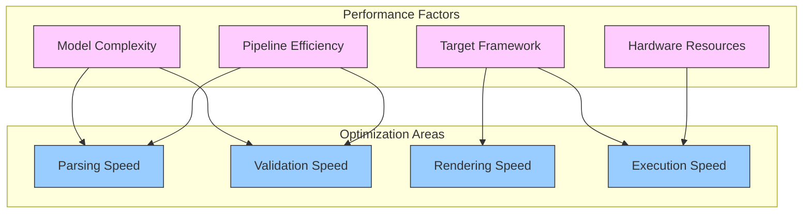

# GNN Performance Optimization Guide

Strategies for optimizing GNN model performance across parsing, validation, rendering, and execution.

## 🎯 Performance Overview

GNN performance depends on several factors:



## 📊 Performance Benchmarks

### Model Complexity Scaling

| Model Size | States | Observations | Parse Time | Validation Time | PyMDP Render | RxInfer Render |
|------------|--------|--------------|------------|-----------------|--------------|----------------|
| **Small** | 2-4 | 2-4 | <1s | <1s | <5s | <3s |
| **Medium** | 5-20 | 5-20 | 1-3s | 1-5s | 5-30s | 3-15s |
| **Large** | 21-100 | 21-100 | 3-10s | 5-30s | 30s-5m | 15s-2m |
| **Very Large** | 100+ | 100+ | 10s+ | 30s+ | 5m+ | 2m+ |

### Framework Performance Comparison

| Framework | Language | Typical Speed | Memory Usage | Best For |
|-----------|----------|---------------|--------------|----------|
| **RxInfer** | Julia | Fastest | Low-Medium | Large models, production |
| **JAX** | Python | Fast | Medium | Research, GPU acceleration |
| **PyMDP** | Python | Medium | Medium-High | Learning, prototyping |
| **NumPy** | Python | Medium | Low | Simple models |

## 🚀 Model-Level Optimizations

### 1. Reduce State Space Dimensionality

**Problem**: Large state spaces cause exponential growth in computation time.

**Solutions**:

```gnn
# ❌ Inefficient: Large joint state space
s_f0[100,1,type=int]  # 100 locations
s_f1[50,1,type=int]   # 50 energy levels
# Joint space: 100×50 = 5,000 states

# ✅ Efficient: Factorized state representation
s_f0[10,1,type=int]   # 10 locations (coarse-grained)
s_f1[5,1,type=int]    # 5 energy levels (essential only)
# Joint space: 10×5 = 50 states
```

**State space reduction techniques**:
1. **Discretization**: Reduce continuous spaces to essential discrete levels
2. **Hierarchical decomposition**: Use multiple levels of abstraction
3. **Feature selection**: Include only decision-relevant variables
4. **Temporal abstraction**: Use options/macro-actions

### 2. Exploit Matrix Structure

**Sparse matrices**: When most probabilities are zero.

```gnn
# ❌ Dense matrix (all entries specified)
A_m0={
  ((0.9, 0.0, 0.0, 0.1),
   (0.0, 0.9, 0.1, 0.0),
   (0.0, 0.1, 0.9, 0.0),
   (0.1, 0.0, 0.0, 0.9))
}

# ✅ Sparse representation (implied zeros)
A_m0={
  "sparse": {
    (0,0): 0.9, (0,3): 0.1,
    (1,1): 0.9, (1,2): 0.1,
    (2,1): 0.1, (2,2): 0.9,
    (3,0): 0.1, (3,3): 0.9
  }
}
```

**Structured matrices**: Use patterns to reduce complexity.

```gnn
# Identity-like structures
A_m0={"structure": "identity", "noise": 0.1}

# Toeplitz structures (shift-invariant)
B_f0={"structure": "toeplitz", "values": [0.8, 0.1, 0.1]}

# Block diagonal structures
B_f0={"structure": "block_diagonal", "blocks": [2, 2]}
```

### 3. Optimize Temporal Horizons

**Problem**: Long planning horizons increase computational cost exponentially.

**Solutions**:
```gnn
# ❌ Very long horizon (expensive)
ModelTimeHorizon=100

# ✅ Adaptive horizon based on problem
ModelTimeHorizon=5   # For reactive behaviors
ModelTimeHorizon=10  # For tactical planning
ModelTimeHorizon=20  # For strategic planning (max recommended)
```

**Advanced techniques**:
- **Receding horizon**: Re-plan every few steps
- **Anytime algorithms**: Improve solution quality over time
- **Hierarchical planning**: Different horizons for different abstraction levels

## ⚙️ Pipeline-Level Optimizations

### 1. Caching and Memoization

**Enable caching for repeated operations**:

```python
# In GNN processing pipeline
import functools
from pathlib import Path

@functools.lru_cache(maxsize=128)
def parse_gnn_file_cached(file_path: str):
    """Cache parsed GNN files to avoid re-parsing."""
    return parse_gnn_file(file_path)

# Use file modification time for cache invalidation
def get_file_mtime(file_path):
    return Path(file_path).stat().st_mtime

@functools.lru_cache(maxsize=128)
def validate_gnn_with_cache(file_path: str, mtime: float):
    """Cache validation results with file modification time."""
    return validate_gnn_file(file_path)
```

### 2. Parallel Processing

**Process multiple GNN files in parallel**:

```python
import multiprocessing
from concurrent.futures import ProcessPoolExecutor

def process_gnn_files_parallel(file_paths, num_workers=None):
    """Process multiple GNN files in parallel."""
    if num_workers is None:
        num_workers = multiprocessing.cpu_count()
    
    with ProcessPoolExecutor(max_workers=num_workers) as executor:
        results = list(executor.map(process_single_gnn_file, file_paths))
    
    return results
```

### 3. Incremental Validation

**Only validate changed components**:

```python
def incremental_validation(gnn_model, previous_validation_hash):
    """Validate only changed sections of a GNN model."""
    current_hash = compute_model_hash(gnn_model)
    
    if current_hash == previous_validation_hash:
        return cached_validation_result
    
    # Validate only changed sections
    changed_sections = detect_changed_sections(gnn_model, previous_model)
    validation_results = {}
    
    for section in changed_sections:
        validation_results[section] = validate_section(gnn_model[section])
    
    return validation_results
```

## 🎯 Framework-Specific Optimizations

### PyMDP Optimizations

```python
# Use JAX backend for better performance
import pymdp
pymdp.utils.set_backend('jax')

# Pre-compile models
agent = pymdp.Agent(
    A=A_matrices,
    B=B_matrices,
    C=C_vectors,
    D=D_vectors,
    compile=True  # Pre-compile for faster execution
)

# Batch processing for multiple agents
agents = [agent.copy() for _ in range(batch_size)]
batch_observations = [obs_list[i] for i in range(batch_size)]
batch_actions = pymdp.utils.batch_infer_policies(agents, batch_observations)
```

### RxInfer.jl Optimizations

```julia
# Use GPU acceleration when available
using CUDA
if CUDA.functional()
    model = build_model_gpu(gnn_params)
else
    model = build_model_cpu(gnn_params)
end

# Pre-compile inference procedures
inference_fn = @compile infer(model=model, data=data)

# Use message passing schedule optimization
schedule = MessagePassingSchedule(
    max_iterations=10,
    tolerance=1e-6,
    free_energy_diagnostics=false  # Disable for speed
)
```

### JAX Optimizations

```python
import jax
import jax.numpy as jnp
from jax import jit, vmap

# JIT compile the inference step
@jit
def inference_step(params, observations):
    return compute_posterior(params, observations)

# Vectorize over batch dimension
batch_inference = vmap(inference_step, in_axes=(None, 0))

# Use device placement for GPU
observations = jax.device_put(observations, jax.devices("gpu")[0])
```

## 💾 Memory Optimization

### 1. Memory-Efficient Data Structures

```python
# Use sparse matrices for large, mostly-zero matrices
from scipy.sparse import csr_matrix
import numpy as np

def create_sparse_matrix(dense_matrix, threshold=1e-10):
    """Convert dense matrix to sparse if beneficial."""
    sparse_matrix = csr_matrix(dense_matrix)
    
    # Only use sparse if it saves significant memory
    dense_memory = dense_matrix.nbytes
    sparse_memory = sparse_matrix.data.nbytes + sparse_matrix.indices.nbytes + sparse_matrix.indptr.nbytes
    
    if sparse_memory < 0.5 * dense_memory:
        return sparse_matrix
    return dense_matrix
```

### 2. Memory Profiling

```python
import psutil
import tracemalloc

def profile_memory_usage():
    """Profile memory usage during GNN processing."""
    tracemalloc.start()
    process = psutil.Process()
    
    # Your GNN processing code here
    result = process_gnn_model(model)
    
    current, peak = tracemalloc.get_traced_memory()
    tracemalloc.stop()
    
    print(f"Current memory usage: {current / 1024 / 1024:.1f} MB")
    print(f"Peak memory usage: {peak / 1024 / 1024:.1f} MB")
    print(f"System memory usage: {process.memory_info().rss / 1024 / 1024:.1f} MB")
    
    return result
```

## 🔧 Debugging Performance Issues

### 1. Performance Profiling

```python
import cProfile
import pstats
from pstats import SortKey

def profile_gnn_processing(gnn_file_path):
    """Profile GNN processing to identify bottlenecks."""
    pr = cProfile.Profile()
    pr.enable()
    
    # Your GNN processing code
    result = process_gnn_file(gnn_file_path)
    
    pr.disable()
    stats = pstats.Stats(pr)
    stats.sort_stats(SortKey.TIME)
    stats.print_stats(20)  # Top 20 time-consuming functions
    
    return result
```

### 2. Bottleneck Identification

**Common bottlenecks and solutions**:

| Bottleneck | Symptoms | Solutions |
|------------|----------|-----------|
| **Matrix operations** | High CPU in numpy/scipy | Use sparse matrices, BLAS optimization |
| **Memory allocation** | Frequent garbage collection | Pre-allocate arrays, use object pooling |
| **File I/O** | Slow parsing | Use faster parsers, caching |
| **Redundant computation** | Repeated calculations | Memoization, caching |
| **Poor vectorization** | Slow loops | Use numpy/jax vectorized operations |

### 3. Scaling Analysis

```python
import time
import matplotlib.pyplot as plt
import numpy as np

def analyze_scaling(state_sizes):
    """Analyze how performance scales with model size."""
    times = []
    
    for size in state_sizes:
        model = create_test_model(size)
        
        start_time = time.time()
        process_gnn_model(model)
        end_time = time.time()
        
        times.append(end_time - start_time)
    
    # Plot scaling behavior
    plt.loglog(state_sizes, times, 'bo-')
    plt.xlabel('State Space Size')
    plt.ylabel('Processing Time (s)')
    plt.title('GNN Processing Time vs. Model Size')
    plt.grid(True)
    plt.show()
    
    # Fit scaling exponent
    log_sizes = np.log(state_sizes)
    log_times = np.log(times)
    exponent = np.polyfit(log_sizes, log_times, 1)[0]
    
    print(f"Scaling exponent: {exponent:.2f}")
    if exponent > 2:
        print("⚠️ Poor scaling detected - consider optimization")
    
    return times
```

## 📋 Performance Checklist

### Model Design
- [ ] **Minimal state space**: Only include decision-relevant variables
- [ ] **Appropriate horizon**: Balance accuracy vs. computational cost
- [ ] **Sparse matrices**: Use when >50% of entries are zero
- [ ] **Structured matrices**: Exploit symmetries and patterns

### Implementation
- [ ] **Correct framework**: Choose based on model size and requirements
- [ ] **Caching enabled**: For repeated operations and file parsing
- [ ] **Parallel processing**: For multiple models or batch operations
- [ ] **Memory monitoring**: Track usage and optimize data structures

### Optimization
- [ ] **Profiling done**: Identify actual bottlenecks before optimizing
- [ ] **Scaling tested**: Verify performance on realistic model sizes
- [ ] **Regression tested**: Ensure optimizations don't break functionality
- [ ] **Documentation updated**: Record optimization decisions and trade-offs

## 🚀 Performance Best Practices

### 1. Start Simple, Optimize Incrementally
```python
# Development workflow
1. Create working model (correctness first)
2. Profile to identify bottlenecks
3. Optimize the largest bottlenecks first
4. Measure improvement and repeat
5. Stop when performance is acceptable
```

### 2. Choose the Right Tool for the Job
```python
# Framework selection guide
def choose_framework(model_size, requirements):
    if model_size < 10 and requirements == "learning":
        return "PyMDP"
    elif model_size > 50 or requirements == "production":
        return "RxInfer"
    elif requirements == "research" and gpu_available:
        return "JAX"
    else:
        return "PyMDP"  # Default for most cases
```

### 3. Monitor and Alert
```python
# Performance monitoring
def monitor_performance(func):
    def wrapper(*args, **kwargs):
        start_time = time.time()
        result = func(*args, **kwargs)
        duration = time.time() - start_time
        
        if duration > PERFORMANCE_THRESHOLD:
            log_warning(f"Slow operation: {func.__name__} took {duration:.2f}s")
        
        return result
    return wrapper
```

## 📚 Additional Resources

- **PyMDP Performance Guide**: [PyMDP Documentation](https://pymdp.readthedocs.io/en/latest/performance.html)
- **JAX Performance Tips**: [JAX Documentation](https://jax.readthedocs.io/en/latest/notebooks/Common_Gotchas_in_JAX.html)
- **NumPy Performance**: [NumPy Performance Guidelines](https://numpy.org/doc/stable/user/basics.performance.html)
- **Profiling Tools**: `cProfile`, `py-spy`, `memory_profiler`

---

**Remember**: Premature optimization is the root of all evil. Profile first, optimize second, and always measure the impact of your changes. 