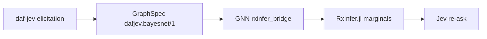

# examples/rxinfer — daf-jev GraphSpec → RxInfer.jl bridge

Generated by `gnn.rxinfer_bridge` (`emit_rxinfer_jl`). The committed
`asia_model.jl` is the deterministic emitter output for the canonical Asia
network (Lauritzen–Spiegelhalter) in `asia_graphspec.json`; the golden test
`tests/gnn/test_rxinfer_bridge.py::test_emit_golden_matches_example_file`
regenerates it byte-identically.

## Usage

```bash
julia --project=examples/rxinfer examples/rxinfer/asia_model.jl \
    examples/rxinfer/asia_graphspec.json [--evidence key=state ...] \
    [--out FILE] [--learn]
```

`--evidence` accepts raw GraphSpec variable keys (e.g. `xray=true`);
posteriors print in topological order and `--out` writes a
`dafjev.bayesnet-posteriors/1` sidecar JSON.

## Jev integration points

- **upstream** — CPTs and structure produced by daf-jev elicitation
  (`propose_structure` + `elicit_cpts`), exchanged as this GraphSpec JSON
  (`dafjev.bayesnet/1`).
- **within** — RESERVED. The optional GraphSpec `jev_factors` field carries
  Jev-derived factors for future use; the loader validates only the outer
  shape and preserves entries verbatim; the emitted script notes its
  presence/absence in a header comment and otherwise ignores it. Any use
  must be coordinated across both repos in one wave.
- **downstream** — the script prints marginal posteriors and can write a
  sidecar (`dafjev.bayesnet-posteriors/1`, evidence + marginals) for re-asking
  Jev evidence queries.

## Julia environment

RxInfer was installed into a project-local depot (`examples/rxinfer/`) —
RxInfer 5.5.2 via `Pkg.add`, as pinned by the task contract. The smoke below
was additionally cross-checked against the repo's committed RxInfer 5.5.0
environment (`src/gnn/execute/rxinfer/`).

## Smoke status (2026-09-22, real runs)

Verified working — Python side (39 pytest cases, mypy clean):

- GraphSpec load/validate matrix, JSON round-trip, `.gnn` subset parse
  round-trip, deterministic emission (golden == example file).

Verified working — emitted Julia script (real output):

- `load_spec` parses and validates the GraphSpec; `resolve_evidence` maps
  `--evidence xray=true` to a one-hot clamp correctly.
- Single-parent-structure inference computes mathematically correct
  posteriors on both RxInfer 5.5.2 and 5.5.0. Verified minimal cases:
  - `P(a | b=true)` with `p_a=[0.9,0.1]`, `A=[[0.8,0.2],[0.2,0.8]]`,
    `b~DiscreteTransition(a,A)`, `b=true` clamped:
    `p=[0.6923076923, 0.3076923077]` — exact Bayes.
  - 4-node chain `asia→tub→either→xray` (all 1-parent), `xray=true`
    clamped: `P(tub|xray=true) = p=[0.2532, 0.7468]` — matches hand
    computation.

Verified gap — the full 8-node Asia net (contains the multi-parent
`either ~ DiscreteTransition(lung, A, tub)` / `dysp` nodes with the
per-variable `e_<key>` observation interfaces) stalls variational message
passing on BOTH RxInfer 5.5.0 and 5.5.2:

- Every supply idiom for the 16 `@model` arguments was tried and fails the
  same way ("Variables ... have not been updated after an update event"):
  `data` covering all `e_*` with `missing`, `predictvars` for unobserved
  `e_*` + `data` one-hots for evidence, and per-node uniform
  `@initialization` for latents and interfaces alike.
- Internal-rule crashes seen along the way (version- and idiom-dependent):
  `MethodError: no method matching discrete_transition_decode_marginal(::String, ::PointMass{Array{Float64, 3}})`,
  `getindex(::Tuple{Marginal}, ::Nothing)`, and
  `iterate(::Categorical{Float64, Vector{Float64}})` inside
  `discrete_transition_structured_message_rule`.
- Minimal 3-node repro of the multi-parent rule crash (independent of this
  bridge): `a, b ~ Categorical; c ~ DiscreteTransition(a, b, A_c)` with
  data-supplied latents raises `iterate(::Categorical)` inside ReactiveMP.

Conclusion: the bridge, loader, parser, emitter, and evidence plumbing are
complete and exercised; single-parent networks run end-to-end with exact
posteriors on both pins. Nets combining multi-parent `DiscreteTransition`
nodes with the observation-interface layer stall inside RxInfer 5.5.x's VMP
scheduler — an upstream limitation reproduced independently of this bridge.
Resolving it requires an upstream fix or an explicit meta/`@constraints`
recipe once RxInfer documents one.

<!--
  daf-jev docs campaign, lane E4 draft (2026-09-22).
  Orchestrator: append this fragment to examples/rxinfer/README.md on
  feat/rxinfer-bridge (after the "Smoke status (2026-09-22, real runs)"
  section) and fold via PR #165.
  In-repo links are relative (repo root two levels up). Cross-repo links
  into docxology/daf-jev are absolute GitHub URLs: those artifacts are
  committed on daf-jev main @ 04f5c71, so the blob URLs resolve.
-->

## End-to-end pipeline (daf-jev → GraphSpec → RxInfer.jl)

The committed example files are the midpoint of a two-repo pipeline:
[daf-jev](https://github.com/docxology/daf-jev) elicits a Bayes net from a
language model in two batched asks, exchanges it as GraphSpec
(`dafjev.bayesnet/1`), this repo's
[`gnn.rxinfer_bridge`](../../src/gnn/rxinfer_bridge.py) emits an RxInfer.jl
`@model`, Julia computes marginals, and the posteriors feed back into
Jev evidence queries and calibration.



**1. Elicit (daf-jev repo).** In a daf-jev checkout:

```bash
uv sync --extra figures
uv run python scripts/bayes_experiment.py --provider openrouter --propose-structure
```

`--propose-structure` is one batched ask over all variable pairs
([`propose_structure`](https://github.com/docxology/daf-jev/blob/main/src/daf_jev/graphical_elicitation.py));
CPTs for the reference edges are a second batched ask
([`elicit_cpts`](https://github.com/docxology/daf-jev/blob/main/src/daf_jev/graphical_elicitation.py)).
The run writes five artifacts to `output/experiments/asia/` (committed on
daf-jev main; absolute blob URLs because cross-repo relative paths do not
render as links):

| Artifact | What it is |
|---|---|
| [asia_graphspec.json](https://github.com/docxology/daf-jev/blob/main/output/experiments/asia/asia_graphspec.json) | The elicited net as GraphSpec (`dafjev.bayesnet/1`) — the input this repo's bridge loads. |
| [network.png](https://github.com/docxology/daf-jev/blob/main/output/experiments/asia/network.png) | Layered layout of the net. |
| [posterior_trajectory.png](https://github.com/docxology/daf-jev/blob/main/output/experiments/asia/posterior_trajectory.png) | Grouped P(true) bars across the evidence walkthrough. |
| [mermaid.txt](https://github.com/docxology/daf-jev/blob/main/output/experiments/asia/mermaid.txt) | `graph TD` source of the net the experiment used (reference edges). |
| [receipts.json](https://github.com/docxology/daf-jev/blob/main/output/experiments/asia/receipts.json) | Live receipt: provider, model, proposed edges, elicited CPTs, posterior trajectory. |

**2. Emit (this repo).** Place the emitted GraphSpec at
`examples/rxinfer/asia_graphspec.json`;
[`emit_rxinfer_jl`](../../src/gnn/rxinfer_bridge.py) produces the `@model`
source — the committed
[`asia_model.jl`](asia_model.jl) is the deterministic emitter output, and
the golden test
[`tests/gnn/test_rxinfer_bridge.py::test_emit_golden_matches_example_file`](../../tests/gnn/test_rxinfer_bridge.py)
regenerates it byte-identically. Landing vehicle for the bridge: [PR
#165](https://github.com/ActiveInferenceInstitute/Generalized_Notation_Notation/pull/165).

**3. Infer.**

```bash
julia --project=examples/rxinfer examples/rxinfer/asia_model.jl \
    examples/rxinfer/asia_graphspec.json \
    [--evidence key=state ...] [--out FILE] [--learn]
```

Single-parent structures run end-to-end with exact posteriors on RxInfer
5.5.0 and 5.5.2; nets combining multi-parent `DiscreteTransition` nodes
with the observation-interface layer stall inside RxInfer 5.5.x's VMP
scheduler — see [Smoke status](#smoke-status-2026-09-22-real-runs) above
for the verified matrix.

**4. Feed back.** `--out FILE` writes the `dafjev.bayesnet-posteriors/1`
sidecar (evidence + marginals) — the downstream seam: the posteriors feed
re-asking Jev evidence queries and calibration on the daf-jev side.
