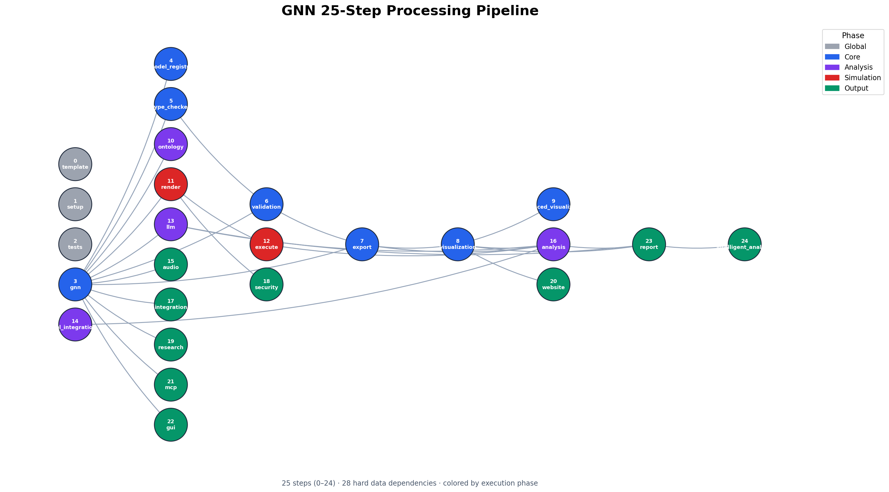
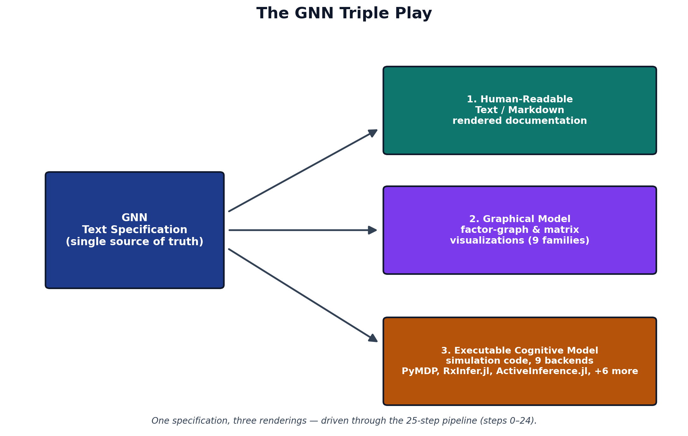

# System Context {#sec:system_context}

Generalized Notation Notation (GNN) couples a small, declarative text language for Active Inference generative models to a deterministic processing pipeline that turns each specification into validation, visualization, simulation, and analysis artifacts [@gnn2023]. The language gives a model one canonical written form; the pipeline gives that form many executable and graphical realizations. This section describes both halves of the architecture and the way they meet.

## The GNN Language

A GNN model is a plain-text document organized into named sections that together pin down a complete partially observable Markov decision process. The `StateSpaceBlock` declares the variables of the model and their dimensions — hidden states, observations, control factors, and policies — establishing the shape of every tensor that follows. The `Connections` section records the directed and undirected dependencies among those variables, the edges of the underlying factor graph that downstream tools read to lay out diagrams and wire up inference.

The generative model itself is carried by the standard Active Inference matrices, each with a fixed role grounded in the discrete state-space formulation [@dacosta2020]. The `A` matrix is the likelihood, mapping hidden states to observations; the `B` matrix is the transition dynamics, mapping states and actions to successor states; the `C` matrix encodes preferences over observations as a vector of prior log-preferences; and the `D` matrix is the prior over initial hidden states. These four objects are sufficient to specify perception as approximate Bayesian inference and action as expected-free-energy minimization, the core commitments of the free energy principle [@friston2010]. Recent work continues to refine how expected-free-energy objectives relate to variational inference and to alternative but equivalent formulations, which is why GNN keeps the mathematical objects explicit rather than burying them in backend-specific code [@champion2024reframingEfe;@nuijten2026typeInference;@nuijten2026efePlanningVariational]. A `ModelParameters` section fixes scalars such as factor cardinalities and precision terms, while a `Time` section declares whether the model is static or dynamic and, if dynamic, how the horizon and discretization are organized. Because every one of these sections is explicit text, a GNN file is at once human-readable, diffable under version control, and unambiguous to a parser — the property that lets the rest of the pipeline operate deterministically.

## The Processing Pipeline

The pipeline is a fixed sequence of {{GNN_STEP_COUNT}} numbered steps, {{GNN_STEP_RANGE}}, each a self-contained stage that consumes the artifacts of its predecessors and writes typed outputs for those that follow. Early steps parse and type-check the GNN text and validate it against the language schema; middle steps render visualizations, export the model to executable backends, and run simulations; later steps perform analysis, reporting, and downstream integration. The data dependencies among the steps form the directed acyclic graph shown in @fig:pipeline, which makes the whole flow inspectable: any artifact can be traced back to the step that produced it and forward to every step that depends on it.

{#fig:pipeline width=90%}

The per-step responsibilities are enumerated below; each row names a step and the transformation it owns within the {{GNN_STEP_RANGE}} range.

{{GNN_STEP_TABLE}}

This staged design keeps the architecture modular. The implementation is organized into {{GNN_SRC_PACKAGE_COUNT}} source packages, one cluster of responsibilities per concern, and is documented across {{GNN_DOC_FILE_COUNT}} documentation files so that each step's contract, inputs, and outputs are specified independently of the others. New backends or analyses attach to the graph by declaring their dependencies rather than by editing a monolith, and the deterministic step ordering means a model processed today yields the same artifacts when reprocessed tomorrow.

## The Triple Play

The reason for separating a single written language from a multi-stage pipeline is the design goal GNN calls the Triple Play: one model specification, three coordinated modes of existence. The same GNN text is simultaneously a human-readable model description, a set of graphical visualizations of its state space and factor structure, and an executable cognitive model that can be run as a simulation. @fig:triple_play depicts these three faces and the shared specification at their center.

{#fig:triple_play width=70%}

Each face is generated from the same source, so they cannot drift apart. The text is the contract a researcher reads and reviews; the visualizations expose the factor-graph structure for inspection and communication; and the executable rendering lets the identical model be simulated across inference frameworks, connecting the written specification to libraries such as pymdp for discrete Active Inference [@heins2022] and to the broader tooling ecosystem for compositional model representation [@defelice2021]. Because all three derive from one parsed document, GNN turns a model from a static artifact into a live object that can be read, seen, and run without re-encoding it for each purpose [@smith2022].
