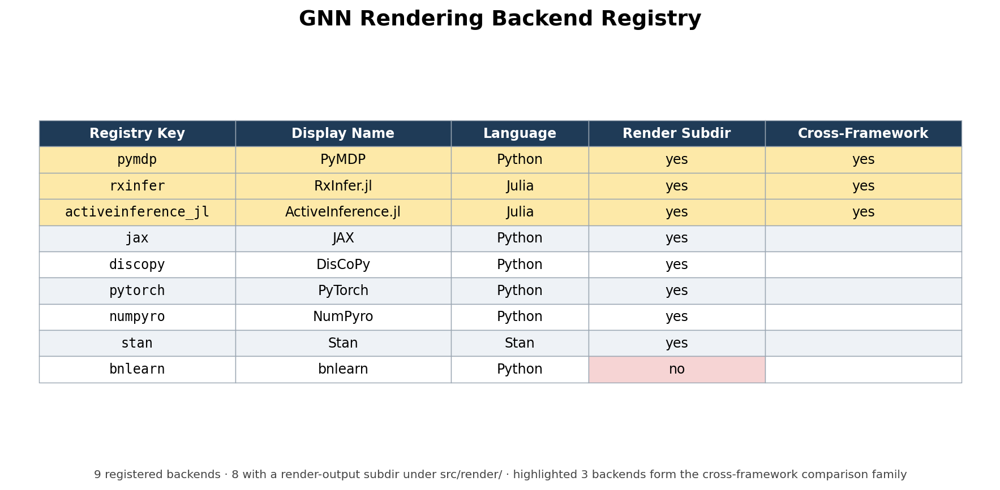

# Methods {#sec:methods}

The GeneralizedNotationNotation (GNN) method is realized as a sequence of deterministic transformations that take a plain-text model specification and carry it through parsing, validation, code generation, execution, and reporting. The processing pipeline is organized into {{GNN_STEP_COUNT}} numbered steps (steps {{GNN_STEP_RANGE}}), each implemented as a standalone module with a single responsibility. The methods below describe the path that a model travels from notation to executable cognitive model and back to analyzed results. Every quantity reported in this section is produced from the live repository rather than asserted by hand; the closing subsection makes that contract explicit.

## Parsing and Multi-Format Export

The pipeline begins by ingesting GNN model files written in the plain-text notation. Parsing (step 3) reads each specification, builds an internal model representation, and re-emits it across a family of structured export formats so that downstream tools, and human readers, can consume the same model through whichever serialization they prefer. The corpus that exercises this stage spans {{GNN_EXAMPLE_COUNT}} example model files organized into {{GNN_INPUT_FAMILY_DIR_COUNT}} curated corpora, ranging from minimal perception fixtures used to test the parser to larger hierarchical and multi-agent models. Treating parsing and export as a single round-trippable stage means a model authored once becomes immediately available as a typed object, a normalized text form, and machine-readable serializations without any manual re-encoding.

## Type Checking and Validation

A model that parses is not yet a model that is well-formed. Steps 5 and 6 apply type checking and validation to confirm that the state spaces, observation modalities, control factors, and the matrices relating them are mutually consistent before any code is generated. This catches dimensional mismatches and malformed factor structures at the notation level, where the diagnostic is cheap and legible, rather than allowing them to surface as opaque runtime errors deep inside a numerical backend. Validation here is the gate that protects every later stage: rendering, execution, and analysis all assume a model that has already been certified consistent.

## Rendering to Multiple Backends

The central act of the "Triple Play" is turning a validated specification into executable cognitive models. The rendering stage emits backend-specific code for {{GNN_BACKEND_COUNT}} registered target frameworks — {{GNN_BACKEND_LIST}} — so that a single GNN model can be instantiated as a simulation in whichever computational ecosystem a researcher already works in; coverage across the family-by-backend matrix is uneven and is recorded explicitly (see @sec:limitations_next_steps). Each backend is addressed through a registry key that maps the abstract model onto that framework's idioms for representing generative models and performing inference. The full mapping from registry key to backend is given below.

{{GNN_BACKEND_TABLE}}

The capability surface of these backends — which model families each one can express and execute — is summarized in @fig:backend_matrix.

{#fig:backend_matrix width=85%}

By generating code rather than asking authors to port models by hand, the method keeps a single source of truth in the notation while still reaching the discrete message-passing libraries [@heins2022] and the categorical, diagrammatic frameworks [@defelice2021] that different research communities have built. The underlying mathematics that all of these backends share — inference and policy selection over discrete state spaces under the free-energy objective [@dacosta2020; @smith2022] — is the same regardless of which framework executes it; the rendering stage simply expresses that common substrate in each target's native form.

## Execution

Generated backend code is not left as a static artifact. The execution stage (step 12) runs the rendered models, driving the inference and behavior that the notation describes and producing concrete traces, beliefs, and outputs. This closes the loop from text to running cognitive model: the same specification that was type-checked and exported is now exercised numerically, so that claims about a model's behavior rest on having actually run it rather than on inspection of the source alone.

## Analysis, Visualization, and Reporting

The final group of stages turns execution results into interpretable evidence. Analysis (step 16) processes the outputs of execution into structured findings; visualization (step 8) and the rendering of figures (step 9) translate model structure and results into graphical form, supporting the graphical leg of the Triple Play; and the reporting stage (step 23) assembles these artifacts into a coherent summary of what the model is and how it behaved. Because each stage writes its outputs to a known location, the chain from a notation file to a finished report is fully traceable, and any figure or number in a report can be followed back to the step and model that produced it.

## Reproducibility and Auto-Injection

Every quantitative value that appears in this manuscript is generated, not typed. The producer `scripts/z_generate_manuscript_variables.py` reads the repository's source surfaces directly — the step modules, the source tree, the model-family manifest, and the framework registry — together with the project's maintained ledgers, notably the Model Context Protocol tool audit (`src/mcp/audit_report.json`, itself regenerated by the test suite). From these it emits a manifest of named tokens — counts of pipeline steps, source packages and files, model families, backends, example files, tests, and tools — which the renderer substitutes into the prose at build time. Filesystem-derived counts are recomputed on every run; ledger-derived counts (such as the MCP tool total) are as current as the ledger they read, which the maintained test suite keeps in sync. The manuscript therefore inherits a determinism property: running the producer against a fixed repository state yields the same values, and authors are prohibited from hard-coding any number that has a corresponding token. This makes the manuscript a faithful, regenerable description of the system it documents: when the {{GNN_STEP_COUNT}}-step pipeline, the {{GNN_BACKEND_COUNT}} rendering backends, or the {{GNN_EXAMPLE_COUNT}}-file example corpus change, the reported numbers change with them on the next build, with no opportunity for prose and repository to silently drift apart.
