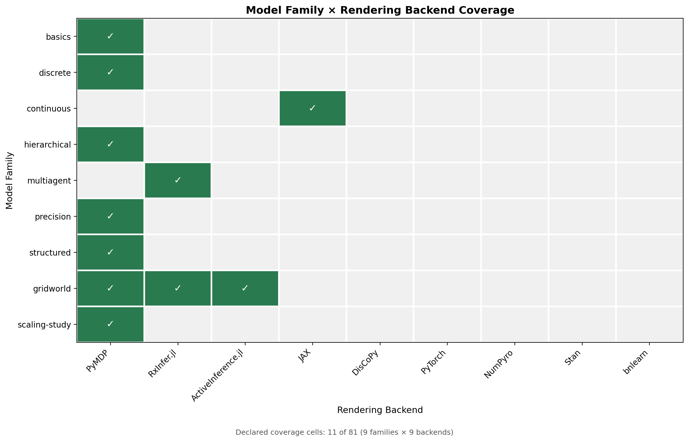
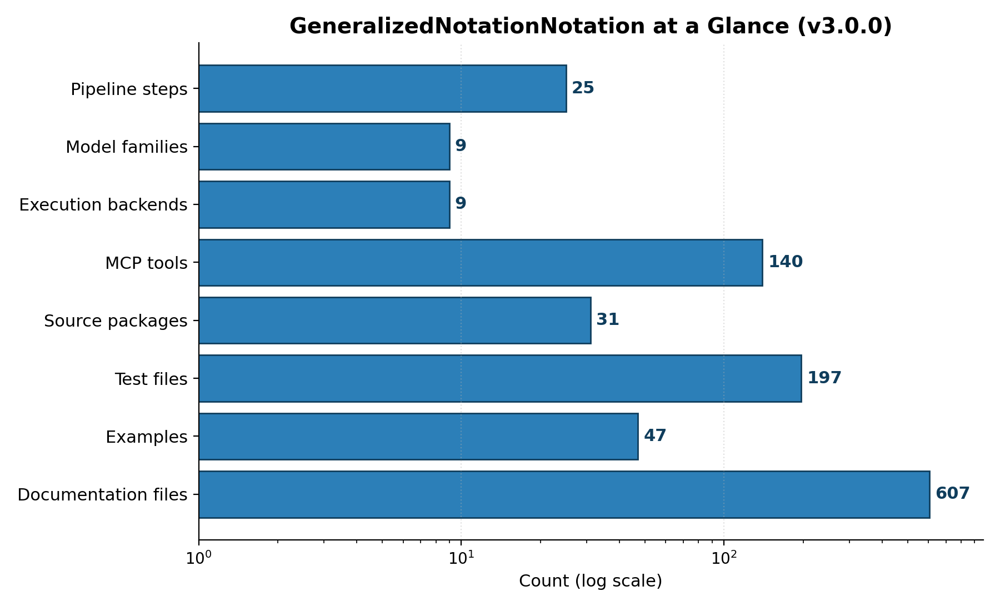

# Artifacts and Evidence {#sec:artifacts_evidence}

This section reports what the project has actually produced and how each quantitative claim is grounded. Every number below is substituted at render time from the deterministic producer that reads the repository state, so the manuscript can never drift from the artifacts it describes.

## Model-Family Coverage

GNN ships a curated corpus of model families that exercise the language across the difficulty gradient from minimal parser fixtures to full multi-agent and scaling studies. The current corpus spans {{GNN_FAMILY_COUNT}} families ({{GNN_FAMILY_LIST}}), drawn from {{GNN_INPUT_FAMILY_DIR_COUNT}} family directories under `input/` and comprising {{GNN_EXAMPLE_COUNT}} concrete example models. Each family declares the simulation frameworks it is meant to drive, which is what lets the same text model fan out across the executable-model leg of the Triple Play [@gnn2023]. The families and their declared frameworks are enumerated below.

{{GNN_FAMILY_TABLE}}

The family-by-framework structure is shown in @fig:family_matrix, which renders the coverage matrix directly from the family registry rather than from a hand-maintained table.

{#fig:family_matrix width=85%}

These families are not illustrative prose: they are the inputs over which the parser, the type checker, and the cross-framework code generators are exercised, and they are the substrate for the reliability gates described next.

## Semantic-Fidelity and Cross-Framework Reliability Gates

Two reproducible-by-command gates check that GNN's promise — one text model, many faithful executable renderings — survives contact with real backends. Both live under `scripts/` and read the same family corpus described above, so they verify the artifacts the manuscript actually references.

The semantic-fidelity gate, `scripts/run_semantic_fidelity_gate.py`, checks that a model parsed from GNN text and then re-emitted preserves its semantic content: the state-space structure, the factor and modality declarations, and the matrix shapes implied by a discrete Active Inference generative model survive the round trip [@dacosta2020]. It is meant to be run as a command and to report fidelity per model, not as a static claim baked into prose.

The cross-framework reliability gate, `scripts/run_cross_framework_reliability.py`, takes a single GNN model and renders it across multiple simulation backends, then checks that the resulting executable models agree on the structure they were generated from. The reference comparison runs on the {{GNN_CROSS_FRAMEWORK_FAMILY}} family across {{GNN_CROSS_FRAMEWORK_BACKENDS}} — three independent Active Inference engines spanning the Python and Julia ecosystems [@heins2022]. Because the same source model drives all three renderings, disagreement between backends localizes a generator defect rather than a modeling choice.

Both gates are stated here as commands you can run, not as asserted pass counts. The manuscript deliberately does not quote a fixed number of passing checks: the authoritative, current result is whatever those scripts report when executed against the corpus, and binding a frozen count into prose would invite exactly the drift the auto-injection contract exists to prevent.

## Repository Scale

The repository's scale is itself evidence of the surface that the gates and pipeline cover, and it is reported in @fig:repo_metrics directly from a scan of the working tree.

{#fig:repo_metrics width=80%}

The test suite comprises {{GNN_TEST_FILE_COUNT}} test files containing {{GNN_TEST_FUNCTION_COUNT}} test functions, exercising a source base of {{GNN_SRC_PY_FILE_COUNT}} Python files across {{GNN_SRC_PACKAGE_COUNT}} packages ({{GNN_SRC_LOC}} lines of source). The Model Context Protocol surface — which exposes GNN's capabilities to external agents and tools — provides {{GNN_MCP_TOOL_COUNT}} tools across {{GNN_MCP_MODULE_COUNT}} modules. The pipeline itself runs as {{GNN_STEP_COUNT}} steps ({{GNN_STEP_RANGE}}), and the rendering of figures, models, and reports produced {{GNN_OUTPUT_FIGURE_COUNT}} figures in the current run.

## Claim Discipline

A claim is manuscript-ready only when it is bound to a verifiable artifact. Concretely, every claim in this manuscript must rest on one of four support types:

- A passing test or validator command — for example the semantic-fidelity and cross-framework gates above, which can be re-run on demand.
- A generated output produced by a deterministic producer, such as the figures rendered from the family and repository scans, or the token values emitted by the manuscript-variable producer that backs every number on this page.
- A source ledger, manifest, or configuration file that fixes the value being claimed.
- A resolved entry in `references.bib` for any external-literature claim [@friston2010; @parr2022].

The pipeline records its own evidence trail under `output/`. The run-level summary is written to `output/PIPELINE_REPORT.md`, and the per-step execution record — including which steps ran, their status, and their artifacts — is captured in `output/00_pipeline_summary`. These are the artifacts a reader should consult to confirm that the numbers substituted into this section correspond to a real, reproducible pipeline run rather than to asserted prose. When a value would otherwise need a literal number with no producer behind it, the discipline is to omit the number rather than to hard-code it.
