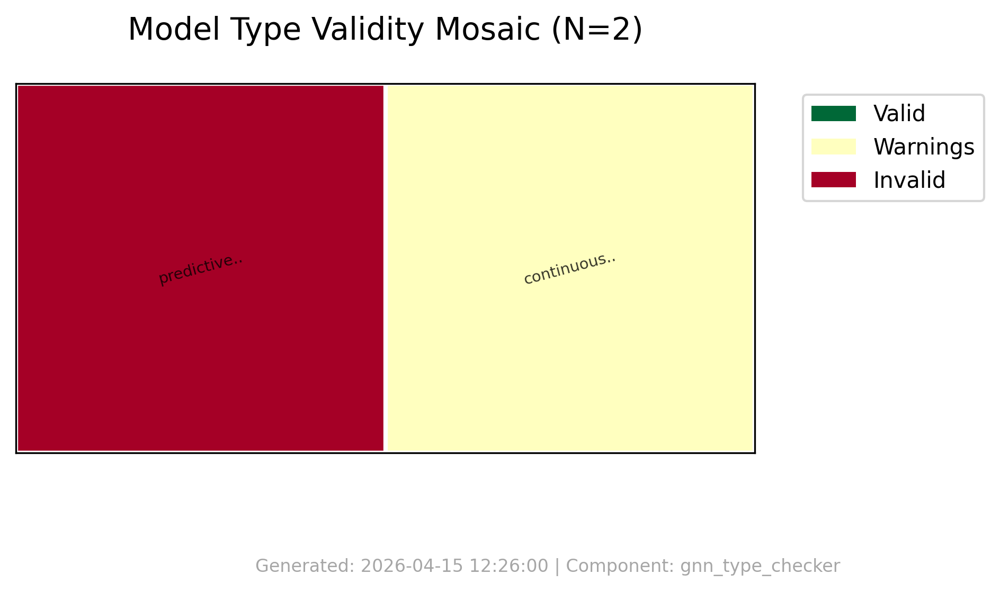
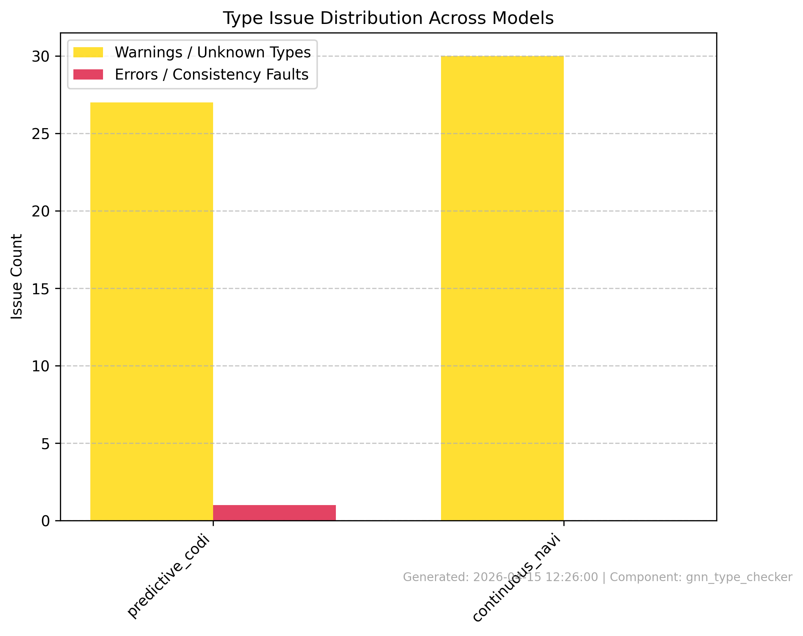
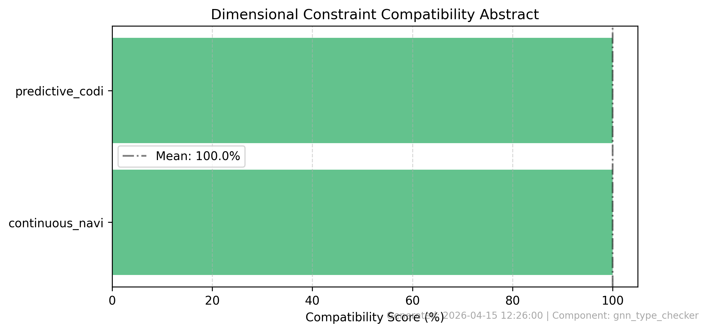
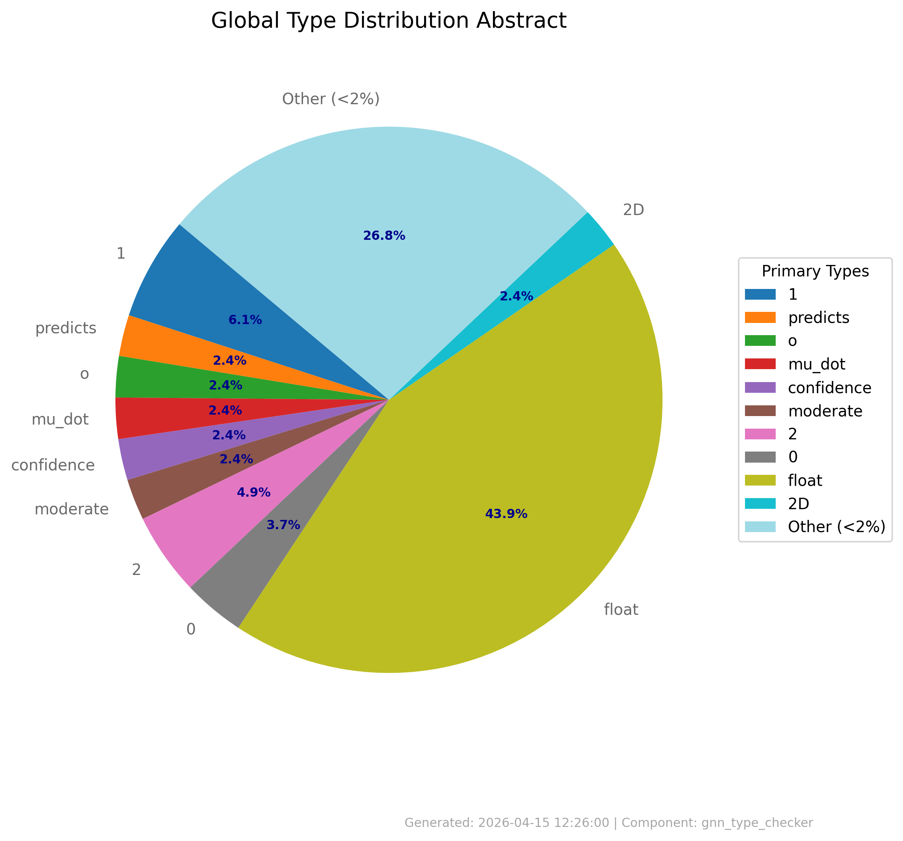
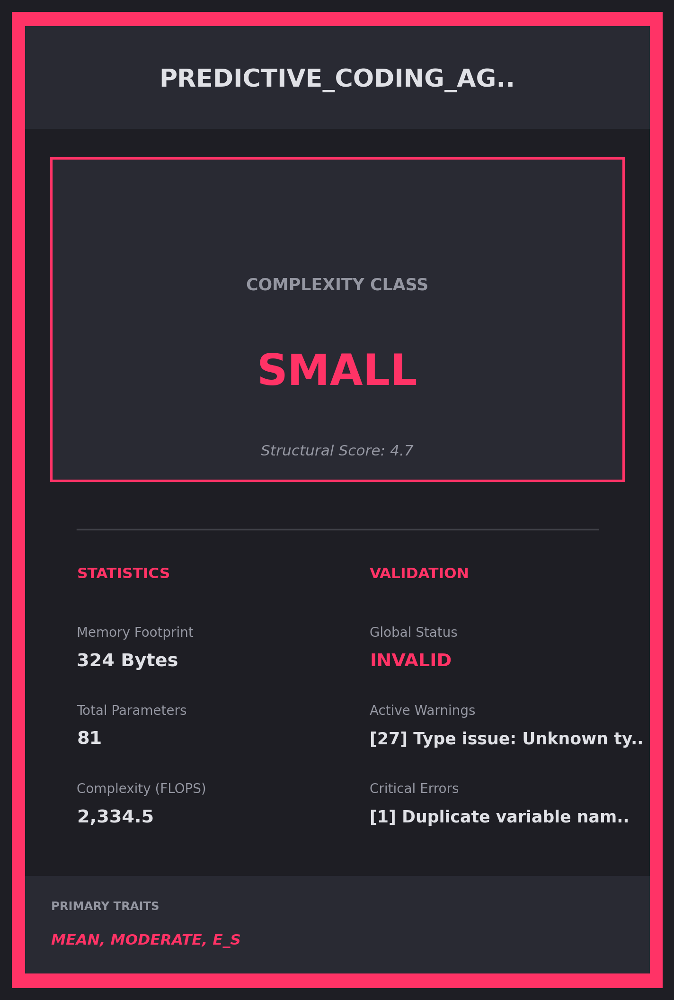

# Type Check Summary

**Generated**: 2026-04-15 12:26:01

## Processing Results
- **Files Processed**: 2
- **Success**: True
- **Errors**: 0

## Validation Results
- **Files Validated**: 2
- **Valid Files**: 1
- **Invalid Files**: 1

## Type Analysis
- **Type Analyses**: 2
- **Total Variables**: 82

## Graphical Abstracts

### Model Baseball Cards Preview

## Error Summary
- No errors encountered
