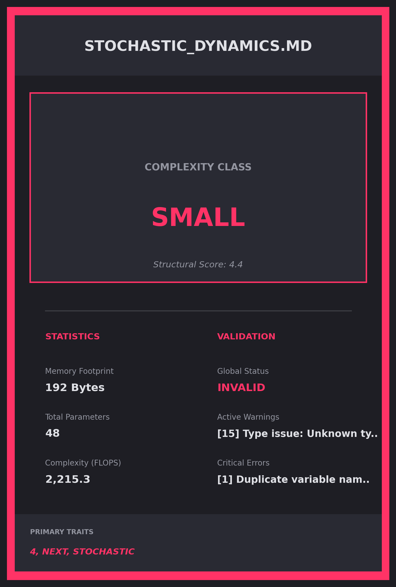

# Type Check Summary

**Generated**: 2026-05-22 06:17:41

## Processing Results
- **Files Processed**: 3
- **Success**: True
- **Errors**: 0

## Validation Results
- **Files Validated**: 3
- **Valid Files**: 1
- **Invalid Files**: 2

## Type Analysis
- **Type Analyses**: 3
- **Total Variables**: 107

## Graphical Abstracts
\n\n\n\n\n\n\n\n\n
### Model Baseball Cards Preview\n\n\n\n\n\n
*(Remaining 1 Model Cards are located in `visualizations/cards/`)*\n
## Error Summary
- No errors encountered\n