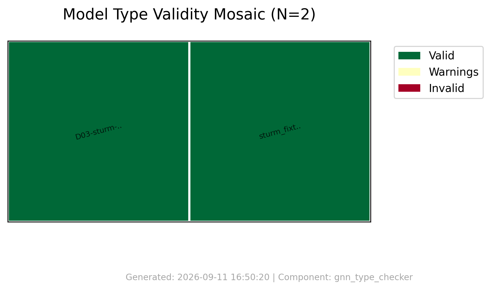
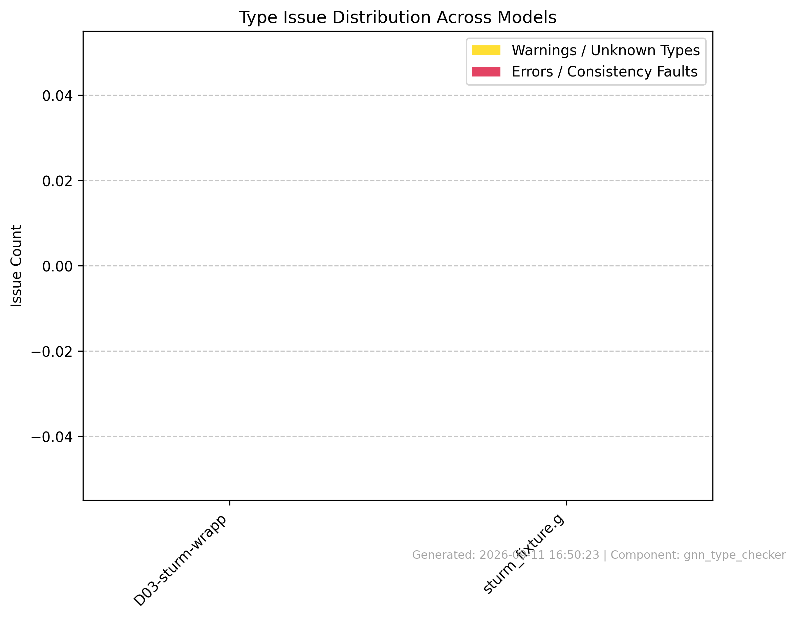
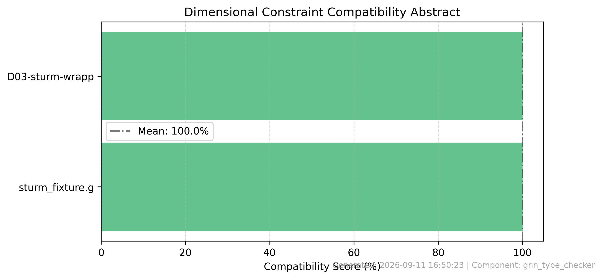
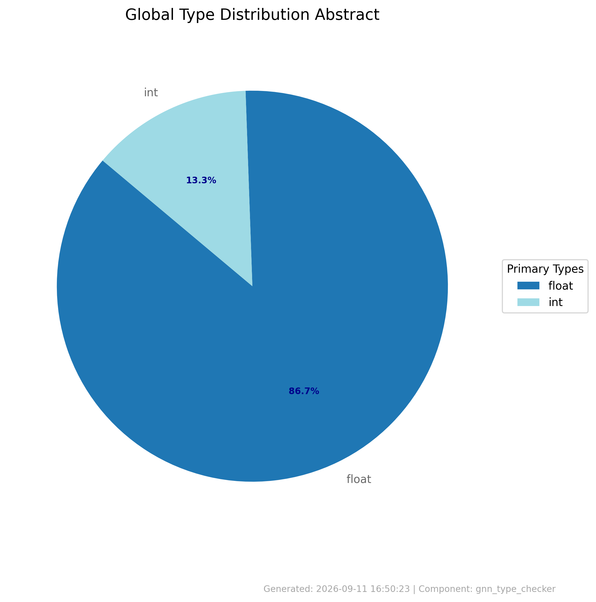
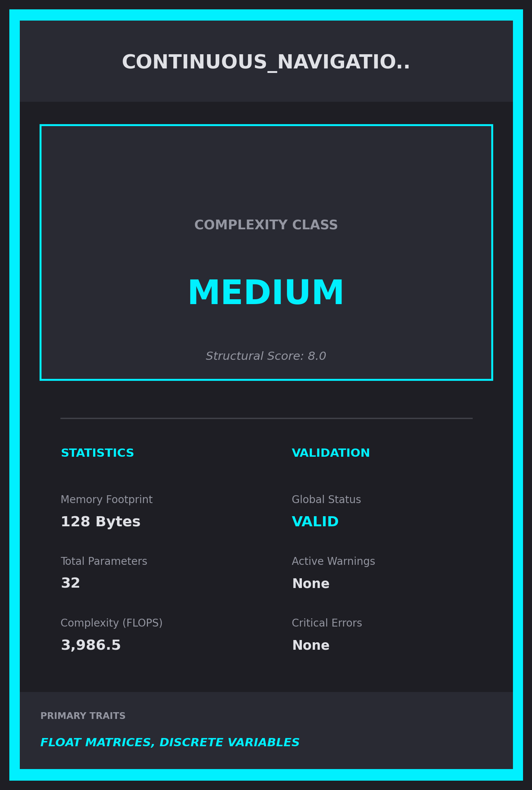
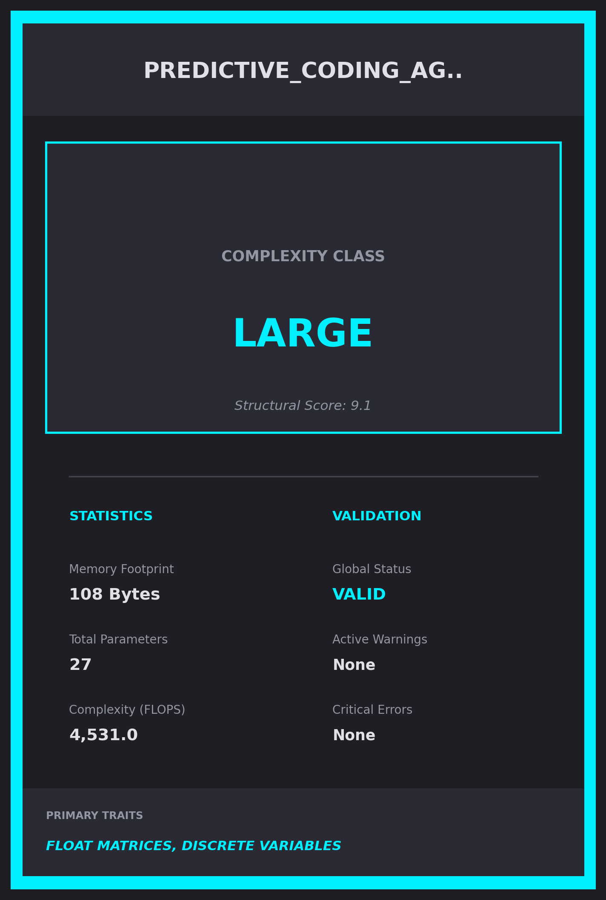

# Type Check Summary

**Generated**: 2026-09-05 20:31:10

## Processing Results
- **Files Processed**: 3
- **Success**: True
- **Errors**: 0

## Validation Results
- **Files Validated**: 3
- **Valid Files**: 3
- **Invalid Files**: 0

## Type Analysis
- **Type Analyses**: 3
- **Total Variables**: 30

## Graphical Abstracts

### Model Baseball Cards Preview

*(Remaining 1 Model Cards are located in `visualizations/cards/`)*

## Error Summary
- No errors encountered
