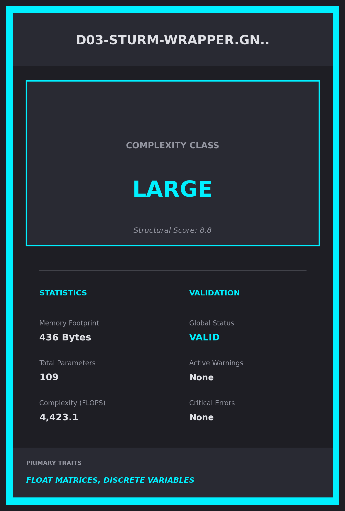
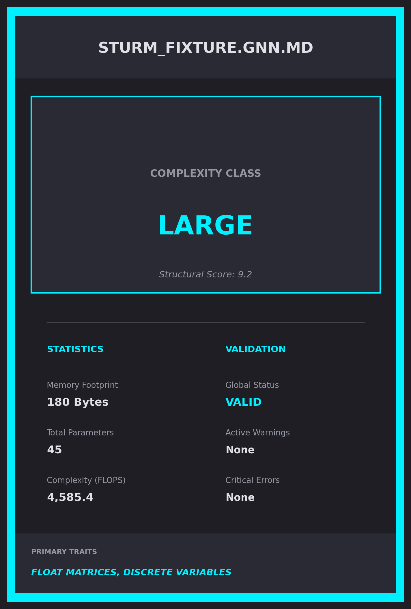

# Type Check Summary

**Generated**: 2026-09-11 16:50:25

## Processing Results
- **Files Processed**: 2
- **Success**: True
- **Errors**: 0

## Validation Results
- **Files Validated**: 2
- **Valid Files**: 2
- **Invalid Files**: 0

## Type Analysis
- **Type Analyses**: 2
- **Total Variables**: 15

## Graphical Abstracts
\n\n\n\n\n\n\n\n\n
### Model Baseball Cards Preview\n\n\n\n\n
## Error Summary
- No errors encountered\n