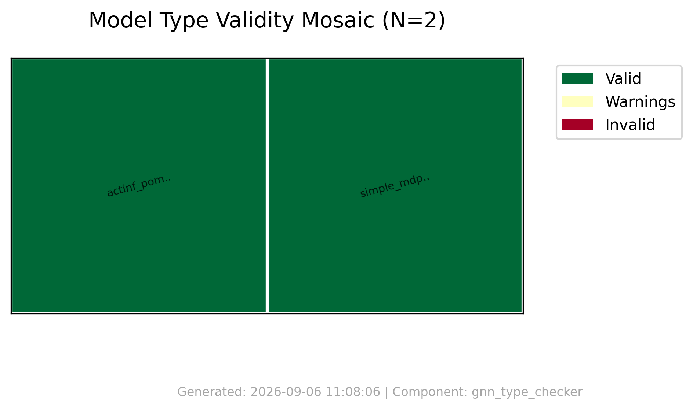
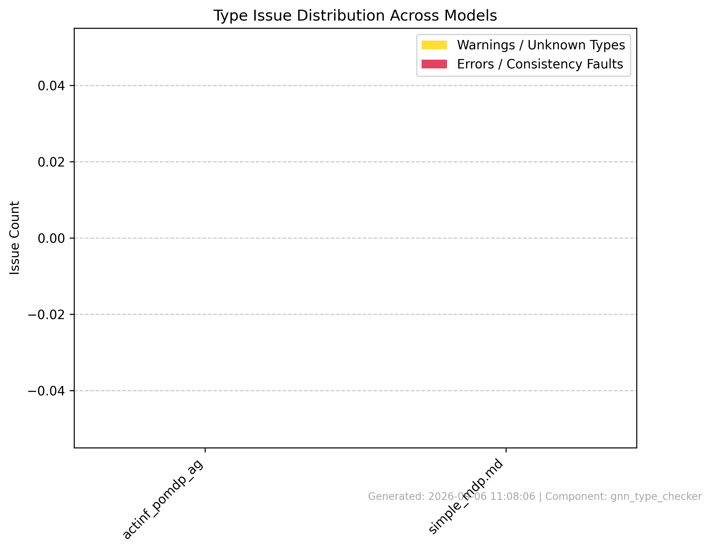
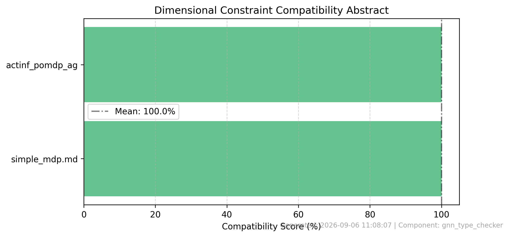
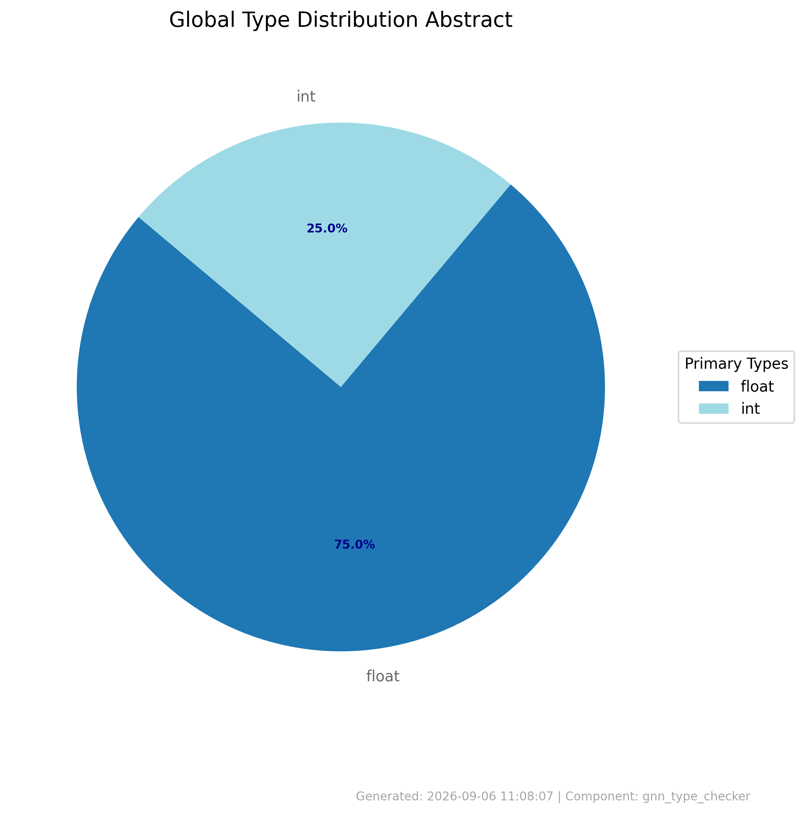
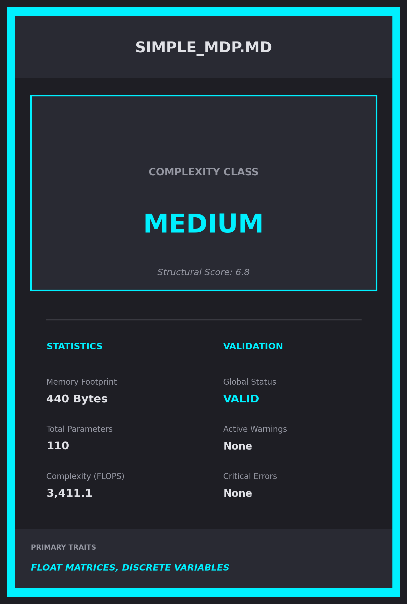

# Type Check Summary

**Generated**: 2026-09-06 11:08:07

## Processing Results
- **Files Processed**: 2
- **Success**: True
- **Errors**: 0

## Validation Results
- **Files Validated**: 2
- **Valid Files**: 2
- **Invalid Files**: 0

## Type Analysis
- **Type Analyses**: 2
- **Total Variables**: 24

## Graphical Abstracts

### Model Baseball Cards Preview

## Error Summary
- No errors encountered
