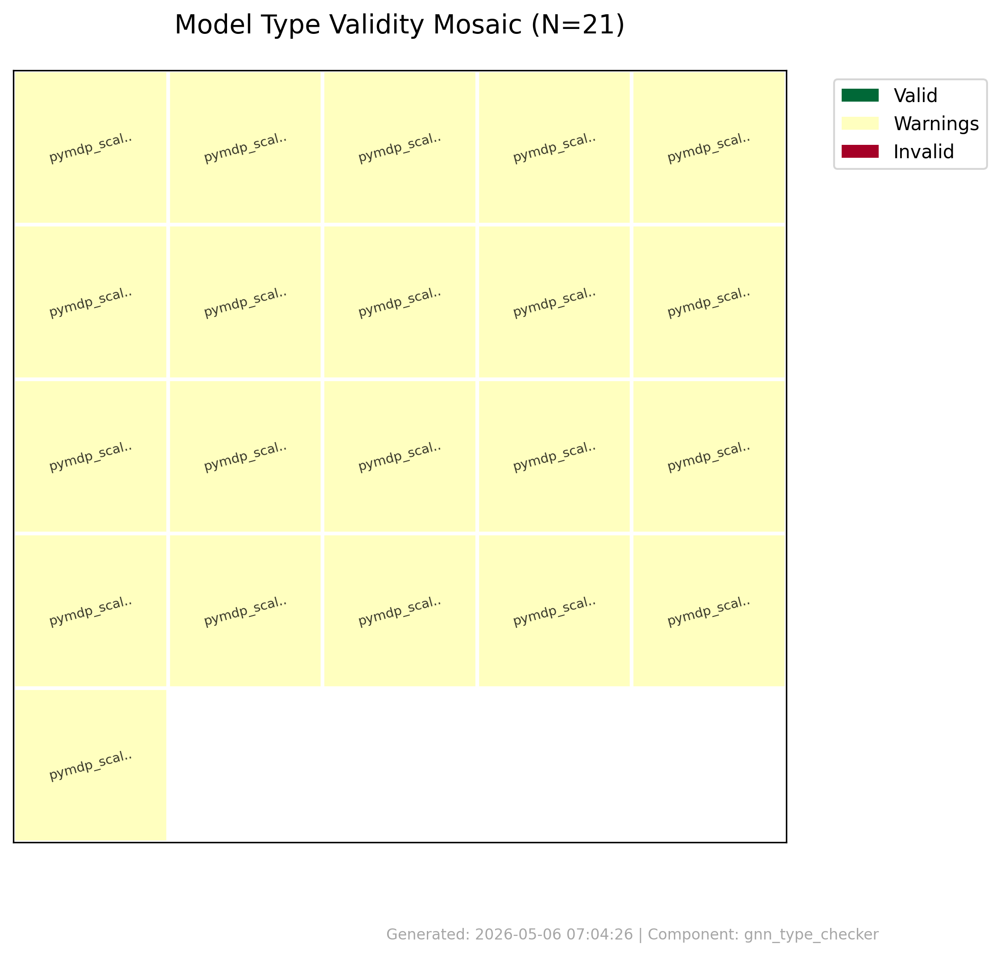
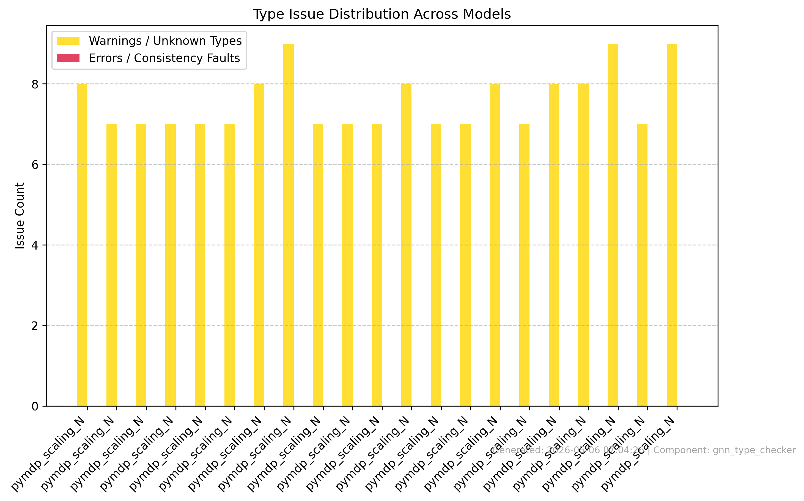
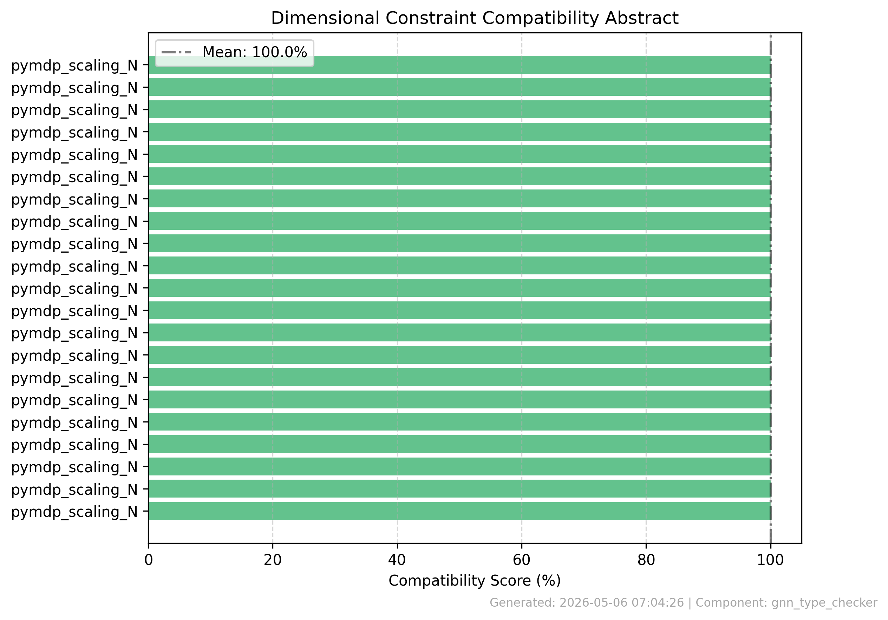
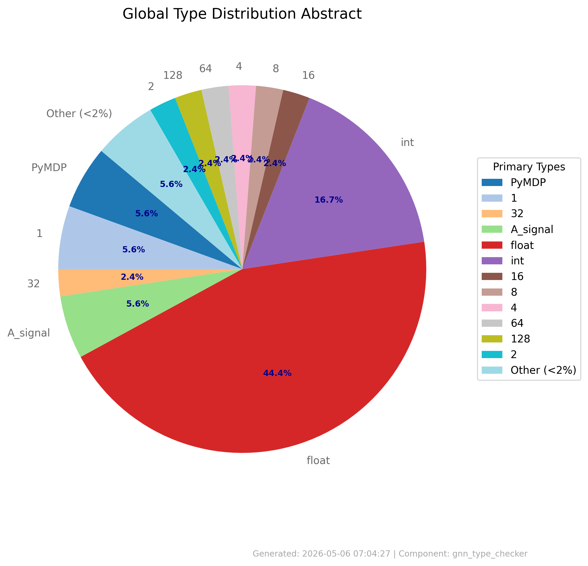
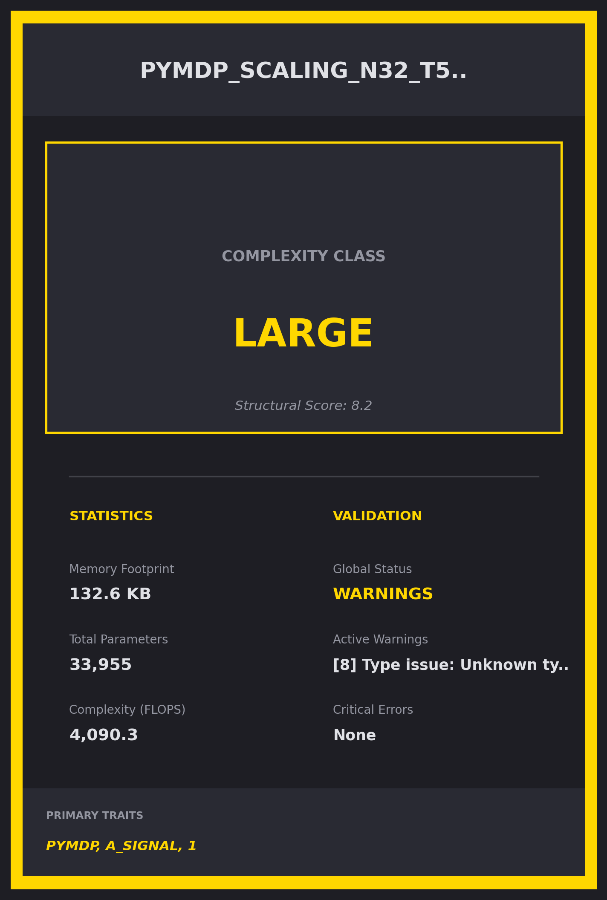
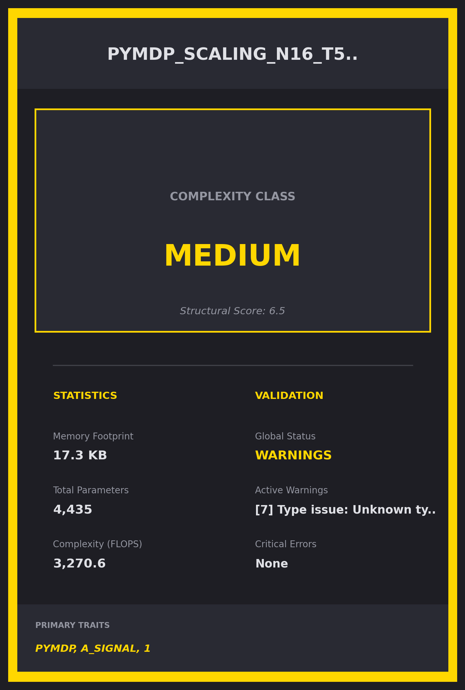

# Type Check Summary

**Generated**: 2026-05-06 07:04:27

## Processing Results
- **Files Processed**: 21
- **Success**: True
- **Errors**: 0

## Validation Results
- **Files Validated**: 21
- **Valid Files**: 21
- **Invalid Files**: 0

## Type Analysis
- **Type Analyses**: 21
- **Total Variables**: 378

## Graphical Abstracts
\n\n\n\n\n\n\n\n\n
### Model Baseball Cards Preview\n\n\n\n\n\n
*(Remaining 19 Model Cards are located in `visualizations/cards/`)*\n
## Error Summary
- No errors encountered\n