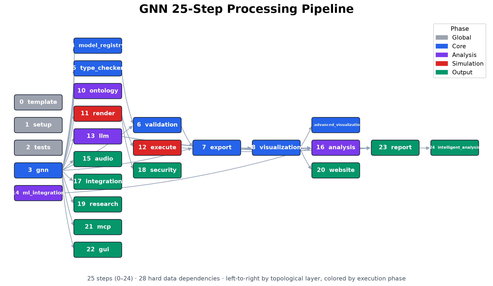
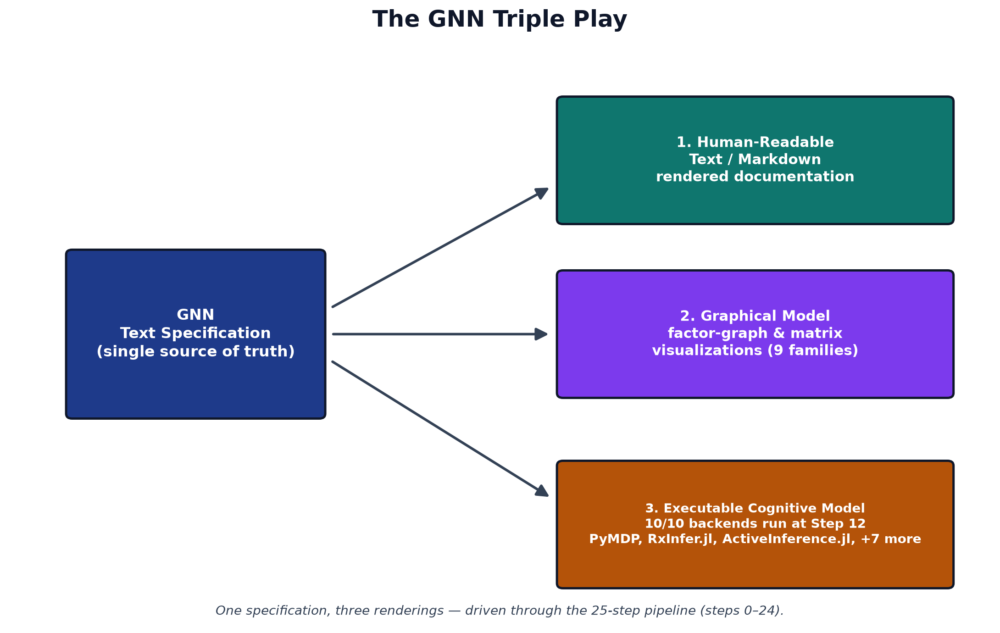
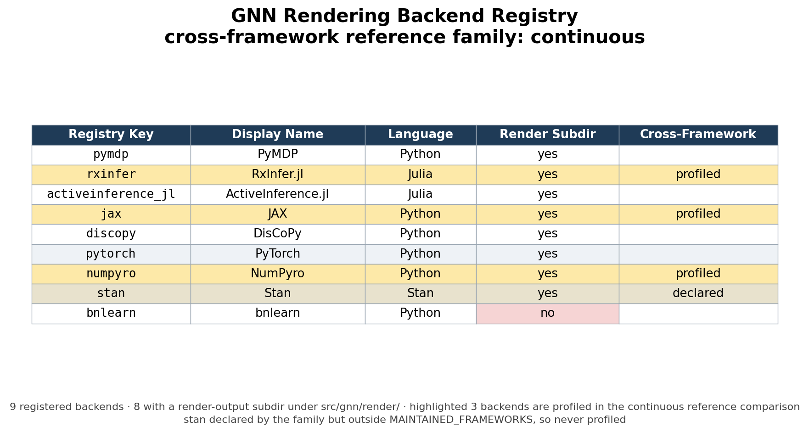
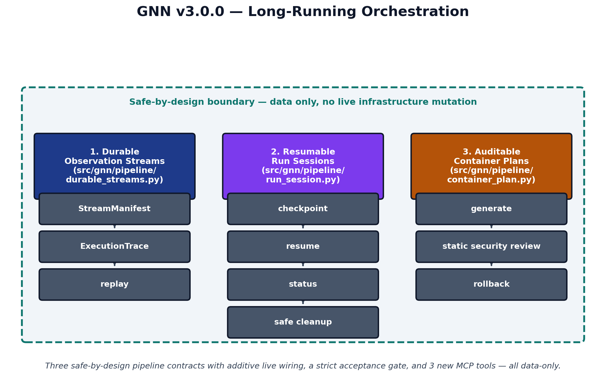
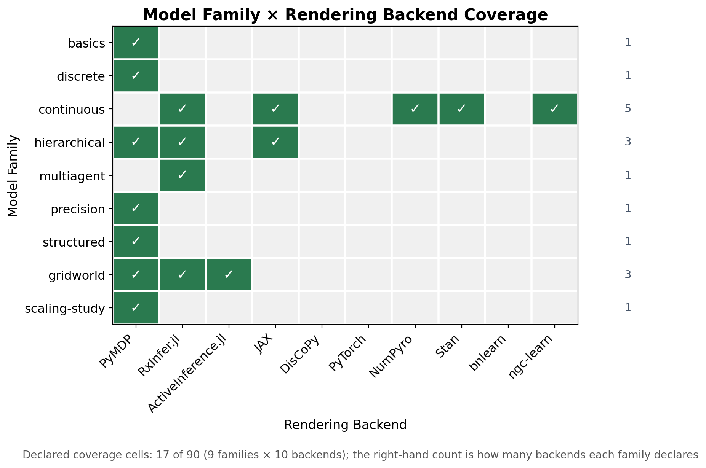
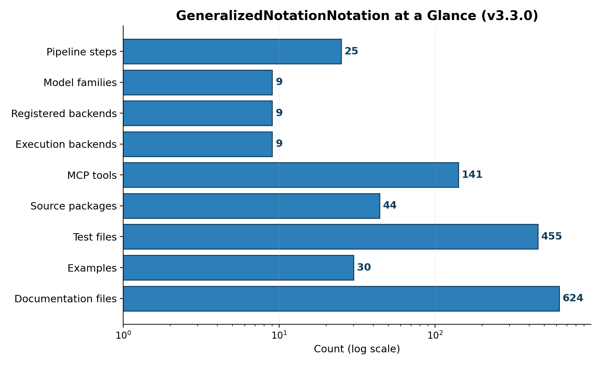

# Abstract {#sec:abstract}

Active Inference offers a unifying account of perception, learning, and action under the free energy principle [@friston2010], yet the generative models at its core are still communicated ad hoc: scattered across prose descriptions, bespoke notebooks, and framework-specific code that rarely agree. This fragmentation makes published models hard to reproduce, compare, or port between tools, and it raises the barrier for newcomers learning the formalism [@parr2022]. GeneralizedNotationNotation (GNN) addresses this gap with a standardized, human- and machine-readable text language for specifying Active Inference generative models, paired with a 25-step processing pipeline that transforms a single specification into validation, visualization, simulation, and analysis artifacts [@gnn2023]. GNN's "Triple Play" treats each model as three coordinated views — a textual specification, graphical visualizations, and executable cognitive models — so that one source yields consistent outputs across modalities. The framework spans 9 model families and 9 registered rendering backends, with explicit gates for cross-format semantic fidelity and cross-framework reliability. GNN 3.0.0 layered safe-by-design long-running orchestration on top of this language and pipeline — durable observation streams, resumable run sessions, and auditable container plans that generate, validate, and replay data only, with no live infrastructure mutation. We describe the language, the pipeline architecture, and the validation that confirms specifications round-trip faithfully across formats and render across multiple simulation backends — with coverage gaps recorded as explicit profiled-unsupported statuses rather than silently omitted — establishing GNN as reproducible, interoperable infrastructure for communicating Active Inference models.


---


# Introduction {#sec:introduction}

## Motivation

Active Inference has matured into a broad research program spanning the free energy principle [@friston2010], discrete state-space formulations of perception and action [@dacosta2020], and a growing body of pedagogy and reference implementations [@parr2022;@smith2022]. Recent graphical-specification and message-passing work makes the same practical pressure visible: active-inference agents need representations that can be inspected as model structure and then carried into executable inference updates without being reauthored by hand [@koudahl2023syntheticAgents1;@vandelaaar2023syntheticAgents2;@bagaev2021reactiveMessagePassing]. As the field has grown, so has a quieter problem: the models themselves are difficult to share, reproduce, and compare. A generative model that lives only as a tangle of matrix definitions inside one author's script, a diagram in a slide deck, and a paragraph of prose in a paper has no single authoritative form. The same model is described three times, in three incompatible media, with no guarantee that they agree. When a reader wants to re-run that model in a different toolkit, they must reverse-engineer it from whichever fragment they happen to have.

This is a reproducibility and interoperability crisis specific to the structure of Active Inference work. The discipline depends on precisely specified state spaces, observation and transition tensors, prior preferences, and policy structures; small notational ambiguities propagate into materially different behaviour. Yet the community has lacked a notation that is simultaneously human-readable, machine-parseable, and faithful to the underlying mathematics. Generalized Notation Notation (GNN) was introduced to fill exactly that gap [@gnn2023]: a standard, text-based way to write down an Active Inference generative model once, such that every downstream use derives from the same source of truth.

## The GNN Approach

GNN treats the model specification as a first-class artifact. A model is written in a plain-text language whose syntax captures the components an Active Inference modeller actually reasons about — state factors, observation modalities, the matrices that link them, control structure, and the temporal organization of the model. Because the specification is text, it lives comfortably in version control, diffs cleanly across revisions, and can be authored and reviewed by humans without specialized tooling.

The defining commitment of GNN is what the project calls the Triple Play: a single text specification is the common origin for three coordinated renderings of the same model. The text form is the authoritative, editable description. From it, GNN produces graphical visualizations that expose the model's factor and dependency structure for inspection and communication. And from the same source it produces executable cognitive models that can actually be run, so that the diagram, the equations, and the running code are all generated from one parsed document rather than three artifacts that merely claim to describe the same model. The Triple Play turns a model from a description scattered across media into one specification with multiple faithful projections (see [@fig:triple_play]).

## Contributions

This work contributes a standard notation together with the infrastructure that makes it usable in practice:

- **A parseable, human-readable notation** for Active Inference generative models, whose text form is authoritative and from which every other representation is derived.
- **A 25-step processing pipeline** (0–24), whose stages are implemented across 31 source packages, that carries a specification from parsing and validation through visualization, rendering, and execution.
- **9 rendering backends** (PyMDP, RxInfer.jl, ActiveInference.jl, JAX, DisCoPy, PyTorch, NumPyro, Stan, bnlearn) that materialize a single GNN specification as backend-specific model code, of which 8 (PyMDP, RxInfer.jl, ActiveInference.jl, JAX, DisCoPy, PyTorch, NumPyro, Stan) also execute at Step 12, realizing the executable arm of the Triple Play.
- **141 Model Context Protocol tools** that expose the pipeline's capabilities to agentic and programmatic clients, so the notation and its tooling are directly accessible to automated workflows.
- **9-family reliability gates** that exercise the pipeline against a curated set of model families (basics, discrete, continuous, hierarchical, multiagent, precision, structured, gridworld, scaling-study), turning interoperability claims into checks that must pass rather than assertions that are merely made.

## Reader Orientation

The remainder of this manuscript is organized to move from language to mechanism to evidence. [@sec:system_context] states the notation and the generative model it denotes, writing the factorization, the four matrices, and the two free-energy objectives as explicit equations ([@eq:generative_model] through [@eq:policy]); it presents the pipeline structure ([@fig:pipeline]), the Triple Play ([@fig:triple_play]), and the per-step responsibility table ([@tbl:pipeline_steps]). [@sec:methods] follows a specification through the pipeline — parsing, type checking, rendering, execution, and reporting — and presents the backend registry ([@tbl:backend_registry]), the backend registry surface ([@fig:backend_matrix]), and the long-running orchestration contracts ([@fig:orchestration]). [@sec:artifacts_evidence] reports what the project has produced and how each number is grounded, with the model-family registry ([@tbl:model_families]), the family-by-framework coverage ([@fig:family_matrix]), and repository-scale metrics ([@fig:repo_metrics]). Claims of independent re-execution are addressed in [@sec:reproducibility], the boundaries of the current system in [@sec:limitations_next_steps], the symbol and construct tables in [@sec:symbols_glossary], and full source details in [@sec:references]. Read in this order, the manuscript moves from why a standard notation is needed, through how GNN realizes it, to the evidence that the standard holds.


---


# System Context {#sec:system_context}

Generalized Notation Notation (GNN) couples a small, declarative text language for Active Inference generative models to a deterministic processing pipeline that turns each specification into validation, visualization, simulation, and analysis artifacts [@gnn2023]. The language gives a model one canonical written form; the pipeline gives that form many executable and graphical realizations. This section describes both halves of the architecture and the way they meet, and it states the mathematical objects the language is obliged to carry.

## The GNN Language

A GNN model is a plain-text document organized into named sections that together pin down a complete partially observable Markov decision process. The `StateSpaceBlock` declares the variables of the model and their dimensions — hidden states, observations, control factors, and policies — establishing the shape of every tensor that follows. The `Connections` section records the directed and undirected dependencies among those variables, the edges of the underlying factor graph that downstream tools read to lay out diagrams and wire up inference. The full construct vocabulary is catalogued in [@tbl:gnn_constructs].

## The Generative Model a Specification Denotes

Every GNN file denotes one object: a discrete state-space generative model over a horizon $T$, factorized as in [@eq:generative_model] following the standard formulation [@dacosta2020; @smith2022].

$$
P(o_{1:T},\, s_{1:T},\, \pi) \;=\; P(\pi)\; P(s_1) \prod_{t=1}^{T} P(o_t \mid s_t) \prod_{t=2}^{T} P(s_t \mid s_{t-1},\, \pi)
$$ {#eq:generative_model}

The four matrices named in the `StateSpaceBlock` are exactly the factors of [@eq:generative_model], and this correspondence is what makes the notation translatable rather than merely descriptive. The `A` matrix is the likelihood, a column-stochastic map from hidden states to observation outcomes, given in [@eq:likelihood].

$$
P(o_t = i \mid s_t = j) \;=\; A_{ij}, \qquad \sum_i A_{ij} = 1
$$ {#eq:likelihood}

The `B` matrix is the controlled transition dynamics: one column-stochastic slice per action, as in [@eq:transition].

$$
P(s_{t+1} = i \mid s_t = j,\, u_t = k) \;=\; B^{(k)}_{ij}, \qquad \sum_i B^{(k)}_{ij} = 1
$$ {#eq:transition}

The `C` vector holds log-preferences over observations, which enter inference as the biased outcome distribution of [@eq:preference]; the `D` vector is the prior over initial hidden states, [@eq:prior].

$$
\tilde{P}(o_t = i) \;=\; \sigma(C)_i \;=\; \frac{\exp C_i}{\sum_j \exp C_j}
$$ {#eq:preference}

$$
P(s_1 = i) \;=\; D_i, \qquad \sum_i D_i = 1
$$ {#eq:prior}

Given those factors, perception is approximate Bayesian inference: a variational posterior $Q(s)$ is fitted by minimizing the variational free energy of [@eq:vfe], which decomposes into a complexity term and an accuracy term [@friston2010].

$$
F[Q] \;=\; \underbrace{D_{\mathrm{KL}}\!\left[\,Q(s) \,\|\, P(s)\,\right]}_{\text{complexity}} \;-\; \underbrace{\mathbb{E}_{Q(s)}\!\left[\ln P(o \mid s)\right]}_{\text{accuracy}}
$$ {#eq:vfe}

Action is expected-free-energy minimization: each policy $\pi$ is scored over future steps $\tau$ by [@eq:efe], whose two terms are the information gain a policy is expected to yield and the extent to which its predicted outcomes match `C` [@dacosta2020].

$$
G(\pi) \;=\; -\underbrace{\mathbb{E}_{Q(o_\tau,\, s_\tau \mid \pi)}\!\left[\ln Q(s_\tau \mid o_\tau, \pi) - \ln Q(s_\tau \mid \pi)\right]}_{\text{epistemic value}} \;-\; \underbrace{\mathbb{E}_{Q(o_\tau \mid \pi)}\!\left[\ln \tilde{P}(o_\tau)\right]}_{\text{pragmatic value}}
$$ {#eq:efe}

The policy posterior then combines those scores with the habit prior `E` declared in the specification, as in [@eq:policy], and the selected action $u$ is sampled from it.

$$
Q(\pi) \;=\; \sigma\!\left(\ln E - G\right)
$$ {#eq:policy}

Recent work continues to refine how expected-free-energy objectives relate to variational inference and to alternative but equivalent formulations, which is why GNN keeps the objects of [@eq:generative_model] through [@eq:policy] explicit in the notation rather than burying them in backend-specific code [@champion2024reframingEfe;@nuijten2026typeInference;@nuijten2026efePlanningVariational]. A `ModelParameters` section fixes the scalars those objects depend on — factor cardinalities and precision terms — while a `Time` section declares whether the model is static or dynamic and, if dynamic, how the horizon $T$ and its discretization are organized. Because every one of these sections is explicit text, a GNN file is at once human-readable, diffable under version control, and unambiguous to a parser — the property that lets the rest of the pipeline operate deterministically.

## The Processing Pipeline

The pipeline is a fixed sequence of 25 numbered steps, 0–24, each a self-contained stage that consumes the artifacts of its predecessors and writes typed outputs for those that follow. Early steps parse and type-check the GNN text and validate it against the language schema; middle steps render visualizations, export the model to executable backends, and run simulations; later steps perform analysis, reporting, and downstream integration. The data dependencies among the steps form the directed acyclic graph shown in [@fig:pipeline], which makes the whole flow inspectable: any artifact can be traced back to the step that produced it and forward to every step that depends on it.

{#fig:pipeline width=90%}

The per-step responsibilities are enumerated in [@tbl:pipeline_steps]; each row names a step and the transformation it owns within the 0–24 range.

| Step | Module | Purpose |
|---:|---|---|
| 0 | `0_template.py` | Pipeline template & initialization |
| 1 | `1_setup.py` | Environment setup & UV dependency install |
| 2 | `2_tests.py` | Test suite execution (pytest) |
| 3 | `3_gnn.py` | GNN file discovery & multi-format parsing |
| 4 | `4_model_registry.py` | Model versioning & registry management |
| 5 | `5_type_checker.py` | GNN type validation & resource estimation |
| 6 | `6_validation.py` | Consistency & semantic quality checking |
| 7 | `7_export.py` | Multi-format export (JSON, XML, GraphML, GEXF, Pickle) |
| 8 | `8_visualization.py` | Graph & matrix visualization generation |
| 9 | `9_advanced_viz.py` | Interactive / advanced visualization (Plotly, D3) |
| 10 | `10_ontology.py` | Active Inference ontology processing & validation |
| 11 | `11_render.py` | Code generation for simulation frameworks |
| 12 | `12_execute.py` | Execute rendered simulation scripts |
| 13 | `13_llm.py` | LLM-enhanced analysis & model interpretation |
| 14 | `14_ml_integration.py` | Machine learning integration & model training |
| 15 | `15_audio.py` | Audio sonification generation (SAPF) |
| 16 | `16_analysis.py` | Statistical analysis & cross-simulation aggregation |
| 17 | `17_integration.py` | System integration & cross-module coordination |
| 18 | `18_security.py` | Security validation & generated code scanning |
| 19 | `19_research.py` | Research tools & literature references |
| 20 | `20_website.py` | Static HTML website generation |
| 21 | `21_mcp.py` | Model Context Protocol processing & tool registration |
| 22 | `22_gui.py` | Interactive GNN constructor GUI |
| 23 | `23_report.py` | Comprehensive analysis report generation |
| 24 | `24_intelligent_analysis.py` | AI-powered pipeline analysis & executive reports |
: The pipeline steps, their thin orchestrator modules, and their purposes, read from `src/STEP_INDEX.md`. {#tbl:pipeline_steps}

This staged design keeps the architecture modular. The implementation is organized into 31 source packages, one cluster of responsibilities per concern, and is documented across 616 documentation files so that each step's contract, inputs, and outputs are specified independently of the others. New backends or analyses attach to the graph by declaring their dependencies rather than by editing a monolith, and the deterministic step ordering means a model processed today yields the same artifacts when reprocessed tomorrow.

## The Triple Play

The reason for separating a single written language from a multi-stage pipeline is the design goal GNN calls the Triple Play: one model specification, three coordinated modes of existence. The same GNN text is simultaneously a human-readable model description, a set of graphical visualizations of its state space and factor structure, and an executable cognitive model that can be run as a simulation. @fig:triple_play depicts these three faces and the shared specification at their center.

{#fig:triple_play width=70%}

Each face is generated from the same source, so they cannot drift apart. The text is the contract a researcher reads and reviews; the visualizations expose the factor-graph structure for inspection and communication; and the executable rendering lets the identical model be simulated across inference frameworks, connecting the written specification to libraries such as pymdp for discrete Active Inference [@heins2022] and to the broader tooling ecosystem for compositional model representation [@defelice2021]. Because all three derive from one parsed document, GNN turns a model from a static artifact into a live object that can be read, seen, and run without re-encoding it for each purpose [@smith2022].


---


# Methods {#sec:methods}

The GeneralizedNotationNotation (GNN) method is realized as a sequence of deterministic transformations that take a plain-text model specification and carry it through parsing, validation, code generation, execution, and reporting. The processing pipeline is organized into 25 numbered steps (steps 0–24), each implemented as a standalone module with a single responsibility. The methods below describe the path that a model travels from notation to executable cognitive model and back to analyzed results. Every quantity reported in this section is produced from the live repository rather than asserted by hand; the closing subsection makes that contract explicit.

## Parsing and Multi-Format Export

The pipeline begins by ingesting GNN model files written in the plain-text notation. Parsing (step 3) reads each specification, builds an internal model representation, and re-emits it across a family of structured export formats so that downstream tools, and human readers, can consume the same model through whichever serialization they prefer. The corpus that exercises this stage spans 29 example model files organized into 10 curated corpora, ranging from minimal perception fixtures used to test the parser to larger hierarchical and multi-agent models. The presence of hierarchical fixtures should be read as a coverage target, not as a claim that every current backend fully executes every hierarchical formulation; scaling hierarchical active inference remains an active research problem in its own right [@rangarajan2026hierarchicalSuccessor]. Treating parsing and export as a single round-trippable stage means a model authored once becomes immediately available as a typed object, a normalized text form, and machine-readable serializations without any manual re-encoding.

## Type Checking and Validation

A model that parses is not yet a model that is well-formed. Steps 5 and 6 apply type checking and validation to confirm that the state spaces, observation modalities, control factors, and the matrices relating them are mutually consistent before any code is generated. This catches dimensional mismatches and malformed factor structures at the notation level, where the diagnostic is cheap and legible, rather than allowing them to surface as opaque runtime errors deep inside a numerical backend. Validation here is the gate that protects every later stage: rendering, execution, and analysis all assume a model that has already been certified consistent.

## Rendering to Multiple Backends

The central act of the "Triple Play" is turning a validated specification into executable cognitive models. The rendering stage emits backend-specific code for 9 registered target frameworks — PyMDP, RxInfer.jl, ActiveInference.jl, JAX, DisCoPy, PyTorch, NumPyro, Stan, bnlearn — so that a single GNN model can be instantiated as a simulation in whichever computational ecosystem a researcher already works in; coverage across the family-by-backend matrix is uneven and is recorded explicitly (see @sec:limitations_next_steps). Each backend is addressed through a registry key that maps the abstract model onto that framework's idioms for representing generative models and performing inference. The full mapping from registry key to backend is given below.

| Registry key | Backend | Executes |
|---|---|---|
| `pymdp` | PyMDP | yes |
| `rxinfer` | RxInfer.jl | yes |
| `activeinference_jl` | ActiveInference.jl | yes |
| `jax` | JAX | yes |
| `discopy` | DisCoPy | yes |
| `pytorch` | PyTorch | yes |
| `numpyro` | NumPyro | yes |
| `stan` | Stan | yes |
| `bnlearn` | bnlearn | render-only |
: Render targets in `src/render/framework_registry.py`. The *Executes* column is the registry's own `supports_execution` flag: a render-only backend has no Step-12 executor. {#tbl:backend_registry}

The registry surface of these backends — registry key, display name, implementation language, and which of them the cross-framework gate compares — is summarized in @fig:backend_matrix; the family-by-backend coverage itself is shown in @fig:family_matrix.

{#fig:backend_matrix width=85%}

By generating code rather than asking authors to port models by hand, the method keeps a single source of truth in the notation while still reaching the discrete message-passing libraries [@heins2022], reactive message-passing lineage [@bagaev2021reactiveMessagePassing], and categorical, diagrammatic frameworks [@defelice2021] that different research communities have built. The underlying mathematics that compatible backends share — inference and policy selection over discrete state spaces under the free-energy objective [@dacosta2020; @smith2022] — is the common substrate the renderer attempts to preserve; where a backend cannot express a family faithfully, GNN records that boundary as an explicit unsupported status rather than treating all registered backends as equivalent.

## Execution

Generated backend code is not left as a static artifact. The execution stage (step 12) runs the rendered models, driving the inference and behavior that the notation describes and producing concrete traces, beliefs, and outputs. This closes the loop from text to running cognitive model: the same specification that was type-checked and exported is now exercised numerically, so that claims about a model's behavior rest on having actually run it rather than on inspection of the source alone.

## Long-Running Orchestration Contracts

GNN 3.0.0 extended the pipeline with three safe-by-design orchestration contracts that let an extended run be observed, paused, resumed, and audited without ever mutating live infrastructure. *Durable observation streams* record file- and array-backed stream manifests with content checksums and replayable execution traces, so that a long run can be re-derived deterministically before any live sensor or device-backed stream is introduced. *Resumable run sessions* carry run-session manifests with atomic checkpoint and resume, status inspection, and cancellation-safe cleanup, so that an extended model-family acceptance run can be interrupted and resumed without corrupting partial state. *Auditable container plans* generate hardened container plans together with an explicit static security review and a rollback descriptor, deliberately stopping short of touching any real cluster. Each contract only generates and validates data; none performs live mutation, and each is governed by a strict acceptance gate and exercised through dedicated Model Context Protocol tools. @fig:orchestration shows how the three contracts compose into one inspectable orchestration surface.

{#fig:orchestration width=85%}

## Analysis, Visualization, and Reporting

The final group of stages turns execution results into interpretable evidence. Analysis (step 16) processes the outputs of execution into structured findings; visualization (step 8) and the rendering of figures (step 9) translate model structure and results into graphical form, supporting the graphical leg of the Triple Play; and the reporting stage (step 23) assembles these artifacts into a coherent summary of what the model is and how it behaved. Because each stage writes its outputs to a known location, the chain from a notation file to a finished report is fully traceable, and any figure or number in a report can be followed back to the step and model that produced it.

## Reproducibility and Auto-Injection

Every count reported in this manuscript is emitted by the producer `scripts/z_generate_manuscript_variables.py` from the repository state at commit 078c6d008, not typed by hand. The producer reads that commit's source surfaces directly — the step modules, the source tree, the model-family manifest, and the framework registry — together with the project's maintained ledgers, notably the Model Context Protocol tool audit (`src/mcp/audit_report.json`, itself regenerated by the test suite). From these it emits a manifest of named tokens — counts of pipeline steps, source packages and files, model families, backends, example files, tests, and tools — which the renderer substitutes into the prose at build time. Filesystem-derived counts are recomputed on every run; ledger-derived counts (such as the MCP tool total) are as current as the ledger they read, which the maintained test suite keeps in sync. The manuscript therefore inherits a determinism property: running the producer against a fixed repository state yields the same values, and authors are prohibited from hard-coding any number that has a corresponding token. This makes the manuscript a faithful, regenerable description of the system it documents: when the 25-step pipeline, the 9 rendering backends, or the 29-file example corpus change, the reported numbers change with them on the next build, and `scripts/check_manuscript_tokens.py` fails the build if a section reintroduces a literal that a token already owns.


---


# Artifacts and Evidence {#sec:artifacts_evidence}

This section reports what the project has actually produced and how each quantitative claim is grounded. Every number below is substituted at render time from the deterministic producer, which reads the repository state at commit 078c6d008, so each figure here is regenerated from the artifacts it describes rather than transcribed.

## Model-Family Coverage

GNN ships a curated corpus of model families that exercise the language across the difficulty gradient from minimal parser fixtures to full multi-agent and scaling studies. The manifest registers 9 families (basics, discrete, continuous, hierarchical, multiagent, precision, structured, gridworld, scaling-study) across 9 target directories, and `input/gnn_files` holds 10 corpus directories containing 29 concrete example models. The three sets are not coextensive, and the manuscript does not treat them as one. Registered in no family: `input/gnn_files/learning` (1 of the 10 corpus directories), covered in [@sec:limitations_next_steps]. Registered but outside the scanned tree: none, because all 9 target directories are themselves `input/gnn_files` corpus directories. Each family declares the simulation frameworks it is meant to drive, which is what lets the same text model fan out across the executable-model leg of the Triple Play [@gnn2023]. The families and their declared frameworks are enumerated below.

| Family | Frameworks | Description |
|---|---|---|
| `basics` | pymdp | Minimal perception fixtures used for parser and validator smoke coverage. |
| `discrete` | pymdp | Discrete POMDP and HMM-style active inference fixtures. |
| `continuous` | jax, numpyro, stan, rxinfer | Continuous-state linear-Gaussian fixtures (F/H/Q/R + Gaussian prior; continuous_navigation closes the loop on beliefs). Native on RxInfer.jl, JAX, PyTorch, NumPyro, Stan; reported unsupported (not failed) on PyMDP, ActiveInference.jl, DisCoPy, bnlearn. |
| `hierarchical` | pymdp, rxinfer, jax | Hierarchical and temporal model fixtures (per-level matrices composed into a joint POMDP for categorical backends; RxInfer.jl renders two-level models natively). |
| `multiagent` | rxinfer | Multi-agent coordination and swarm fixtures. |
| `precision` | pymdp | Precision weighting and curiosity-driven fixtures. |
| `structured` | pymdp | Structured factor graph and posterior fixtures. |
| `gridworld` | pymdp, rxinfer, activeinference_jl | Gridworld POMDP fixture used for cross-framework acceptance checks. |
| `scaling-study` | pymdp | PyMDP scaling-study fixtures, sampled conservatively for acceptance. |
: Model families declared in `input/model_family_manifest.json` and the frameworks each family targets. Capability splits in the Description column are generated from `src/render/framework_registry.py`, not authored in the manifest. {#tbl:model_families}

The family-by-framework structure is shown in @fig:family_matrix, which renders the coverage matrix directly from the family registry rather than from a hand-maintained table.

{#fig:family_matrix width=85%}

These families are not illustrative prose: they are the inputs over which the parser, the type checker, and the cross-framework code generators are exercised, and they are the substrate for the reliability gates described next.

## Semantic-Fidelity and Cross-Framework Reliability Gates

Two reproducible-by-command gates check that GNN's promise — one text model, many faithful executable renderings — survives contact with real backends. Both live under `scripts/` and read the same family corpus described above, so they verify the artifacts the manuscript actually references.

The semantic-fidelity gate, `scripts/run_semantic_fidelity_gate.py`, checks that a model parsed from GNN text and then re-emitted preserves its semantic content: the state-space structure, the factor and modality declarations, and the matrix shapes implied by a discrete Active Inference generative model survive the round trip [@dacosta2020]. It is meant to be run as a command and to report fidelity per model, not as a static claim baked into prose.

The cross-framework reliability gate, `scripts/run_cross_framework_reliability.py`, takes a single GNN model and renders it across multiple simulation backends, then checks that the resulting executable models agree on the structure they were generated from. The reference comparison runs on the continuous family across JAX, NumPyro, RxInfer.jl — 3 independent Active Inference engines spanning the Python and Julia ecosystems [@heins2022]. The family declares 4 backends (JAX, NumPyro, Stan, RxInfer.jl); Stan is declared but not among the 7 frameworks the gate profiles, so it is excluded from the comparison. Because the same source model drives all 3 renderings, disagreement between backends localizes a generator defect rather than a modeling choice.

Both gates are stated here as commands you can run, not as asserted pass counts. The manuscript deliberately does not quote a fixed number of passing checks: the authoritative, current result is whatever those scripts report when executed against the corpus, and binding a frozen count into prose would invite exactly the drift the auto-injection contract exists to prevent.

## Repository Scale

The repository's scale is itself evidence of the surface that the gates and pipeline cover, and it is reported in @fig:repo_metrics directly from the tracked files at commit 078c6d008.

{#fig:repo_metrics width=80%}

The test suite comprises 367 test files containing 4133 test functions, exercising a source base of 582 Python files across 31 packages (194808 lines of source). The Model Context Protocol surface — which exposes GNN's capabilities to external agents and tools — provides 141 tools across 32 modules. The pipeline itself runs as 25 steps (0–24), and 105 figure artifacts from the rendering of figures, models, and reports are committed under `output/`, of which 6 are the manuscript's own.

## Claim Discipline

A claim is manuscript-ready only when it is bound to a verifiable artifact. Concretely, every claim in this manuscript must rest on one of four support types:

- A passing test or validator command — for example the semantic-fidelity and cross-framework gates above, which can be re-run on demand.
- A generated output produced by a deterministic producer, such as the figures rendered from the family and repository scans, or the token values emitted by the manuscript-variable producer that backs every number on this page.
- A source ledger, manifest, or configuration file that fixes the value being claimed.
- A resolved entry in `references.bib` for any external-literature claim [@friston2010; @parr2022].

The pipeline records its own evidence trail under `output/`. The run-level summary is written to `output/PIPELINE_REPORT.md`, and the per-step execution record — including which steps ran, their status, and their artifacts — is captured in `output/00_pipeline_summary`. These are the artifacts a reader should consult to confirm that the numbers substituted into this section correspond to a real, reproducible pipeline run rather than to asserted prose. When a value would otherwise need a literal number with no producer behind it, the discipline is to omit the number rather than to hard-code it.


---


# Reproducibility {#sec:reproducibility}

Reproducibility in GNN is not an aspiration layered on top of the system; it is the operating contract that the pipeline enforces. The 0–24 processing steps are deterministic given a model specification and a target directory, and every published claim in this manuscript is traceable to a command that regenerates the underlying artifact. This section lists only commands that exist in the repository, so that a reader with a clean checkout can reproduce the pipeline, the validation gates, and this manuscript itself.

## Pipeline Smoke Run

The fastest way to confirm a working installation is to drive the full pipeline over the discrete model family without invoking the optional LLM steps:

```bash
uv run python src/main.py --target-dir input/gnn_files/discrete --output-dir /tmp/gnn-smoke --skip-llm
```

This parses the discrete GNN files, runs visualization and rendering across the maintained backends, and writes all artifacts under the chosen output directory. The `--skip-llm` flag keeps the run hermetic and free of external API calls, which makes it suitable for continuous integration and for offline reproduction. To exercise every registered family rather than a single one, drive the manifest through the model-family acceptance gate given below: pointing `--target-dir` at `input/gnn_files` covers that tree's 10 corpus directories. All 9 registered family target directories lie inside that tree, so a single invocation reaches every registered family.

## Validation Gates

GNN's reproducibility guarantees rest on a small set of strict, deterministic gates that bind the manuscript's quantitative claims to recomputable ledgers. The model-family acceptance gate runs the maintained families declared in the manifest and fails on any regression:

```bash
uv run python scripts/run_model_family_acceptance.py \
  --manifest input/model_family_manifest.json --strict
```

The semantic-fidelity gate verifies that a parse → serialize → parse round trip preserves variables, edges, dimensions, parameter shapes, equations, time semantics, and ontology mappings across the 9 model families; the cross-framework gate profiles the 7 maintained backends (PyMDP, RxInfer.jl, JAX, NumPyro, PyTorch, ActiveInference.jl, DisCoPy) — refusing any framework outside that set — and records explicit compatible and unsupported statuses rather than silently degrading. Both write their ledgers to an output directory of your choosing:

```bash
uv run python scripts/run_semantic_fidelity_gate.py \
  --manifest input/model_family_manifest.json \
  --output-dir output/semantic_fidelity --strict
uv run python scripts/run_cross_framework_reliability.py \
  --manifest input/model_family_manifest.json \
  --output-dir output/cross_framework --strict
```

Under `--strict`, each gate exits non-zero on the first mismatch, so these commands double as assertions in an automated reproduction run. Code-quality reproducibility is enforced separately through the developer command reference: `just lint` runs the Ruff linter over `src` and `scripts`, and the broader `just quality` recipe chains formatting, terminology, documentation, type, and security checks for a full pre-commit gate.

## Manuscript Reproducibility

This manuscript is itself a reproducible artifact. Every quantitative value in the prose — the pipeline step count, the family and backend counts, the source and test inventories — is a token rather than a hard-coded literal, and the deterministic producer regenerates all of them from the tracked files at the current commit:

```bash
python scripts/z_generate_manuscript_variables.py
```

That command recomputes the {{...}} tokens, persists them to `output/data/manuscript_variables.json` for audit, and hydrates the manuscript sources into `output/manuscript/`. The manuscript's own figures are rebuilt from the same token map:

```bash
python -m scripts.manuscript_build_figures
```

The hydrated sources are then rendered to PDF by the docxology template's render stage. That stage lives in a separate checkout, with this repository symlinked into it at `projects/active/GeneralizedNotationNotation`; run from the template root:

```bash
uv run --frozen python scripts/pipeline/stage_03_render.py \
  --project GeneralizedNotationNotation
```

The render needs a LaTeX installation providing the packages listed in `manuscript/preamble.md` plus `seqsplit`; the template guards `seqsplit` with `\IfFileExists`, so a missing copy degrades rather than failing the build.

Because the variables file is regenerated before rendering, the counts in the rendered PDF track the repository state at the commit recorded in `output/data/manuscript_variables.json` (078c6d008): a code change that alters, for example, the test inventory (367 test files, 4133 test functions) propagates into the prose on the next regeneration without any manual editing.

## Reproducibility Contract

- Do not cite results that cannot be regenerated or directly traced to a command in this repository.
- Keep generated outputs under `output/` and maintained manuscript source under `manuscript/`; treat everything in `output/` as disposable and regeneratable.
- Express every quantitative claim in the prose as a double-brace `{{...}}` token substituted by `scripts/z_generate_manuscript_variables.py`, never as a hard-coded number.
- Keep private data, credentials, and unpublished sensitive details out of the manuscript and out of version control.
- Record the exact verification commands — the smoke run, the acceptance and fidelity gates, and `just lint` — before marking this manuscript publication-ready.


---


# Limitations and Next Steps {#sec:limitations_next_steps}

## Current Limitations

GNN 3.2.0 is a working system with deliberately scoped boundaries, and it is worth stating those boundaries plainly rather than implying broader completeness than the artifacts support. The reliability gates that underpin our confidence in the system — the semantic-fidelity ledger and the cross-framework reliability ledger — are reproducible by command and recorded against the 9 model families, but this manuscript does not assert a particular full-suite pass rate as a headline number. Pass and skip counts shift with the local toolchain, the presence or absence of optional simulation dependencies, and whether the optional Ollama integration paths are exercised, so we treat the reproducing command as the durable claim and leave the run-specific tallies to the ledgers and execution traces that the pipeline writes alongside each run. A reader who wants a number should regenerate it in their own environment rather than trust a transcribed digit here.

A second limitation lives at the boundary between the model families and the rendering backends. GNN registers 9 simulation backends, but coverage across the family-by-backend matrix is intentionally uneven, and the gaps are recorded as explicit *profiled-unsupported* statuses rather than silently omitted. The cross-framework acceptance check is anchored on the continuous family, where JAX, NumPyro, RxInfer.jl are compared directly; the continuous and hierarchical families, by contrast, carry profiled-unsupported markers at the render and execute steps (Steps 11 and 12) for backends that cannot yet faithfully realize their continuous-state or temporal-depth structure. This is honest bookkeeping, not a defect to be hidden: an unsupported status with a recorded reason is more trustworthy than a forced translation that quietly misrepresents the model. It also reflects the state of the surrounding literature, where expected-free-energy formulations, variational-inference reductions, and hierarchical active-inference methods are still being actively refined rather than collapsed into one settled executable recipe [@champion2024reframingEfe;@nuijten2026typeInference;@rangarajan2026hierarchicalSuccessor]. The practical consequence is that not every model expressible in the GNN syntax can be executed on every registered backend today, and authors should consult the profiled-unsupported ledger that `scripts/run_model_family_acceptance.py` writes — the command is given in [@sec:reproducibility] — before assuming a given family will round-trip through a given framework.

A third limitation is one of scope rather than capability. The formal account in [@sec:system_context] fixes the generative-model components `A`, `B`, `C`, `D` and `E` as given and defines only state inference ([@eq:vfe]) and policy inference ([@eq:efe]). GNN can also express *parameter* learning: a matrix may be declared as a latent variable with a Dirichlet prior, and the repository ships both a corpus model that does so (`input/gnn_files/learning/dirichlet_likelihood_learning.md`, which learns its likelihood matrix `A` from observations by joint variational message passing) and the renderer strategy that emits code for it (`src/render/rxinfer/_strategies_learning.py`). That corpus directory is registered in no manifest family — the unregistered set is exactly `input/gnn_files/learning` — so parameter learning is exercised by neither the semantic-fidelity nor the cross-framework ledger and carries no figure or table in this manuscript. We state it here as implemented-but-out-of-scope rather than leave the omission to be inferred from the family tables.

Finally, several capabilities depend on optional dependencies that are not part of the minimal install. The simulation frameworks themselves, the audio sonification path, the LLM-enhanced analysis step, and the interactive visualization step all require extra packages that a lean checkout will not have, and the corresponding pipeline steps degrade to recorded skips rather than failures when those dependencies are absent. This keeps the core parse-validate-export-visualize spine runnable in constrained environments, but it means a full 0–24 traversal of all 25 steps reflects the optional surface that a particular machine has installed. We consider this an acceptable engineering trade for portability, but it is a limitation a reader should hold in mind when interpreting any single end-to-end run.

## Next Steps

The roadmap is concrete and staged. The current release is GNN 3.2.0 ("Exemplar Gold Standard", 2026-09-02). It builds on the three safe-by-design orchestration contracts introduced in GNN 3.0.0, which generate and validate data only, with no live infrastructure mutation. The first is *durable observation streams*: file- and array-backed stream manifests (content-checksummed) with replayable execution traces, so that an extended run can be observed, paused, and re-derived deterministically before any live sensor or device-backed stream is ever introduced. The second is *resumable run sessions*: run-session manifests with atomic checkpoint/resume, status inspection, and cancellation-safe cleanup so that extended model-family acceptance runs can be interrupted and resumed without corrupting partial state. The third is *auditable container plans*: generating hardened container plans with an explicit static security-review and rollback descriptor, deliberately stopping short of mutating any real cluster. Each contract is covered by tests over real objects with negative controls and a strict acceptance gate, additive live wiring connects them to the session-acceptance and run-manifest paths, and three new Model Context Protocol tools expose them. The unifying discipline across all three is that orchestration becomes more capable only as fast as it becomes more inspectable.

The next major target, v4.0.0, pushes toward bounded autonomy, and it is gated behind the 3.0.0 orchestration work for good reason. The intent is to promote today's proposal-only candidate-scoring machinery — which already ranks candidate patches using the existing validators, model-family ledgers, and interpretability reports — toward *reviewed self-editing of GNN files*. Crucially, the design keeps a human in the loop: edits are proposed and applied only after explicit user approval, with no automatic source mutation, and the autonomy is wrapped in policy, rollback, and audit controls before any self-modifying or distributed action is permitted. This continues the same principle that governs the rest of the system, in the lineage of active-inference accounts of self-organizing systems that act to minimize free energy under explicit generative models [@friston2010; @parr2022]: an agent should expand its license to act only in proportion to the reviewability of what it does. The v4.0.0 items are not claimed as complete here; they are the recorded direction of travel, and each will be evidenced by its own gates when it lands, just as the 3.0.0 contracts are evidenced by theirs today.


---


# Supplemental Source Surface {#sec:source_surface}

This supplement records the top-level source surfaces a reader or reviewer should inspect before turning any prose in the main manuscript into a verifiable claim. Each surface below is authored material under version control; the generated artifacts it produces are described separately so that the boundary between hand-written source and reproducible output stays explicit.

The `src/` tree is the executable core of GNN. It is organized into 31 Python packages spanning 582 source files and roughly 194808 lines of code. Alongside these packages sit the 25 top-level step modules (0–24) that implement the numbered pipeline as thin orchestrators delegating into the packages, each module owning one stage of the progression from a parsed GNN text model through visualization, type checking, code export, and executable cognitive simulation. Every claim the manuscript makes about pipeline behavior should be traceable to one of these step modules rather than to descriptive prose alone.

The `input/` tree holds the model corpora that exercise the pipeline. Its `gnn_files/` subtree contains 10 corpus directories organized by model family, together totaling 29 example files. Outside that subtree, `input/multi_agent_models/` holds 1 model file and is registered by no manifest family; `input/recursive_models/` holds no model files and is registered by no manifest family. That model file is outside the 29-file count above. A `model_family_manifest.json` enumerates the 9 registered families and their target directories. This manifest is the authoritative registry that downstream steps and the manuscript variable producer read when they report family counts and cross-framework coverage; it should be consulted directly rather than inferred from directory listings.

The `scripts/` tree contains the thin orchestrators that gate and reproduce the project. These include the acceptance scripts that confirm the pipeline runs end to end, the reliability gates that enforce determinism and coverage expectations, and the manuscript variable producer (`src/manuscript_variables.py` driven from this layer) that emits the double-brace `{{...}}` token values consumed throughout the manuscript. Treating these scripts as the source of reproduction commands keeps reported numbers bound to what the code actually computes.

The `doc/` tree is the prose and reference surface, comprising 616 files of specification, tutorial, and design documentation for the GNN language and its Active Inference grounding [@gnn2023]. It is the place to verify that a manuscript statement about GNN syntax or semantics matches the documented language rather than a convenient paraphrase.

The `output/` tree collects per-step pipeline artifacts: the data dumps, intermediate representations, validation reports, and the 105 figure artifacts committed under it. Everything here is disposable and reproducible from the surfaces above, so it should be read as evidence of a run rather than as authored source. Notably, `output/data/manuscript_variables.json` is where the manuscript's substituted token values are materialized.

## Authored Source Versus Generated Output

`src/`, `scripts/`, `input/`, `doc/` and `manuscript/` are authored and reviewed; everything under `output/` is generated and disposable, including `output/manuscript/`, which holds the token-substituted copies of the `manuscript/` sources rather than the sources themselves. The commands that regenerate the output surfaces are listed in [@sec:reproducibility]: the smoke run for the per-step artifacts, `scripts/z_generate_manuscript_variables.py` for the token map and the hydrated sections, `scripts.manuscript_build_figures` for the 6 manuscript figures, and the template render stage for the PDF. Which values become tokens is not a matter of taste: any quantity the producer can derive from a source surface is a token, `scripts/check_manuscript_tokens.py` fails the build when a section hard-codes one instead, and the resulting 86-entry map is committed at `output/data/manuscript_variables.json` for audit. External references are resolved from `manuscript/references.bib`, which the same gate cross-checks against every citation key in the prose. This manuscript quotes no private or unpublished material.


---


# Symbols and Glossary {#sec:symbols_glossary}

This glossary defines the Generalized Notation Notation (GNN) language constructs
used to specify Active Inference generative models, together with the canonical
Active Inference symbols those constructs carry. Definitions follow the GNN
syntax specification and the discrete POMDP exemplars distributed with the
repository, and they align with the standard discrete-state-space formulation of
Active Inference [@gnn2023; @dacosta2020; @parr2022].

## Language Constructs

A GNN file is an ordered, UTF-8 Markdown document whose level-2 headers name
required and optional sections. The strict schema validator enforces section
order, declaration grammar, and connection syntax; the constructs below are the
load-bearing sections a parser must recognize; they are catalogued in [@tbl:gnn_constructs].

| Construct | Meaning |
| --- | --- |
| `## GNNSection` | Required short identifier for the model block (no spaces, e.g. `ActInfPOMDP`). |
| `## GNNVersionAndFlags` | Required version declaration (`GNN v1` or `GNN v1.1`) with optional flags. |
| `## ModelName` | Required human-readable title of the generative model. |
| `## StateSpaceBlock` | Required block declaring every variable and matrix as `NAME[dim, …, type=…]`, one per line. |
| `## Connections` | Required edge list relating state-space variables, expressing the model's factor graph. |
| `## ModelAnnotation` | Optional free-text description of the model's modalities, factors, and assumptions. |
| `## InitialParameterization` | Optional concrete numeric values for declared matrices and vectors. |
| `## ActInfOntologyAnnotation` | Optional bindings from each variable to a CamelCase Active Inference ontology term. |
| `## ModelParameters` | Optional key-value dimensions (e.g. `num_hidden_states`, `num_obs`, `num_actions`) consumed by code generators. |
| `## Time` | Optional dynamics declaration: a time variable plus `Dynamic`/`Static`, `Discrete`/`Continuous`, and `ModelTimeHorizon`. |
| `## Equations` | Optional LaTeX-rendered formulas defining model dynamics and the relationships between declared variables; round-tripped by the semantic-fidelity gate. |
| `## Footer` | Optional closing section that terminates the file and lets a reader or parser enter it from either end. |
| `## Signature` | Optional provenance block carrying a cryptographic signature over the specification. |
| `NAME[d₁,d₂,…,type=…]` | A variable or tensor declaration; dimensions are positive integers or named references, and a `type` (`float`, `int`, `bool`) is required. |
| `A>B` | Directed (causal) connection operator: edge from `A` to `B`, e.g. `D>s` (a prior conditions a hidden state). |
| `A-B` | Undirected (bidirectional) connection operator, e.g. `s-A` (a hidden state participates in the likelihood mapping). |
| `A>B:label` / `A-B:label` | A v1.1 annotated edge; the trailing label documents the relation and is preserved but may be ignored for structural validation. |
| `default=…` | A v1.1 declaration hint (`uniform`, `zeros`, `ones`, `eye`, `random`) supplying an initialization for a matrix or vector. |
: GNN language constructs a conforming parser must recognize, with the meaning each carries. {#tbl:gnn_constructs}

## Active Inference Symbols

The exemplar discrete POMDP agent declares the standard generative-model
components of Active Inference over a discrete state space, mapping each GNN
variable to its probabilistic meaning [@dacosta2020; @smith2022; @parr2022]. Each row
of [@tbl:actinf_symbols] names the equation in [@sec:system_context] that fixes the
symbol's role, so the glossary and the formal statement cannot drift apart.

| Symbol | Meaning |
| --- | --- |
| `A` | Likelihood (observation) matrix encoding $P(o \mid s)$, mapping hidden states to observation outcomes ([@eq:likelihood]). |
| `B` | Transition matrix encoding $P(s' \mid s, u)$, mapping a previous state and action to the next state ([@eq:transition]). |
| `C` | Preference vector: log-preferences over observation outcomes that bias the agent toward preferred outcomes ([@eq:preference]). |
| `D` | Prior vector over initial hidden states ([@eq:prior]). |
| `E` | Habit vector: an initial policy prior (baseline preference) over actions, entering the policy posterior ([@eq:policy]). |
| `s` | Current hidden-state distribution; `s_prime` (`s'`) is the next hidden-state distribution. |
| `o` | Current observation, an integer index over outcome modalities. |
| `π` | Policy: a distribution over actions inferred from expected free energy ([@eq:policy]). |
| `u` | The selected (sampled) action, sampled from the policy posterior. |
| `F` | Variational free energy, minimized during state inference to update beliefs from observations ([@eq:vfe]) [@friston2010]. |
| `G` | Expected free energy per policy, minimized during policy inference to score candidate actions ([@eq:efe]) [@dacosta2020]. |
| `t` | Discrete time step; the horizon $T$ bounds the product in [@eq:generative_model]. |
: Active Inference symbols carried by a GNN specification, each bound to the equation in [@sec:system_context] that defines it. {#tbl:actinf_symbols}

## Ontology Bindings and Implementations

The `## ActInfOntologyAnnotation` section binds each variable to a canonical term
(`A=LikelihoodMatrix`, `B=TransitionMatrix`, `C=LogPreferenceVector`,
`D=PriorOverHiddenStates`, `s=HiddenState`, `o=Observation`, `π=PolicyVector`),
which downstream pipeline steps use for semantic analysis and validation. The
same GNN specification feeds the project's rendering backends — including the
9 registered targets (PyMDP, RxInfer.jl, ActiveInference.jl, JAX, DisCoPy, PyTorch, NumPyro, Stan, bnlearn), of which the
8 listed as executable
(PyMDP, RxInfer.jl, ActiveInference.jl, JAX, DisCoPy, PyTorch, NumPyro, Stan) also run at Step 12 — so that a
model written once in this notation can be parsed, visualized, and executed across the
25-step pipeline (0–24) without restating its
mathematics [@gnn2023; @heins2022; @defelice2021].


---


# References {#sec:references}

Entries below are resolved by Pandoc from [`manuscript/references.bib`](references.bib) at render time; `scripts/check_manuscript_tokens.py` fails the build on a citation key that file does not define.
