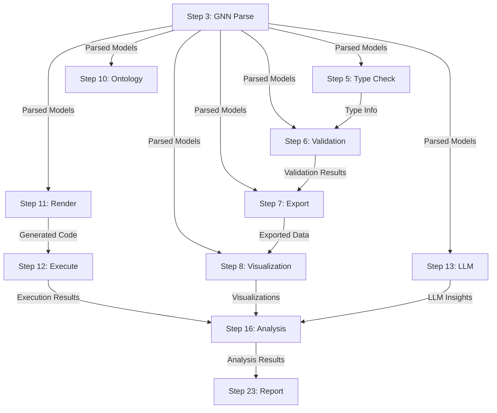

# GNN Pipeline - Master Agent Scaffolding

## Overview

The GNN (Generalized Notation Notation) Pipeline is a comprehensive 25-step system for processing Active Inference generative models. Each module follows the **thin orchestrator pattern** where numbered scripts delegate to modular implementations.

## 📚 GNN Documentation

The GNN system is fully documented in `doc/gnn/`.

> **[GNN Documentation Index](../doc/gnn/README.md)** - Start here for all GNN guides.

### Specialized Documentation Agents

See **[doc/gnn/AGENTS.md](../doc/gnn/AGENTS.md)** for the registry of all 25 documentation agents, including:

- **Syntax & DSL**: `gnn_syntax.md`, `gnn_dsl_manual.md`
- **Modeling**: `quickstart_tutorial.md`, `gnn_examples_doc.md`
- **Integration**: `framework_integration_guide.md`, `gnn_implementation.md`
- **Troubleshooting**: `gnn_troubleshooting.md`

---

## Module Registry

### Core Processing Modules (Steps 0-9)

- **Step 0**: **[template/](template/AGENTS.md)** - Pipeline template and initialization
- **Step 1**: **[setup/](setup/AGENTS.md)** - Environment setup and dependency management
- **Step 2**: **[tests/](tests/AGENTS.md)** - Comprehensive test suite execution
- **Step 3**: **[gnn/](gnn/AGENTS.md)** - GNN file discovery, parsing, and multi-format serialization
- **Step 4**: **[model_registry/](model_registry/AGENTS.md)** - Model versioning and registry management
- **Step 5**: **[type_checker/](type_checker/AGENTS.md)** - Type checking and validation
- **Step 6**: **[validation/](validation/AGENTS.md)** - Advanced validation and consistency checking
- **Step 7**: **[export/](export/AGENTS.md)** - Multi-format export generation
- **Step 8**: **[visualization/](visualization/AGENTS.md)** - Graph and matrix visualization
- **Step 9**: **[advanced_visualization/](advanced_visualization/AGENTS.md)** - Advanced visualization and interactive plots

### Simulation & Analysis Modules (Steps 10-16)

- **Step 10**: **[ontology/](ontology/AGENTS.md)** - Active Inference ontology processing
- **Step 11**: **[render/](render/AGENTS.md)** - Code generation for simulation frameworks
- **Step 12**: **[execute/](execute/AGENTS.md)** - Execute rendered simulation scripts
- **Step 13**: **[llm/](llm/AGENTS.md)** - LLM-enhanced analysis and interpretation
- **Step 14**: **[ml_integration/](ml_integration/AGENTS.md)** - Machine learning integration
- **Step 15**: **[audio/](audio/AGENTS.md)** - Audio generation and sonification
- **Step 16**: **[analysis/](analysis/AGENTS.md)** - Advanced statistical analysis

### Integration & Output Modules (Steps 17-24)

- **Step 17**: **[integration/](integration/AGENTS.md)** - System integration and coordination
- **Step 18**: **[security/](security/AGENTS.md)** - Security validation and access control
- **Step 19**: **[research/](research/AGENTS.md)** - Research tools and experimental features
- **Step 20**: **[website/](website/AGENTS.md)** - Static HTML website generation
- **Step 21**: **[mcp/](mcp/AGENTS.md)** - Model Context Protocol processing
- **Step 22**: **[gui/](gui/AGENTS.md)** - Interactive GUI for model construction (includes gui_1, gui_2, gui_3, oxdraw)
- **Step 23**: **[report/](report/AGENTS.md)** - Comprehensive analysis report generation
- **Step 24**: **[intelligent_analysis/](intelligent_analysis/AGENTS.md)** - AI-powered pipeline analysis and executive reports

### Infrastructure Modules

- **[utils/](utils/AGENTS.md)** - Shared utilities and helper functions
- **[pipeline/](pipeline/AGENTS.md)** - Pipeline orchestration and configuration

---

## Architectural Pattern

### Thin Orchestrator Design

**Numbered Scripts** (`N_module.py`):

- Handle argument parsing
- Setup logging and output directories
- Call module processing functions
- Return standardized exit codes

**Module Implementation** (`src/module/`):

- Contains all domain logic
- Provides public API for orchestrators
- Implements error handling and fallbacks
- Exports functions via `__init__.py`

### Example Structure

```
src/
├── 11_render.py              # Thin orchestrator (< 150 lines)
├── render/                   # Module implementation
│   ├── __init__.py          # Public API exports
│   ├── AGENTS.md            # This documentation
│   ├── processor.py         # Core logic
│   ├── pymdp/               # Framework-specific code
│   ├── rxinfer/
│   └── mcp.py               # MCP tool registration
```

---

## Pipeline Execution Flow

```mermaid
flowchart TD
    Main[main.py Orchestrator] --> Step0[Step 0: Template]
    Step0 --> Step1[Step 1: Setup]
    Step1 --> Step2[Step 2: Tests]
    Step2 --> Step3[Step 3: GNN]
    Step3 --> Step4[Step 4: Registry]
    Step4 --> Step5[Step 5: Type Check]
    Step5 --> Step6[Step 6: Validation]
    Step6 --> Step7[Step 7: Export]
    Step7 --> Step8[Step 8: Visualization]
    Step8 --> Step9[Step 9: Advanced Viz]
    Step9 --> Step10[Step 10: Ontology]
    Step10 --> Step11[Step 11: Render]
    Step11 --> Step12[Step 12: Execute]
    Step12 --> Step13[Step 13: LLM]
    Step13 --> Step14[Step 14: ML Integration]
    Step14 --> Step15[Step 15: Audio]
    Step15 --> Step16[Step 16: Analysis]
    Step16 --> Step17[Step 17: Integration]
    Step17 --> Step18[Step 18: Security]
    Step18 --> Step19[Step 19: Research]
    Step19 --> Step20[Step 20: Website]
    Step20 --> Step21[Step 21: MCP]
    Step21 --> Step22[Step 22: GUI]
    Step22 --> Step23[Step 23: Report]
    Step23 --> Step24[Step 24: Intelligent Analysis]

    Step24 --> Output[output/ Directory]
    Output --> Summary[pipeline_execution_summary.json]
```



### Data Dependencies



---

## Performance Characteristics

### Latest Status (2026-01-23)

- **Total Steps**: 25 (all steps 0-24)
- **Execution Time**: ~90s (pipeline) / ~9min (full test suite)
- **Memory Usage**: 36.3MB peak
- **Success Rate**: 100% (25/25 steps successful)
- **Test Suite Status**: ✅ 1,127 tests passed (21 skipped - optional deps)
- **Syntax Status**: ✅ 100% valid Python (all syntax errors fixed)
- **Thin Orchestrator Pattern**: ✅ 100% compliant (all steps use proper delegation)
- **Module Availability**: ✅ 100% (all modules have real implementations, no fallbacks needed)
- **AGENTS.md Coverage**: ✅ 100% (28/28 modules + all subdirectories documented)
- **README Coverage**: ✅ 100% (all modules have comprehensive documentation)
- **SPEC.md Coverage**: ✅ 100% (all modules have specifications)
- **Architecture Status**: ✅ Production Ready

### Recent Updates (February 2026)

- **Visualization Refactoring**: Removed visualization code from execute step (12), consolidated in analysis step (16)
  - RxInfer.jl: Removed Plots.jl dependencies, exports data only
  - PyMDP: Removed PyMDPVisualizer from execute, analysis step handles visualization
- **Test Fixes**: Fixed LLM and pipeline test path expectations (1,127 tests passing)
- **Method Robustness**: Enhanced metadata extraction, PyMDP error recovery, and render validation
- **Observability**: Added JSON logging, log rotation, and performance metrics
- **Analysis**: Cross-simulation aggregation and statistical summaries
- **LLM**: Improved provider fallback chain and timeout handling
- **Documentation**: Added missing AGENTS.md, README.md, SPEC.md to output/ directory

---

## 25-Step Pipeline Structure (CURRENT)

The pipeline consists of exactly 25 steps (steps 0-24), executed in order:

0. **0_template.py** → `src/template/` - Pipeline template and initialization
1. **1_setup.py** → `src/setup/` - Environment setup, virtual environment management, dependency installation
2. **2_tests.py** → `src/tests/` - Comprehensive test suite execution
3. **3_gnn.py** → `src/gnn/` - GNN file discovery, multi-format parsing, and validation
4. **4_model_registry.py** → `src/model_registry/` - Model registry management and versioning
5. **5_type_checker.py** → `src/type_checker/` - GNN syntax validation and resource estimation
6. **6_validation.py** → `src/validation/` - Advanced validation and consistency checking
7. **7_export.py** → `src/export/` - Multi-format export (JSON, XML, GraphML, GEXF, Pickle)
8. **8_visualization.py** → `src/visualization/` - Graph and matrix visualization generation
9. **9_advanced_viz.py** → `src/advanced_visualization/` - Advanced visualization and interactive plots
10. **10_ontology.py** → `src/ontology/` - Active Inference Ontology processing and validation
11. **11_render.py** → `src/render/` - Code generation for PyMDP, RxInfer, ActiveInference.jl simulation environments
12. **12_execute.py** → `src/execute/` - Execute rendered simulation scripts with result capture
13. **13_llm.py** → `src/llm/` - LLM-enhanced analysis, model interpretation, and AI assistance
14. **14_ml_integration.py** → `src/ml_integration/` - Machine learning integration and model training
15. **15_audio.py** → `src/audio/` - Audio generation (SAPF, Pedalboard, and other backends)
16. **16_analysis.py** → `src/analysis/` - Advanced analysis and statistical processing
17. **17_integration.py** → `src/integration/` - System integration and cross-module coordination
18. **18_security.py** → `src/security/` - Security validation and access control
19. **19_research.py** → `src/research/` - Research tools and experimental features
20. **20_website.py** → `src/website/` - Static HTML website generation from pipeline artifacts
21. **21_mcp.py** → `src/mcp/` - Model Context Protocol processing and tool registration
22. **22_gui.py** → `src/gui/` - Interactive GUI for constructing/editing GNN models
23. **23_report.py** → `src/report/` - Comprehensive analysis report generation
24. **24_intelligent_analysis.py** → `src/intelligent_analysis/` - AI-powered pipeline analysis and executive reports

---

## Module Status Matrix

| Module | AGENTS.md | README | Status | Test Coverage | MCP Tools |
|--------|-----------|--------|--------|---------------|-----------|
| template | ✅ Complete | ✅ Complete | ✅ Ready | 85% | 3 |
| setup | ✅ Complete | ✅ Complete | ✅ Ready | 90% | 2 |
| tests | ✅ Complete | ✅ Complete | ✅ Ready | 95% | 1 |
| gnn | ✅ Complete | ✅ Complete | ✅ Ready | 85% | 4 |
| model_registry | ✅ Complete | ✅ Complete | ✅ Ready | 80% | 3 |
| type_checker | ✅ Complete | ✅ Complete | ✅ Ready | 88% | 2 |
| validation | ✅ Complete | ✅ Complete | ✅ Ready | 82% | 3 |
| export | ✅ Complete | ✅ Complete | ✅ Ready | 86% | 3 |
| visualization | ✅ Complete | ✅ Complete | ✅ Ready | 84% | 4 |
| advanced_visualization | ✅ Complete | ✅ Complete | ✅ Ready | 95% | 3 |
| ontology | ✅ Complete | ✅ Complete | ✅ Ready | 81% | 3 |
| render | ✅ Complete | ✅ Complete | ✅ Ready | 78% | 5 |
| execute | ✅ Complete | ✅ Complete | ✅ Ready | 79% | 4 |
| llm | ✅ Complete | ✅ Complete | ✅ Ready | 76% | 6 |
| ml_integration | ✅ Complete | ✅ Complete | ✅ Ready | 72% | 2 |
| audio | ✅ Complete | ✅ Complete | ✅ Ready | 74% | 3 |
| analysis | ✅ Complete | ✅ Complete | ✅ Ready | 80% | 4 |
| integration | ✅ Complete | ✅ Complete | ✅ Ready | 83% | 2 |
| security | ✅ Complete | ✅ Complete | ✅ Ready | 87% | 3 |
| research | ✅ Complete | ✅ Complete | ✅ Ready | 70% | 2 |
| website | ✅ Complete | ✅ Complete | ✅ Ready | 79% | 3 |
| mcp | ✅ Complete | ✅ Complete | ✅ Ready | 82% | 5 |
| gui | ✅ Complete | ✅ Complete | ✅ Ready | 68% | 4 |
| report | ✅ Complete | ✅ Complete | ✅ Ready | 81% | 3 |
| intelligent_analysis | ✅ Complete | ✅ Complete | ✅ Ready | 75% | 3 |
| utils | ✅ Complete | ✅ Complete | ✅ Ready | 88% | N/A |
| pipeline | ✅ Complete | ✅ Complete | ✅ Ready | 90% | N/A |
| sapf | ✅ Complete | ✅ Complete | ✅ Ready | 75% | 2 |

**Legend**: ✅ Complete | ⏳ Pending | 🔄 Fixed/Updated

---

## Quick Start

### Run Full Pipeline

```bash
python src/main.py --target-dir input/gnn_files --verbose
```

### Run Specific Steps

```bash
python src/main.py --only-steps "3,5,7,8,11,12" --verbose
```

### Run Individual Step

```bash
python src/3_gnn.py --target-dir input/gnn_files --output-dir output --verbose
```

### Framework Selection

```bash
# Execute only specific frameworks
python src/12_execute.py --frameworks "pymdp,jax" --verbose

# Use lite preset (PyMDP, JAX, DisCoPy)
python src/12_execute.py --frameworks "lite" --verbose

# All frameworks (default)
python src/12_execute.py --frameworks "all" --verbose
```

### Optional Dependencies

```bash
# Install optional groups
python src/1_setup.py --install_optional --optional_groups "pymdp,jax,viz,gui,audio,llm"

# Install specific groups
python src/1_setup.py --install_optional --optional_groups "viz,pymdp"
```

---

## Development Guidelines

### Adding New Modules

1. Create module directory: `src/new_module/`
2. Implement `__init__.py` with public API
3. Create `AGENTS.md` documentation
4. Add numbered script: `N_new_module.py`
5. Implement tests in `src/tests/`
6. Add MCP tools in `mcp.py` (if applicable)

### Code Standards

- Follow thin orchestrator pattern
- Use type hints for all public functions
- Document all classes and methods
- Maintain >80% test coverage
- Include error handling and fallbacks

---

## Testing

### Run All Tests

```bash
python src/2_tests.py --comprehensive
```

### Run Module-Specific Tests

```bash
pytest src/tests/test_[module]*.py -v
```

### Check Coverage

```bash
pytest --cov=src --cov-report=term-missing
```

---

## References

- **Main Documentation**: [README.md](../README.md)
- **GNN Documentation Index**: [doc/gnn/README.md](../doc/gnn/README.md)

---

**Last Updated**: 2026-02-09
**Pipeline Version**: 1.1.3
**Total Modules**: 29
**Total Steps**: 25 (0-24)
**Test Status**: ✅ 1,127 tests passed
**Documentation Coverage**: ✅ 100% Complete (AGENTS.md + README.md + SPEC.md for all modules and subdirectories)
**Status**: ✅ Production Ready
