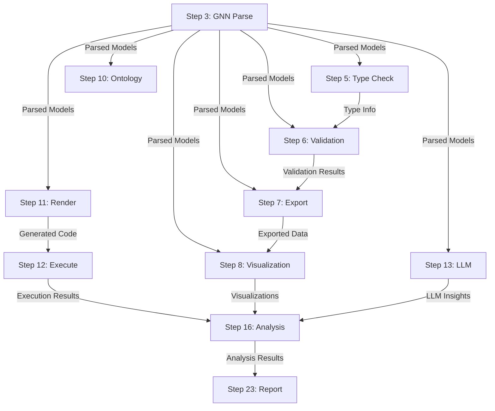

# GNN Pipeline - Master Agent Scaffolding

## Overview

The GNN (Generalized Notation Notation) Pipeline is a comprehensive 25-step system for processing Active Inference generative models. Each module follows the **thin orchestrator pattern** where numbered scripts delegate to modular implementations.

## 📚 GNN Documentation

The GNN system is fully documented in `gnn/doc/gnn/`.

> **[GNN Documentation Index](../doc/gnn/README.md)** - Start here for all GNN guides.

### Specialized Documentation Agents

See **[gnn/doc/gnn/AGENTS.md](../doc/gnn/AGENTS.md)** for the registry of all 25 documentation agents, including:

- **Syntax & DSL**: `gnn_syntax.md`, `gnn_dsl_manual.md`
- **Modeling**: `quickstart_tutorial.md`, `gnn_examples_doc.md`
- **Integration**: `framework_integration_guide.md`, `gnn_implementation.md`
- **Troubleshooting**: `gnn_troubleshooting.md`

---

## Module Registry

### Core Processing Modules (Steps 0-9)

- **Step 0**: **[gnn/template/](gnn/template/AGENTS.md)** - Pipeline template and initialization
- **Step 1**: **[gnn/setup/](gnn/setup/AGENTS.md)** - Environment setup and dependency management
- **Step 2**: **[tests/](../tests/AGENTS.md)** - Comprehensive test suite execution
- **Step 3**: **[gnn/](gnn/AGENTS.md)** - GNN file discovery, parsing, and multi-format serialization
- **Step 4**: **[gnn/model_registry/](gnn/model_registry/AGENTS.md)** - Model versioning and registry management
- **Step 5**: **[gnn/type_checker/](gnn/type_checker/AGENTS.md)** - Type checking and validation
- **Step 6**: **[gnn/validation/](gnn/validation/AGENTS.md)** - Advanced validation and consistency checking
- **Step 7**: **[gnn/export/](gnn/export/AGENTS.md)** - Multi-format export generation
- **Step 8**: **[gnn/visualization/](gnn/visualization/AGENTS.md)** - Graph and matrix visualization
- **Step 9**: **[gnn/advanced_visualization/](gnn/advanced_visualization/AGENTS.md)** - Advanced visualization and interactive plots

### Simulation & Analysis Modules (Steps 10-16)

- **Step 10**: **[gnn/ontology/](gnn/ontology/AGENTS.md)** - Active Inference ontology processing
- **Step 11**: **[gnn/render/](gnn/render/AGENTS.md)** - Code generation for simulation frameworks
- **Step 12**: **[gnn/execute/](gnn/execute/AGENTS.md)** - Execute rendered simulation scripts
- **Step 13**: **[gnn/llm/](gnn/llm/AGENTS.md)** - LLM-enhanced analysis and interpretation
- **Step 14**: **[gnn/ml_integration/](gnn/ml_integration/AGENTS.md)** - Machine learning integration
- **Step 15**: **[gnn/audio/](gnn/audio/AGENTS.md)** - Audio generation and sonification
- **Step 16**: **[gnn/analysis/](gnn/analysis/AGENTS.md)** - Advanced statistical analysis

### Integration & Output Modules (Steps 17-24)

- **Step 17**: **[gnn/integration/](gnn/integration/AGENTS.md)** - System integration and coordination
- **Step 18**: **[gnn/security/](gnn/security/AGENTS.md)** - Security validation and access control
- **Step 19**: **[gnn/research/](gnn/research/AGENTS.md)** - Research tools and experimental features
- **Step 20**: **[gnn/website/](gnn/website/AGENTS.md)** - Static HTML website generation
- **Step 21**: **[gnn/mcp/](gnn/mcp/AGENTS.md)** - Model Context Protocol processing
- **Step 22**: **[gnn/gui/](gnn/gui/AGENTS.md)** - Interactive GUI for model construction (includes gui_1, gui_2, gui_3, oxdraw)
- **Step 23**: **[gnn/report/](gnn/report/AGENTS.md)** - Comprehensive analysis report generation
- **Step 24**: **[gnn/intelligent_analysis/](gnn/intelligent_analysis/AGENTS.md)** - AI-powered pipeline analysis and executive reports

### Step Index

- **📋 [STEP_INDEX.md](gnn/STEP_INDEX.md)** — Comprehensive 20-column reference table for all 25 steps
  - Covers: script, module, phase, input, output, frameworks, timeouts, dependencies, recovery behavior, data flow, matrix routing, criticality, and category

### Infrastructure Modules

- **[gnn/utils/](gnn/utils/AGENTS.md)** - Shared utilities and helper functions
- **[gnn/pipeline/](gnn/pipeline/AGENTS.md)** - Pipeline orchestration and configuration
- **[gnn/api/](gnn/api/AGENTS.md)** - REST API server (FastAPI)
- **[gnn/cli/](gnn/cli/AGENTS.md)** - CLI entry point
- **[gnn/lsp/](gnn/lsp/AGENTS.md)** - Language Server Protocol support
- **[gnn/sapf/](gnn/sapf/AGENTS.md)** - SAPF public entry point (re-exports from `gnn/audio/sapf/`)
- **[gnn/doc/](gnn/doc/AGENTS.md)** - In-repo technical documentation subtree (`src/gnn/doc/`)

---

## Architectural Pattern

### Thin Orchestrator Design

**Numbered Scripts** (`N_module.py`):

- Handle argument parsing
- Setup logging and output directories
- Call module processing functions
- Return standardized exit codes

**Module Implementation** (`src/module/`):

- Contains all domain logic
- Provides public API for orchestrators
- Implements explicit error handling, skip statuses, and dependency diagnostics
- Exports functions via `__init__.py`

### Example Structure

```
src/
├── 11_render.py              # Thin orchestrator (< 150 lines)
├── gnn/render/                   # Module implementation
│   ├── __init__.py          # Public API exports
│   ├── AGENTS.md            # This documentation
│   ├── processor.py         # Core logic
│   ├── pymdp/               # Framework-specific code
│   ├── rxinfer/
│   └── mcp.py               # MCP tool registration
```

---

## Pipeline Execution Flow

This diagram shows nominal full-run order. Matrix-driven folder routing and dependency-based step inclusion are documented in `src/gnn/main.py` and `src/gnn/STEP_INDEX.md`.


```mermaid
flowchart TD
    Main[main.py Orchestrator] --> Step0[Step 0: Template]
    Step0 --> Step1[Step 1: Setup]
    Step1 --> Step2[Step 2: Tests]
    Step2 --> Step3[Step 3: GNN]
    Step3 --> Step4[Step 4: Registry]
    Step4 --> Step5[Step 5: Type Check]
    Step5 --> Step6[Step 6: Validation]
    Step6 --> Step7[Step 7: Export]
    Step7 --> Step8[Step 8: Visualization]
    Step8 --> Step9[Step 9: Advanced Viz]
    Step9 --> Step10[Step 10: Ontology]
    Step10 --> Step11[Step 11: Render]
    Step11 --> Step12[Step 12: Execute]
    Step12 --> Step13[Step 13: LLM]
    Step13 --> Step14[Step 14: ML Integration]
    Step14 --> Step15[Step 15: Audio]
    Step15 --> Step16[Step 16: Analysis]
    Step16 --> Step17[Step 17: Integration]
    Step17 --> Step18[Step 18: Security]
    Step18 --> Step19[Step 19: Research]
    Step19 --> Step20[Step 20: Website]
    Step20 --> Step21[Step 21: MCP]
    Step21 --> Step22[Step 22: GUI]
    Step22 --> Step23[Step 23: Report]
    Step23 --> Step24[Step 24: Intelligent Analysis]

    Step24 --> Output[gnn/output/ Directory]
    Output --> Summary[pipeline_execution_summary.json]
```

### Data Dependencies


```mermaid
graph TD
    Step3[Step 3: GNN Parse] -->|Parsed Models| Step5[Step 5: Type Check]
    Step3 -->|Parsed Models| Step6[Step 6: Validation]
    Step3 -->|Parsed Models| Step7[Step 7: Export]
    Step3 -->|Parsed Models| Step8[Step 8: Visualization]
    Step3 -->|Parsed Models| Step10[Step 10: Ontology]
    Step3 -->|Parsed Models| Step11[Step 11: Render]
    Step3 -->|Parsed Models| Step13[Step 13: LLM]
    
    Step11 -->|Generated Code| Step12[Step 12: Execute]
    Step12 -->|Execution Results| Step16[Step 16: Analysis]
    
    Step5 -->|Type Info| Step6
    Step6 -->|Validation Results| Step7
    Step7 -->|Exported Data| Step8
    Step8 -->|Visualizations| Step16
    Step13 -->|LLM Insights| Step16
    Step16 -->|Analysis Results| Step23[Step 23: Report]
```

---

## Performance Characteristics

### Status Notes

- The pipeline contains 25 ordered steps (0-24).
- Modules follow the thin orchestrator pattern.
- MCP integration and documentation coverage are tracked by repository audits.
- Use step outputs and tests as the ground-truth status indicators.

### Defaults worth knowing

- **LLM default model**: `smollm2:135m-instruct-q4_K_S` via Ollama
  (`llm.defaults.DEFAULT_OLLAMA_MODEL`; override with the `OLLAMA_MODEL` env var or
  `input/config.yaml`).
- **MCP registration**: `discover_modules` walks `src/*/mcp.py` on startup; see
  `src/gnn/mcp/processor.py` for the worker pool configuration.
- **Tests command of record**: `uv run --extra dev python -m pytest tests/ -q
  --tb=no -rsx --ignore=tests/llm/test_llm_ollama.py
  --ignore=tests/llm/test_llm_ollama_integration.py`. Re-include the two Ollama files
  when `ollama` is installed and reachable. The dated pass/skip receipt for the latest
  full run lives in the root [`README.md`](../README.md) (see also
  `tests/TEST_SUITE_SUMMARY.md`); this file deliberately does not copy the counts.
  That receipt is taken with the Julia backends run from their committed environments
  and Ollama enabled.
- **Default dev suite**: FastAPI, websocket bridge, and LSP tests run under the
  `dev` extra; browser, public-network, live GUI, audio-DSP, and Ollama
  integrations remain explicit opt-in surfaces rather than hidden default-suite skips.
- **Public POMDP output**: root `gnn/output/` is published from the maintained
  `input/gnn_files/pomdp_gridworld` fixture and validated with
  `uv run --extra dev python scripts/check_pomdp_gridworld_outputs.py output`.
- All 25 orchestrator scripts comply with the <150 line thin orchestrator pattern.
- Maintained source/test documentation coverage is enforced by `gnn/doc/development/docs_audit.py --strict`.

Per-step timings and tool counts are generated under `gnn/output/`; current test inventory
lives in `tests/TEST_SUITE_SUMMARY.md`. Regenerate pipeline artifacts locally when
you need fresh run evidence rather than committing them as maintained documentation.

---

## 25-Step Pipeline Structure (CURRENT)

The pipeline consists of exactly 25 steps (steps 0-24), executed in order:

0. **0_template.py** → `src/gnn/template/` - Pipeline template and initialization
1. **1_setup.py** → `src/gnn/setup/` - Environment setup, virtual environment management, dependency installation
2. **2_tests.py** → `tests/` - Comprehensive test suite execution
3. **3_gnn.py** → `src/gnn/` - GNN file discovery, multi-format parsing, and validation
4. **4_model_registry.py** → `src/gnn/model_registry/` - Model registry management and versioning
5. **5_type_checker.py** → `src/gnn/type_checker/` - GNN syntax validation and resource estimation
6. **6_validation.py** → `src/gnn/validation/` - Advanced validation and consistency checking
7. **7_export.py** → `src/gnn/export/` - Multi-format export (JSON, XML, GraphML, GEXF, Pickle)
8. **8_visualization.py** → `src/gnn/visualization/` - Graph and matrix visualization generation
9. **9_advanced_viz.py** → `src/gnn/advanced_visualization/` - Advanced visualization and interactive plots
10. **10_ontology.py** → `src/gnn/ontology/` - Active Inference Ontology processing and validation
11. **11_render.py** → `src/gnn/render/` - Code generation for PyMDP, RxInfer.jl, ActiveInference.jl, JAX, DisCoPy, PyTorch, NumPyro, Stan, bnlearn simulation environments
12. **12_execute.py** → `src/gnn/execute/` - Execute rendered simulation scripts with result capture
13. **13_llm.py** → `src/gnn/llm/` - LLM-enhanced analysis, model interpretation, and AI assistance
14. **14_ml_integration.py** → `src/gnn/ml_integration/` - Machine learning integration and model training
15. **15_audio.py** → `src/gnn/audio/` - Audio generation (SAPF, Pedalboard, and other backends)
16. **16_analysis.py** → `src/gnn/analysis/` - Advanced analysis and statistical processing
17. **17_integration.py** → `src/gnn/integration/` - System integration and cross-module coordination
18. **18_security.py** → `src/gnn/security/` - Security validation and access control
19. **19_research.py** → `src/gnn/research/` - Research tools and experimental features
20. **20_website.py** → `src/gnn/website/` - Static HTML website generation from pipeline artifacts
21. **21_mcp.py** → `src/gnn/mcp/` - Model Context Protocol processing and tool registration
22. **22_gui.py** → `src/gnn/gui/` - Interactive GUI for constructing/editing GNN models
23. **23_report.py** → `src/gnn/report/` - Comprehensive analysis report generation
24. **24_intelligent_analysis.py** → `src/gnn/intelligent_analysis/` - AI-powered pipeline analysis and executive reports

---

## Module Status Matrix

Module-level readiness and coverage details change over time; use each module's `AGENTS.md`, `README.md`, and tests in `tests/` as the authoritative source.

- **[SPEC.md](SPEC.md)** — Architectural requirements and standards
- **[STEP_INDEX.md](gnn/STEP_INDEX.md)** — Complete 20-column master reference for all 25 steps
- **[README.md](../README.md)** — Project overview and documentation
- **[main.py](gnn/main.py)** — Pipeline orchestrator
- **[input/config.yaml](../input/config.yaml)** — Testing matrix configuration

---

## Quick Start

### Run Full Pipeline

```bash
python src/gnn/main.py --target-dir input/gnn_files --verbose
```

### Run Specific Steps

```bash
python src/gnn/main.py --only-steps "3,5,7,8,11,12" --verbose
```

### Programmatic step selection

`main.py` exposes a pure, typed step-selection core for embedders and tests:

```python
from main import select_pipeline_steps, parse_step_list_strict, step_number_from_script_name
from pipeline.step_registry import PIPELINE_STEPS_TUPLE

selection = select_pipeline_steps(
    list(PIPELINE_STEPS_TUPLE),
    only_steps="3,5",        # CLI/config only_steps (dependencies auto-resolved)
    cli_skip_steps="15",     # CLI --skip-steps
    config_skip_steps=[],    # pipeline.skip_steps from input/config.yaml
)
selection.selected              # tuple[(script_name, description), ...]
selection.skipped               # sorted skip step numbers
selection.added_dependencies    # dependency-resolved additions
selection.unknown_requested     # out-of-range requested numbers (never executed)
```

`select_pipeline_steps` is pure (no logging, no globals; the step list is
injected) and frozen. `parse_step_list_strict` raises `ValueError` on
non-numeric tokens instead of silently dropping them, and
`_resolve_steps_to_execute` (the logging adapter used by `main()`) fails
fast with `ValueError` when an `only_steps` request contains no executable
step — invalid CLI selections exit 1 with a clear startup error instead of
silently running zero steps. The lenient `parse_step_list` is unchanged and
remains available for back-compat.

### Run Individual Step

```bash
python src/gnn/3_gnn.py --target-dir input/gnn_files --output-dir output --verbose
```

### Framework Selection

```bash
# Execute only specific frameworks
python src/gnn/12_execute.py --frameworks "pymdp,jax" --verbose

# Use lite preset (PyMDP, JAX, DisCoPy, bnlearn)
python src/gnn/12_execute.py --frameworks "lite" --verbose

# All frameworks (default)
python src/gnn/12_execute.py --frameworks "all" --verbose
```

### Optional Dependencies

```bash
# Install optional groups
python src/gnn/1_setup.py --install-optional --optional-groups "gui,audio,ml-ai"

# Install specific groups
python src/gnn/1_setup.py --install-optional --optional-groups "graphs,ml-ai"
```

---

## Development Guidelines

### Adding New Modules

1. Create module directory: `src/new_module/`
2. Implement `__init__.py` with public API
3. Create `AGENTS.md` documentation
4. Add numbered script: `N_new_module.py`
5. Implement tests in `tests/`
6. Add MCP tools in `mcp.py` (if applicable)

### Code Standards

- Follow thin orchestrator pattern
- Use type hints for all public functions
- Document all classes and methods
- Maintain >80% test coverage
- Include explicit error handling, status reporting, and dependency diagnostics

---

## Testing

### Run All Tests

```bash
python src/gnn/2_tests.py --comprehensive
```

### Run Module-Specific Tests

```bash
uv run --extra dev python -m pytest tests/test_[module]*.py -v
```

### Check Coverage

```bash
pytest --cov=src --cov-report=term-missing
```

---

## References

- **Main Documentation**: [README.md](../README.md)
- **GNN Documentation Index**: [gnn/doc/gnn/README.md](../doc/gnn/README.md)

---

**Last Updated**: 2026-09-04
**Pipeline Version**: 3.2.0
**Total Steps**: 25 (0-24)
**Status**: Maintained
