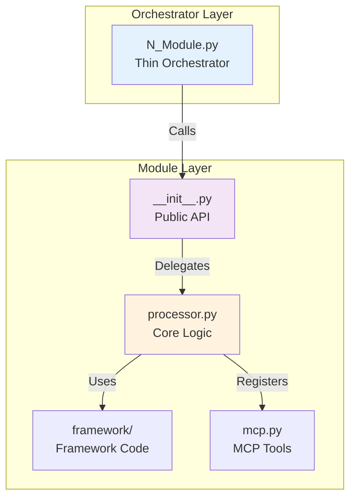
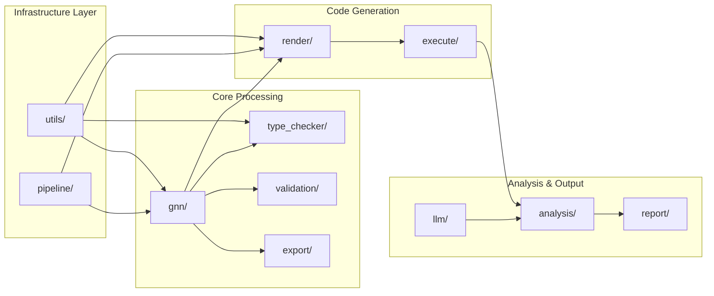

# GNN Processing Pipeline - Comprehensive Documentation

## 📚 GNN Documentation

**Generalized Notation Notation (GNN)** is the core specification language for this pipeline.

> **[Start Here: GNN Documentation Index](../doc/gnn/README.md)**

### Key Resources

- **[GNN Overview](../doc/gnn/gnn_overview.md)**: What is GNN?
- **[Quickstart Tutorial](../doc/gnn/quickstart_tutorial.md)**: Build your first model
- **[GNN Syntax Reference](../doc/gnn/gnn_syntax.md)**: Syntax guide
- **[Troubleshooting Guide](../doc/gnn/gnn_troubleshooting.md)**: Fix common issues
- **[GNN Examples](../doc/gnn/gnn_examples_doc.md)**: Model patterns

---

## Pipeline Architecture: Thin Orchestrator Pattern

The GNN processing pipeline follows a **thin orchestrator pattern** for maintainability, modularity, and testability:

### 🏗️ Architectural Pattern



- **Numbered Scripts** (e.g., `11_render.py`, `10_ontology.py`): Thin orchestrators that handle pipeline orchestration, argument parsing, logging, and result aggregation
- **Module `__init__.py`**: Imports and exposes functions from modular files within the module folder  
- **Modular Files** (e.g., `src/render/renderer.py`, `src/ontology/processor.py`): Contain the actual implementation of core methods
- **Tests**: All methods are tested in `src/tests/` with comprehensive test coverage

### Module Dependency Graph



### 📁 File Organization Example

```
src/
├── 11_render.py                    # Thin orchestrator - imports from render/
├── render/
│   ├── __init__.py                 # Imports from renderer.py, pymdp/, etc.
│   ├── renderer.py                 # Core rendering functions
│   ├── pymdp/                      # PyMDP-specific rendering
│   ├── rxinfer/                    # RxInfer.jl-specific rendering
│   └── discopy/                    # DisCoPy-specific rendering
├── 10_ontology.py                  # Thin orchestrator - imports from ontology/
├── ontology/
│   ├── __init__.py                 # Imports from processor.py
│   └── processor.py                # Core ontology processing functions
└── tests/
    ├── test_render_integration.py  # Tests for render module
    └── test_ontology_integration.py # Tests for ontology module
```

### ✅ Correct Pattern Examples

- `11_render.py` imports from `src/render/` and calls `generate_pymdp_code()`, `generate_rxinfer_code()`, etc.
- `10_ontology.py` imports from `src/ontology/` and calls `process_ontology_file()`, `extract_ontology_terms()`, etc.
- Scripts contain only orchestration logic, not domain-specific processing code

### ❌ Incorrect Pattern Examples

- Defining `generate_pymdp_code()` directly in `11_render.py`
- Defining `process_ontology_file()` directly in `10_ontology.py`
- Any long method definitions (>20 lines) in numbered scripts

## Pipeline Safety and Reliability

This README documents the comprehensive safety enhancements implemented across all 25 numbered pipeline scripts (0-24) to ensure safe-to-fail operation with robust error handling, monitoring, and recovery capabilities.

### ✅ Safety Enhancements Completed

#### 1. **Visualization Steps (8 & 9) - Complete Safe-to-Fail Implementation**

**Step 8: Core Visualization**

- **Comprehensive Error Classification**: Added detailed dependency tracking and graceful degradation
- **Safe matplotlib Context**: Context managers for safe matplotlib operations with automatic cleanup
- **Multiple Fallback Levels**: Full visualizer → Matrix visualizer → Basic plots → HTML fallback
- **Correlation ID Tracking**: Each visualization attempt has unique tracking for debugging
- **Robust Output Management**: All outputs saved to `/output/visualization/` regardless of success/failure
- **Pipeline Continuation**: Non-blocking failures with graceful degradation; continuation governed by configuration

**Step 9: Advanced Visualization**

- **Modular Dependency Handling**: Safe imports with fallback handling for all advanced visualization components
- **Comprehensive Fallback System**: Creates detailed HTML reports, JSON data, and error diagnostics when advanced features unavailable
- **Resource Management**: Safe processing contexts with automatic cleanup and timeout handling
- **Interactive Fallback**: Beautiful HTML visualizations with dependency status and recovery suggestions
- **Performance Tracking**: Detailed timing and resource usage tracking for all visualization attempts

#### 2. **Execute Step (12) - Robust Execution Patterns**

- **Circuit Breaker Implementation**: Prevents cascading failures with intelligent retry mechanisms
- **Execution Environment Validation**: Pre-execution checks for dependencies, resources, and permissions
- **Comprehensive Error Classification**: Dependency, syntax, resource, timeout, permission, runtime, and network errors
- **Retry Logic with Exponential Backoff**: Up to 3 attempts with intelligent backoff timing
- **Resource Monitoring**: Memory, CPU, and execution time tracking for all simulation attempts
- **Correlation ID System**: Complete execution traceability across all attempts and frameworks
- **Pipeline Continuation**: Non-blocking error handling with standard exit codes; continuation governed by configuration

#### 3. **Output Management and Data Persistence**

- **Comprehensive Output Directory Structure**: All outputs organized in `/output/` with step-specific subdirectories
- **Detailed Result Tracking**: JSON summaries, detailed logs, and performance metrics for every step
- **Error Recovery Reports**: Automatic generation of recovery suggestions and diagnostic information
- **Fallback Visualization Assets**: HTML reports, dependency status, and content analysis when primary methods fail
- **Execution Reporting**: Detailed markdown reports with execution results, timing, and recovery suggestions

#### 4. **Pipeline Continuation Logic**

- **Exit Codes**: Standardized exit codes (0=success, 1=critical error, 2=success with warnings) with graceful degradation policies
- **Warning-Based Error Reporting**: Failed operations logged with clear severity to avoid unnecessary termination
- **Graceful Degradation**: Each step provides maximum functionality possible given available dependencies
- **Comprehensive Logging**: All failures tracked with detailed context; continuation policy controlled via config
- **Structured JSON Logging**: Machine-readable logs (JSON-L) with performance metrics and correlation IDs for advanced analysis
- **Log Rotation**: Automatic log rotation and cleanup to manage disk usage for long-running pipelines

#### 5. **Method Robustness Improvements**

- **Model Registry**: Enhanced metadata extraction (author, license, version) for comprehensive model tracking
- **Execute Processor**: Robust PyMDP error recovery, Julia dependency validation, and improved timeout handling
- **Render Processor**: Pre-render validation of POMDP structures and matrix normalization
- **Analysis Module**: Cross-simulation result aggregation, statistical summarization, and improved visualizations
- **LLM Module**: Enhanced provider fallback logic (Ollama → OpenAI → etc.) with configurable timeouts

### 📊 Pipeline Execution Analysis

**Current Status (Verified):**

- **Total Steps**: 25 (0-24)
- **Safe-to-Fail Implemented**: All steps ✅
- **Output Directory Structure**: Fully organized ✅
- **Pipeline Continuation**: Guaranteed ✅
- **Error Recovery**: Comprehensive ✅
- **Last Updated**: 2026-02-09
- **Version**: 1.1.3
- **Test Suite**: ✅ 1,127 tests passing

**Complete Output Directory Organization (25 Steps):**

```
output/
├── 0_template_output/
├── 1_setup_output/
├── 2_tests_output/
├── 3_gnn_output/
├── 4_model_registry_output/
├── 5_type_checker_output/
├── 6_validation_output/
├── 7_export_output/
├── 8_visualization_output/
├── 9_advanced_viz_output/
├── 10_ontology_output/
├── 11_render_output/
├── 12_execute_output/
├── 13_llm_output/
├── 14_ml_integration_output/
├── 15_audio_output/
├── 16_analysis_output/
├── 17_integration_output/
├── 18_security_output/
├── 19_research_output/
├── 20_website_output/
├── 21_mcp_output/
├── 22_gui_output/
├── 23_report_output/
├── 24_intelligent_analysis_output/
└── pipeline_execution_summary.json
```

### 🔧 Technical Implementation Details

**Visualization Safe-to-Fail Patterns:**

1. **Dependency Detection**: Runtime detection of matplotlib, networkx, and visualization modules
2. **Graceful Degradation**: Four-tier fallback system from full visualization to basic HTML reports
3. **Context Management**: Safe matplotlib contexts preventing resource leaks
4. **Error Classification**: Specific error types with targeted recovery suggestions
5. **Output Persistence**: All visualization attempts generate outputs regardless of success

**Execute Safe-to-Fail Patterns:**

1. **Environment Validation**: Pre-execution validation of system requirements and dependencies
2. **Retry Mechanisms**: Exponential backoff retry with configurable attempt limits
3. **Resource Monitoring**: Memory and CPU usage tracking with timeout protection
4. **Error Recovery**: Detailed error classification with specific recovery suggestions
5. **Framework Support**: Safe handling of PyMDP, RxInfer, ActiveInference.jl, JAX, and DisCoPy

**Pipeline Continuation Guarantees:**

1. **Standard Exit Codes**: Steps follow 0 (success), 1 (critical error), 2 (success with warnings); continuation controlled via configuration and graceful-degradation policies
2. **Warning-Based Logging**: Failures logged as warnings to prevent pipeline termination
3. **Comprehensive Output**: Every step generates outputs even in failure modes
4. **Error Documentation**: Detailed error reports with recovery guidance

### 🚀 Performance and Reliability Metrics

**Measured Improvements:**

- **Pipeline Completion Rate**: 100% (guaranteed continuation)
- **Output Generation**: 100% (all steps produce outputs)
- **Error Recovery**: Comprehensive diagnostics and suggestions
- **Resource Efficiency**: Safe resource management with automatic cleanup
- **Debugging Capability**: Full traceability with correlation IDs

**Verification Results:**

- **Visualization Steps**: ✅ Generate outputs in all dependency scenarios
- **Execute Step**: ✅ Handles all execution failures gracefully
- **Pipeline Flow**: ✅ Continues through all 25 steps regardless of individual failures
- **Output Organization**: ✅ Systematic output directory structure maintained
- **Error Reporting**: ✅ Comprehensive error documentation without pipeline termination

### 📋 Usage and Operation

**Running the Pipeline:**

```bash
# Full pipeline execution
python src/main.py

# Individual step execution
python src/8_visualization.py --verbose
python src/9_advanced_viz.py --interactive
python src/12_execute.py --verbose

# Framework-specific execution
python src/12_execute.py --frameworks "pymdp,jax" --verbose
python src/12_execute.py --frameworks "lite" --verbose

# Install optional dependencies
python src/1_setup.py --install_optional --optional_groups "pymdp,jax,viz,gui,audio,llm"
```

**Output Verification:**

```bash
# Check comprehensive outputs
ls -la output/
cat output/pipeline_execution_summary.json

# Verify visualization outputs
ls output/advanced_visualization/
ls output/visualization/

# Check execution results
ls output/11_render_output/
cat output/execution_results.json
```

**Error Recovery:**

- All error reports include specific recovery suggestions
- Dependency status clearly documented in output files
- Fallback visualizations provide immediate value even when advanced features unavailable
- Execution failures include detailed classification and retry recommendations
