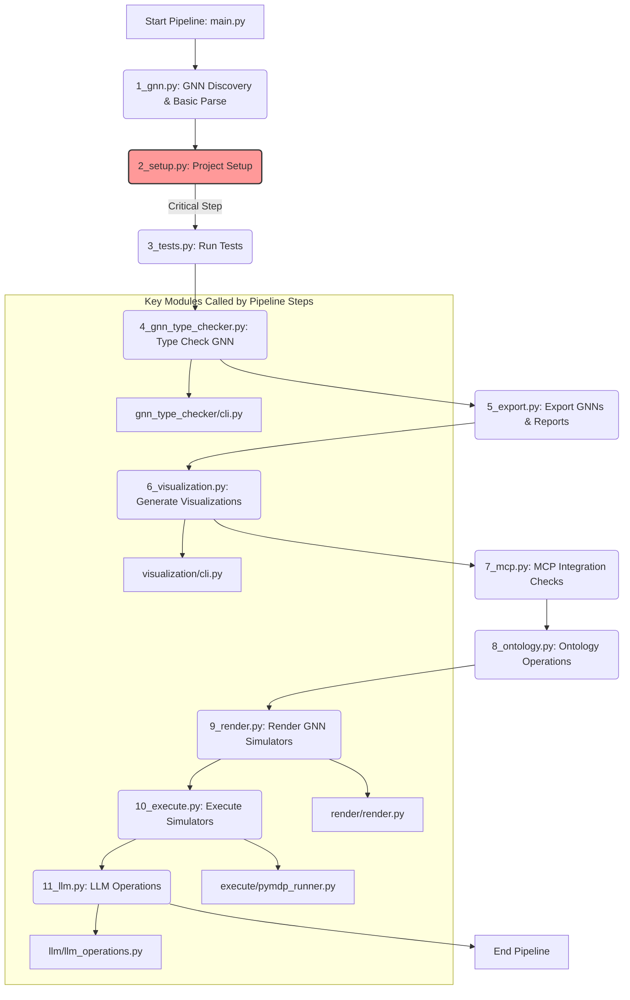

# GNN Processing Pipeline (`src/`)

This directory contains the source code for the Generalized Notation Notation (GNN) processing pipeline. It provides a systematic, modular, and extensible way to process, analyze, validate, and visualize GNN files and related project artifacts.

## Pipeline Orchestration (`main.py`)

The entire pipeline is orchestrated by `main.py`, located in this `src/` directory.

**How it Works:**
1.  **Dynamic Script Discovery:** `main.py` automatically discovers all executable pipeline step scripts within the `src/` directory that follow the naming convention `[number]_*.py` (e.g., `1_gnn.py`, `2_setup.py`).
2.  **Sequential Execution:** Scripts are executed in numerical order based on their prefix.
3.  **Argument Propagation:** `main.py` parses command-line arguments (see Options below) and passes them to each individual pipeline script. Each script is responsible for utilizing the arguments relevant to its operation.
4.  **Safe-to-Fail Mechanism:**
    *   Most pipeline steps are designed to be "safe-to-fail." If a non-critical step encounters an error (non-zero exit code) or returns code `2` (success with warnings), `main.py` will log this outcome and continue to the next step.
    *   **Critical Steps:** Certain steps, like `2_setup.py`, are deemed critical. If a critical step fails, the pipeline will halt immediately to prevent further errors due to an improper environment or setup.
    *   **Summary Report:** At the end of its run, `main.py` generates a comprehensive `pipeline_execution_summary.json` file in the main output directory. This JSON file details the arguments used, the status of each step (success, failure, skipped, warnings), timings, and captures stdout/stderr for each executed step. A brief summary is also printed to the console.

## Pipeline Workflow Diagram


*Note: While the diagram shows a linear flow, data dependencies exist. For example, `5_export.py` prepares GNN data used by `6_visualization.py`, `9_render.py`, and potentially `11_llm.py`. `9_render.py`'s output is used by `10_execute.py`.*

## Pipeline Steps & Corresponding Modules

Below is a detailed description of each pipeline step script (located in `src/`) and its corresponding primary module/folder (also in `src/`).

---

### 1. `1_gnn.py` - GNN Discovery & Basic Parse
-   **Folder:** `src/gnn/`
-   **What:** Performs initial GNN-specific operations. This includes discovering GNN Markdown (`.md`) files and performing basic parsing to identify key structural elements (like `ModelName`, `StateSpaceBlock`, `Connections`, `ModelParameters`) based on `src/gnn/gnn_file_structure.md` and `src/gnn/gnn_punctuation.md`.
-   **Why:** To get a preliminary understanding of the GNN files being processed, generate a basic report on their structure, and parse initial model parameters. This step can help catch very high-level errors or provide statistics before more intensive processing.
-   **How:**
    -   Scans the `args.target_dir` for `.md` files (recursively if `args.recursive` is set).
    -   For each file, it attempts to parse predefined sections and parameters.
    -   Generates a report (`<output_dir>/gnn_processing_step/1_gnn_discovery_report.md`) summarizing findings per file.
-   **Output:** A markdown report detailing parsed sections and parameters for each GNN file.

---

### 2. `2_setup.py` - Project Setup
-   **Folder:** `src/setup/`
-   **What:** Handles critical initial setup tasks for the project environment. This includes verifying and creating necessary output directories and, importantly, setting up a Python virtual environment (`.venv/` in `src/`) and installing dependencies from `src/requirements.txt`. Also confirms PyMDP availability.
-   **Why:** To ensure a consistent and correctly configured environment for the subsequent pipeline steps, preventing issues due to missing dependencies or directories. This step is **critical**; its failure halts the pipeline.
-   **How:**
    -   Calls `verify_directories()` to create standard output subfolders (e.g., for visualizations, type checking) within `args.output_dir`.
    -   Invokes `perform_full_setup()` from `src/setup/setup.py`. This function:
        -   Checks for and creates a virtual environment at `src/.venv/` if one doesn't exist.
        -   Installs/updates dependencies listed in `src/requirements.txt` using `pip` within the virtual environment.
    -   Attempts to import `pymdp` and `pymdp.agent.Agent` to confirm availability.
-   **Output:** Created directories, a configured virtual environment, console logs confirming setup.

---

### 3. `3_tests.py` - Run Tests
-   **Folder:** `src/tests/`
-   **What:** Executes automated tests for the project, primarily using the `pytest` framework.
-   **Why:** To verify the correctness and reliability of the codebase, including GNN parsing, type checking logic, and other utilities.
-   **How:**
    -   Invokes `pytest` as a subprocess (`<venv_python> -m pytest src/tests/`).
    -   The tests are run from the `src/` directory context (project root).
    -   Captures `pytest` output (stdout, stderr) and reports success or failure based on `pytest`'s exit code.
    -   Generates a JUnit XML report.
-   **Output:**
    - Test results printed to the console.
    - A JUnit XML report (`pytest_report.xml`) saved in `<output_dir>/test_reports/`.

---

### 4. `4_gnn_type_checker.py` - GNN Type Checking
-   **Folder:** `src/gnn_type_checker/`
-   **What:** Performs comprehensive type checking and structural validation of GNN files. It can also estimate computational resources.
-   **Why:** To ensure GNN models adhere to the GNN specification, are internally consistent, and use valid types and connections. This helps maintain model quality and interpretability.
-   **How:**
    -   Imports and calls the `main()` function from `src/gnn_type_checker/cli.py`.
    -   Passes arguments like the target directory/file, output directory (`<pipeline_output_dir>/gnn_type_check/`), and options (`--recursive`, `--strict`, `--estimate-resources`).
    -   The `gnn_type_checker.cli.main()` function then uses `GNNTypeChecker` and `GNNResourceEstimator` classes from `src/gnn_type_checker/` to perform the analysis.
-   **Output:** All outputs are placed within `<pipeline_output_dir>/gnn_type_check/`:
    -   Markdown report (`type_check_report.md`) detailing validation results per file.
    -   JSON data file (`resources/type_check_data.json`) with structured validation data.
    -   HTML report for richer viewing (`resources/html_vis/`).
    -   If `--estimate-resources` is used, additional reports (Markdown, JSON, HTML) for resource estimation are generated in a subfolder (`resource_estimates/`).

---

### 5. `5_export.py` - Export GNNs & Reports
-   **Folder:** `src/export/`
-   **What:** This step has two primary functions:
    1.  **Export GNN Models:** Parses GNN files (typically `.md` source files from `args.target_dir`) and exports them into various intermediate formats (e.g., JSON, XML, GEXF, GraphML, DSL, Python Pickle). These exported models are saved in a structured way within `<output_dir>/gnn_exports/`. This output is a common input for steps like `9_render.py` and `6_visualization.py`.
    2.  **Generate Reports:**
        *   Creates an export-step-specific summary (`5_export_step_report.md`) detailing export activities, saved in `<output_dir>/gnn_exports/`.
        *   Generates a basic overall file listing (`gnn_processing_summary.md`) in `args.output_dir` of GNN files found in the target directory. For a comprehensive execution summary of all pipeline steps, refer to the `pipeline_execution_summary.json` file generated by `main.py`.
-   **Why:**
    1.  To convert GNN models into standardized formats that can be consumed by other tools or subsequent pipeline steps.
    2.  To provide reports related to the export process and a basic listing of processed files.
-   **How:**
    -   For GNN model export:
        -   Scans `args.target_dir` for GNN files.
        -   Uses functions from `src/export/format_exporters.py` to convert each GNN model into multiple formats based on the `--formats` argument.
        -   Saves these exported files into `<output_dir>/gnn_exports/<model_name_stem>/<model_name_stem>.<format_extension>`.
    -   For report generation:
        -   Creates the step-specific export report.
        -   Creates the `gnn_processing_summary.md` file.
-   **Output:**
    -   Exported GNN models in various formats within `<output_dir>/gnn_exports/`.
    -   `5_export_step_report.md` in `<output_dir>/gnn_exports/`.
    -   A basic `gnn_processing_summary.md` in `args.output_dir`.

---

### 6. `6_visualization.py` - Generate Visualizations
-   **Folder:** `src/visualization/`
-   **What:** Generates visual representations (e.g., graphs, diagrams) of GNN models, typically using the GNN source files from `args.target_dir`.
-   **Why:** To help users understand the structure, connections, and dependencies within their GNN models, aiding in debugging, analysis, and communication.
-   **How:**
    -   Imports and calls the `main()` function from `src/visualization/cli.py`.
    -   Passes arguments like the target directory/file (`args.target_dir`) and the output directory (`<pipeline_output_dir>/gnn_examples_visualization/`).
    -   The `visualization.cli.main()` function uses `GNNVisualizer` and other components from `src/visualization/` to parse GNN files and render various visual outputs (e.g., using Graphviz).
-   **Output:** Image files (e.g., PNG, SVG) and potentially HTML files for each processed GNN model, saved in `<pipeline_output_dir>/gnn_examples_visualization/<model_name_stem>/`.

---

### 7. `7_mcp.py` - MCP Integration Checks
-   **Folder:** `src/mcp/` (and scans other modules)
-   **What:** Performs checks related to the project's Model Context Protocol (MCP) integration. It verifies that core MCP files exist, initializes the MCP system, attempts to load tools from functional modules (like `export`, `visualization`, etc.), and reports on their `mcp.py` integration files and registered tools.
-   **Why:** To ensure the project's MCP framework is correctly set up, that all intended modules are exposing their functionalities via MCP, and to provide a central report on available MCP tools.
-   **How:**
    -   Scans `src/mcp/` for essential files (`mcp.py`, `meta_mcp.py`, `cli.py`, etc.).
    -   Initializes the MCP system using `src.mcp.initialize()`, which discovers and registers tools from other modules.
    -   Scans other primary `src/` subdirectories (defined in `EXPECTED_MCP_MODULE_DIRS`) for the presence of an `mcp.py` file.
    -   Lists methods found via AST parsing in module `mcp.py` files and also lists tools registered with the `mcp_instance`.
    -   Generates a report (`<output_dir>/mcp_processing_step/7_mcp_integration_report.md`) detailing core file status, module integration status, and a global summary of registered MCP tools with their schemas and descriptions.
-   **Output:** A markdown report on the status of MCP file integrations and registered tools.

---

### 8. `8_ontology.py` - Ontology Operations
-   **Folder:** `src/ontology/`
-   **What:** Handles ontology-specific operations for GNN files. This includes parsing ontology annotations from GNN files (from `args.target_dir`), validating these annotations against a defined set of ontological terms (from `args.ontology_terms_file`), and generating a report.
-   **Why:** To link variables and components within GNN models to formal ontological terms, enhancing semantic clarity, interoperability, and enabling more advanced model analysis and comparison.
-   **How:**
    -   Uses helper functions from `src/ontology/mcp.py` (note: this `mcp.py` contains helper functions, not full MCP server tools).
    -   Processes GNN `.md` files from `args.target_dir`.
    -   Extracts annotations from the `ActInfOntologyAnnotation` section.
    -   If an `--ontology-terms-file` (e.g., `src/ontology/act_inf_ontology_terms.json`) is provided, it validates the extracted annotations against these terms.
    -   Generates a consolidated markdown report (`<output_dir>/ontology_processing/ontology_processing_report.md`) summarizing the findings for all processed files.
-   **Output:** A markdown report detailing parsed and validated ontological annotations for each GNN file.

---

### 9. `9_render.py` - Render GNN Simulators
-   **Folder:** `src/render/`
-   **What:** Renders GNN specifications (typically the JSON files exported by `5_export.py` found in `<pipeline_output_dir>/gnn_exports/`) into executable simulator code or configurations for specific modeling frameworks (e.g., `pymdp`, `rxinfer`).
-   **Why:** To translate abstract GNN models into concrete, runnable simulations or models that can be used for analysis, inference, or further development within supported target frameworks.
-   **How:**
    -   Imports and calls the `main()` function from `src/render/render.py`.
    -   Scans `<pipeline_output_dir>/gnn_exports/` for GNN specification files (primarily `*.json`).
    -   For each specification and for each supported target format (e.g., "pymdp", "rxinfer"):
        -   Invokes the rendering logic in `src/render/render.py`, passing the GNN spec file, output directory for the rendered file, target format, and desired output filename stem.
        -   Saves the generated simulator code/configuration into `<pipeline_output_dir>/gnn_rendered_simulators/<target_format>/<original_subpath_if_any>/<filename_rendered>.<ext>`.
-   **Output:** Generated simulator files (e.g., Python scripts for `pymdp`) in `<pipeline_output_dir>/gnn_rendered_simulators/`.

---

### 10. `10_execute.py` - Execute Rendered Simulators
-   **Folder:** `src/execute/`
-   **What:** Executes the rendered simulator scripts, with an initial focus on PyMDP scripts generated by `9_render.py`.
-   **Why:** To run the GNN models that have been translated into executable forms, allowing for simulation, testing of the generated code, and observation of model behavior.
-   **How:**
    -   Imports and calls `run_pymdp_scripts()` from `src/execute/pymdp_runner.py`.
    -   The `pymdp_runner.py` script:
        -   Locates Python scripts (`*_rendered.py`) within subdirectories of `<pipeline_output_dir>/gnn_rendered_simulators/pymdp/`.
        -   Executes each found script using a Python interpreter (preferably from the project's virtual environment `src/.venv/bin/python`).
        -   Captures `stdout` and `stderr` from each script execution.
        -   Logs the success or failure of each script.
        -   Saves execution logs and any generated data (like plots) into `<pipeline_output_dir>/pymdp_execute_logs/<model_name_rendered>/`.
-   **Output:** Console logs detailing the execution status of each simulator script. Execution logs and output files (e.g., plots) from the simulators are saved in `<pipeline_output_dir>/pymdp_execute_logs/`.

---

### 11. `11_llm.py` - LLM Operations
-   **Folder:** `src/llm/`
-   **What:** Utilizes Large Language Models (LLMs) for tasks like summarizing GNN files, performing comprehensive analyses, and generating question-answer pairs about the models. Input GNN files are taken from `args.target_dir` (e.g., `.md`, `.json` files). Requires an OpenAI API key set in a `.env` file at the project root.
-   **Why:** To leverage AI capabilities for deeper understanding, documentation, and analysis of GNN models and experiments.
-   **How:**
    -   Imports `llm_operations` and `mcp` from `src/llm/` and `mcp_instance` from `src/mcp/mcp.py`.
    -   Ensures LLM tools are registered with the main `mcp_instance` (this also loads the API key).
    -   Processes GNN files (e.g., `.md`, `.json` source files from `args.target_dir`).
    -   For each file, calls functions in `llm_operations` (e.g., `construct_prompt`, `get_llm_response`) to perform tasks specified by `args.llm_tasks` (summary, comprehensive analysis, Q&A).
    -   Saves generated text outputs:
        -   Summaries as `*_summary.txt`.
        -   Comprehensive analyses as structured `*_comprehensive_analysis.json`.
        -   Question-Answer pairs as `*_qa.json`.
    -   Outputs are saved in `<pipeline_output_dir>/llm_processing_step/<model_name_stem>/`.
-   **Output:** Text and JSON files containing LLM-generated content for each processed GNN file, saved within `<pipeline_output_dir>/llm_processing_step/`.

---

## Core Utility Modules

Beyond the pipeline step scripts, several folders in `src/` contain core logic and utilities used by these steps:

-   **`src/gnn/`**: Defines GNN file structure (`gnn_file_structure.md`), punctuation (`gnn_punctuation.md`), and contains example GNN files (`gnn/examples/`).
-   **`src/gnn_type_checker/`**: Contains the `GNNTypeChecker` and `GNNResourceEstimator` classes and their CLI (`cli.py`), forming the backbone of the type checking and resource estimation capabilities.
-   **`src/visualization/`**: Contains the `GNNParser`, `GNNVisualizer`, and related components (e.g., `MatrixVisualizer`, `OntologyVisualizer`) along with its CLI (`cli.py`), responsible for parsing GNN files and generating various visual outputs.
-   **`src/mcp/`**: Implements the Model Context Protocol server (`server_stdio.py`, `server_http.py`), client (`cli.py`), core MCP class (`mcp.py`), and meta-module (`meta_mcp.py`). Individual modules like `export`, `visualization`, `llm`, etc., are expected to have their own `mcp.py` to register tools with this MCP framework.
-   **`src/ontology/`**: Provides tools for ontology processing. Its `mcp.py` file contains helper functions (like `load_defined_ontology_terms`, `parse_gnn_ontology_section`, `validate_annotations`, `generate_ontology_report_for_file`) for these tasks, rather than MCP server tools. It uses `act_inf_ontology_terms.json` as the default term definition.
-   **`src/export/`**: Contains logic for formatting and exporting data, primarily through `format_exporters.py`.
-   **`src/setup/`**: Contains the detailed Python environment setup script (`setup.py`) used by `2_setup.py`.
-   **`src/tests/`**: Contains test files (e.g., `test_gnn_type_checker.py`) used by `3_tests.py`.
-   **`src/render/`**: Contains the core GNN rendering logic (in `render.py` which utilizes helpers like `pymdp_utils.py`) used by `9_render.py` to convert GNN specifications into executable simulators.
-   **`src/execute/`**: Contains logic for executing rendered GNN models. `pymdp_runner.py` handles the execution of PyMDP scripts and is used by `10_execute.py`.
-   **`src/llm/`**: Contains modules for Large Language Model (LLM) integration. `llm_operations.py` provides core functions for API interaction (OpenAI), and `mcp.py` defines and registers LLM-related tools with the MCP framework.
-   **`src/utils/`**: Contains utility modules, such as `logging_utils.py` for standardized logging setup across pipeline scripts.

## Usage

### Running the Full Pipeline

From the `src/` directory:
```bash
python main.py [options]
```

### Running Individual Steps

Each step script can also be run individually (e.g., for debugging or specific tasks). From the `src/` directory:
```bash
python 1_gnn.py [options]
python 2_setup.py [options]
# ... and so on for other steps.
```
When running scripts individually, ensure that any prerequisite steps (especially `2_setup.py`) have been successfully completed or that the environment is otherwise correctly configured. Also, relative paths for default arguments (like `../output` or `gnn/examples`) are typically interpreted from the `src/` directory as the current working directory.

## Options (for `main.py`)

The `main.py` script accepts several command-line options to customize the pipeline execution:

-   `--target-dir DIR`: Path to the directory containing GNN source files (e.g., `.md` specifications).
    Default: `src/gnn/examples` (relative to project root).
-   `--output-dir DIR`: Path to the main directory where all pipeline outputs will be saved.
    Default: `output` (relative to project root).
-   `--recursive` / `--no-recursive`: Recursively process GNN files in the target directory.
    Default: `--recursive` (True).
-   `--skip-steps LIST`: Comma-separated list of step numbers or script names (without `.py`, e.g., `1_gnn`) to skip.
    Example: `"1,7_mcp"`. Default: "" (empty string, no steps skipped by default).
-   `--only-steps LIST`: Comma-separated list of step numbers or script names to run exclusively. This overrides `--skip-steps`.
    Example: `"4,6_visualization"`. Default: "" (empty string, all non-skipped steps run).
-   `--verbose` / `--no-verbose`: Enable detailed (DEBUG level) logging for the pipeline and its steps.
    Default: `--verbose` (True).
-   `--strict`: Enable strict type checking mode (passed to `4_gnn_type_checker.py`).
    Default: False (not enabled).
-   `--estimate-resources` / `--no-estimate-resources`: Estimate computational resources during type checking (passed to `4_gnn_type_checker.py`).
    Default: `--estimate-resources` (True).
-   `--ontology-terms-file FILE`: Path to a JSON file defining valid ontological terms (passed to `8_ontology.py`).
    Default: `src/ontology/act_inf_ontology_terms.json` (relative to project root).
-   `--llm-tasks TASKS`: Comma-separated list of tasks for `11_llm.py` to perform (e.g., `"summary,analysis,qa"`). Use `"all"` for all available tasks (`summary`, `analysis`, `qa`).
    Default: `"all"`.
-   `--llm-timeout SECONDS`: Timeout in seconds for the entire `11_llm.py` script execution.
    Default: `360`.
-   `--pipeline-summary-file FILE`: Path to save the final pipeline execution summary report in JSON format.
    Default: `output/pipeline_execution_summary.json` (relative to project root).

## Deprecated Scripts

-   `gnn_type_checker/bin/check_gnn.py`: Functionality is now integrated into the `src/gnn_type_checker/` module and invoked via `4_gnn_type_checker.py`.

---
This README provides a comprehensive guide to the GNN processing pipeline. For details on specific GNN syntax or the Model Context Protocol, refer to the documentation within the respective module directories (e.g., `src/gnn/`, `src/mcp/`). 