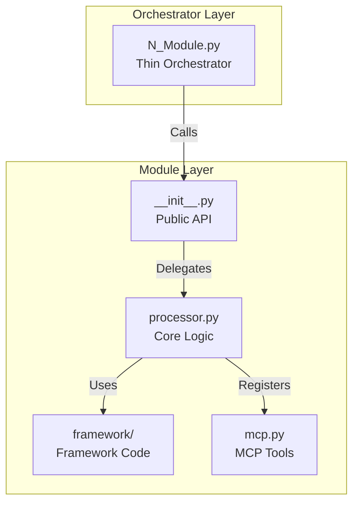
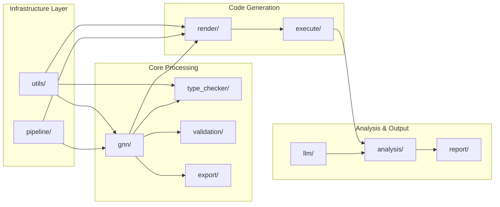

# GNN Processing Pipeline - Comprehensive Documentation

## 📚 GNN Documentation

**Generalized Notation Notation (GNN)** is the core specification language for this pipeline.

> **[Start Here: GNN Documentation Index](../doc/gnn/README.md)**

### Key Resources

- **[GNN Overview](../doc/gnn/gnn_overview.md)**: What is GNN?
- **[Quickstart Tutorial](../doc/gnn/tutorials/quickstart_tutorial.md)**: Build your first model
- **[GNN Syntax Reference](../doc/gnn/reference/gnn_syntax.md)**: Syntax guide
- **[Troubleshooting Guide](../doc/gnn/operations/gnn_troubleshooting.md)**: Fix common issues
- **[GNN Examples](../doc/gnn/tutorials/gnn_examples_doc.md)**: Model patterns

---

## Pipeline Architecture: Thin Orchestrator Pattern

The GNN processing pipeline follows a **thin orchestrator pattern** for maintainability, modularity, and testability:

### 🏗️ Architectural Pattern


```mermaid
graph TB
    subgraph "Orchestrator Layer"
        Script[N_Module.py<br/>Thin Orchestrator]
    end
    
    subgraph "Module Layer"
        Init[__init__.py<br/>Public API]
        Processor[processor.py<br/>Core Logic]
        Framework[framework/<br/>Framework Code]
        MCP[mcp.py<br/>MCP Tools]
    end
    
    Script -->|Calls| Init
    Init -->|Delegates| Processor
    Processor -->|Uses| Framework
    Processor -->|Registers| MCP
    
    %% styling intentionally omitted (theme-controlled)
```

- **Numbered Scripts** (e.g., `11_render.py`, `10_ontology.py`): Thin orchestrators that handle pipeline orchestration, argument parsing, logging, and result aggregation
- **Module `__init__.py`**: Imports and exposes functions from modular files within the module folder  
- **Modular Files** (e.g., `src/render/processor.py`, `src/ontology/processor.py`): Contain the actual implementation of core methods
- **Tests**: All methods are tested in `src/tests/` with comprehensive test coverage

### Module Dependency Graph


```mermaid
graph LR
    subgraph "Infrastructure Layer"
        Utils[utils/]
        Pipeline[pipeline/]
    end
    
    subgraph "Core Processing"
        GNN[gnn/]
        TypeChecker[type_checker/]
        Validation[validation/]
        Export[export/]
    end
    
    subgraph "Code Generation"
        Render[render/]
        Execute[execute/]
    end
    
    subgraph "Analysis & Output"
        LLM[llm/]
        Analysis[analysis/]
        Report[report/]
    end
    
    Utils --> GNN
    Utils --> TypeChecker
    Utils --> Render
    Pipeline --> GNN
    Pipeline --> Render
    
    GNN --> TypeChecker
    GNN --> Validation
    GNN --> Export
    GNN --> Render
    
    Render --> Execute
    Execute --> Analysis
    LLM --> Analysis
    Analysis --> Report
```

### 📁 File Organization Example

```
src/
├── 11_render.py                    # Thin orchestrator - imports from render/
├── render/
│   ├── __init__.py                 # Imports from processor.py, pymdp/, etc.
│   ├── processor.py                # Core rendering functions
│   ├── pymdp/                      # PyMDP-specific rendering
│   ├── rxinfer/                    # RxInfer.jl-specific rendering
│   └── discopy/                    # DisCoPy-specific rendering
├── 10_ontology.py                  # Thin orchestrator - imports from ontology/
├── ontology/
│   ├── __init__.py                 # Imports from processor.py
│   └── processor.py                # Core ontology processing functions
└── tests/
    ├── test_render_integration.py  # Tests for render module
    └── test_ontology_overall.py # Tests for ontology module
```

### ✅ Correct Pattern Examples

- `11_render.py` imports from `src/render/` and calls `generate_pymdp_code()`, `generate_rxinfer_code()`, etc.
- `10_ontology.py` imports from `src/ontology/` and calls `process_ontology_file()`, `extract_ontology_terms()`, etc.
- Scripts contain only orchestration logic, not domain-specific processing code

### ❌ Incorrect Pattern Examples

- Defining `generate_pymdp_code()` directly in `11_render.py`
- Defining `process_ontology_file()` directly in `10_ontology.py`
- Any long method definitions (>20 lines) in numbered scripts

## Pipeline Safety and Reliability

Every numbered step follows the same safe-to-fail contract: run as far as dependencies
allow, log what went wrong, write artifacts to its step-specific output directory, and
return a structured exit code rather than propagating an exception.

### Shared patterns

- **Exit codes**: `0` success, `1` critical failure, `2` success with warnings.
  Step-level continuation is governed by `input/config.yaml` / CLI flags, not by raising.
- **Dependency probes**: steps that wrap optional stacks (visualization, execute, LLM,
  audio, GUI) check imports before use and degrade to text/HTML recovery artifacts on
  miss.
- **Correlation IDs**: emitted into logs and JSON summaries so failures can be traced
  across steps.
- **Structured logs**: JSON-L alongside human-readable text via
  `utils.logging.logging_utils`.

### Step-specific notes

- **Steps 8/9 (Visualization)**: four-tier recovery (full → matrix → basic → HTML) with
  `with_safe_matplotlib()` context managers.
- **Step 12 (Execute)**: circuit breaker with bounded exponential backoff, per-framework
  environment validation, timeout-aware resource monitoring.
- **Step 13 (LLM)**: provider chain (Ollama → OpenAI → Anthropic → Perplexity) with
  configurable timeouts; a missing provider is a warning, not a failure.
- **Step 11 (Render)**: matrix normalization and POMDP-shape pre-checks before any
  framework-specific emitter runs.
- **Step 4 (Model Registry)**: metadata extraction (author, license, version) for every
  discovered model.

### Pipeline Execution Notes

- The pipeline is organized as 25 ordered steps.
- Each step writes artifacts to a step-specific output directory.
- Error handling and continuation behavior are controlled by configuration.
- Refer to step-level docs for current behavior and dependency details.

**Complete Output Directory Organization (25 Steps):**

```
output/
├── 0_template_output/
├── 1_setup_output/
├── 2_tests_output/
├── 3_gnn_output/
├── 4_model_registry_output/
├── 5_type_checker_output/
├── 6_validation_output/
├── 7_export_output/
├── 8_visualization_output/
├── 9_advanced_viz_output/
├── 10_ontology_output/
├── 11_render_output/
├── 12_execute_output/
├── 13_llm_output/
├── 14_ml_integration_output/
├── 15_audio_output/
├── 16_analysis_output/
├── 17_integration_output/
├── 18_security_output/
├── 19_research_output/
├── 20_website_output/
├── 21_mcp_output/
├── 22_gui_output/
├── 23_report_output/
├── 24_intelligent_analysis_output/
└── pipeline_execution_summary.json
```

### Running the pipeline

```bash
# Full pipeline
uv run python src/main.py

# A single step
uv run python src/8_visualization.py --verbose
uv run python src/12_execute.py --verbose

# Pick execution frameworks for Step 12
uv run python src/12_execute.py --frameworks "pymdp,jax" --verbose

# Install optional dependency groups
uv run python src/1_setup.py --install-optional --optional-groups "llm,visualization"

# Staged folder execution (driven by input/config.yaml → testing_matrix)
uv run python src/main.py --only-steps "3,5,6,11" --verbose
```

### Inspecting outputs

```bash
ls output/
cat output/pipeline_execution_summary.json
ls output/8_visualization_output/
ls output/9_advanced_viz_output/
ls output/11_render_output/
ls output/12_execute_output/
```

When a step degrades, it writes a JSON summary plus either an HTML recovery report or
textual diagnostics to the same step-specific output directory, so the artifact set is
stable whether the step succeeded or fell back.
