# GNN Processing Pipeline (`src/`) - Comprehensive Architecture Guide

This directory contains the source code for the Generalized Notation Notation (GNN) processing pipeline. It provides a systematic, modular, and extensible way to process, analyze, validate, and visualize GNN files and related project artifacts.

## Table of Contents
- [Pipeline Architecture Overview](#pipeline-architecture-overview)
- [Data Flow Architecture](#data-flow-architecture)
- [Module Dependencies](#module-dependencies)
- [File Structure Organization](#file-structure-organization)
- [Pipeline Steps Documentation](#pipeline-steps-documentation)
- [Core Utility Modules](#core-utility-modules)
- [Usage](#usage)
- [Options](#options)

## Pipeline Architecture Overview

The entire pipeline is orchestrated by `main.py`, which automatically discovers and executes numbered pipeline scripts in sequential order.

```mermaid
graph TD
    A[🚀 main.py Pipeline Orchestrator] --> B{Discover Numbered Scripts}
    B --> C[📋 Script Execution Queue]
    C --> D[1️⃣ GNN Discovery & Parse]
    D --> E[2️⃣ Project Setup ⚠️ CRITICAL]
    E --> F[3️⃣ Run Tests]
    F --> G[4️⃣ Type Check GNN]
    G --> H[5️⃣ Export GNNs & Reports]
    H --> I[6️⃣ Generate Visualizations]
    I --> J[7️⃣ MCP Integration Checks]
    J --> K[8️⃣ Ontology Operations]
    K --> L[9️⃣ Render GNN Simulators]
    L --> M[🔟 Execute Simulators]
    M --> N[1️⃣1️⃣ LLM Operations]
    N --> O[1️⃣2️⃣ DisCoPy Diagrams]
    O --> P[1️⃣3️⃣ DisCoPy JAX Eval]
    P --> Q[1️⃣5️⃣ Generate HTML Site]
    Q --> R[📊 Pipeline Summary JSON]

    subgraph "Critical Failure Points"
        E
    end

    subgraph "Safe-to-Fail Steps"
        D
        F
        G
        H
        I
        J
        K
        L
        M
        N
        O
        P
        Q
    end

    style E fill:#ff9999,stroke:#333,stroke-width:3px
    style A fill:#e1f5fe,stroke:#333,stroke-width:2px
    style R fill:#c8e6c9,stroke:#333,stroke-width:2px
```



## Data Flow Architecture

This diagram shows how data flows between pipeline steps and the key file transformations:

```mermaid
graph TD
    subgraph "Input Sources"
        A1[📝 GNN .md Files<br/>src/gnn/examples/]
        A2[🔧 Configuration Files<br/>requirements.txt, .env]
        A3[📚 Ontology Terms<br/>act_inf_ontology_terms.json]
    end

    subgraph "Pipeline Processing"
        B1[1️⃣ GNN Discovery]
        B2[2️⃣ Setup Environment]
        B3[3️⃣ Run Tests]
        B4[4️⃣ Type Checking]
        B5[5️⃣ Export Processing]
        B6[6️⃣ Visualization]
        B7[7️⃣ MCP Integration]
        B8[8️⃣ Ontology Validation]
        B9[9️⃣ Code Generation]
        B10[🔟 Execution]
        B11[1️⃣1️⃣ LLM Analysis]
        B12[1️⃣2️⃣ DisCoPy Transform]
        B13[1️⃣3️⃣ JAX Evaluation]
        B14[1️⃣5️⃣ Site Generation]
    end

    subgraph "Intermediate Artifacts"
        C1[📄 Discovery Reports<br/>1_gnn_discovery_report.md]
        C2[🧪 Test Results<br/>pytest_report.xml]
        C3[✅ Type Check Reports<br/>type_check_report.md]
        C4[📦 Exported Models<br/>JSON, XML, GEXF, etc.]
        C5[🖼️ Visualizations<br/>PNG, SVG, HTML]
        C6[🔗 MCP Tool Registry<br/>Tool schemas & descriptions]
        C7[🏷️ Ontology Mappings<br/>Validated annotations]
        C8[🔄 Rendered Code<br/>PyMDP, RxInfer scripts]
        C9[📊 Execution Logs<br/>Simulation outputs]
        C10[🤖 LLM Analyses<br/>Summaries, Q&A, analyses]
        C11[📐 DisCoPy Diagrams<br/>Category theory representations]
        C12[🔢 JAX Tensor Results<br/>Computed outputs]
    end

    subgraph "Final Outputs"
        D1[🌐 HTML Summary Site<br/>Comprehensive pipeline view]
        D2[📋 Pipeline Summary<br/>JSON execution report]
        D3[📁 Organized Output Structure<br/>Categorized by step]
    end

    A1 --> B1
    A1 --> B4
    A1 --> B5
    A1 --> B6
    A1 --> B8
    A1 --> B9
    A1 --> B11
    A1 --> B12
    A1 --> B13
    A2 --> B2
    A3 --> B8

    B1 --> C1
    B2 -.-> B3
    B3 --> C2
    B4 --> C3
    B5 --> C4
    B6 --> C5
    B7 --> C6
    B8 --> C7
    B9 --> C8
    B10 --> C9
    B11 --> C10
    B12 --> C11
    B13 --> C12

    C4 --> B6
    C4 --> B9
    C8 --> B10
    C1 --> D2
    C2 --> D2
    C3 --> D2
    C4 --> D1
    C5 --> D1
    C6 --> D1
    C7 --> D1
    C8 --> D1
    C9 --> D1
    C10 --> D1
    C11 --> D1
    C12 --> D1

    B14 --> D1
    B1 --> D2
    B2 --> D2
    B3 --> D2
    B4 --> D2
    B5 --> D2
    B6 --> D2
    B7 --> D2
    B8 --> D2
    B9 --> D2
    B10 --> D2
    B11 --> D2
    B12 --> D2
    B13 --> D2
    B14 --> D2

    style A1 fill:#fff3e0,stroke:#ff9800
    style C4 fill:#e8f5e8,stroke:#4caf50
    style D1 fill:#e3f2fd,stroke:#2196f3
```



## Module Dependencies

This diagram shows the dependency relationships between core modules:


## File Structure Organization

Detailed view of the project's file organization:

```mermaid
graph TD
    subgraph "Project Root"
        ROOT[GeneralizedNotationNotation/]
    end

    subgraph "Source Code (src/)"
        SRC[src/]
        
        subgraph "Pipeline Scripts"
            P1[1_gnn.py]
            P2[2_setup.py]
            P3[3_tests.py]
            P4[4_gnn_type_checker.py]
            P5[5_export.py]
            P6[6_visualization.py]
            P7[7_mcp.py]
            P8[8_ontology.py]
            P9[9_render.py]
            P10[10_execute.py]
            P11[11_llm.py]
            P12[12_discopy.py]
            P13[13_discopy_jax_eval.py]
            P15[15_site.py]
            PMAIN[main.py]
        end

        subgraph "Core Modules"
            MGNN[gnn/<br/>├── examples/<br/>├── gnn_file_structure.md<br/>├── gnn_punctuation.md<br/>└── mcp.py]
            
            MCHECKER[gnn_type_checker/<br/>├── checker.py<br/>├── cli.py<br/>├── resource_estimator.py<br/>└── mcp.py]
            
            MEXPORT[export/<br/>├── format_exporters.py<br/>├── graph_exporters.py<br/>├── structured_data_exporters.py<br/>├── text_exporters.py<br/>└── mcp.py]
            
            MVIZ[visualization/<br/>├── cli.py<br/>├── parser.py<br/>├── visualizer.py<br/>├── matrix_visualizer.py<br/>├── ontology_visualizer.py<br/>└── mcp.py]
            
            MRENDER[render/<br/>├── render.py<br/>├── pymdp_converter.py<br/>├── pymdp_renderer.py<br/>├── pymdp_templates.py<br/>├── pymdp_utils.py<br/>├── rxinfer.py<br/>└── mcp.py]
            
            MEXEC[execute/<br/>├── pymdp_runner.py<br/>└── mcp.py]
            
            MMCP[mcp/<br/>├── mcp.py<br/>├── meta_mcp.py<br/>├── cli.py<br/>├── server_stdio.py<br/>├── server_http.py<br/>├── sympy_mcp.py<br/>├── sympy_mcp_client.py<br/>└── npx_inspector.py]
            
            MONTO[ontology/<br/>├── act_inf_ontology_terms.json<br/>└── mcp.py]
            
            MLLM[llm/<br/>├── llm_operations.py<br/>└── mcp.py]
            
            MDISCOPY[discopy_translator_module/<br/>├── translator.py<br/>└── visualize_jax_output.py]
            
            MSITE[site/<br/>├── generator.py<br/>└── mcp.py]
            
            MSETUP[setup/<br/>├── setup.py<br/>├── utils.py<br/>└── mcp.py]
            
            MTESTS[tests/<br/>├── test_gnn_type_checker.py<br/>├── render/<br/>│   ├── test_pymdp_converter.py<br/>│   ├── test_pymdp_templates.py<br/>│   └── test_pymdp_utils.py<br/>└── mcp.py]
            
            MUTILS[utils/<br/>└── logging_utils.py]
        end
        
        MCONFIG[requirements.txt<br/>__init__.py<br/>README.md]
    end

    subgraph "Output Directory (output/)"
        OUT[output/]
        
        subgraph "Step Outputs"
            OUT1[gnn_processing_step/<br/>└── 1_gnn_discovery_report.md]
            
            OUT2[test_reports/<br/>└── pytest_report.xml]
            
            OUT3[gnn_type_check/<br/>├── type_check_report.md<br/>├── resources/<br/>└── resource_estimates/]
            
            OUT4[gnn_exports/<br/>├── model_name/<br/>│   ├── model.json<br/>│   ├── model.xml<br/>│   └── model.gexf<br/>└── 5_export_step_report.md]
            
            OUT5[gnn_examples_visualization/<br/>└── model_name/<br/>    ├── graph.png<br/>    └── matrix.png]
            
            OUT6[mcp_processing_step/<br/>└── 7_mcp_integration_report.md]
            
            OUT7[ontology_processing/<br/>└── ontology_processing_report.md]
            
            OUT8[gnn_rendered_simulators/<br/>├── pymdp/<br/>│   └── model_rendered.py<br/>└── rxinfer/<br/>    └── model.jl]
            
            OUT9[pymdp_execute_logs/<br/>└── model_rendered/<br/>    ├── execution.log<br/>    └── plots/]
            
            OUT10[llm_processing_step/<br/>└── model_name/<br/>    ├── summary.txt<br/>    ├── analysis.json<br/>    └── qa.json]
            
            OUT11[discopy_gnn/<br/>└── model_name/<br/>    └── diagram.png]
            
            OUT12[discopy_jax_eval/<br/>└── model_name/<br/>    ├── scalar.txt<br/>    ├── plot.png<br/>    └── heatmap.png]
        end
        
        OUTFINAL[gnn_pipeline_summary_site.html<br/>pipeline_execution_summary.json<br/>gnn_processing_summary.md]
    end

    subgraph "Documentation (doc/)"
        DOC[doc/<br/>├── templates/<br/>├── troubleshooting/<br/>├── pymdp/<br/>├── rxinfer/<br/>├── mcp/<br/>└── ...]
    end

    ROOT --> SRC
    ROOT --> OUT
    ROOT --> DOC
    
    SRC --> P1
    SRC --> P2
    SRC --> P3
    SRC --> P4
    SRC --> P5
    SRC --> P6
    SRC --> P7
    SRC --> P8
    SRC --> P9
    SRC --> P10
    SRC --> P11
    SRC --> P12
    SRC --> P13
    SRC --> P15
    SRC --> PMAIN
    SRC --> MCONFIG
    
    SRC --> MGNN
    SRC --> MCHECKER
    SRC --> MEXPORT
    SRC --> MVIZ
    SRC --> MRENDER
    SRC --> MEXEC
    SRC --> MMCP
    SRC --> MONTO
    SRC --> MLLM
    SRC --> MDISCOPY
    SRC --> MSITE
    SRC --> MSETUP
    SRC --> MTESTS
    SRC --> MUTILS
    
    OUT --> OUT1
    OUT --> OUT2
    OUT --> OUT3
    OUT --> OUT4
    OUT --> OUT5
    OUT --> OUT6
    OUT --> OUT7
    OUT --> OUT8
    OUT --> OUT9
    OUT --> OUT10
    OUT --> OUT11
    OUT --> OUT12
    OUT --> OUTFINAL

    style SRC fill:#e8f5e8,stroke:#4caf50
    style OUT fill:#fff3e0,stroke:#ff9800
    style DOC fill:#e3f2fd,stroke:#2196f3
```



## Technology Integration Map

This diagram shows how different technologies and frameworks integrate within the pipeline:


## Pipeline Steps Documentation

### 1. `1_gnn.py` - GNN Discovery & Basic Parse
-   **Folder:** `src/gnn/`
-   **What:** Performs initial GNN-specific operations. This includes discovering GNN Markdown (`.md`) files and performing basic parsing to identify key structural elements (like `ModelName`, `StateSpaceBlock`, `Connections`, `ModelParameters`) based on `src/gnn/gnn_file_structure.md` and `src/gnn/gnn_punctuation.md`.
-   **Why:** To get a preliminary understanding of the GNN files being processed, generate a basic report on their structure, and parse initial model parameters. This step can help catch very high-level errors or provide statistics before more intensive processing.
-   **How:**
    -   Scans the `args.target_dir` for `.md` files (recursively if `args.recursive` is set).
    -   For each file, it attempts to parse predefined sections and parameters.
    -   Generates a report (`<output_dir>/gnn_processing_step/1_gnn_discovery_report.md`) summarizing findings per file.
-   **Output:** A markdown report detailing parsed sections and parameters for each GNN file.

### 2. `2_setup.py` - Project Setup
-   **Folder:** `src/setup/`
-   **What:** Handles critical initial setup tasks for the project environment. This includes verifying and creating necessary output directories and, importantly, setting up a Python virtual environment (`.venv/` in `src/`) and installing dependencies from `src/requirements.txt`. Also confirms PyMDP availability.
-   **Why:** To ensure a consistent and correctly configured environment for the subsequent pipeline steps, preventing issues due to missing dependencies or directories. This step is **critical**; its failure halts the pipeline.
-   **How:**
    -   Calls `verify_directories()` to create standard output subfolders (e.g., for visualizations, type checking) within `args.output_dir`.
    -   Invokes `perform_full_setup()` from `src/setup/setup.py`. This function:
        -   Checks for and creates a virtual environment at `src/.venv/` if one doesn't exist.
        -   Installs/updates dependencies listed in `src/requirements.txt` using `pip` within the virtual environment.
    -   Attempts to import `pymdp` and `pymdp.agent.Agent` to confirm availability.
-   **Output:** Created directories, a configured virtual environment, console logs confirming setup.

### 3. `3_tests.py` - Run Tests
-   **Folder:** `src/tests/`
-   **What:** Executes automated tests for the project, primarily using the `pytest` framework.
-   **Why:** To verify the correctness and reliability of the codebase, including GNN parsing, type checking logic, and other utilities.
-   **How:**
    -   Invokes `pytest` as a subprocess (`<venv_python> -m pytest src/tests/`).
    -   The tests are run from the `src/` directory context (project root).
    -   Captures `pytest` output (stdout, stderr) and reports success or failure based on `pytest`'s exit code.
    -   Generates a JUnit XML report.
-   **Output:**
    - Test results printed to the console.
    - A JUnit XML report (`pytest_report.xml`) saved in `<output_dir>/test_reports/`.

### 4. `4_gnn_type_checker.py` - GNN Type Checking
-   **Folder:** `src/gnn_type_checker/`
-   **What:** Performs comprehensive type checking and structural validation of GNN files. It can also estimate computational resources.
-   **Why:** To ensure GNN models adhere to the GNN specification, are internally consistent, and use valid types and connections. This helps maintain model quality and interpretability.
-   **How:**
    -   Imports and calls the `main()` function from `src/gnn_type_checker/cli.py`.
    -   Passes arguments like the target directory/file, output directory (`<pipeline_output_dir>/gnn_type_check/`), and options (`--recursive`, `--strict`, `--estimate-resources`).
    -   The `gnn_type_checker.cli.main()` function then uses `GNNTypeChecker` and `GNNResourceEstimator` classes from `src/gnn_type_checker/` to perform the analysis.
-   **Output:** All outputs are placed within `<pipeline_output_dir>/gnn_type_check/`:
    -   Markdown report (`type_check_report.md`) detailing validation results per file.
    -   JSON data file (`resources/type_check_data.json`) with structured validation data.
    -   HTML report for richer viewing (`resources/html_vis/`).
    -   If `--estimate-resources` is used, additional reports (Markdown, JSON, HTML) for resource estimation are generated in a subfolder (`resource_estimates/`).

### 5. `5_export.py` - Export GNNs & Reports
-   **Folder:** `src/export/`
-   **What:** This step has two primary functions:
    1.  **Export GNN Models:** Parses GNN files (typically `.md` source files from `args.target_dir`) and exports them into various intermediate formats (e.g., JSON, XML, GEXF, GraphML, DSL, Python Pickle). These exported models are saved in a structured way within `<output_dir>/gnn_exports/`. This output is a common input for steps like `9_render.py` and `6_visualization.py`.
    2.  **Generate Reports:**
        *   Creates an export-step-specific summary (`5_export_step_report.md`) detailing export activities, saved in `<output_dir>/gnn_exports/`.
        *   Generates a basic overall file listing (`gnn_processing_summary.md`) in `args.output_dir` of GNN files found in the target directory. For a comprehensive execution summary of all pipeline steps, refer to the `pipeline_execution_summary.json` file generated by `main.py`.
-   **Why:**
    1.  To convert GNN models into standardized formats that can be consumed by other tools or subsequent pipeline steps.
    2.  To provide reports related to the export process and a basic listing of processed files.
-   **How:**
    -   For GNN model export:
        -   Scans `args.target_dir` for GNN files.
        -   Uses functions from `src/export/format_exporters.py` to convert each GNN model into multiple formats based on the `--formats` argument.
        -   Saves these exported files into `<output_dir>/gnn_exports/<model_name_stem>/<model_name_stem>.<format_extension>`.
    -   For report generation:
        -   Creates the step-specific export report.
        -   Creates the `gnn_processing_summary.md` file.
-   **Output:**
    -   Exported GNN models in various formats within `<output_dir>/gnn_exports/`.
    -   `5_export_step_report.md` in `<output_dir>/gnn_exports/`.
    -   A basic `gnn_processing_summary.md` in `args.output_dir`.

### 6. `6_visualization.py` - Generate Visualizations
-   **Folder:** `src/visualization/`
-   **What:** Generates visual representations (e.g., graphs, diagrams) of GNN models, typically using the GNN source files from `args.target_dir`.
-   **Why:** To help users understand the structure, connections, and dependencies within their GNN models, aiding in debugging, analysis, and communication.
-   **How:**
    -   Imports and calls the `main()` function from `src/visualization/cli.py`.
    -   Passes arguments like the target directory/file (`args.target_dir`) and the output directory (`<pipeline_output_dir>/gnn_examples_visualization/`).
    -   The `visualization.cli.main()` function uses `GNNVisualizer` and other components from `src/visualization/` to parse GNN files and render various visual outputs (e.g., using Graphviz).
-   **Output:** Image files (e.g., PNG, SVG) and potentially HTML files for each processed GNN model, saved in `<pipeline_output_dir>/gnn_examples_visualization/<model_name_stem>/`.

### 7. `7_mcp.py` - MCP Integration Checks
-   **Folder:** `src/mcp/` (and scans other modules)
-   **What:** Performs checks related to the project's Model Context Protocol (MCP) integration. It verifies that core MCP files exist, initializes the MCP system, attempts to load tools from functional modules (like `export`, `visualization`, etc.), and reports on their `mcp.py` integration files and registered tools.
-   **Why:** To ensure the project's MCP framework is correctly set up, that all intended modules are exposing their functionalities via MCP, and to provide a central report on available MCP tools.
-   **How:**
    -   Scans `src/mcp/` for essential files (`mcp.py`, `meta_mcp.py`, `cli.py`, etc.).
    -   Initializes the MCP system using `src.mcp.initialize()`, which discovers and registers tools from other modules.
    -   Scans other primary `src/` subdirectories (defined in `EXPECTED_MCP_MODULE_DIRS`) for the presence of an `mcp.py` file.
    -   Lists methods found via AST parsing in module `mcp.py` files and also lists tools registered with the `mcp_instance`.
    -   Generates a report (`<output_dir>/mcp_processing_step/7_mcp_integration_report.md`) detailing core file status, module integration status, and a global summary of registered MCP tools with their schemas and descriptions.
-   **Output:** A markdown report on the status of MCP file integrations and registered tools.

### 8. `8_ontology.py` - Ontology Operations
-   **Folder:** `src/ontology/`
-   **What:** Handles ontology-specific operations for GNN files. This includes parsing ontology annotations from GNN files (from `args.target_dir`), validating these annotations against a defined set of ontological terms (from `args.ontology_terms_file`), and generating a report.
-   **Why:** To link variables and components within GNN models to formal ontological terms, enhancing semantic clarity, interoperability, and enabling more advanced model analysis and comparison.
-   **How:**
    -   Uses helper functions from `src/ontology/mcp.py` (note: this `mcp.py` contains helper functions, not full MCP server tools).
    -   Processes GNN `.md` files from `args.target_dir`.
    -   Extracts annotations from the `ActInfOntologyAnnotation` section.
    -   If an `--ontology-terms-file` (e.g., `src/ontology/act_inf_ontology_terms.json`) is provided, it validates the extracted annotations against these terms.
    -   Generates a consolidated markdown report (`<output_dir>/ontology_processing/ontology_processing_report.md`) summarizing the findings for all processed files.
-   **Output:** A markdown report detailing parsed and validated ontological annotations for each GNN file.

### 9. `9_render.py` - Render GNN Simulators
-   **Folder:** `src/render/`
-   **What:** Renders GNN specifications (typically the JSON files exported by `5_export.py` found in `<pipeline_output_dir>/gnn_exports/`) into executable simulator code or configurations for specific modeling frameworks (e.g., `pymdp`, `rxinfer`).
-   **Why:** To translate abstract GNN models into concrete, runnable simulations or models that can be used for analysis, inference, or further development within supported target frameworks.
-   **How:**
    -   Imports and calls the `main()` function from `src/render/render.py`.
    -   Scans `<pipeline_output_dir>/gnn_exports/` for GNN specification files (primarily `*.json`).
    -   For each specification and for each supported target format (e.g., "pymdp", "rxinfer"):
        -   Invokes the rendering logic in `src/render/render.py`, passing the GNN spec file, output directory for the rendered file, target format, and desired output filename stem.
        -   Saves the generated simulator code/configuration into `<pipeline_output_dir>/gnn_rendered_simulators/<target_format>/<original_subpath_if_any>/<filename_rendered>.<ext>`.
-   **Output:** Generated simulator files (e.g., Python scripts for `pymdp`) in `<pipeline_output_dir>/gnn_rendered_simulators/`.

### 10. `10_execute.py` - Execute Rendered Simulators
-   **Folder:** `src/execute/`
-   **What:** Executes the rendered simulator scripts, with an initial focus on PyMDP scripts generated by `9_render.py`.
-   **Why:** To run the GNN models that have been translated into executable forms, allowing for simulation, testing of the generated code, and observation of model behavior.
-   **How:**
    -   Imports and calls `run_pymdp_scripts()` from `src/execute/pymdp_runner.py`.
    -   The `pymdp_runner.py` script:
        -   Locates Python scripts (`*_rendered.py`) within subdirectories of `<pipeline_output_dir>/gnn_rendered_simulators/pymdp/`.
        -   Executes each found script using a Python interpreter (preferably from the project's virtual environment `src/.venv/bin/python`).
        -   Captures `stdout` and `stderr` from each script execution.
        -   Logs the success or failure of each script.
        -   Saves execution logs and any generated data (like plots) into `<pipeline_output_dir>/pymdp_execute_logs/<model_name_rendered>/`.
-   **Output:** Console logs detailing the execution status of each simulator script. Execution logs and output files (e.g., plots) from the simulators are saved in `<pipeline_output_dir>/pymdp_execute_logs/`.

### 11. `11_llm.py` - LLM Operations
-   **Folder:** `src/llm/`
-   **What:** Utilizes Large Language Models (LLMs) for tasks like summarizing GNN files, performing comprehensive analyses, and generating question-answer pairs about the models. Input GNN files are taken from `args.target_dir` (e.g., `.md`, `.json` files). Requires an OpenAI API key set in a `.env` file at the project root.
-   **Why:** To leverage AI capabilities for deeper understanding, documentation, and analysis of GNN models and experiments.
-   **How:**
    -   Imports `llm_operations` and `mcp` from `src/llm/` and `mcp_instance` from `src/mcp/mcp.py`.
    -   Ensures LLM tools are registered with the main `mcp_instance` (this also loads the API key).
    -   Utilizes `src/utils/logging_utils.py` for console logging. Informational messages (INFO, DEBUG) from `11_llm.py` are directed to its `stdout`, while warnings and errors (WARNING, ERROR, CRITICAL) go to its `stderr`.
    -   Processes GNN files (e.g., `.md`, `.json` source files from `args.target_dir`).
    -   For each file, calls functions in `llm_operations` (e.g., `construct_prompt`, `get_llm_response`) to perform tasks specified by `args.llm_tasks` (summary, comprehensive analysis, Q&A).
    -   Saves generated text outputs:
        -   Summaries as `*_summary.txt`.
        -   Comprehensive analyses as structured `*_comprehensive_analysis.json`.
        -   Question-Answer pairs as `*_qa.json`.
    -   Output files are saved in `<pipeline_output_dir>/llm_processing_step/<model_name_stem>/`.
-   **Output Files:** Text and JSON files containing LLM-generated content for each processed GNN file are saved within `<pipeline_output_dir>/llm_processing_step/`.
-   **Console Logging & `main.py` Interaction:**
    -   When `11_llm.py` is run by `main.py` (with default `--verbose` settings for `main.py`):
        -   `INFO` and `DEBUG` logs from `11_llm.py` (sent to its `stdout`) will appear in `main.py`'s console output prefixed with `[11_llm-STDOUT]` and logged at the `GNN_Pipeline` logger's `DEBUG` level.
        -   `WARNING`, `ERROR`, and `CRITICAL` logs from `11_llm.py` (sent to its `stderr`) will appear in `main.py`'s console output prefixed with `[11_llm-STDERR]` and logged at the `GNN_Pipeline` logger's `WARNING` or `ERROR` level, respectively.
    -   The full, raw `stdout` and `stderr` streams from the `11_llm.py` process are always captured by `main.py` and saved in the `pipeline_execution_summary.json` file (in the `steps[N].stdout` and `steps[N].stderr` fields for the LLM step). This summary file provides the most detailed record of the script's console output.

### 12. `12_discopy.py` - GNN to DisCoPy Transformation
-   **Folder:** `src/discopy_translator_module/`
-   **What:** Translates GNN model specifications into DisCoPy diagrams and saves visualizations of these diagrams. It processes GNN files from the input directory specified by `args.discopy_gnn_input_dir` (or `args.target_dir` if the former is not provided).
-   **Why:** To represent GNN models within the formal framework of category theory using DisCoPy, enabling structural analysis, visualization, and a pathway to functorial semantics (execution, transformation).
-   **How:**
    -   Uses `src.discopy_translator_module.translator.gnn_file_to_discopy_diagram()` to parse GNN files.
    -   `StateSpaceBlock` entries are mapped to `discopy.Ty` objects.
    -   `Connections` section entries (e.g., `A > B`) are mapped to `discopy.Box` objects and composed into a `discopy.Diagram`.
    -   The resulting diagram is visualized and saved as a PNG image.
-   **Output:** PNG images of DisCoPy diagrams (e.g., `<model_name_stem>_diagram.png`) saved in `<pipeline_output_dir>/discopy_gnn/<model_name_stem_if_subdir>/`.

### 13. `13_discopy_jax_eval.py` - DisCoPy JAX Evaluation & Output Visualization
-   **Folder:** `src/discopy_translator_module/`
-   **What:** Translates GNN models to DisCoPy `MatrixDiagram` objects using JAX-backed tensors, evaluates these diagrams, and visualizes the resulting output tensors. It processes GNN files from `args.discopy_jax_gnn_input_dir` (or `args.target_dir`).
-   **Why:** To perform concrete computations and statistical inference with GNN models translated into a JAX-compatible DisCoPy representation, and to inspect the results.
-   **How:**
    -   Uses `src.discopy_translator_module.translator.gnn_file_to_discopy_matrix_diagram()` to create JAX-backed DisCoPy `MatrixDiagrams`.
    -   Tensor data for boxes is sourced from the `TensorDefinitions` section of the GNN file, supporting direct data, loading from `.npy` files, or random initialization using JAX PRNG (seeded by `args.discopy_jax_seed`).
    -   Evaluates the `MatrixDiagram` using `diagram.eval()`, which triggers JAX computations.
    -   Uses `src.discopy_translator_module.visualize_jax_output.plot_tensor_output()` to generate visualizations (text, line plots, heatmaps) of the evaluated tensor data.
-   **Output:** Visualizations of JAX tensor outputs (e.g., `*_scalar.txt`, `*_plot.png`, `*_heatmap.png`, `*_raw.txt`) saved in `<pipeline_output_dir>/discopy_jax_eval/<model_name_stem_if_subdir>/`.

### 15. `15_site.py` - Generate HTML Site Summary
-   **Folder:** `src/site/`
-   **What:** Generates a single, comprehensive HTML website that summarizes and provides access to all artifacts produced by the GNN processing pipeline and stored in the `args.output_dir`.
-   **Why:** To provide a user-friendly, centralized way to view and navigate all pipeline outputs, including reports, visualizations, logs, and data files. This aids in understanding the overall pipeline execution and easily accessing specific results.
-   **How:**
    -   Imports and calls the `generate_html_report` function from `src/site/generator.py`.
    -   The `generator.py` module scans the entire `args.output_dir` (passed from `main.py`).
    -   It identifies various file types (Markdown, JSON, text/logs, images, HTML reports) and known directory structures (e.g., `gnn_examples_visualization/`, `llm_processing_step/`, `discopy_gnn/`, `discopy_jax_eval/`).
    -   It dynamically constructs an HTML page with sections for each major output category or pipeline step.
    -   Content is embedded directly where feasible (e.g., images via base64, Markdown converted to HTML, JSON/text in `<pre>` tags) or linked (especially for complex HTML files or other artifacts).
    -   The script uses the `--output-dir` argument (from `main.py`) to know where to find the pipeline outputs and saves the generated HTML file (e.g., `gnn_pipeline_summary_site.html`) directly into this same `output_dir`.
-   **Output:** A single HTML file (e.g., `gnn_pipeline_summary_site.html` or as specified by `args.site_html_filename` in `main.py`) saved in the main `--output-dir`.

## Core Utility Modules

### Model Context Protocol (MCP) Integration
Each functional module contains an `mcp.py` file that:
- Registers tools with the central MCP server
- Exposes module functionality as callable tools
- Provides standardized interfaces for cross-module communication

### Logging Infrastructure
- **`utils/logging_utils.py`**: Centralized logging configuration
- **Consistent levels**: DEBUG, INFO, WARNING, ERROR, CRITICAL
- **Pipeline integration**: Each step reports to main orchestrator

### Environment Management
- **Virtual Environment**: `src/.venv/` for isolated dependencies
- **Requirements**: Managed via `src/requirements.txt` (includes both core and development dependencies)
- **Automatic Setup**: Handled by `2_setup.py`
- **Development Flag**: Use `--dev` flag with `main.py` or `2_setup.py` to install development dependencies

### Dependencies
Core dependencies in `requirements.txt` are organized in categories:
- Core data processing libraries (numpy, scipy, pandas)
- Visualization tools (matplotlib, graphviz, networkx)
- Active Inference ecosystem (inferactively-pymdp)
- Documentation and utilities (Markdown)
- HTTP communication (httpx)
- High-performance computing (JAX, JAXlib)
- Development tools (marked in the "Development Dependencies" section)

To install only core dependencies:
```bash
python 2_setup.py
```

To install both core and development dependencies:
```bash
python 2_setup.py --dev
```

## Usage

### Running the Full Pipeline

From the project root:
```bash
cd src
python main.py [options]
```

### Running Individual Steps

For debugging or specific tasks:
```bash
cd src
python 1_gnn.py [options]
python 4_gnn_type_checker.py [options]
# ... etc.
```

### Docker Usage (if configured)
```bash
docker build -t gnn-pipeline .
docker run -v $(pwd)/output:/app/output gnn-pipeline
```

## Options

### Core Options
- `--target-dir DIR`: GNN source files directory (default: `src/gnn/examples`)
- `--output-dir DIR`: Pipeline outputs directory (default: `output`)
- `--recursive`: Process subdirectories recursively (default: True)
- `--verbose`: Enable detailed logging (default: True)

### Step Control
- `--skip-steps LIST`: Skip specific steps (e.g., `"1,7_mcp"`)
- `--only-steps LIST`: Run only specified steps (overrides skip)

### Advanced Options
- `--strict`: Enable strict type checking mode
- `--estimate-resources`: Estimate computational resources (default: True)
- `--ontology-terms-file FILE`: Custom ontology terms file
- `--llm-tasks TASKS`: LLM analysis tasks (`"summary,analysis,qa"` or `"all"`)
- `--llm-timeout SECONDS`: LLM processing timeout (default: 360)
- `--discopy-jax-seed INT`: JAX PRNG seed (default: 0)

### Output Configuration
- `--pipeline-summary-file FILE`: Pipeline execution summary location
- `--site-html-filename NAME`: HTML site filename (default: `gnn_pipeline_summary_site.html`)

## Quality Assurance & Testing

The pipeline includes comprehensive testing at multiple levels:


## Error Handling & Recovery

The pipeline implements robust error handling:

- **Critical Steps**: `2_setup.py` failure halts pipeline
- **Safe-to-Fail**: Most steps log errors but allow continuation
- **Comprehensive Logging**: All stdout/stderr captured in summary
- **Graceful Degradation**: Missing optional dependencies don't break core functionality

## Extension Points

The architecture supports easy extension:

1. **New Pipeline Steps**: Add numbered scripts (e.g., `14_new_feature.py`)
2. **Export Formats**: Extend `export/format_exporters.py`
3. **Visualization Types**: Add to `visualization/` module
4. **Simulator Targets**: Extend `render/` with new target frameworks
5. **MCP Tools**: Add `mcp.py` to any module for tool registration

---

*This comprehensive guide reflects the current architecture of the GNN Processing Pipeline. For module-specific details, refer to the README files within each subdirectory.* 