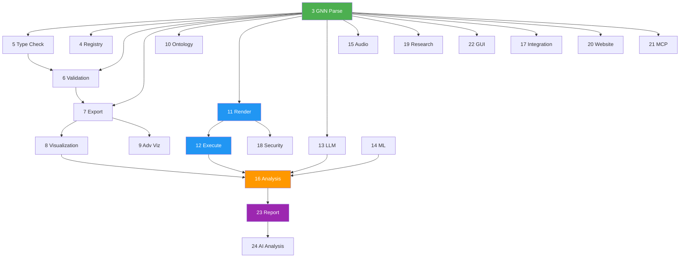

# GNN Pipeline Step Index

**Version**: 1.3.0 · **Last Updated**: 2026-03-03 · **Total Steps**: 25 (0–24)

---

## Configuration

Steps are controlled via [`input/config.yaml`](../input/config.yaml) using the **testing matrix**:

- **Global steps** (0, 1, 2): Toggled individually via `testing_matrix.global_steps`
- **Processing steps** (3–24): Routed per-folder via `testing_matrix.folders`

> See [`SPEC.md`](SPEC.md) for full matrix configuration documentation.

---

## Master Step Table

| Step | Script | Module Dir | Phase | Purpose | Input | Output Dir | Has MCP | AGENTS.md | README | SPEC.md | Frameworks | Exit Codes | Timeout (s) | Dependencies | Fallback Behavior | Data Flow | Matrix Routed | Criticality | Category |
|:----:|--------|-----------|-------|---------|-------|------------|:-------:|:---------:|:------:|:-------:|------------|:----------:|:-----------:|--------------|-------------------|-----------|:-------------:|-------------|----------|
| 0 | [`0_template.py`](0_template.py) | [`template/`](template/) | Global | Pipeline template & initialization | — | `0_template_output/` | ✅ | [✅](template/AGENTS.md) | [✅](template/README.md) | [✅](template/SPEC.md) | — | 0, 1, 2 | 60 | None | N/A | Produces pipeline metadata | Global | Low | Infrastructure |
| 1 | [`1_setup.py`](1_setup.py) | [`setup/`](setup/) | Global | Environment setup & UV dependency install | `pyproject.toml` | `1_setup_output/` | ✅ | [✅](setup/AGENTS.md) | [✅](setup/README.md) | [✅](setup/SPEC.md) | — | 0, 1, 2 | 300 | None | Skips optional deps gracefully | Produces `.venv/` | Global | High | Infrastructure |
| 2 | [`2_tests.py`](2_tests.py) | [`tests/`](tests/) | Global | Test suite execution (pytest) | `src/tests/` | `2_tests_output/` | ✅ | [✅](tests/AGENTS.md) | [✅](tests/README.md) | [✅](tests/SPEC.md) | — | 0, 1, 2 | 600 | Step 1 | Reports failures, continues | Produces test reports | Global | Medium | Quality |
| 3 | [`3_gnn.py`](3_gnn.py) | [`gnn/`](gnn/) | Core | GNN file discovery & multi-format parsing | `input/gnn_files/` | `3_gnn_output/` | ✅ | [✅](gnn/AGENTS.md) | [✅](gnn/README.md) | [✅](gnn/SPEC.md) | — | 0, 1, 2 | 300 | None | Logs parse errors per file | Parsed models → Steps 5–16 | Per-folder | Critical | Processing |
| 4 | [`4_model_registry.py`](4_model_registry.py) | [`model_registry/`](model_registry/) | Core | Model versioning & registry management | Parsed GNN | `4_model_registry_output/` | ✅ | [✅](model_registry/AGENTS.md) | [✅](model_registry/README.md) | [✅](model_registry/SPEC.md) | — | 0, 1, 2 | 300 | Step 3 | Creates registry with available data | Registry JSON | Per-folder | Medium | Processing |
| 5 | [`5_type_checker.py`](5_type_checker.py) | [`type_checker/`](type_checker/) | Core | GNN type validation & resource estimation | Parsed GNN | `5_type_checker_output/` | ✅ | [✅](type_checker/AGENTS.md) | [✅](type_checker/README.md) | [✅](type_checker/SPEC.md) | — | 0, 1, 2 | 300 | Step 3 | Reports type errors, continues | Type info → Step 6 | Per-folder | High | Validation |
| 6 | [`6_validation.py`](6_validation.py) | [`validation/`](validation/) | Core | Consistency & semantic quality checking | Parsed GNN, Type info | `6_validation_output/` | ✅ | [✅](validation/AGENTS.md) | [✅](validation/README.md) | [✅](validation/SPEC.md) | — | 0, 1, 2 | 300 | Steps 3, 5 | Reports issues, continues | Validation results → Step 7 | Per-folder | High | Validation |
| 7 | [`7_export.py`](7_export.py) | [`export/`](export/) | Core | Multi-format export (JSON, XML, GraphML, GEXF, Pickle) | Parsed GNN | `7_export_output/` | ✅ | [✅](export/AGENTS.md) | [✅](export/README.md) | [✅](export/SPEC.md) | — | 0, 1, 2 | 300 | Step 3 | Exports available formats | Exported data → Step 8 | Per-folder | Medium | Export |
| 8 | [`8_visualization.py`](8_visualization.py) | [`visualization/`](visualization/) | Core | Graph & matrix visualization generation | Exported data | `8_visualization_output/` | ✅ | [✅](visualization/AGENTS.md) | [✅](visualization/README.md) | [✅](visualization/SPEC.md) | matplotlib, networkx | 0, 1, 2 | 300 | Step 7 | HTML fallback if matplotlib missing | Visualizations → Step 16 | Per-folder | Low | Visualization |
| 9 | [`9_advanced_viz.py`](9_advanced_viz.py) | [`advanced_visualization/`](advanced_visualization/) | Core | Interactive / advanced visualization (Plotly, D3) | Exported data | `9_advanced_viz_output/` | ✅ | [✅](advanced_visualization/AGENTS.md) | [✅](advanced_visualization/README.md) | [✅](advanced_visualization/SPEC.md) | plotly, d3 | 0, 1, 2 | 300 | Step 7 | HTML report fallback | Interactive plots | Per-folder | Low | Visualization |
| 10 | [`10_ontology.py`](10_ontology.py) | [`ontology/`](ontology/) | Analysis | Active Inference ontology processing & validation | Parsed GNN | `10_ontology_output/` | ✅ | [✅](ontology/AGENTS.md) | [✅](ontology/README.md) | [✅](ontology/SPEC.md) | — | 0, 1, 2 | 300 | Step 3 | Logs missing ontology terms | Ontology mappings | Per-folder | Medium | Analysis |
| 11 | [`11_render.py`](11_render.py) | [`render/`](render/) | Simulation | Code generation for simulation frameworks | Parsed GNN | `11_render_output/` | ✅ | [✅](render/AGENTS.md) | [✅](render/README.md) | [✅](render/SPEC.md) | PyMDP, RxInfer, JAX, DisCoPy, ActInf.jl, PyTorch, NumPyro | 0, 1, 2 | 600 | Step 3 | Generates available frameworks | Generated scripts → Step 12 | Per-folder | Critical | Code Gen |
| 12 | [`12_execute.py`](12_execute.py) | [`execute/`](execute/) | Simulation | Execute rendered simulation scripts | Generated scripts | `12_execute_output/` | ✅ | [✅](execute/AGENTS.md) | [✅](execute/README.md) | [✅](execute/SPEC.md) | PyMDP, RxInfer, JAX, DisCoPy, ActInf.jl, PyTorch, NumPyro | 0, 1, 2 | 1800 | Step 11 | Circuit breaker + retry (3×) | Execution results → Step 16 | Per-folder | Critical | Simulation |
| 13 | [`13_llm.py`](13_llm.py) | [`llm/`](llm/) | Analysis | LLM-enhanced analysis & model interpretation | Parsed GNN | `13_llm_output/` | ✅ | [✅](llm/AGENTS.md) | [✅](llm/README.md) | [✅](llm/SPEC.md) | OpenAI, Anthropic, Ollama | 0, 1, 2 | 600 | Step 3 | Provider fallback chain | LLM insights → Step 16 | Per-folder | Low | AI |
| 14 | [`14_ml_integration.py`](14_ml_integration.py) | [`ml_integration/`](ml_integration/) | Analysis | Machine learning integration & model training | Parsed GNN | `14_ml_integration_output/` | ✅ | [✅](ml_integration/AGENTS.md) | [✅](ml_integration/README.md) | [✅](ml_integration/SPEC.md) | scikit-learn, torch | 0, 1, 2 | 600 | Step 3 | Skips if ML deps missing | ML model artifacts | Per-folder | Low | AI |
| 15 | [`15_audio.py`](15_audio.py) | [`audio/`](audio/) | Output | Audio sonification generation (SAPF) | Parsed GNN | `15_audio_output/` | ✅ | [✅](audio/AGENTS.md) | [✅](audio/README.md) | [✅](audio/SPEC.md) | soundfile, pedalboard | 0, 1, 2 | 300 | Step 3 | Logs if audio deps missing | Audio files | Per-folder | Low | Creative |
| 16 | [`16_analysis.py`](16_analysis.py) | [`analysis/`](analysis/) | Analysis | Statistical analysis & cross-simulation aggregation | Execution results | `16_analysis_output/` | ✅ | [✅](analysis/AGENTS.md) | [✅](analysis/README.md) | [✅](analysis/SPEC.md) | numpy, scipy | 0, 1, 2 | 600 | Steps 12, 8, 13 | Reports available data | Analysis results → Step 23 | Per-folder | Medium | Analysis |
| 17 | [`17_integration.py`](17_integration.py) | [`integration/`](integration/) | Output | System integration & cross-module coordination | Pipeline artifacts | `17_integration_output/` | ✅ | [✅](integration/AGENTS.md) | [✅](integration/README.md) | [✅](integration/SPEC.md) | — | 0, 1, 2 | 300 | Steps 3–16 | Logs integration gaps | Integration report | Per-folder | Medium | Integration |
| 18 | [`18_security.py`](18_security.py) | [`security/`](security/) | Output | Security validation & generated code scanning | Generated scripts | `18_security_output/` | ✅ | [✅](security/AGENTS.md) | [✅](security/README.md) | [✅](security/SPEC.md) | — | 0, 1, 2 | 300 | Step 11 | Reports findings, continues | Security report | Per-folder | High | Quality |
| 19 | [`19_research.py`](19_research.py) | [`research/`](research/) | Output | Research tools & literature references | Parsed GNN | `19_research_output/` | ✅ | [✅](research/AGENTS.md) | [✅](research/README.md) | [✅](research/SPEC.md) | — | 0, 1, 2 | 300 | Step 3 | Generates with available data | Research notes | Per-folder | Low | Research |
| 20 | [`20_website.py`](20_website.py) | [`website/`](website/) | Output | Static HTML website generation | Pipeline artifacts | `20_website_output/` | ✅ | [✅](website/AGENTS.md) | [✅](website/README.md) | [✅](website/SPEC.md) | jinja2 | 0, 1, 2 | 300 | Steps 3–16 | Minimal HTML if deps missing | Website files | Per-folder | Low | Publishing |
| 21 | [`21_mcp.py`](21_mcp.py) | [`mcp/`](mcp/) | Output | Model Context Protocol processing & tool registration | Module MCPs | `21_mcp_output/` | ✅ | [✅](mcp/AGENTS.md) | [✅](mcp/README.md) | [✅](mcp/SPEC.md) | — | 0, 1, 2 | 300 | All modules | Registers available tools | MCP tool manifest | Per-folder | Medium | Integration |
| 22 | [`22_gui.py`](22_gui.py) | [`gui/`](gui/) | Output | Interactive GNN constructor GUI | Parsed GNN | `22_gui_output/` | ✅ | [✅](gui/AGENTS.md) | [✅](gui/README.md) | [✅](gui/SPEC.md) | tkinter, customtkinter | 0, 1, 2 | 300 | Step 3 | Logs if GUI deps missing | GUI screenshots | Per-folder | Low | Creative |
| 23 | [`23_report.py`](23_report.py) | [`report/`](report/) | Output | Comprehensive analysis report generation | Analysis results | `23_report_output/` | ✅ | [✅](report/AGENTS.md) | [✅](report/README.md) | [✅](report/SPEC.md) | — | 0, 1, 2 | 600 | Steps 3–16 | Generates partial report | Markdown + PDF reports | Per-folder | Medium | Publishing |
| 24 | [`24_intelligent_analysis.py`](24_intelligent_analysis.py) | [`intelligent_analysis/`](intelligent_analysis/) | Output | AI-powered pipeline analysis & executive reports | Pipeline summary | `24_intelligent_analysis_output/` | ✅ | [✅](intelligent_analysis/AGENTS.md) | [✅](intelligent_analysis/README.md) | [✅](intelligent_analysis/SPEC.md) | LLM providers | 0, 1, 2 | 600 | All steps | Generates without LLM if unavailable | Executive summary | Per-folder | Low | AI |

---

## Column Legend

| # | Column | Description |
|:-:|--------|-------------|
| 1 | **Step** | Pipeline step number (0–24) |
| 2 | **Script** | Thin orchestrator script in `src/` (link) |
| 3 | **Module Dir** | Module implementation directory (link) |
| 4 | **Phase** | Execution phase: Global, Core, Analysis, Simulation, Output |
| 5 | **Purpose** | One-line description of what the step does |
| 6 | **Input** | Primary input source consumed by this step |
| 7 | **Output Dir** | Subdirectory created under `output/` |
| 8 | **Has MCP** | Whether the module exposes Model Context Protocol tools |
| 9 | **AGENTS.md** | Link to module's agent scaffolding documentation |
| 10 | **README** | Link to module's usage documentation |
| 11 | **SPEC.md** | Link to module's technical specification |
| 12 | **Frameworks** | External frameworks / libraries used |
| 13 | **Exit Codes** | Supported exit codes (0=success, 1=error, 2=warnings) |
| 14 | **Timeout (s)** | Default timeout for this step in seconds |
| 15 | **Dependencies** | Upstream step dependencies (data flow) |
| 16 | **Fallback Behavior** | What happens when optional deps are missing |
| 17 | **Data Flow** | What downstream steps consume from this step |
| 18 | **Matrix Routed** | `Global` (toggleable) or `Per-folder` (matrix-controlled) |
| 19 | **Criticality** | Impact severity: Critical, High, Medium, Low |
| 20 | **Category** | Functional category: Infrastructure, Processing, Validation, etc. |

---

## Phase Breakdown

---

## Data Dependency Graph

---

## Testing Matrix Configuration

The testing matrix in [`input/config.yaml`](../input/config.yaml) controls which steps run on which folders:

| Folder | Files | Steps 3–6 | Steps 7–9 | Step 10 | Step 11 | Step 12 | Steps 13–24 |
|--------|:-----:|:---------:|:---------:|:-------:|:-------:|:-------:|:-----------:|
| `discrete/` | 4 | ✅ | ✅ | ✅ | ✅ | ✅ | ✅ |
| `basics/` | 2 | ✅ | · | ✅ | · | · | · |
| `continuous/` | 2 | ✅ | · | · | · | · | · |
| `hierarchical/` | 2 | ✅ | · | · | · | · | · |
| `multiagent/` | 2 | ✅ | · | · | · | · | · |
| `precision/` | 2 | ✅ | · | · | · | · | · |
| `structured/` | 1 | ✅ | · | · | · | · | · |

---

## References

- **[SPEC.md](SPEC.md)** — Architectural requirements and standards
- **[README.md](README.md)** — Pipeline safety documentation and usage
- **[AGENTS.md](AGENTS.md)** — Module registry and scaffolding
- **[main.py](main.py)** — Pipeline orchestrator
- **[input/config.yaml](../input/config.yaml)** — Matrix configuration
