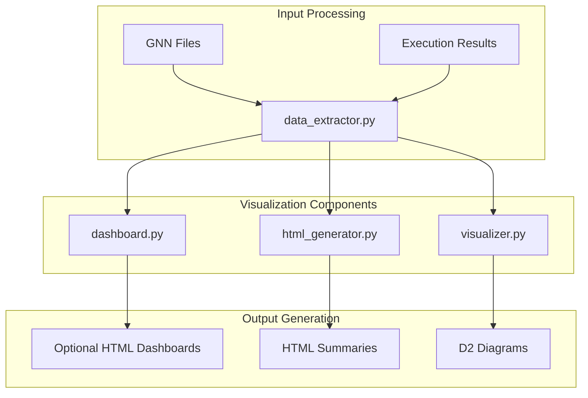
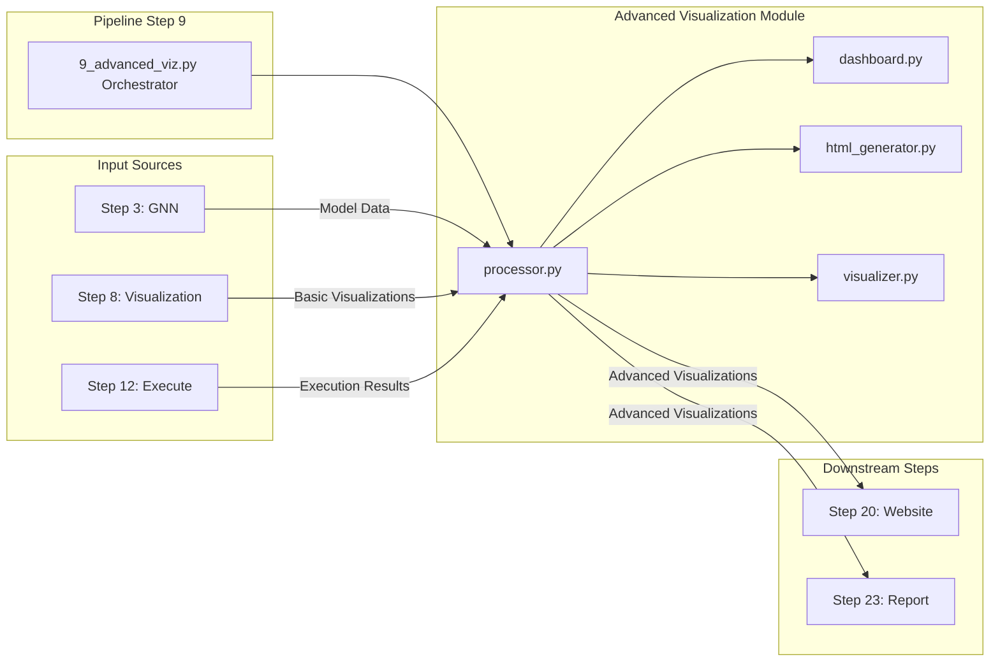
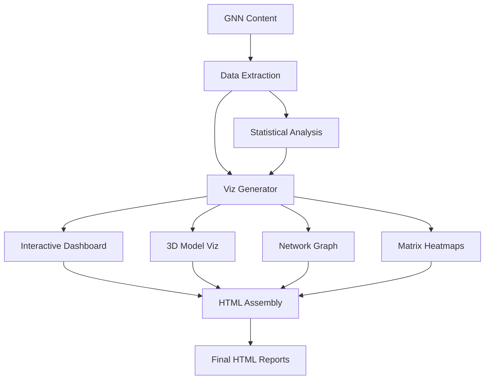

# Advanced Visualization Module

This module provides Step 9 advanced visualization artifacts for GNN models: statistical plots, POMDP-specific panels, network metrics, optional Plotly/HTML dashboards, and optional D2 diagrams.

`process_advanced_viz` returns `True` when artifacts are produced, `2` for
warning-only recovery such as missing Step 3 model data or optional-only skips,
and `False` for hard failures. Output creation is gated by `viz_type` and
`interactive`; interactive dashboards are not emitted when `interactive=False`.

## Module Structure

```
src/advanced_visualization/
├── __init__.py                    # Module initialization and exports
├── README.md                      # This documentation
├── dashboard.py                   # Dashboard generation system
├── data_extractor.py              # Data extraction and processing
├── html_generator.py              # HTML visualization generation
└── visualizer.py                  # Main visualization orchestrator
```

### Advanced Visualization Architecture



### Module Integration Flow



## Core Components

### DashboardGenerator (`dashboard.py`)

Generates comprehensive interactive dashboards for GNN models.

#### Key Methods

- `generate_dashboard(content: str, model_name: str, output_dir: Path) -> Optional[Path]`
  - Creates a complete dashboard from GNN content
  - Returns path to generated dashboard HTML file
  - Handles strict validation and error recovery

- `_generate_dashboard_html(extracted_data: Dict[str, Any], model_name: str) -> str`
  - Generates HTML content for dashboard
  - Includes interactive components and styling
  - Provides comprehensive model analysis

#### Usage

```python
from advanced_visualization.dashboard import DashboardGenerator

generator = DashboardGenerator(strict_validation=True)
dashboard_path = generator.generate_dashboard(
    content=gnn_content,
    model_name="my_model",
    output_dir=Path("output/")
)
```

### VisualizationDataExtractor (`data_extractor.py`)

Extracts and processes data from GNN content for visualization.

#### Key Methods

- `extract_from_file(file_path: Path) -> Dict[str, Any]`
  - Extracts visualization data from GNN file
  - Returns structured data dictionary

- `extract_from_content(content: str, format_hint: Optional[GNNFormat] = None) -> Dict[str, Any]`
  - Extracts data from GNN content string
  - Supports multiple format hints

- `get_model_statistics(extracted_data: Dict[str, Any]) -> Dict[str, Any]`
  - Calculates comprehensive model statistics
  - Includes complexity metrics and structural analysis

#### Usage

```python
from advanced_visualization.data_extractor import VisualizationDataExtractor

extractor = VisualizationDataExtractor(strict_validation=True)
data = extractor.extract_from_content(gnn_content)
stats = extractor.get_model_statistics(data)
```

### HTMLVisualizationGenerator (`html_generator.py`)

Generates advanced HTML visualizations with interactive components.

#### Key Methods

- `generate_advanced_visualization(extracted_data: Dict[str, Any], model_name: str) -> str`
  - Creates comprehensive HTML visualization
  - Includes interactive charts and analysis
  - Provides error handling and recovery content

- `_generate_error_page(model_name: str, errors: List[str]) -> str`
  - Generates error page with diagnostic information
  - Provides recovery suggestions

#### Usage

```python
from advanced_visualization.html_generator import HTMLVisualizationGenerator

generator = HTMLVisualizationGenerator()
html_content = generator.generate_advanced_visualization(data, "model_name")
```

### AdvancedVisualizer (`visualizer.py`)

Main orchestrator for advanced visualization capabilities.

#### Key Methods

- `generate_visualizations(content: str, model_name: str, output_dir: Path, viz_type: str = "all", interactive: bool = True, export_formats: List[str] = None) -> List[str]`
  - Main method for generating all visualization types
  - Supports multiple visualization types and export formats
  - Returns list of generated file paths

#### Usage

```python
from advanced_visualization.visualizer import AdvancedVisualizer

visualizer = AdvancedVisualizer(strict_validation=True)
generated_files = visualizer.generate_visualizations(
    content=gnn_content,
    model_name="my_model",
    output_dir=Path("output/"),
    viz_type="all",
    interactive=True
)
```

## Visualization Types

### 1. Interactive Dashboards
- Generated only for dashboard/interactive visualization types when `interactive=True`
- HTML output backed by extracted model data and available optional dependencies
- Degrades to recorded skips or static artifacts when optional dependencies are absent

### 2. 3D Visualizations
- Static 3D-style model or matrix artifacts produced by the Step 9 processor
- Output depends on `viz_type`, model data availability, and plotting dependencies

### 3. Network Graphs
- Network metrics and graph artifacts derived from parsed GNN structure
- Interactive behavior is limited to optional Plotly/HTML outputs

### 4. Statistical Analysis
- Variable type distribution pie charts
- Variable dimension distribution analysis
- Scalar parameter value histograms
- Matrix size distribution analysis
- Matrix correlation heatmaps between all matrices
- Comprehensive statistical overview panels

### 5. POMDP-Specific Visualizations
- Transition matrix (B) analysis with action-specific slices
- Policy distribution visualizations (π and E matrices)
- State-action relationship diagrams
- 3D transition matrix heatmaps

### 6. Network Analysis
- Network metrics (nodes, edges, density, clustering)
- Centrality analysis and node importance rankings
- Network graph visualization with force-directed layout
- Connection strength and pattern analysis
- Network topology statistics

### 7. Interactive Plotly Dashboards
- Multi-panel interactive dashboard
- Network graph interaction
- Model statistics tables
- HTML output when Plotly support is available and requested

### 8. Matrix Visualizations
- Heatmap representations
- Value highlighting
- Static image artifacts and JSON manifests

## Data Processing Pipeline



### 1. Content Extraction
```python
# Extract data from GNN content
extractor = VisualizationDataExtractor()
data = extractor.extract_from_content(gnn_content)
```

### 2. Statistical Analysis
```python
# Generate comprehensive statistics
stats = extractor.get_model_statistics(data)
```

### 3. Visualization Generation
```python
# Create visualizations
visualizer = AdvancedVisualizer()
files = visualizer.generate_visualizations(
    content=gnn_content,
    model_name=model_name,
    output_dir=output_dir,
    viz_type="all",
    interactive=True,
)
```

### 4. Dashboard Assembly
```python
# Generate complete dashboard
dashboard = DashboardGenerator()
dashboard_path = dashboard.generate_dashboard(content, model_name, output_dir)
```

## Error Handling and Recovery

### Recovery Mechanisms
- **Dependency Failures**: Graceful degradation to basic HTML
- **Data Extraction Errors**: Error pages with diagnostic information
- **Visualization Failures**: Alternative visualization methods
- **Export Failures**: Multiple export format attempts

### Error Reporting
```python
# Comprehensive error reporting
if not success:
    error_page = generator._generate_error_page(model_name, errors)
    # Save error page for debugging
```

## Performance and Resource Notes

- Generate a specific `viz_type` instead of `"all"` when only one artifact family is needed.
- Use `interactive=False` to skip interactive/dashboard branches.
- Treat timing and memory numbers as run-specific; measure them in the current environment before publishing performance claims.

## Integration with Pipeline

### Pipeline Step 9: Advanced Visualization
```python
from advanced_visualization.processor import process_advanced_viz

result = process_advanced_viz(
    target_dir=Path("input/gnn_files"),
    output_dir=Path("output/9_advanced_viz_output"),
    logger=logger,
    viz_type="all",
    interactive=True,
    export_formats=["html", "json"],
)
```

### Output Structure
```
output/9_advanced_viz_output/
├── advanced_viz_summary.json
├── {model}_3d_visualization.png
├── {model}_interactive_dashboard.html      # only when interactive output is requested and available
├── {model}_matrix_correlations.png
├── {model}_network_metrics.png
├── {model}_policy_visualization.png
├── {model}_pomdp_transitions.png
└── {model}_statistical_analysis.png
```

## Configuration Options

### Visualization Settings
```python
# Configuration options
config = {
    "viz_type": "all",
    "interactive": True,
    "export_formats": ["html", "json"],
}
```

The public Step 9 controls are `viz_type`, `interactive`, and `export_formats`.
Do not document additional tuning flags unless they are implemented in the
public API.

## Testing and Validation

### Unit Tests
```python
# Test visualization generation
def test_visualization_generation():
    visualizer = AdvancedVisualizer()
    result = visualizer.generate_visualizations(test_content, "test", test_dir)
    assert len(result) > 0
```

### Integration Tests
```python
# Test pipeline integration
def test_pipeline_integration():
    success = process_advanced_visualization(test_dir, output_dir)
    assert success
```

## Dependencies

### Required Dependencies
- **matplotlib**: Basic plotting capabilities
- **networkx**: Network graph generation
- **numpy**: Numerical computations
- **pandas**: Data manipulation

### Optional Dependencies
- **plotly**: Interactive visualizations
- **seaborn**: Enhanced statistical panels
- **d2 CLI**: D2 diagram compilation; missing D2 records a skip instead of failing the whole step

## Performance Metrics

Do not treat this README as the source of performance numbers. Measure
current processing time and memory from a fresh run when performance is part of
the claim.

## Troubleshooting

### Common Issues

#### 1. Missing Dependencies
```
Error: ModuleNotFoundError: No module named 'plotly'
Solution: Install optional dependencies or use recovery visualizations
```

#### 2. Memory Issues
```
Error: MemoryError during large model processing
Solution: Generate a narrower viz_type, run with interactive=False, or reduce the target set
```

#### 3. Visualization Failures
```
Error: Failed to generate 3D visualization
Solution: Check browser compatibility or use 2D recovery
```

Use the pipeline `--verbose` flag or the provided logger for diagnostics; the
`AdvancedVisualizer` constructor does not expose a public debug constructor flag.

## Future Enhancements

### Planned Features
- **Collaborative Features**: Multi-user visualization sessions
- **Advanced Analytics**: Machine learning-based insights
- **Mobile Support**: Responsive review of generated HTML artifacts

### Performance Improvements
- **WebGL Rendering**: Hardware-accelerated 3D rendering
- **Live Processing Contracts**: Add only after implementation and tests define live-data semantics

## Summary

The Advanced Visualization module provides artifact-generating visualization capabilities for GNN models, including statistical panels, POMDP-specific plots, network metrics, optional dashboards, and D2 diagrams. Its documentation should stay tied to implemented outputs, dependency fallbacks, and the `process_advanced_viz` return contract.

## License and Citation

This module is part of the GeneralizedNotationNotation project. See the main repository for license and citation information. 

## References

- Project overview: ../../README.md
- Comprehensive docs: ../../DOCS.md
- Architecture guide: ../../ARCHITECTURE.md
- Pipeline details: ../../doc/pipeline/README.md

---
## Documentation
- **[README](README.md)**: Module Overview
- **[AGENTS](AGENTS.md)**: Agentic Workflows
- **[SPEC](SPEC.md)**: Architectural Specification
- **[SKILL](SKILL.md)**: Capability API
