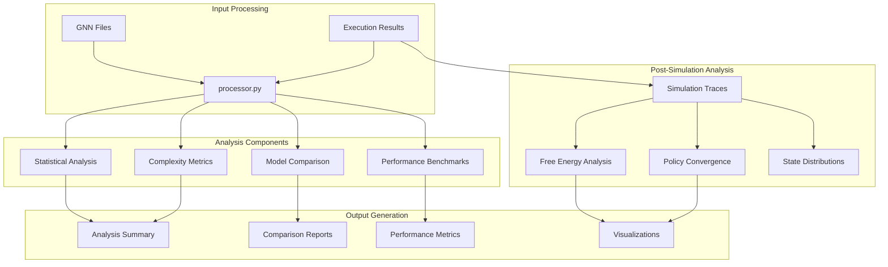
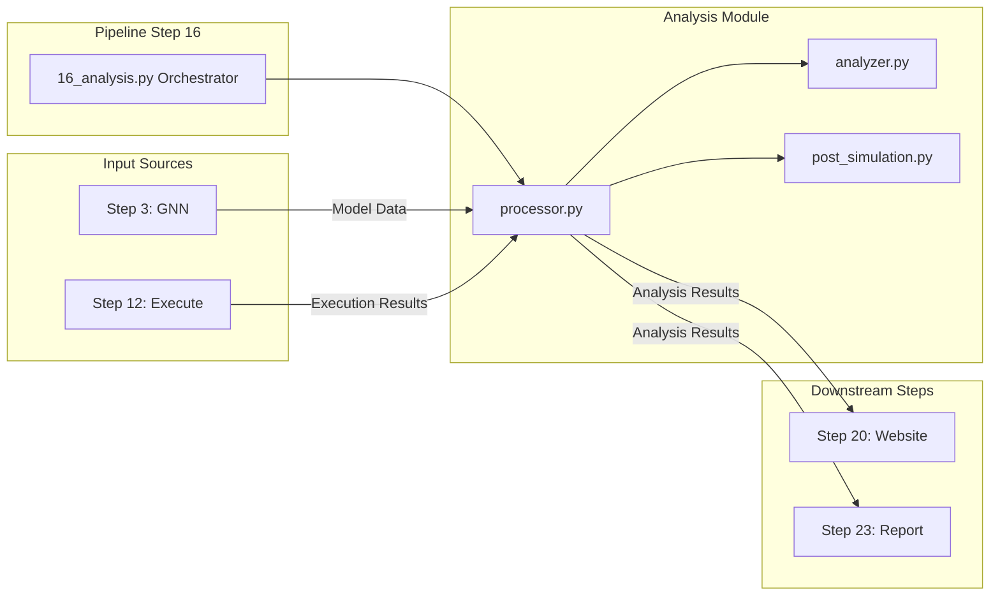
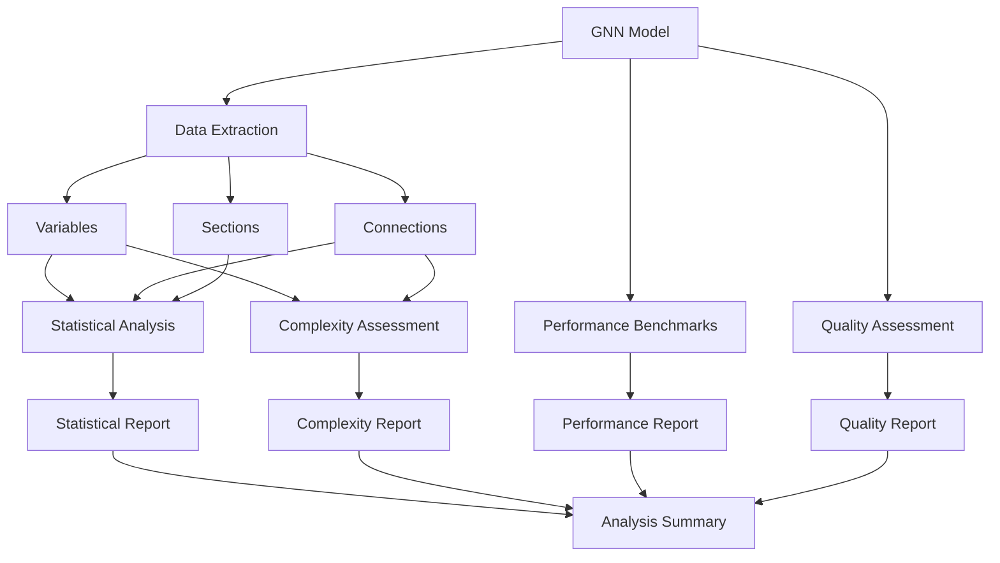

# Analysis Module

This module provides comprehensive statistical analysis, performance profiling, and model evaluation capabilities for GNN models and pipeline components.

## Module Structure

```
src/analysis/
├── __init__.py                    # Module initialization and exports
├── README.md                      # This documentation
├── processor.py                   # Main analysis processor (Step 16 entry)
├── analyzer.py                    # Statistical analysis functions
├── post_simulation.py             # Post-simulation analysis
├── trace_analysis.py              # Execution trace analysis helpers
├── framework_extractors.py        # Per-framework result extraction
├── math_utils.py                  # Math/statistics helpers
├── visualizations.py / viz_base.py # Plotting helpers
├── interpretability.py            # Interpretability summaries
├── generate_cross_model_report.py # Cross-model report generation
├── mcp.py                         # Model Context Protocol integration
└── <framework>/analyzer.py        # pymdp, rxinfer, jax, discopy, activeinference_jl, numpyro, pytorch
```

### Analysis Processing Architecture



### Module Integration Flow



Analysis uses whatever execution (Step 12) produced. Python backends are in core `uv sync`; for Julia frameworks, install Julia and packages, then re-run Step 12.

For the maintained 3x3 GridWorld fixture, Step 16 recognizes the current PyMDP,
RxInfer.jl, and ActiveInference.jl schemas and writes per-framework belief GIFs,
per-framework 3x3 state trajectory GIFs, a side-by-side cross-framework trajectory
GIF, and `cross_framework/gridworld_analysis_manifest.json`. Use
`--no-animations` on Step 16 to suppress GIF artifacts. Programmatic callers
should pass `generate_animations`; compatibility `no_animations` is normalized
as its inverse only when the canonical key is absent.

Return contract: `process_analysis` returns `True` when analysis artifacts are
produced, `2` for warning-only recovery such as no input, and `False` for hard
failures.
## Core Components

### Statistical Analysis Functions

#### `perform_statistical_analysis(file_path: Path, verbose: bool = False) -> Dict[str, Any]`
Performs comprehensive statistical analysis on a GNN model file.

**Returns (keys):**
- `variable_statistics`, `connection_statistics`, `section_statistics`
- `distributions`, `correlations`
- `file_path`, `file_name`, `file_size`, `line_count`, `analysis_timestamp`

Raises `RuntimeError` on failure.

#### `extract_variables(content: str) -> List[Dict[str, Any]]`
Extracts variables from GNN content (regex-based: `name: type`, `name = value`, `name[dimensions]`).

#### `extract_connections(content: str) -> List[Dict[str, Any]]`
Extracts connections from GNN content.

#### `extract_sections(content: str) -> List[Dict[str, Any]]`
Extracts GNN sections for comprehensive analysis.

### Statistical Calculation Functions

#### `calculate_variable_statistics(variables: List[Dict[str, Any]]) -> Dict[str, Any]`
Calculates comprehensive statistics for variables.

**Metrics:**
- Type distribution
- Dimension statistics
- Complexity measures
- Memory usage estimates

#### `calculate_connection_statistics(connections: List[Dict[str, Any]]) -> Dict[str, Any]`
Calculates statistics for model connections.

**Metrics:**
- Connection density
- Graph metrics
- Dependency patterns
- Structural complexity

#### `calculate_section_statistics(sections: List[Dict[str, Any]]) -> Dict[str, Any]`
Calculates statistics for GNN sections.

**Metrics:**
- Section distribution
- Content analysis
- Validation status
- Quality metrics

### Complexity Analysis Functions

#### `calculate_cyclomatic_complexity(variables: List[Dict[str, Any]], connections: List[Dict[str, Any]]) -> float`
Calculates cyclomatic complexity of the model.

**Formula:**
```
Complexity = E - N + 2P
Where:
- E = Number of edges (connections)
- N = Number of nodes (variables)
- P = Number of connected components
```

#### `calculate_cognitive_complexity(variables: List[Dict[str, Any]], connections: List[Dict[str, Any]]) -> float`
Calculates cognitive complexity based on model structure.

**Factors:**
- Variable type diversity
- Connection patterns
- Nesting levels
- Semantic complexity

#### `calculate_structural_complexity(variables: List[Dict[str, Any]], connections: List[Dict[str, Any]]) -> float`
Calculates structural complexity metrics.

**Metrics:**
- Graph density
- Clustering coefficient
- Path length analysis
- Modularity measures

### Performance Analysis Functions

#### `run_performance_benchmarks(file_path: Path, verbose: bool = False) -> Dict[str, Any]`
Runs comprehensive performance benchmarks.

**Benchmarks:**
- Processing time analysis
- Memory usage profiling
- CPU utilization
- I/O performance
- Scalability testing

#### `calculate_complexity_metrics(file_path: Path, verbose: bool = False) -> Dict[str, Any]`
Calculates comprehensive complexity metrics.

**Metrics:**
- Cyclomatic complexity
- Cognitive complexity
- Structural complexity
- Maintainability index
- Technical debt assessment

### Quality Assessment Functions

#### `calculate_maintainability_index(content: str, variables: List[Dict[str, Any]], connections: List[Dict[str, Any]]) -> float`
Calculates maintainability index for the model.

**Formula:**
```
MI = 171 - 5.2 * ln(len(variables) + len(connections)) - 0.23 * ln(line_count)
Clamped to [0, 100]
```

#### `calculate_technical_debt(content: str, variables: List[Dict[str, Any]], connections: List[Dict[str, Any]]) -> float`
Calculates technical debt for the model.

**Factors:**
- Code quality issues
- Complexity penalties
- Documentation gaps
- Testing coverage
- Performance bottlenecks

### Model Comparison Functions

#### `perform_model_comparisons(statistical_analyses: List[Dict[str, Any]], verbose: bool = False) -> Dict[str, Any]`
Performs comparative analysis across multiple models.

### Reporting Functions

#### `generate_analysis_summary(results: Dict[str, Any]) -> str`
Generates comprehensive analysis summary.

**Content:**
- Executive summary
- Key metrics
- Recommendations
- Risk assessment
- Improvement suggestions

## Usage Examples

### Basic Statistical Analysis

```python
from analysis import perform_statistical_analysis

# Analyze a GNN model file
results = perform_statistical_analysis(
    file_path=Path("models/my_model.md"), verbose=True
)

print(f"Variable stats: {results['variable_statistics']}")
print(f"Connection stats: {results['connection_statistics']}")
```

### Comprehensive Analysis

```python
from analysis import (
    extract_variables,
    extract_connections,
    calculate_variable_statistics,
    calculate_connection_statistics,
)

# Extract and analyze components
variables = extract_variables(gnn_content)
connections = extract_connections(gnn_content)

# Calculate statistics
var_stats = calculate_variable_statistics(variables)
conn_stats = calculate_connection_statistics(connections)
```

### Performance Benchmarking

```python
from analysis import run_performance_benchmarks

# Run performance benchmarks
benchmarks = run_performance_benchmarks(
    file_path=Path("models/large_model.md"), verbose=True
)

print(f"Parse time: {benchmarks['parse_time']:.3f}s")
print(f"Memory footprint: {benchmarks['memory_usage']} bytes")
print(f"Complexity score: {benchmarks['complexity_score']}")
```
```python
from analysis import (
    calculate_cyclomatic_complexity,
    calculate_cognitive_complexity,
    calculate_structural_complexity,
)

# Calculate complexity metrics
cyclomatic = calculate_cyclomatic_complexity(variables, connections)
cognitive = calculate_cognitive_complexity(variables, connections)
structural = calculate_structural_complexity(variables, connections)

print(f"Cyclomatic complexity: {cyclomatic:.2f}")
print(f"Cognitive complexity: {cognitive:.2f}")
print(f"Structural complexity: {structural:.2f}")
```

### Quality Assessment

```python
from analysis import calculate_maintainability_index, calculate_technical_debt

# Assess model quality
maintainability = calculate_maintainability_index(content, variables, connections)
tech_debt = calculate_technical_debt(content, variables, connections)

print(f"Maintainability index: {maintainability:.2f}")
print(f"Technical debt: {tech_debt:.2f}")
```

## Analysis Pipeline



### 1. Data Extraction
```python
# Extract model components
variables = extract_variables(content)
connections = extract_connections(content)
sections = extract_sections(content)
```

### 2. Statistical Analysis
```python
# Calculate comprehensive statistics
var_stats = calculate_variable_statistics(variables)
conn_stats = calculate_connection_statistics(connections)
section_stats = calculate_section_statistics(sections)
```

### 3. Complexity Assessment
```python
# Assess model complexity
complexity_metrics = {
    "cyclomatic": calculate_cyclomatic_complexity(variables, connections),
    "cognitive": calculate_cognitive_complexity(variables, connections),
    "structural": calculate_structural_complexity(variables, connections),
}
```

### 4. Performance Evaluation
```python
# Evaluate performance characteristics
performance = run_performance_benchmarks(file_path)
```

### 5. Quality Assessment
```python
# Assess model quality
quality_metrics = {
    "maintainability": calculate_maintainability_index(content, variables, connections),
    "technical_debt": calculate_technical_debt(content, variables, connections),
}
```

## Integration with Pipeline

### Pipeline Step 16: Analysis

The step calls `analysis.process_analysis(target_dir, output_dir, verbose, **kwargs)`; it handles extraction, statistics, benchmarks, post-simulation framework analysis, and report generation in one pass.

### Output Structure
```
output/16_analysis_output/
├── analysis_results.json          # Full step results
├── analysis_summary.md            # Human-readable summary
├── cross_model_comparison_report.md
├── {model}_post_simulation_analysis.json
└── comprehensive_visualizations/  # Plot and GIF artifacts
```

## Analysis Metrics

### Statistical Metrics
- **Variable Count**: Total number of variables
- **Connection Count**: Total number of connections
- **Type Distribution**: Distribution of variable types
- **Dimension Analysis**: Variable dimension statistics
- **Density Metrics**: Connection density and patterns

### Complexity Metrics
- **Cyclomatic Complexity**: Graph-based complexity measure
- **Cognitive Complexity**: Human comprehension difficulty
- **Structural Complexity**: Model structure complexity
- **Maintainability Index**: Code maintainability score
- **Technical Debt**: Quality and maintainability debt

### Performance Metrics
- **Processing Time**: Model processing duration
- **Memory Usage**: Memory consumption during processing
- **CPU Utilization**: CPU usage patterns
- **I/O Performance**: Input/output performance
- **Scalability**: Performance scaling characteristics

### Quality Metrics
- **Code Quality**: Overall code quality assessment
- **Documentation Coverage**: Documentation completeness
- **Testing Coverage**: Test coverage metrics
- **Best Practices**: Adherence to best practices
- **Risk Assessment**: Potential risk factors

## Configuration Options

### Analysis Settings

`process_analysis` accepts `generate_animations` (canonical; default `True`) and the compatibility inverse `no_animations`; unused kwargs are ignored. CLI flags on Step 16: `--no-animations` and `--advanced-stats`. There are no memory/CPU profiling toggles or benchmark-iteration settings.

## Error Handling

- `perform_statistical_analysis`, `calculate_complexity_metrics`, and `run_performance_benchmarks` raise `RuntimeError` on failure.
- `process_analysis` collects per-file errors in `results["errors"]` and continues; missing execution data for post-simulation analysis logs a warning and is skipped.
- There is no `AnalysisError` exception type and no separate `validate_gnn_content` entry point.

## Performance Considerations

### Optimization Strategies
- **Caching**: Cache analysis results for repeated analysis
- **Parallel Processing**: Use parallel processing for large models
- **Memory Management**: Optimize memory usage for large datasets
- **Incremental Analysis**: Support incremental analysis for large models

### Scalability
- **Large Models**: Handle models with thousands of variables
- **Batch Processing**: Process multiple models efficiently
- **Resource Management**: Manage CPU and memory resources
- **Progress Tracking**: Track analysis progress for long-running operations

## Testing and Validation

### Unit Tests
```python
# Test individual analysis functions
def test_variable_statistics():
    variables = extract_variables_for_analysis(test_content)
    stats = calculate_variable_statistics(variables)
    assert "type_distribution" in stats
    assert "count" in stats
```

### Integration Tests
```python
# Test complete analysis pipeline
def test_analysis_pipeline():
    results = perform_statistical_analysis(test_file)
    assert "statistics" in results
    assert "complexity_metrics" in results
    assert "performance_benchmarks" in results
```

## Dependencies

### Required Dependencies

- **numpy**: Numerical computations (core dependency)
- **matplotlib**: Statistical plotting (core dependency; falls back to text-based reports when unavailable)


## Summary

The Analysis module provides comprehensive statistical analysis, performance profiling, and model evaluation capabilities for GNN models. The module includes sophisticated complexity metrics, quality assessment tools, and performance benchmarking capabilities to support Active Inference research and development.

## License and Citation

This module is part of the GeneralizedNotationNotation project. See the main repository for license and citation information. 

## References

- Project overview: ../../README.md
- Comprehensive docs: ../../DOCS.md
- Architecture guide: ../../ARCHITECTURE.md
- Pipeline details: ../../doc/pipeline/README.md

---
## Documentation
- **[README](README.md)**: Module Overview
- **[AGENTS](AGENTS.md)**: Agentic Workflows
- **[SPEC](SPEC.md)**: Architectural Specification
- **[SKILL](SKILL.md)**: Capability API
