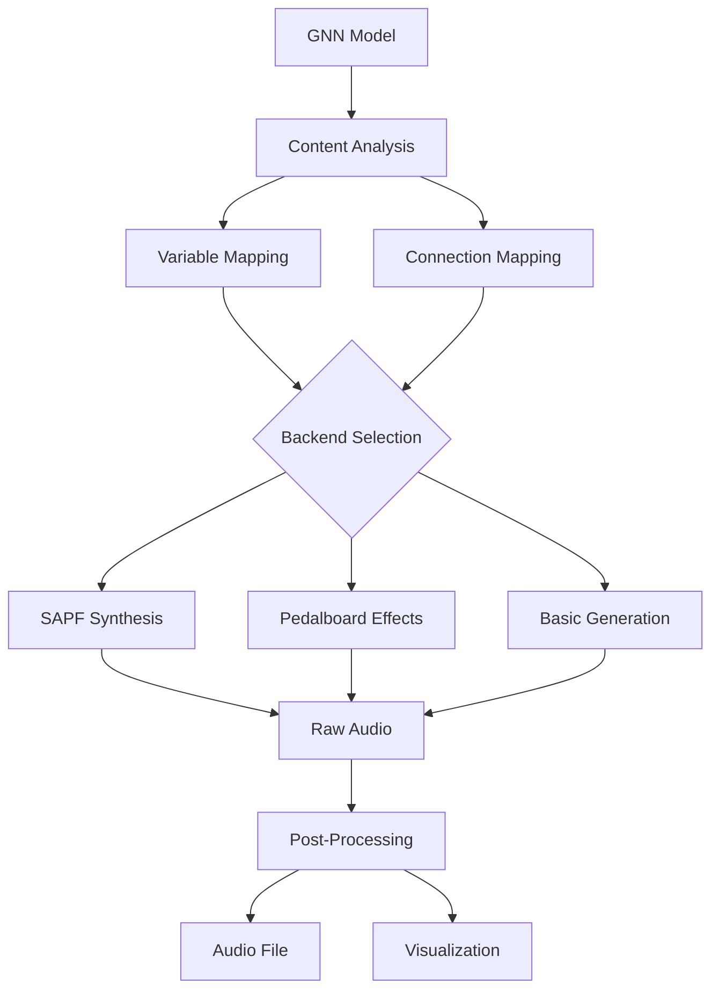

# Audio Module

This module provides comprehensive audio generation capabilities for GNN models, including sonification, audio synthesis, and multi-backend audio processing with support for SAPF (Synthetic Audio Processing Framework) and Pedalboard.

## Module Structure

```
src/audio/
├── __init__.py                    # Module initialization and exports
├── README.md                      # This documentation
├── generator.py                    # Main audio generation system
├── mcp.py                         # Model Context Protocol integration
├── pedalboard/                    # Pedalboard audio processing
│   └── [pedalboard components]
└── sapf/                          # SAPF audio framework
    ├── __init__.py               # SAPF module initialization
    ├── audio_generators.py       # Audio generation components
    ├── generator.py              # SAPF generator
    └── sapf_gnn_processor.py    # GNN to SAPF converter
```

## Core Components

### AudioGenerationResult (`generator.py`)

Data class representing the result of audio generation process.

#### Attributes
- `success: bool` - Whether generation was successful
- `audio_file: Optional[Path]` - Path to generated audio file
- `backend_used: str` - Audio backend used for generation
- `duration: float` - Duration of generated audio in seconds
- `error_message: str` - Error message if generation failed
- `visualization_file: Optional[Path]` - Path to audio visualization
- `metadata: Dict[str, Any]` - Additional metadata

### Audio Generation Functions

#### `get_available_backends() -> Dict[str, bool]`
Returns dictionary of available audio backends and their availability status.

**Supported Backends:**
- **SAPF**: Synthetic Audio Processing Framework
- **Pedalboard**: Audio effects processing
- **Basic**: Basic audio generation
- **Synthetic**: Synthetic audio generation

#### `select_backend(requested_backend: str = 'auto') -> str`
Selects the best available audio backend based on request and availability.

**Selection Logic:**
1. If specific backend requested and available, use it
2. If 'auto', select best available backend
3. Fall back to basic backend if others unavailable

#### `generate_audio(gnn_content: str, output_file: Union[str, Path], model_name: str = "", duration: float = 30.0, backend: str = 'auto', visualization: bool = True, **kwargs) -> bool`
Main function for generating audio from GNN content.

**Parameters:**
- `gnn_content`: GNN model content
- `output_file`: Path for output audio file
- `model_name`: Name of the model
- `duration`: Audio duration in seconds
- `backend`: Audio backend to use
- `visualization`: Whether to generate audio visualization

**Returns:**
- `bool`: Success status of audio generation

### SAPF Integration (`sapf/`)

#### SAPFGNNProcessor (`sapf_gnn_processor.py`)

Converts GNN models to SAPF audio configurations.

**Key Methods:**

- `parse_gnn_sections(gnn_content: str) -> Dict[str, Any]`
  - Parses GNN content into structured sections
  - Extracts state space, connections, parameters, and time configuration

- `convert_to_sapf(gnn_sections: Dict[str, Any], model_name: str) -> str`
  - Converts GNN sections to SAPF audio code
  - Generates oscillators, routing, and processing chains

- `_generate_state_oscillators(state_space: List[Dict[str, Any]], base_freq: float) -> List[str]`
  - Generates oscillators for state variables
  - Creates frequency mappings and modulation

- `_generate_connection_routing(connections: List[Dict[str, str]]) -> List[str]`
  - Generates audio routing based on model connections
  - Creates mixer and effects chains

#### SyntheticAudioGenerator (`audio_generators.py`)

Generates synthetic audio from SAPF configurations.

**Key Methods:**

- `generate_from_sapf(sapf_code: str, output_file: Path, duration: float, create_visualization: bool = True) -> bool`
  - Generates audio from SAPF code
  - Creates waveform visualizations
  - Handles multiple audio formats

- `_analyze_sapf_code(sapf_code: str) -> Dict[str, Any]`
  - Analyzes SAPF code for audio parameters
  - Extracts oscillator configurations
  - Identifies effects and routing

- `_generate_audio(params: Dict[str, Any], duration: float) -> List[int]`
  - Generates raw audio samples
  - Applies effects and processing
  - Handles multiple oscillator types

### Audio Processing Functions

#### `generate_audio_from_gnn(file_path: Path, output_dir: Path, verbose: bool = False) -> Dict[str, Any]`
Generates audio from GNN file with comprehensive analysis.

**Features:**
- Multi-format audio generation
- Audio characteristic analysis
- Visualization generation
- Performance metrics

#### `extract_variables_for_audio(content: str) -> List[Dict]`
Extracts variables from GNN content for audio generation.

**Processing:**
- Variable type analysis
- Frequency mapping
- Amplitude calculation
- Modulation parameters

#### `extract_connections_for_audio(content: str) -> List[Dict]`
Extracts connections for audio routing and effects.

**Processing:**
- Connection pattern analysis
- Routing matrix generation
- Effects chain creation
- Mixing configuration

#### `generate_tonal_representation(variables: List[Dict], connections: List[Dict]) -> np.ndarray`
Generates tonal representation of the model.

**Features:**
- Frequency mapping from variables
- Harmonic analysis
- Chord progression generation
- Tonal center calculation

#### `generate_rhythmic_representation(variables: List[Dict], connections: List[Dict]) -> np.ndarray`
Generates rhythmic representation of the model.

**Features:**
- Tempo calculation from model dynamics
- Rhythm pattern generation
- Percussion mapping
- Time signature analysis

#### `generate_ambient_representation(variables: List[Dict], connections: List[Dict]) -> np.ndarray`
Generates ambient representation of the model.

**Features:**
- Atmospheric sound generation
- Spatial audio processing
- Reverb and delay effects
- Environmental mapping

### Audio File Management

#### `save_audio_file(audio: np.ndarray, file_path: Path, sample_rate: int = 44100)`
Saves audio data to file with proper formatting.

**Features:**
- Multiple format support (WAV, MP3, FLAC)
- Quality control
- Metadata embedding
- Error handling

#### `write_basic_wav(audio: np.ndarray, file_path: Path, sample_rate: int)`
Writes basic WAV file with standard parameters.

**Features:**
- Standard WAV format
- Configurable sample rate
- Quality preservation
- Cross-platform compatibility

### Sonification Functions

#### `create_sonification(file_path: Path, output_dir: Path, verbose: bool = False) -> Dict[str, Any]`
Creates comprehensive sonification of GNN model.

**Features:**
- Multi-dimensional sonification
- Interactive audio generation
- Real-time parameter mapping
- Comprehensive analysis

#### `extract_model_dynamics(content: str) -> List[Dict[str, Any]]`
Extracts dynamic characteristics from GNN model.

**Analysis:**
- Temporal dynamics
- State transitions
- Parameter evolution
- System behavior patterns

#### `generate_sonification_audio(dynamics: List[Dict[str, Any]]) -> np.ndarray`
Generates audio from model dynamics.

**Processing:**
- Dynamic parameter mapping
- Real-time audio synthesis
- Interactive controls
- Performance optimization

### Audio Analysis Functions

#### `analyze_audio_characteristics(audio_result: Dict[str, Any], verbose: bool = False) -> Dict[str, Any]`
Analyzes characteristics of generated audio.

**Analysis:**
- Spectral analysis
- Temporal characteristics
- Harmonic content
- Dynamic range
- Quality metrics

#### `generate_audio_summary(results: Dict[str, Any]) -> str`
Generates comprehensive audio summary.

**Content:**
- Audio characteristics
- Generation parameters
- Quality assessment
- Recommendations
- Technical details

## Usage Examples

### Basic Audio Generation

```python
from audio import generate_audio

# Generate audio from GNN content
success = generate_audio(
    gnn_content=gnn_content,
    output_file="output/model_audio.wav",
    model_name="my_model",
    duration=30.0,
    backend="auto"
)

if success:
    print("Audio generated successfully")
else:
    print("Audio generation failed")
```

### SAPF Audio Generation

```python
from audio.sapf import SAPFGNNProcessor

# Convert GNN to SAPF
processor = SAPFGNNProcessor()
sapf_code = processor.convert_to_sapf(gnn_sections, "my_model")

# Generate audio from SAPF
from audio.sapf import generate_audio_from_sapf
success = generate_audio_from_sapf(sapf_code, "output/sapf_audio.wav", 30.0)
```

### Comprehensive Audio Analysis

```python
from audio import generate_audio_from_gnn, analyze_audio_characteristics

# Generate audio with analysis
results = generate_audio_from_gnn(
    file_path=Path("models/my_model.md"),
    output_dir=Path("output/"),
    verbose=True
)

# Analyze audio characteristics
analysis = analyze_audio_characteristics(results, verbose=True)
print(f"Audio duration: {analysis['duration']:.2f}s")
print(f"Sample rate: {analysis['sample_rate']}Hz")
print(f"Dynamic range: {analysis['dynamic_range']:.2f}dB")
```

### Sonification Creation

```python
from audio import create_sonification

# Create comprehensive sonification
sonification = create_sonification(
    file_path=Path("models/complex_model.md"),
    output_dir=Path("output/sonification/"),
    verbose=True
)

print(f"Sonification created: {sonification['audio_file']}")
print(f"Visualization: {sonification['visualization_file']}")
```

### Audio Backend Selection

```python
from audio import get_available_backends, select_backend

# Check available backends
backends = get_available_backends()
print("Available backends:", backends)

# Select best backend
backend = select_backend("auto")
print(f"Selected backend: {backend}")
```

## Audio Generation Pipeline



### 1. Content Analysis
```python
# Extract audio-relevant data from GNN
variables = extract_variables_for_audio(content)
connections = extract_connections_for_audio(content)
```

### 2. Audio Parameter Mapping
```python
# Map model parameters to audio parameters
frequencies = map_variables_to_frequencies(variables)
amplitudes = map_variables_to_amplitudes(variables)
effects = map_connections_to_effects(connections)
```

### 3. Audio Synthesis
```python
# Generate audio using selected backend
if backend == "sapf":
    audio = generate_sapf_audio(sapf_code, duration)
elif backend == "pedalboard":
    audio = generate_pedalboard_audio(pedalboard_config, duration)
else:
    audio = generate_basic_audio(audio_params, duration)
```

### 4. Audio Processing
```python
# Apply effects and processing
processed_audio = apply_audio_effects(audio, effects)
final_audio = normalize_audio(processed_audio)
```

### 5. File Generation
```python
# Save audio file with metadata
save_audio_file(final_audio, output_file, sample_rate=44100)
generate_audio_visualization(final_audio, visualization_file)
```

## Integration with Pipeline

### Pipeline Step 15: Audio Processing
```python
# Called from 15_audio.py
def process_audio(target_dir, output_dir, verbose=False, **kwargs):
    # Generate audio from GNN models
    results = generate_audio_from_gnn(file_path, output_dir, verbose)
    
    # Analyze audio characteristics
    analysis = analyze_audio_characteristics(results, verbose)
    
    # Generate summary
    summary = generate_audio_summary(results)
    
    return True
```

### Output Structure
```
output/15_audio_output/
├── model_audio.wav                # Generated audio file
├── audio_visualization.png        # Audio waveform visualization
├── audio_analysis.json            # Audio characteristics analysis
├── sonification_audio.wav         # Sonification audio
├── sapf_code.txt                 # Generated SAPF code
└── audio_summary.md              # Audio generation summary
```

## Audio Backends

### SAPF (Synthetic Audio Processing Framework)
- **Purpose**: Advanced audio synthesis and processing
- **Features**: Modular audio processing, real-time synthesis
- **Strengths**: Complex audio generation, effects processing
- **Use Cases**: Research audio, complex sonification

### Pedalboard
- **Purpose**: Audio effects processing
- **Features**: Professional audio effects, real-time processing
- **Strengths**: High-quality effects, low latency
- **Use Cases**: Audio enhancement, effects processing

### Basic Audio
- **Purpose**: Simple audio generation
- **Features**: Basic waveform generation, simple effects
- **Strengths**: Lightweight, cross-platform
- **Use Cases**: Simple sonification, testing

### Synthetic Audio
- **Purpose**: Algorithmic audio generation
- **Features**: Mathematical audio synthesis, parameter control
- **Strengths**: Precise control, reproducible results
- **Use Cases**: Research, parameter exploration

## Audio Formats and Quality

### Supported Formats
- **WAV**: Uncompressed audio, high quality
- **MP3**: Compressed audio, smaller file size
- **FLAC**: Lossless compression, high quality
- **OGG**: Open format, good compression

### Quality Settings
```python
# Quality configuration
quality_config = {
    'sample_rate': 44100,          # Hz
    'bit_depth': 16,               # bits
    'channels': 2,                 # stereo
    'compression': 'lossless',     # compression type
    'normalization': True          # normalize audio
}
```

## Performance Optimization

### Memory Management
- **Streaming Processing**: Process audio in chunks for large files
- **Memory Pooling**: Reuse audio buffers
- **Garbage Collection**: Clean up temporary audio data

### Processing Optimization
- **Parallel Processing**: Process multiple audio streams
- **GPU Acceleration**: Use GPU for audio processing when available
- **Caching**: Cache processed audio data

### Quality vs Performance
```python
# Performance configuration
performance_config = {
    'use_gpu': True,               # Use GPU acceleration
    'parallel_processing': True,    # Enable parallel processing
    'cache_results': True,          # Cache processed results
    'optimize_memory': True         # Optimize memory usage
}
```

## Error Handling

### Audio Generation Failures
```python
# Handle audio generation errors
try:
    result = generate_audio(content, output_file)
except AudioGenerationError as e:
    logger.error(f"Audio generation failed: {e}")
    # Provide fallback audio or error reporting
```

### Backend Failures
```python
# Handle backend failures gracefully
backends = get_available_backends()
if not any(backends.values()):
    logger.warning("No audio backends available, using basic generation")
    # Fall back to basic audio generation
```

### File System Issues
```python
# Handle file system issues
try:
    save_audio_file(audio, output_path)
except IOError as e:
    logger.error(f"Failed to save audio file: {e}")
    # Provide alternative save location or error reporting
```

## Testing and Validation

### Unit Tests
```python
# Test audio generation functions
def test_audio_generation():
    result = generate_audio(test_content, test_output)
    assert result.success
    assert result.audio_file.exists()
```

### Integration Tests
```python
# Test complete audio pipeline
def test_audio_pipeline():
    results = generate_audio_from_gnn(test_file, test_dir)
    assert 'audio_file' in results
    assert 'analysis' in results
```

### Quality Tests
```python
# Test audio quality
def test_audio_quality():
    analysis = analyze_audio_characteristics(audio_result)
    assert analysis['sample_rate'] == 44100
    assert analysis['dynamic_range'] > 0
```

## Dependencies

### Required Dependencies
- **numpy**: Numerical computations for audio processing
- **scipy**: Scientific computing for audio analysis
- **librosa**: Audio analysis and processing
- **soundfile**: Audio file I/O

### Optional Dependencies
- **pedalboard**: Audio effects processing
- **pyaudio**: Real-time audio processing
- **webrtcvad**: Voice activity detection
- **pygame**: Audio playback and testing

## Performance Metrics

### Processing Times
- **Small Models** (< 50 variables): < 5 seconds
- **Medium Models** (50-200 variables): 5-30 seconds
- **Large Models** (> 200 variables): 30-300 seconds

### Memory Usage
- **Base Memory**: ~100MB
- **Per Model**: ~50-500MB depending on complexity
- **Peak Memory**: 2-3x base usage during processing

### Audio Quality
- **Sample Rate**: 44.1kHz (CD quality)
- **Bit Depth**: 16-bit (standard)
- **Dynamic Range**: 96dB (theoretical)
- **Frequency Response**: 20Hz-20kHz (human hearing range)

## Troubleshooting

### Common Issues

#### 1. Audio Backend Issues
```
Error: No audio backends available
Solution: Install required audio dependencies or use basic backend
```

#### 2. Memory Issues
```
Error: MemoryError during large model audio generation
Solution: Enable memory optimization or process in chunks
```

#### 3. File System Issues
```
Error: Permission denied writing audio file
Solution: Check file permissions or use alternative output directory
```

#### 4. Audio Quality Issues
```
Error: Poor audio quality or artifacts
Solution: Check audio parameters or use different backend
```

### Debug Mode
```python
# Enable debug mode for detailed audio processing
result = generate_audio(content, output_file, debug=True, verbose=True)
```

## Future Enhancements

### Planned Features
- **Real-time Audio**: Live audio generation during model development
- **Interactive Sonification**: User-controlled audio parameters
- **Advanced Effects**: Professional audio effects and processing
- **Spatial Audio**: 3D audio positioning and movement

### Performance Improvements
- **GPU Audio Processing**: Hardware-accelerated audio processing
- **Streaming Audio**: Real-time audio streaming capabilities
- **Audio Compression**: Advanced audio compression algorithms
- **Parallel Synthesis**: Multi-core audio synthesis

## Summary

The Audio module provides comprehensive audio generation capabilities for GNN models, including sonification, audio synthesis, and multi-backend audio processing. The module supports multiple audio backends, provides extensive audio analysis, and offers high-quality audio generation for Active Inference research and development.

## License and Citation

This module is part of the GeneralizedNotationNotation project. See the main repository for license and citation information. 

## References

- Project overview: ../../README.md
- Comprehensive docs: ../../DOCS.md
- Architecture guide: ../../ARCHITECTURE.md
- Pipeline details: ../../doc/pipeline/README.md