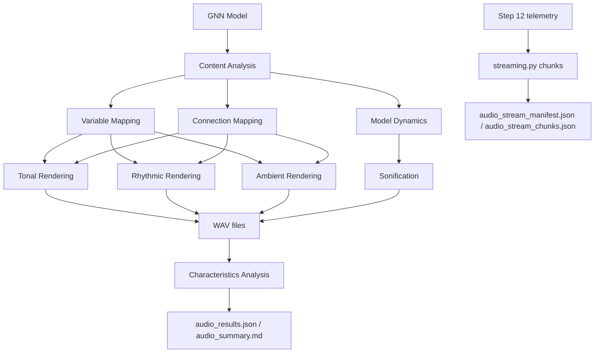

# Audio Module

This module provides audio generation capabilities for GNN models: tonal, rhythmic, and ambient renderings of a model's variables and connections, a dynamics-driven sonification, optional streaming chunk metadata derived from Step 12 execution telemetry, and the SAPF (Sound As Pure Form) code-generation sub-package.

## Module Structure

```
src/audio/
├── __init__.py                    # Module initialization and exports
├── README.md                      # This documentation
├── analyzer.py                    # Module info, generation options, SAPF-config helpers
├── classes.py                     # AudioGenerator and SAPFGNNProcessor facade classes
├── generator.py                   # Tonal / rhythmic / ambient / sonification synthesis
├── processor.py                   # process_audio entry point, WAV writing, analysis
├── streaming.py                   # Telemetry frames -> streaming chunk metadata
├── mcp.py                         # Model Context Protocol integration
├── pedalboard/                    # Documentation-only scaffold (no Python code yet)
└── sapf/                          # SAPF (Sound As Pure Form) sub-package
    ├── __init__.py               # SAPF module initialization
    ├── audio_generators.py       # SyntheticAudioGenerator and oscillator helpers
    ├── generator.py              # Directory-level SAPF generation helper
    ├── module_info.py            # get_module_info / register_tools
    ├── processor.py              # GNN -> SAPF code -> WAV wrapper
    ├── sapf_gnn_processor.py     # SAPFGNNProcessor: GNN sections -> SAPF code
    └── utils.py                  # Small shared helpers
```

## Core Components

### Pipeline Entry Point (`processor.py`)

#### `process_audio(target_dir: Path, output_dir: Path, verbose: bool = False, **kwargs) -> bool`
Processes every `*.md` GNN file in `target_dir`. For each file it calls
`generate_audio_from_gnn`, `analyze_audio_characteristics`, and `create_sonification`,
then writes `audio_results.json` and `audio_summary.md`. When execution telemetry is
available (inline `telemetry`, `telemetry_file(s)`, `execution_output_dir`, or a sibling
`12_execute_output/` directory) it also writes `audio_stream_manifest.json` and
`audio_stream_chunks.json` via `streaming.py`.

### Audio Generation Functions

#### `generate_audio_from_gnn(file_path_or_content, output_dir: Path | None = None, verbose: bool = False) -> Dict[str, Any]`
Accepts either a GNN file path or raw GNN content. Extracts variables and connections,
then writes `{stem}_tonal.wav`, `{stem}_rhythmic.wav`, and `{stem}_ambient.wav` into
`output_dir`. Returns a dictionary with `file_path`, `file_name`, `audio_files`
(type → path), `variables_count`, `connections_count`, and `generation_timestamp`.
Raises `RuntimeError` on failure and `ValueError` when `output_dir` is omitted.

#### `check_audio_backends() -> Dict[str, Any]`
Probes `librosa`, `soundfile`, `pedalboard`, and `numpy`, returning
`{name: {"available": bool, "version": str | None}}` for each. Only `numpy` is required
for generation; the others enrich file I/O and analysis when present.

### SAPF Integration (`sapf/`)

#### SAPFGNNProcessor (`sapf_gnn_processor.py`)

Converts GNN models to SAPF code.

**Key Methods:**

- `parse_gnn_sections(gnn_content: str) -> Dict[str, Any]`
  - Parses GNN content into structured sections
  - Extracts state space, connections, parameters, and time configuration

- `convert_to_sapf(gnn_sections: Dict[str, Any], model_name: str) -> str`
  - Converts GNN sections to SAPF audio code
  - Generates oscillators, routing, and processing chains

- `_generate_state_oscillators(state_space: List[Dict[str, Any]], base_freq: float) -> List[str]`
  - Generates oscillators for state variables
  - Creates frequency mappings and modulation

- `_generate_connection_routing(connections: List[Dict[str, str]]) -> List[str]`
  - Generates audio routing based on model connections
  - Creates mixer and effects chains

#### SyntheticAudioGenerator (`audio_generators.py`)

Generates synthetic audio from SAPF code.

**Key Methods:**

- `generate_from_sapf(sapf_code: str, output_file: Path, duration: float, create_visualization: bool = True) -> bool`
  - Generates audio from SAPF code
  - Creates waveform visualizations
  - Writes WAV output

- `_analyze_sapf_code(sapf_code: str) -> Dict[str, Any]`
  - Analyzes SAPF code for audio parameters
  - Extracts oscillator configurations
  - Identifies effects and routing

- `_generate_audio(params: Dict[str, Any], duration: float) -> List[int]`
  - Generates raw audio samples
  - Applies effects and processing
  - Handles multiple oscillator types

See [sapf/README.md](sapf/README.md) for the full SAPF function surface.

### Audio Processing Functions

#### `extract_variables_for_audio(content: str) -> List[Dict]`
Extracts variables from GNN content for audio generation.

#### `extract_connections_for_audio(content: str) -> List[Dict]`
Extracts connections for audio routing.

#### `generate_tonal_representation(variables: List[Dict], connections: List[Dict]) -> np.ndarray`
Generates a tonal rendering: one oscillator per variable, frequency derived from
variable type and dimensions.

#### `generate_rhythmic_representation(variables: List[Dict], connections: List[Dict]) -> np.ndarray`
Generates a rhythmic rendering driven by the connection count and structure.

#### `generate_ambient_representation(variables: List[Dict], connections: List[Dict]) -> np.ndarray`
Generates a slowly evolving ambient rendering of the model.

### Audio File Management

#### `save_audio_file(audio: np.ndarray, file_path: Path, sample_rate: int = 44100) -> None`
Cleans and clips the array, validates the sample rate, then writes with `soundfile`
when it is importable. If `soundfile` is missing or fails and the target has a `.wav`
suffix, it falls back to the stdlib WAV writer below; any other suffix re-raises.

#### `write_basic_wav(audio: np.ndarray, file_path: Path, sample_rate: int)`
Writes a 16-bit mono PCM WAV file using only the standard library.

### Sonification Functions

#### `create_sonification(file_path: Path | str, output_dir: Path, verbose: bool = False) -> Dict[str, Any]`
Reads the GNN file, extracts model dynamics, and writes `{stem}_sonification.wav`.
Returns `file_path`, `sonification_file`, `dynamics_analyzed`, `sonification_type`,
and `generation_timestamp`.

#### `extract_model_dynamics(content: str) -> List[Dict[str, Any]]`
Extracts dynamic characteristics (time configuration, state transitions) from a GNN model.

#### `generate_sonification_audio(dynamics: List[Dict[str, Any]]) -> np.ndarray`
Generates audio from the extracted dynamics.

### Audio Analysis Functions

#### `analyze_audio_characteristics(audio_result: Dict[str, Any], verbose: bool = False) -> Dict[str, Any]`
Reads each file in `audio_result["audio_files"]` (requires `soundfile`) and returns
`audio_characteristics` (duration, sample rate, channels, max/RMS amplitude) and
`spectral_analysis` (dominant frequency, spectral centroid, spectral bandwidth) per
audio type. Read failures are recorded per type under an `error` key rather than raised.

#### `generate_audio_summary(results: Dict[str, Any]) -> str`
Renders the Markdown summary written to `audio_summary.md`.

## Usage Examples

### Basic Audio Generation

```python
from pathlib import Path
from audio import generate_audio_from_gnn

# Generate tonal / rhythmic / ambient WAV files from a GNN file
results = generate_audio_from_gnn(
    Path("input/gnn_files/actinf_pomdp_agent.md"),
    output_dir=Path("output/15_audio_output/actinf_pomdp_agent"),
    verbose=True,
)
print(results["audio_files"])  # {"tonal": ..., "rhythmic": ..., "ambient": ...}
```

### SAPF Audio Generation

```python
from audio.sapf import SAPFGNNProcessor

# Convert GNN to SAPF
processor = SAPFGNNProcessor()
sapf_code = processor.convert_to_sapf(gnn_sections, "my_model")

# Generate audio from SAPF
from audio.sapf import generate_audio_from_sapf

success = generate_audio_from_sapf(sapf_code, Path("output/sapf_audio.wav"), 30.0)
```

### Audio Analysis

```python
from pathlib import Path
from audio import generate_audio_from_gnn, analyze_audio_characteristics

results = generate_audio_from_gnn(Path("models/my_model.md"), output_dir=Path("output/"))
analysis = analyze_audio_characteristics(results, verbose=True)
tonal = analysis["audio_characteristics"]["tonal"]
print(f"Audio duration: {tonal['duration']:.2f}s")
print(f"Sample rate: {tonal['sample_rate']}Hz")
```

### Sonification Creation

```python
from pathlib import Path
from audio import create_sonification

sonification = create_sonification(
    file_path=Path("models/complex_model.md"),
    output_dir=Path("output/sonification/"),
    verbose=True,
)
print(f"Sonification created: {sonification['sonification_file']}")
```

### Backend Probe

```python
from audio import check_audio_backends

backends = check_audio_backends()
for name, info in backends.items():
    print(name, info["available"], info["version"])
```

## Audio Generation Pipeline


```mermaid
graph TD
    Input[GNN Model] --> Analysis[Content Analysis]
    Analysis --> Vars[Variable Mapping]
    Analysis --> Conns[Connection Mapping]
    Analysis --> Dyn[Model Dynamics]

    Vars --> Tonal[Tonal Rendering]
    Vars --> Rhythm[Rhythmic Rendering]
    Vars --> Ambient[Ambient Rendering]
    Conns --> Tonal
    Conns --> Rhythm
    Conns --> Ambient
    Dyn --> Sonif[Sonification]

    Tonal --> WAV[WAV files]
    Rhythm --> WAV
    Ambient --> WAV
    Sonif --> WAV
    WAV --> Analyze[Characteristics Analysis]
    Analyze --> Results[audio_results.json / audio_summary.md]

    Telemetry[Step 12 telemetry] --> Stream[streaming.py chunks]
    Stream --> Manifest[audio_stream_manifest.json / audio_stream_chunks.json]
```

### 1. Content Analysis
```python
variables = extract_variables_for_audio(content)
connections = extract_connections_for_audio(content)
dynamics = extract_model_dynamics(content)
```

### 2. Audio Synthesis
```python
tonal = generate_tonal_representation(variables, connections)
rhythmic = generate_rhythmic_representation(variables, connections)
ambient = generate_ambient_representation(variables, connections)
sonification = generate_sonification_audio(dynamics)
```

### 3. File Generation
```python
save_audio_file(tonal, output_dir / f"{stem}_tonal.wav", sample_rate=44100)
```

## Integration with Pipeline

### Pipeline Step 15: Audio Processing
`15_audio.py` delegates to `audio.process_audio(target_dir, output_dir, verbose, **kwargs)`,
which loops over the GNN files, generates the WAV renderings and sonification for each,
analyzes them, and writes the JSON/Markdown results below.

### Output Structure
```
output/15_audio_output/
├── {model}_tonal.wav              # Tonal rendering
├── {model}_rhythmic.wav           # Rhythmic rendering
├── {model}_ambient.wav            # Ambient rendering
├── {model}_sonification.wav       # Dynamics-driven sonification
├── audio_results.json             # Per-file results and analysis
├── audio_summary.md               # Markdown summary
├── audio_stream_manifest.json     # Streaming manifest (when telemetry is available)
└── audio_stream_chunks.json       # Streaming chunk metadata (when telemetry is available)
```

## Audio Backends

### SAPF (Sound As Pure Form)
- **Purpose**: Code generation from GNN structure plus Python synthesis of that code
- **Where**: `audio/sapf/`
- **Use Cases**: Auditory inspection of model structure, research sonification

### Pedalboard
- **Purpose**: Planned effects processing; see [pedalboard/README.md](pedalboard/README.md)
- **Status**: Documentation-only scaffold; `check_audio_backends()` reports whether the
  `pedalboard` package is importable but no code path uses it yet

### NumPy Synthesis
- **Purpose**: The default generation path in `generator.py`
- **Features**: Oscillators, envelopes, channel mixing, deterministic output
- **Use Cases**: Every pipeline run; no optional dependencies required

## Audio Formats and Quality

### Supported Formats
- **WAV**: The only output format. Written via `soundfile` when available, otherwise by
  the stdlib writer in `write_basic_wav` (16-bit mono PCM).

### Quality Settings
All generators use a 44.1 kHz sample rate; the stdlib fallback writes 16-bit mono PCM.

## Error Handling

### Audio Generation Failures
```python
from audio import generate_audio_from_gnn

try:
    result = generate_audio_from_gnn(gnn_path, output_dir=output_dir)
except (RuntimeError, ValueError) as e:
    logger.error(f"Audio generation failed: {e}")
```

### Backend Probing
```python
from audio import check_audio_backends

backends = check_audio_backends()
if not backends["soundfile"]["available"]:
    logger.info("soundfile missing: WAV output uses the stdlib writer; analysis is skipped")
```

### File System Issues
```python
try:
    save_audio_file(audio, output_path)
except OSError as e:
    logger.error(f"Failed to save audio file: {e}")
```

## Testing and Validation

Tests live in `src/tests/audio/` (generation, edge cases, integration, MCP tools,
streaming, SAPF). Run them with:

```bash
uv run --extra dev python -m pytest src/tests/audio/ -v
```

The generated test summary under `output/` reports current counts; this document does
not track them.

## Dependencies

### Required Dependencies
- **numpy**: All synthesis and array handling

### Optional Dependencies (`audio` extra in `pyproject.toml`)
- **soundfile**: WAV I/O and the input side of `analyze_audio_characteristics`
- **librosa**: Reported by `check_audio_backends()`; not used by the generation path
- **pedalboard**: Reported by `check_audio_backends()`; planned effects processing

## Troubleshooting

### Common Issues

#### 1. Missing `soundfile`
WAV files are still written by the stdlib writer, but `analyze_audio_characteristics`
records an `error` entry for each audio type because it needs `soundfile` to read them.

#### 2. Memory Issues
Very large models produce long arrays; reduce the number of files processed per run.

#### 3. File System Issues
```
Error: Permission denied writing audio file
Solution: Check file permissions or use an alternative output directory
```

### Verbose Mode
```python
results = generate_audio_from_gnn(gnn_path, output_dir=output_dir, verbose=True)
```

## Future Enhancements

### Planned Features
- **Pedalboard Effects**: Effects chains over the generated WAV files (see `pedalboard/`)
- **Interactive Sonification**: User-controlled audio parameters
- **Spatial Audio**: 3D audio positioning and movement

## Summary

The Audio module renders GNN models as tonal, rhythmic, ambient, and sonification WAV
files, analyzes the results, and optionally emits streaming chunk metadata from Step 12
telemetry. The SAPF sub-package converts GNN structure to SAPF code and synthesizes it.

## License and Citation

This module is part of the GeneralizedNotationNotation project. See the main repository for license and citation information. 

## References

- Project overview: ../../README.md
- Comprehensive docs: ../../DOCS.md
- Architecture guide: ../../ARCHITECTURE.md
- Pipeline details: ../../doc/pipeline/README.md

---
## Documentation
- **[README](README.md)**: Module Overview
- **[AGENTS](AGENTS.md)**: Agentic Workflows
- **[SPEC](SPEC.md)**: Architectural Specification
- **[SKILL](SKILL.md)**: Capability API
