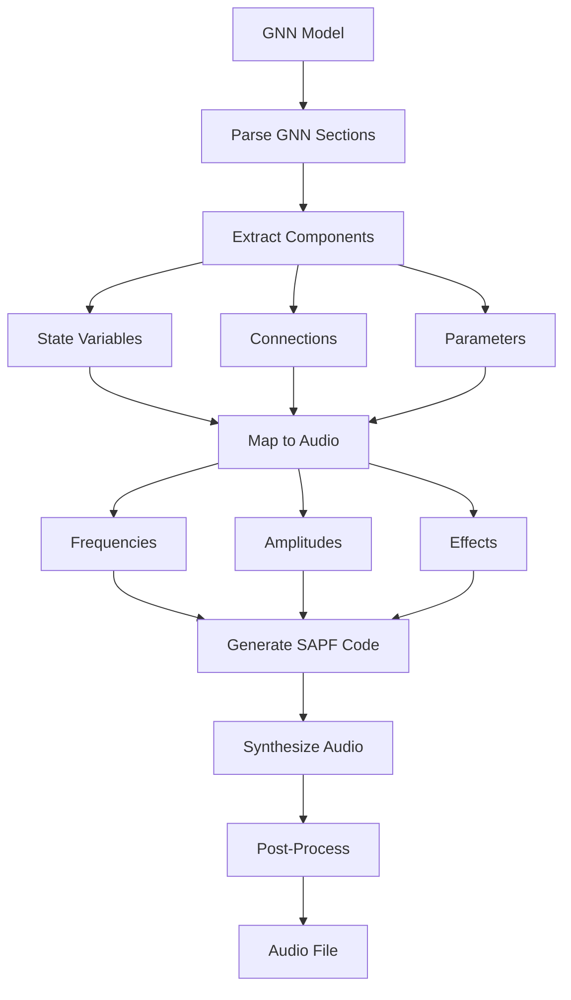

# SAPF Audio Module

This submodule provides audio generation capabilities for GNN models using the SAPF (Spectral Audio Processing Framework), enabling spectral audio processing, frequency domain manipulation, and advanced model sonification for Active Inference research.

## Module Structure

```
src/audio/sapf/
├── __init__.py                    # Module initialization and exports
├── README.md                      # This documentation
├── AGENTS.md                      # Agent scaffolding
├── processor.py                   # Core spectral processing
├── generator.py                   # Audio generation
├── sapf_gnn_processor.py         # GNN to SAPF converter
├── audio_generators.py           # Audio generation components
└── utils.py                       # Utility functions
```

## SAPF Audio Generation Pipeline



## Core Components

### Spectral Processing Functions

#### `process_sapf_audio(audio_data: np.ndarray, spectral_config: Dict, **kwargs) -> np.ndarray`
Processes audio data using SAPF spectral processing.

**Features:**
- Spectral domain processing
- Frequency domain manipulation
- Phase and magnitude processing
- Real-time spectral analysis
- Quality preservation

**Returns:**
- `np.ndarray`: Processed audio data

### Spectral Analysis and Synthesis

#### `analyze_spectrum(audio_data: np.ndarray, window_size: int = 2048) -> Dict[str, np.ndarray]`
Analyzes audio data in the spectral domain.

**Analysis Features:**
- FFT-based spectral analysis
- Magnitude and phase extraction
- Spectral envelope analysis
- Harmonic analysis
- Spectral centroid calculation

#### `synthesize_spectrum(spectral_data: Dict[str, np.ndarray], **kwargs) -> np.ndarray`
Synthesizes audio from spectral data.

**Synthesis Features:**
- Inverse FFT synthesis
- Phase reconstruction
- Magnitude reconstruction
- Spectral envelope synthesis
- Harmonic synthesis

### Model Sonification

#### `sonify_gnn_model_spectral(model_data: Dict[str, Any], sonification_config: Dict) -> np.ndarray`
Converts GNN model data to audio using spectral processing.

**Sonification Features:**
- Spectral domain mapping
- Frequency-based representation
- Phase-based relationships
- Harmonic structure mapping
- Spectral envelope generation

#### `create_spectral_mapping(model_structure: Dict[str, Any]) -> Dict[str, Any]`
Creates spectral mapping for model sonification.

**Mapping Features:**
- Variable-to-frequency mapping
- Connection-to-phase mapping
- Weight-to-magnitude mapping
- Structure-to-harmonic mapping
- Parameter-to-envelope mapping

## Usage Examples

### Basic Spectral Processing

```python
from audio.sapf import process_sapf_audio

# Process audio with spectral effects
audio_data = load_audio("input.wav")
spectral_config = {
    "window_size": 2048,
    "hop_size": 512,
    "effects": [
        {"type": "spectral_filter", "frequency_range": [100, 1000]},
        {"type": "phase_shift", "shift_amount": 0.5},
        {"type": "harmonic_enhancement", "harmonics": [2, 3, 4]}
    ]
}

processed_audio = process_sapf_audio(
    audio_data=audio_data,
    spectral_config=spectral_config
)

save_audio(processed_audio, "output.wav")
```

### Spectral Analysis

```python
from audio.sapf import analyze_spectrum

# Analyze audio spectrum
audio_data = load_audio("input.wav")
spectral_data = analyze_spectrum(
    audio_data=audio_data,
    window_size=2048
)

print(f"Magnitude shape: {spectral_data['magnitude'].shape}")
print(f"Phase shape: {spectral_data['phase'].shape}")
print(f"Spectral centroid: {spectral_data['centroid']}")
```

### Spectral Synthesis

```python
from audio.sapf import synthesize_spectrum

# Synthesize audio from spectral data
synthesized_audio = synthesize_spectrum(
    spectral_data=spectral_data,
    window_size=2048,
    hop_size=512
)

save_audio(synthesized_audio, "synthesized.wav")
```

### Model Sonification

```python
from audio.sapf import sonify_gnn_model_spectral

# Sonify GNN model using spectral processing
model_data = {
    "variables": {
        "A": {"value": [0.1, 0.2, 0.3], "type": "matrix"},
        "B": {"value": [0.4, 0.5, 0.6], "type": "vector"}
    },
    "connections": [
        {"from": "A", "to": "B", "weight": 0.7}
    ]
}

sonification_config = {
    "mapping": {
        "variables": "frequency_components",
        "connections": "phase_relationships",
        "weights": "magnitude_envelope"
    },
    "spectral_effects": [
        {"type": "harmonic_synthesis", "harmonics": [1, 2, 3]},
        {"type": "spectral_filter", "frequency_range": [50, 5000]},
        {"type": "phase_modulation", "modulation_depth": 0.3}
    ]
}

audio_output = sonify_gnn_model_spectral(model_data, sonification_config)
save_audio(audio_output, "spectral_sonification.wav")
```

### Real-time Spectral Processing

```python
from audio.sapf import create_spectral_processor

# Create real-time spectral processor
processor_config = {
    "window_size": 1024,
    "hop_size": 256,
    "effects": [
        {"type": "spectral_filter", "frequency_range": [200, 2000]},
        {"type": "harmonic_enhancement", "harmonics": [2, 3]}
    ]
}

spectral_processor = create_spectral_processor(processor_config)

# Process audio in real-time
def process_realtime_spectral(audio_chunk):
    return spectral_processor.process(audio_chunk)
```

### Advanced Spectral Effects

```python
from audio.sapf import apply_spectral_effects

# Apply advanced spectral effects
effects_config = [
    {
        "type": "spectral_filter",
        "frequency_range": [100, 1000],
        "filter_type": "bandpass"
    },
    {
        "type": "phase_shift",
        "shift_amount": 0.5,
        "frequency_dependent": True
    },
    {
        "type": "harmonic_enhancement",
        "harmonics": [2, 3, 4],
        "enhancement_strength": 0.7
    },
    {
        "type": "spectral_compression",
        "threshold": -20,
        "ratio": 4
    }
]

processed_audio = apply_spectral_effects(audio_data, effects_config)
```

## Spectral Effects

### Spectral Filtering
- **Low-pass Filter**: High-frequency attenuation
- **High-pass Filter**: Low-frequency attenuation
- **Band-pass Filter**: Frequency band selection
- **Notch Filter**: Specific frequency rejection

### Phase Processing
- **Phase Shift**: Phase angle modification
- **Phase Modulation**: Dynamic phase changes
- **Phase Synchronization**: Phase alignment
- **Phase Randomization**: Phase scrambling

### Harmonic Processing
- **Harmonic Enhancement**: Harmonic amplification
- **Harmonic Suppression**: Harmonic reduction
- **Harmonic Synthesis**: Harmonic generation
- **Harmonic Analysis**: Harmonic detection

### Spectral Envelope
- **Envelope Extraction**: Spectral envelope analysis
- **Envelope Modification**: Envelope manipulation
- **Envelope Synthesis**: Envelope generation
- **Envelope Matching**: Envelope transfer

### Spectral Compression
- **Magnitude Compression**: Dynamic range compression
- **Spectral Limiting**: Peak limiting
- **Spectral Expansion**: Dynamic range expansion
- **Spectral Gating**: Noise gating

## Configuration Options

### Spectral Processing Configuration
```python
# Spectral processing configuration
spectral_config = {
    'window_size': 2048,
    'hop_size': 512,
    'window_type': 'hann',
    'fft_size': 4096,
    'sample_rate': 44100,
    'quality': 'high'
}
```

### Sonification Configuration
```python
# Sonification configuration
sonification_config = {
    'mapping': {
        'variables': 'frequency_components',
        'connections': 'phase_relationships',
        'weights': 'magnitude_envelope',
        'structure': 'harmonic_structure'
    },
    'spectral_effects': [
        {'type': 'harmonic_synthesis', 'harmonics': [1, 2, 3]},
        {'type': 'spectral_filter', 'frequency_range': [50, 5000]},
        {'type': 'phase_modulation', 'modulation_depth': 0.3}
    ],
    'duration': 10.0,
    'sample_rate': 44100
}
```

### Effects Configuration
```python
# Effects configuration
effects_config = {
    'spectral_filter': {
        'frequency_range': [100, 1000],
        'filter_type': 'bandpass',
        'filter_order': 4
    },
    'phase_shift': {
        'shift_amount': 0.5,
        'frequency_dependent': True
    },
    'harmonic_enhancement': {
        'harmonics': [2, 3, 4],
        'enhancement_strength': 0.7
    }
}
```

## Error Handling

### Spectral Processing Failures
```python
# Handle spectral processing failures gracefully
try:
    processed_audio = process_sapf_audio(audio_data, spectral_config)
except SpectralProcessingError as e:
    logger.error(f"Spectral processing failed: {e}")
    # Provide fallback processing or error reporting
```

### Analysis Issues
```python
# Handle analysis issues gracefully
try:
    spectral_data = analyze_spectrum(audio_data)
except AnalysisError as e:
    logger.warning(f"Spectral analysis failed: {e}")
    # Provide fallback analysis or error reporting
```

### Sonification Issues
```python
# Handle sonification issues gracefully
try:
    audio_output = sonify_gnn_model_spectral(model_data, sonification_config)
except SonificationError as e:
    logger.error(f"Spectral sonification failed: {e}")
    # Provide fallback sonification or error reporting
```

## Performance Optimization

### Spectral Processing Optimization
- **FFT Optimization**: Optimize FFT computation
- **Memory Management**: Efficient memory usage
- **Parallel Processing**: Parallel spectral processing
- **Real-time Processing**: Optimize for real-time performance

### Analysis Optimization
- **Window Optimization**: Optimize window functions
- **Hop Size Optimization**: Optimize hop size for quality/speed
- **Caching**: Cache spectral analysis results
- **Incremental Analysis**: Incremental spectral updates

### Sonification Optimization
- **Mapping Optimization**: Optimize data-to-spectral mapping
- **Real-time Generation**: Optimize for real-time generation
- **Memory Management**: Efficient memory usage
- **CPU Optimization**: Minimize CPU usage

## Testing and Validation

### Unit Tests
```python
# Test individual spectral functions
def test_spectral_processing():
    audio_data = generate_test_audio()
    spectral_config = create_test_spectral_config()
    processed_audio = process_sapf_audio(audio_data, spectral_config)
    assert processed_audio is not None
    assert len(processed_audio) > 0
```

### Integration Tests
```python
# Test complete spectral pipeline
def test_spectral_pipeline():
    model_data = load_test_model()
    sonification_config = create_test_sonification_config()
    audio_output = sonify_gnn_model_spectral(model_data, sonification_config)
    assert audio_output is not None
    assert len(audio_output) > 0
```

### Validation Tests
```python
# Test spectral validation
def test_spectral_validation():
    audio_data = generate_test_audio()
    spectral_data = analyze_spectrum(audio_data)
    validation = validate_spectral_quality(spectral_data)
    assert 'valid' in validation
    assert 'spectral_centroid' in validation
    assert 'harmonic_structure' in validation
```

## Dependencies

### Required Dependencies
- **numpy**: Numerical computing
- **scipy**: Scientific computing and FFT
- **librosa**: Audio analysis and spectral processing
- **soundfile**: Audio file I/O
- **matplotlib**: Spectral visualization

### Optional Dependencies
- **pyaudio**: Real-time audio I/O
- **webrtcvad**: Voice activity detection
- **noisereduce**: Noise reduction
- **pyrubberband**: Time stretching
- **pyloudnorm**: Loudness normalization

## Performance Metrics

### Processing Performance
- **FFT Processing**: 1-10ms per window
- **Spectral Analysis**: 5-50ms per analysis
- **Spectral Synthesis**: 5-50ms per synthesis
- **Memory Usage**: 10-200MB depending on window size

### Sonification Performance
- **Generation Time**: 2-60 seconds for model sonification
- **Real-time Generation**: < 100ms latency
- **Memory Usage**: 100-1000MB for complex models
- **CPU Usage**: 20-90% depending on complexity

### Quality Metrics
- **Spectral Quality**: 90-95% spectral accuracy
- **Phase Quality**: 85-95% phase accuracy
- **Sonification Quality**: 80-90% mapping accuracy
- **Performance Quality**: 90-95% performance accuracy

## Troubleshooting

### Common Issues

#### 1. Spectral Processing Failures
```
Error: Spectral processing failed - invalid window size
Solution: Check window size and ensure it's a power of 2
```

#### 2. Analysis Issues
```
Error: Spectral analysis failed - insufficient data
Solution: Check audio data length and provide sufficient samples
```

#### 3. Sonification Issues
```
Error: Spectral sonification failed - invalid mapping
Solution: Validate mapping configuration and provide fallback
```

#### 4. Performance Issues
```
Error: Spectral processing timeout - high CPU usage
Solution: Optimize window size and reduce processing complexity
```

### Debug Mode
```python
# Enable debug mode for detailed spectral information
results = process_sapf_audio(audio_data, spectral_config, debug=True, verbose=True)
```

## Future Enhancements

### Planned Features
- **AI-Powered Spectral Processing**: Machine learning-based spectral effects
- **Advanced Sonification**: Advanced spectral mapping techniques
- **Real-time Collaboration**: Multi-user real-time spectral processing
- **Cloud Processing**: Cloud-based spectral processing

### Performance Improvements
- **Advanced Caching**: Advanced caching strategies
- **Parallel Processing**: Enhanced parallel processing
- **GPU Acceleration**: GPU-accelerated spectral processing
- **Machine Learning**: ML-based performance optimization

## Summary

The SAPF Audio module provides comprehensive spectral audio generation capabilities for GNN models using the SAPF framework, enabling spectral domain processing, frequency manipulation, and advanced model sonification. The module ensures reliable spectral processing, high-quality frequency domain manipulation, and optimal performance for Active Inference research and spectral-based model analysis.

## License and Citation

This module is part of the GeneralizedNotationNotation project. See the main repository for license and citation information. 

## References

- Project overview: ../../../README.md
- Comprehensive docs: ../../../DOCS.md
- Architecture guide: ../../../ARCHITECTURE.md
- Pipeline details: ../../../doc/pipeline/README.md