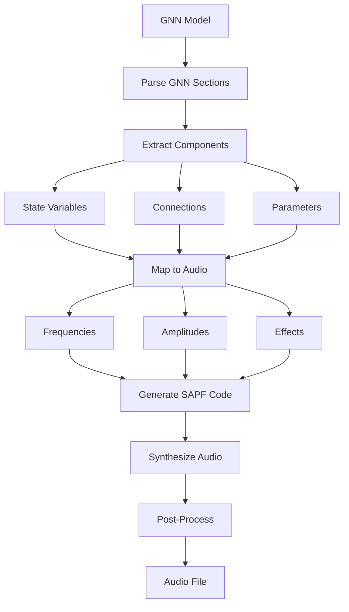

# SAPF Audio Module

This submodule provides audio generation capabilities for GNN models using the SAPF (Spectral Audio Processing Framework), enabling spectral audio processing, frequency domain manipulation, and advanced model sonification for Active Inference research.

## Module Structure

```
src/audio/sapf/
├── __init__.py                    # Module initialization and exports
├── README.md                      # This documentation
├── AGENTS.md                      # Agent scaffolding
├── processor.py                   # Core spectral processing
├── generator.py                   # Audio generation
├── sapf_gnn_processor.py         # GNN to SAPF converter
├── audio_generators.py           # Audio generation components
└── utils.py                       # Utility functions
```

## SAPF Audio Generation Pipeline


```mermaid
graph TD
    GNN[GNN Model] --> Parse[Parse GNN Sections]
    Parse --> Extract[Extract Components]
    
    Extract --> States[State Variables]
    Extract --> Conns[Connections]
    Extract --> Params[Parameters]
    
    States --> Map[Map to Audio]
    Conns --> Map
    Params --> Map
    
    Map --> Frequencies[Frequencies]
    Map --> Amplitudes[Amplitudes]
    Map --> Effects[Effects]
    
    Frequencies --> Generate[Generate SAPF Code]
    Amplitudes --> Generate
    Effects --> Generate
    
    Generate --> Synthesize[Synthesize Audio]
    Synthesize --> Process[Post-Process]
    Process --> Output[Audio File]
```

## Core Components

### GNN-to-Audio Conversion

#### `process_gnn_to_audio(gnn_content: str, output_dir: str | Path, **kwargs) -> Dict[str, Any]`
Parses GNN content and produces `{model}_sapf_audio.wav` in `output_dir`.

### SAPF Code Generation

#### `convert_gnn_to_sapf(gnn_content: str, output_dir: str | Path, **kwargs) -> Dict[str, Any]`
Converts GNN sections (state space, connections, parameters) into SAPF code.

#### `generate_audio_from_sapf(sapf_code: str, output_dir: str | Path, **kwargs) -> Dict[str, Any]`
Generates audio from SAPF code via `SyntheticAudioGenerator`.

#### `validate_sapf_code(sapf_code: str) -> Dict[str, Any]`
Validates SAPF code structure.

### Audio Generation

#### `generate_sapf_audio(sapf_code: str, output_dir: str | Path, **kwargs) -> Path`
Renders SAPF code to a WAV file.

#### `create_sapf_visualization(...) -> Dict[str, Any]` / `generate_sapf_report(...) -> Dict[str, Any]`
Write visualization data and processing reports as JSON.

### Audio Generators (`audio_generators.py`)

- `SyntheticAudioGenerator` — oscillator/LFO synthesis from SAPF code analysis
- `generate_oscillator_audio`, `apply_envelope`, `mix_audio_channels`

## Usage Examples

### GNN to SAPF Audio

```python
from audio.sapf import process_gnn_to_audio

result = process_gnn_to_audio(gnn_content, output_dir="output/audio_sapf")
```

### GNN to SAPF Code

```python
from audio.sapf import convert_gnn_to_sapf, validate_sapf_code

conversion = convert_gnn_to_sapf(gnn_content, output_dir="output/audio_sapf")
validation = validate_sapf_code(conversion["sapf_code"])
```

### Audio from SAPF Code

```python
from audio.sapf import generate_audio_from_sapf

audio = generate_audio_from_sapf(sapf_code, output_dir="output/audio_sapf")
```

### Model Sonification

```python
from audio.sapf import process_gnn_to_audio

# Sonification goes through the same GNN-to-SAPF pipeline
result = process_gnn_to_audio(gnn_content, output_dir="output/audio_sapf")
```

## Error Handling

```python
# Conversion/generation failures raise ordinary exceptions
try:
    result = process_gnn_to_audio(gnn_content, output_dir="output/audio_sapf")
except Exception as e:
    logger.error(f"SAPF audio generation failed: {e}")
```

## Dependencies

### Required Dependencies
- **numpy**: Numerical computing
- **soundfile**: Audio file I/O

### Optional Dependencies
- **matplotlib**: Audio visualization
- **pedalboard**: Audio effects (separate `audio/pedalboard/` scaffold)

## Performance Metrics

See the parent module docs (`src/audio/`) for measured generation timings;
exact figures depend on model size and synthesis length.

## Troubleshooting

### Common Issues

#### 1. Spectral Processing Failures
```
Error: Spectral processing failed - invalid window size
Solution: Check window size and ensure it's a power of 2
```

#### 2. Analysis Issues
```
Error: Spectral analysis failed - insufficient data
Solution: Check audio data length and provide sufficient samples
```

#### 3. Sonification Issues
```
Error: Spectral sonification failed - invalid mapping
Solution: Validate mapping configuration and provide recovery
```

#### 4. Performance Issues
```
Error: Spectral processing timeout - high CPU usage
Solution: Optimize window size and reduce processing complexity
```

### Debug Mode
```python
# Enable verbose logging during GNN-to-audio conversion
results = process_gnn_to_audio(gnn_content, output_dir="output/audio_sapf", verbose=True)
```

## Future Enhancements

### Planned Features
- **AI-Powered Spectral Processing**: Machine learning-based spectral effects
- **Advanced Sonification**: Advanced spectral mapping techniques
- **Real-time Collaboration**: Multi-user real-time spectral processing
- **Cloud Processing**: Cloud-based spectral processing

### Performance Improvements
- **Advanced Caching**: Advanced caching strategies
- **Parallel Processing**: Enhanced parallel processing
- **GPU Acceleration**: GPU-accelerated spectral processing
- **Machine Learning**: ML-based performance optimization

## Summary

The SAPF Audio module provides comprehensive spectral audio generation capabilities for GNN models using the SAPF framework, enabling spectral domain processing, frequency manipulation, and advanced model sonification. The module ensures reliable spectral processing, high-quality frequency domain manipulation, and optimal performance for Active Inference research and spectral-based model analysis.

## License and Citation

This module is part of the GeneralizedNotationNotation project. See the main repository for license and citation information. 

## References

- Project overview: ../../../README.md
- Comprehensive docs: ../../../DOCS.md
- Architecture guide: ../../../ARCHITECTURE.md
- Pipeline details: ../../../doc/pipeline/README.md