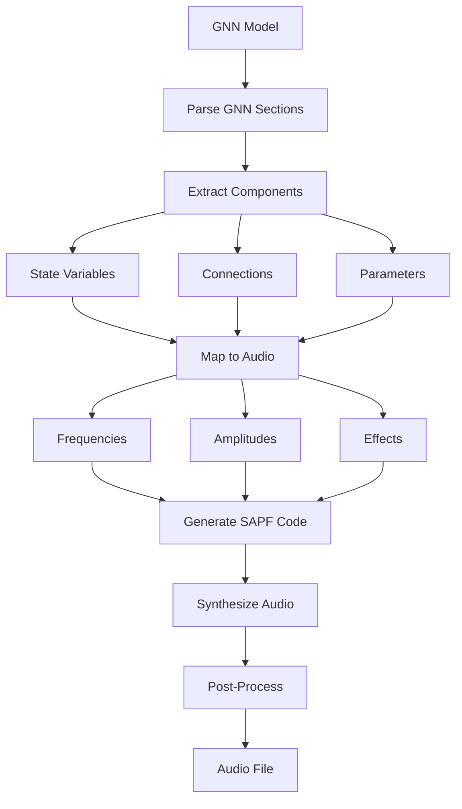

# SAPF Audio Module

This submodule provides audio generation capabilities for GNN models using SAPF (Sound As Pure Form): GNN structure is converted to SAPF code, which is then synthesized to WAV audio in Python for auditory inspection of Active Inference models.

## Module Structure

```
src/audio/sapf/
├── __init__.py                    # Module initialization and exports
├── README.md                      # This documentation
├── AGENTS.md                      # Agent scaffolding
├── processor.py                   # GNN -> SAPF code -> WAV wrapper (process_gnn_to_audio)
├── generator.py                   # Directory-level generate_sapf_audio helper
├── module_info.py                 # get_module_info / get_audio_generation_options / register_tools
├── sapf_gnn_processor.py         # SAPFGNNProcessor: GNN sections -> SAPF code
├── audio_generators.py           # SyntheticAudioGenerator and oscillator helpers
└── utils.py                       # Small shared helpers
```

## SAPF Audio Generation Pipeline


```mermaid
graph TD
    GNN[GNN Model] --> Parse[Parse GNN Sections]
    Parse --> Extract[Extract Components]
    
    Extract --> States[State Variables]
    Extract --> Conns[Connections]
    Extract --> Params[Parameters]
    
    States --> Map[Map to Audio]
    Conns --> Map
    Params --> Map
    
    Map --> Frequencies[Frequencies]
    Map --> Amplitudes[Amplitudes]
    Map --> Effects[Effects]
    
    Frequencies --> Generate[Generate SAPF Code]
    Amplitudes --> Generate
    Effects --> Generate
    
    Generate --> Synthesize[Synthesize Audio]
    Synthesize --> Process[Post-Process]
    Process --> Output[Audio File]
```

## Core Components

### GNN-to-Audio Conversion

#### `process_gnn_to_audio(gnn_content: str, model_name: str, output_dir: str, duration: float = 10.0, validate_only: bool = False) -> Dict[str, Any]`
Converts GNN content to SAPF code and synthesizes `{model_name}_sapf_audio.wav` in `output_dir`.
`model_name` is required. Returns `success`, `audio_file`, `model_name`, `sapf_code`, `duration`;
with `validate_only=True` it returns `validation_result` instead of writing audio. Failures
come back as `{"success": False, "error": ...}`.

### SAPF Code Generation

#### `convert_gnn_to_sapf(gnn_content: str, model_name: str) -> str`
Converts GNN sections (state space, connections, parameters, time) into SAPF code and returns it as a string.

#### `generate_audio_from_sapf(sapf_code: str, output_file: Path, duration: float = 10.0) -> bool`
Generates a WAV file from SAPF code via `SyntheticAudioGenerator`; returns `True` on success.

#### `validate_sapf_code(sapf_code: str) -> Tuple[bool, List[str]]`
Checks for empty code, unbalanced brackets, a `play` command, and variable assignments; returns `(is_valid, issues)`.

### Audio Generation

#### `generate_sapf_audio(sapf_code: str, output_path: str, **kwargs) -> Dict[str, Any]`
Dict-returning wrapper over `generate_audio_from_sapf` (`duration` via kwargs); returns `{"success": bool, "output_path": str}`.

#### `create_sapf_visualization(sapf_code, output_path=None) -> Dict[str, Any]` / `generate_sapf_report(sapf_results, output_path=None) -> Dict[str, Any]`
Return parsed component data / a results summary and write them as JSON when `output_path` is given.

Each WAV is accompanied by `{model}_sapf_audio_waveform_analysis.png` (waveform, spectrum, spectrogram panels) unless `create_visualization=False` is passed to `SyntheticAudioGenerator.generate_from_sapf`.

### Audio Generators (`audio_generators.py`)

- `SyntheticAudioGenerator` — oscillator/LFO synthesis from SAPF code analysis
- `generate_oscillator_audio`, `apply_envelope`, `mix_audio_channels`

## Usage Examples

### GNN to SAPF Audio

```python
from audio.sapf import process_gnn_to_audio

result = process_gnn_to_audio(gnn_content, "my_model", "output/15_audio_output", duration=10.0)
```

### GNN to SAPF Code

```python
from audio.sapf import convert_gnn_to_sapf, validate_sapf_code

sapf_code = convert_gnn_to_sapf(gnn_content, "my_model")
is_valid, issues = validate_sapf_code(sapf_code)
```

### Audio from SAPF Code

```python
from audio.sapf import generate_audio_from_sapf

ok = generate_audio_from_sapf(sapf_code, Path("output/15_audio_output/my_model_sapf_audio.wav"), duration=10.0)
```

### Model Sonification

```python
from audio.sapf import process_gnn_to_audio

# Sonification goes through the same GNN-to-SAPF pipeline
result = process_gnn_to_audio(gnn_content, "my_model", "output/15_audio_output")
```

## Error Handling

```python
# process_gnn_to_audio reports failures in its result dict rather than raising
result = process_gnn_to_audio(gnn_content, "my_model", "output/15_audio_output")
if not result["success"]:
    logger.error(f"SAPF audio generation failed: {result.get('error')}")
```

## Dependencies

### Required Dependencies
- **numpy**: Numerical computing
- **matplotlib**: Imported unconditionally by `audio_generators.py` for the analysis PNG

WAV files are written with the standard-library `wave` module; `soundfile` is not used here.

## Performance Metrics

See the parent module docs (`src/audio/`) for measured generation timings;
exact figures depend on model size and synthesis length.

## Troubleshooting

### Common Issues

#### 1. `TypeError` from `process_gnn_to_audio`
`model_name` is a required positional argument: `process_gnn_to_audio(gnn_content, model_name, output_dir)`.

#### 2. Validation reports "No 'play' command found"
The SAPF code was truncated or hand-edited; regenerate it with `convert_gnn_to_sapf`.

#### 3. Silent or very short audio
Few or no state variables were parsed; check the GNN file's `StateSpaceBlock` and `Connections` sections.

### Validate Without Writing Audio
```python
result = process_gnn_to_audio(gnn_content, "my_model", "output/15_audio_output", validate_only=True)
print(result["validation_result"])
```

## Future Enhancements

### Planned Features
- **Pedalboard Effects**: Post-process the generated WAV files (see `audio/pedalboard/`)
- **Richer SAPF Constructs**: Additional oscillator and routing forms from GNN matrices

## Summary

The SAPF Audio module converts GNN model structure to SAPF (Sound As Pure Form) code and synthesizes that code to WAV audio with an accompanying waveform/spectrum analysis image, giving Active Inference researchers an auditory view of model structure.

## License and Citation

This module is part of the GeneralizedNotationNotation project. See the main repository for license and citation information. 

## References

- Project overview: ../../../README.md
- Comprehensive docs: ../../../DOCS.md
- Architecture guide: ../../../ARCHITECTURE.md
- Pipeline details: ../../../doc/pipeline/README.md