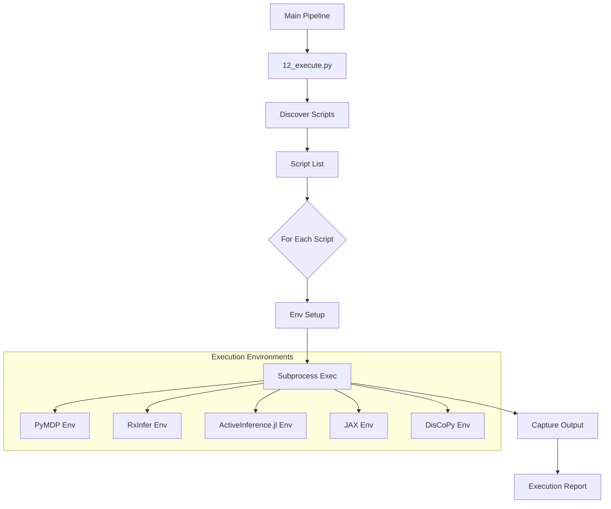
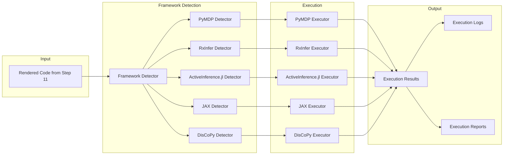
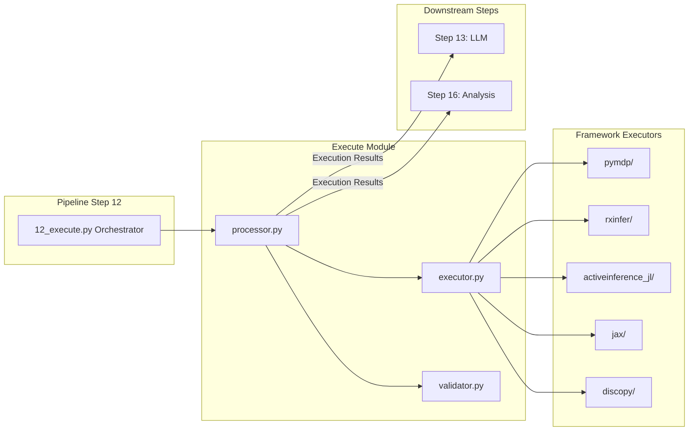
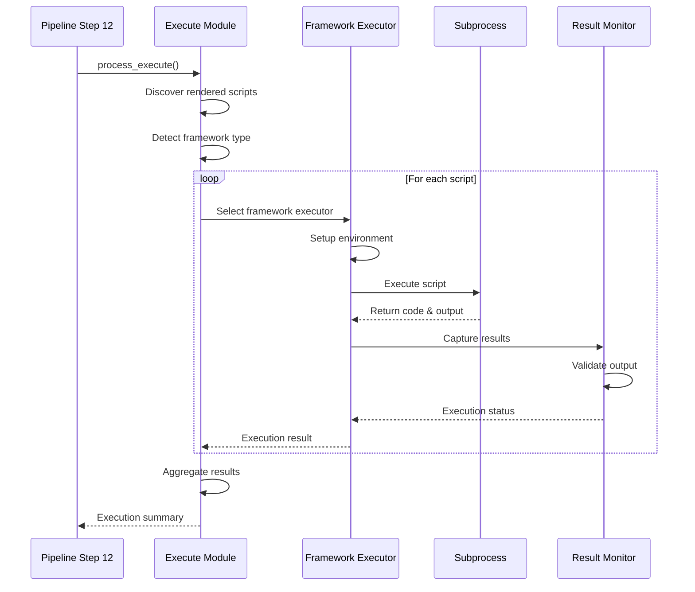

# Execute Module

This module is responsible for running or executing GNN models that have been rendered into specific simulator formats by other parts of the GNN pipeline (e.g., by `11_render.py`).

The execute module is now organized into subfolders for each execution environment:
- `pymdp/` - PyMDP script execution
- `rxinfer/` - RxInfer.jl script execution
- `discopy/` - DisCoPy diagram validation and analysis
- `activeinference_jl/` - ActiveInference.jl script execution and comprehensive analysis

- `activeinference_jl/` - ActiveInference.jl script execution and comprehensive analysis

### Execution Workflow



### Multi-Framework Execution Architecture



### Module Integration Flow


    RxInferExec --> Results
    ActInfExec --> Results
    JAXExec --> Results
    DisCoPyExec --> Results
    
    Results --> Logs
    Results --> Reports
```

### Execution Sequence Flow



## Core Components

### `pymdp_runner.py`

This script is the primary runner for PyMDP-based simulations. Its main responsibilities include:

-   **Discovering Scripts**: It searches for Python scripts (typically `*_pymdp.py`) within `output/11_render_output/`.
-   **Environment Setup**: It attempts to use the Python interpreter from the project's virtual environment (`src/.venv/bin/python`) to ensure that the necessary dependencies (like `inferactively-pymdp`) are available.
-   **Execution**: It executes each discovered PyMDP script as a separate subprocess.
-   **Output Handling**: It captures `stdout` and `stderr` from the executed scripts and logs success or failure for each.
-   **Reporting**: It provides a summary of which scripts were run and their execution status.

### `12_execute.py` (Pipeline Step)

This script integrates the execution capabilities (currently `pymdp_runner.py`) into the main GNN processing pipeline (`main.py`) as "Step 12".
-   It receives pipeline arguments (like output directory, verbosity) from `main.py`.
-   It invokes `pymdp_runner.run_pymdp_scripts` to carry out the execution of rendered PyMDP simulations.
-   It reports the overall success or failure of this execution step back to the main pipeline.

## Usage

The `12_execute.py` script is typically invoked automatically by `main.py` if it's present in the `src/` directory and not skipped.

The `pymdp_runner.py` can also be run standalone for testing purposes, provided that the PyMDP scripts have already been generated in the expected output location (e.g., after running up to Step 11 of the pipeline).

## Future Extensions

-   Support for executing other types of rendered simulators (e.g., RxInfer.jl scripts).
-   More sophisticated control over execution parameters passed to individual simulations. 