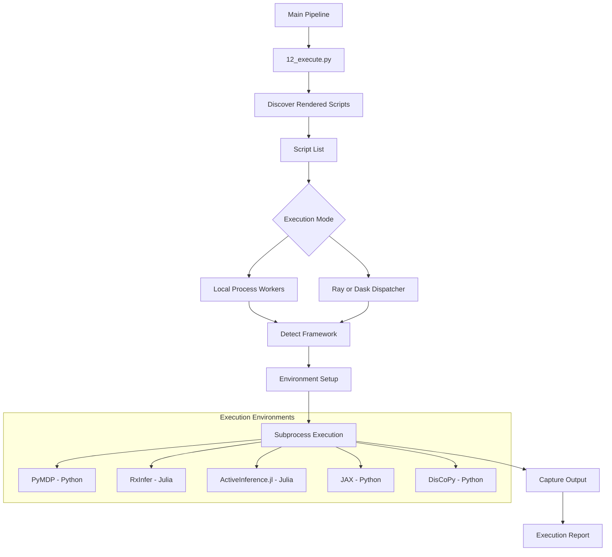

# Execute Module

This module is responsible for running GNN models that have been rendered into framework-specific simulation code by Step 11 (`11_render.py`).

## Supported Frameworks

| Framework | Language | Subfolder | Script Pattern | Status |
|-----------|----------|-----------|----------------|--------|
| **PyMDP** | Python | `pymdp/` | `*_pymdp.py` | ✅ Full support |
| **RxInfer.jl** | Julia | `rxinfer/` | `*_rxinfer.jl` | ✅ Full support |
| **ActiveInference.jl** | Julia | `activeinference_jl/` | `*_activeinference.jl` | ✅ Full support |
| **JAX** | Python | `jax/` | `*_jax.py` | ✅ Full support |
| **DisCoPy** | Python | `discopy/` | `*_discopy.py` | ✅ Full support |
| **PyTorch** | Python | `pytorch/` | `*_pytorch.py` | ✅ Full support |
| **NumPyro** | Python | `numpyro/` | `*_numpyro.py` | ✅ Full support |

JAX, NumPyro, PyTorch, and DisCoPy are **core** dependencies (`uv sync`). If the environment is incomplete, their scripts report an explicit skipped status. Requested Julia frameworks require Julia plus their package set; in strict requested-framework runs, missing packages make Step 12 fail.

## Module Structure

```
src/execute/
├── __init__.py              # Module initialization
├── executor.py              # GNNExecutor class (framework dispatch)
├── processor.py             # Main processor (Step 12 entry point)
├── validator.py             # Output validation
├── data_extractors.py       # Result data extraction
├── julia_setup.py           # Julia environment setup
├── pymdp/                   # PyMDP execution
│   └── simulation.py        # PyMDP simulation runner
├── rxinfer/                 # RxInfer.jl execution
├── activeinference_jl/      # ActiveInference.jl execution
├── jax/                     # JAX execution
├── discopy/                 # DisCoPy execution
│   └── discopy_translator_module/
└── mcp.py                   # MCP tool integration
```

## Execution Workflow


```mermaid
graph TD
    Pipeline[Main Pipeline] --> Step12[12_execute.py]
    Step12 --> Discovery[Discover Rendered Scripts]
    Discovery --> List[Script List]
    
    List --> Dispatch{Execution Mode}
    Dispatch --> Local[Local Process Workers]
    Dispatch --> Distributed[Ray or Dask Dispatcher]
    Local --> Detect[Detect Framework]
    Distributed --> Detect
    Detect --> Setup[Environment Setup]
    Setup --> Run[Subprocess Execution]
    Run --> Capture[Capture Output]
    Capture --> Report[Execution Report]
    
    subgraph "Execution Environments"
    Run --> PyMDP[PyMDP - Python]
    Run --> RxInfer[RxInfer - Julia]
    Run --> ActInf[ActiveInference.jl - Julia]
    Run --> JAX[JAX - Python]
    Run --> DisCoPy[DisCoPy - Python]
    end
```

## Core Components

### `executor.py` — `GNNExecutor`

Main executor class providing framework dispatch:

- `execute_gnn_model(model_path, execution_type, options)` — Execute a rendered script
- `run_simulation(simulation_config)` — Run a simulation from config
- `generate_execution_report(output_file)` — Generate execution summary
- `_execute_pymdp_script()`, `_execute_rxinfer_config()`, `_execute_discopy_diagram()`, `_execute_jax_script()` — Framework-specific execution methods

### `processor.py` — Step 12 Entry Point

Orchestrates multi-framework execution:

1. Discovers all rendered scripts in `output/11_render_output/`
2. Detects framework by file extension and naming pattern
3. Executes each script in the appropriate runtime environment, serially by default or with bounded script-level workers
4. Aggregates results into `output/12_execute_output/summaries/`

`--execution-workers N` parallelizes across rendered scripts, for example separate scaling-study `(N,T)` runs. It does not split the timesteps inside one rendered PyMDP/JAX script. `--distributed --backend ray|dask` uses the distributed dispatcher; otherwise worker counts above `1` use local processes.

### `pymdp/simulation.py`

PyMDP simulation runner with:

- 2D and 3D B matrices (passive models and action-conditioned)
- Column normalization for stochastic matrices
- Strict `pymdp_simulation_v1` `simulation_results.json` output

### Julia framework scripts

RxInfer.jl and ActiveInference.jl generated scripts write current JSON schemas:

- `rxinfer_simulation_v1`
- `activeinference_jl_simulation_v1`

Both schemas include observations by modality, hidden states by factor, actions by control factor, beliefs by factor, expected free energy, policy posterior, validation, matrix provenance, and runtime metadata.

### `julia_setup.py`

Julia environment management helpers for RxInfer.jl and ActiveInference.jl.

## Current Cross-Framework Gate

```bash
uv run pytest src/tests/pipeline/test_pomdp_gridworld_cross_framework.py -q --tb=short
```

## Usage

### From Pipeline

```bash
# Run as part of full pipeline
python src/main.py

# Run only render + execute steps  
python src/main.py --only-steps "11,12"

# Execute rendered scripts with two local workers
python src/main.py --only-steps "11,12" --execution-workers 2
```

### Standalone

```python
from execute.executor import GNNExecutor

executor = GNNExecutor(output_dir="output/12_execute_output")
result = executor.execute_gnn_model("path/to/script.py", execution_type="pymdp")
```

---

## Documentation

- **[README](README.md)**: Module Overview
- **[AGENTS](AGENTS.md)**: Agentic Workflows
- **[SPEC](SPEC.md)**: Architectural Specification
- **[SKILL](SKILL.md)**: Capability API
