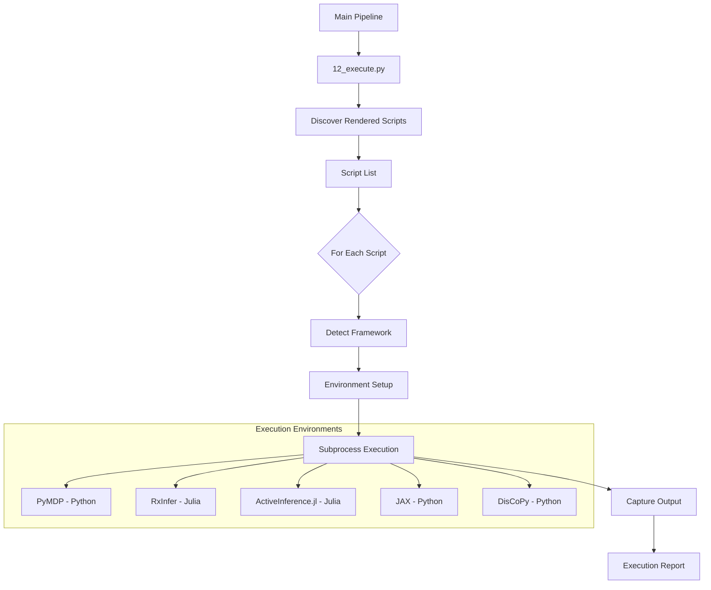

# Execute Module

This module is responsible for running GNN models that have been rendered into framework-specific simulation code by Step 11 (`11_render.py`).

## Supported Frameworks

| Framework | Language | Subfolder | Script Pattern | Status |
|-----------|----------|-----------|----------------|--------|
| **PyMDP** | Python | `pymdp/` | `*_pymdp.py` | ✅ Full support |
| **RxInfer.jl** | Julia | `rxinfer/` | `*_rxinfer.jl` | ✅ Full support |
| **ActiveInference.jl** | Julia | `activeinference_jl/` | `*_activeinference.jl` | ✅ Full support |
| **JAX** | Python | `jax/` | `*_jax.py` | ✅ Full support |
| **DisCoPy** | Python | `discopy/` | `*_discopy.py` | ✅ Full support |
| **PyTorch** | Python | `pytorch/` | `*_pytorch.py` | ✅ Full support (optional dep) |
| **NumPyro** | Python | `numpyro/` | `*_numpyro.py` | ✅ Full support (optional dep) |

JAX, NumPyro, PyTorch, and DisCoPy require optional dependencies. If not installed, their scripts are **skipped** (not failed). To run all frameworks: `uv sync --extra execution-frameworks`.

## Module Structure

```
src/execute/
├── __init__.py              # Module initialization
├── executor.py              # GNNExecutor class (framework dispatch)
├── processor.py             # Main processor (Step 12 entry point)
├── validator.py             # Output validation
├── recovery.py              # Recovery execution strategies
├── data_extractors.py       # Result data extraction
├── julia_setup.py           # Julia environment setup
├── install_dependencies.py  # Dependency management
├── test_execution.py        # Execution tests
├── pymdp/                   # PyMDP execution
│   └── simple_simulation.py # PyMDP simulation runner
├── rxinfer/                 # RxInfer.jl execution
├── activeinference_jl/      # ActiveInference.jl execution
├── jax/                     # JAX execution
├── discopy/                 # DisCoPy execution
│   └── discopy_translator_module/
└── mcp.py                   # MCP tool integration
```

## Execution Workflow


```mermaid
graph TD
    Pipeline[Main Pipeline] --> Step12[12_execute.py]
    Step12 --> Discovery[Discover Rendered Scripts]
    Discovery --> List[Script List]
    
    List --> Loop{For Each Script}
    Loop --> Detect[Detect Framework]
    Detect --> Setup[Environment Setup]
    Setup --> Run[Subprocess Execution]
    Run --> Capture[Capture Output]
    Capture --> Report[Execution Report]
    
    subgraph "Execution Environments"
    Run --> PyMDP[PyMDP - Python]
    Run --> RxInfer[RxInfer - Julia]
    Run --> ActInf[ActiveInference.jl - Julia]
    Run --> JAX[JAX - Python]
    Run --> DisCoPy[DisCoPy - Python]
    end
```

## Core Components

### `executor.py` — `GNNExecutor`

Main executor class providing framework dispatch:

- `execute_gnn_model(model_path, execution_type, options)` — Execute a rendered script
- `run_simulation(simulation_config)` — Run a simulation from config
- `generate_execution_report(output_file)` — Generate execution summary
- `_execute_pymdp_script()`, `_execute_rxinfer_config()`, `_execute_discopy_diagram()`, `_execute_jax_script()` — Framework-specific execution methods

### `processor.py` — Step 12 Entry Point

Orchestrates multi-framework execution:

1. Discovers all rendered scripts in `output/11_render_output/`
2. Detects framework by file extension and naming pattern
3. Executes each script in appropriate runtime environment
4. Aggregates results into `output/12_execute_output/summaries/`

### `pymdp/simple_simulation.py`

PyMDP simulation runner with support for:

- 2D and 3D B matrices (passive models and action-conditioned)
- Column normalization for stochastic matrices
- Standardized `simulation_results.json` output

### `julia_setup.py`

Julia environment management for RxInfer.jl and ActiveInference.jl:

- Package installation and version management
- Environment activation
- Runtime error handling

## Current Performance (8 Discrete Models × 5 Frameworks)

```
Total: 40 | Success: 40 | Failed: 0

  actinf_pomdp_agent     (5/5): ✅PyMDP ✅JAX ✅DisCoPy ✅RxInfer ✅ActInf.jl
  deep_planning_horizon  (5/5): ✅PyMDP ✅JAX ✅DisCoPy ✅RxInfer ✅ActInf.jl
  hmm_baseline           (5/5): ✅PyMDP ✅JAX ✅DisCoPy ✅RxInfer ✅ActInf.jl
  markov_chain           (5/5): ✅PyMDP ✅JAX ✅DisCoPy ✅RxInfer ✅ActInf.jl
  multi_armed_bandit     (5/5): ✅PyMDP ✅JAX ✅DisCoPy ✅RxInfer ✅ActInf.jl
  simple_mdp             (5/5): ✅PyMDP ✅JAX ✅DisCoPy ✅RxInfer ✅ActInf.jl
  tmaze_epistemic        (5/5): ✅PyMDP ✅JAX ✅DisCoPy ✅RxInfer ✅ActInf.jl
  two_state_bistable     (5/5): ✅PyMDP ✅JAX ✅DisCoPy ✅RxInfer ✅ActInf.jl
```

## Usage

### From Pipeline

```bash
# Run as part of full pipeline
python src/main.py

# Run only render + execute steps  
python src/main.py --only-steps "11,12"
```

### Standalone

```python
from execute.executor import GNNExecutor

executor = GNNExecutor(output_dir="output/12_execute_output")
result = executor.execute_gnn_model("path/to/script.py", execution_type="pymdp")
```

---

## Documentation

- **[README](README.md)**: Module Overview
- **[AGENTS](AGENTS.md)**: Agentic Workflows
- **[SPEC](SPEC.md)**: Architectural Specification
- **[SKILL](SKILL.md)**: Capability API
