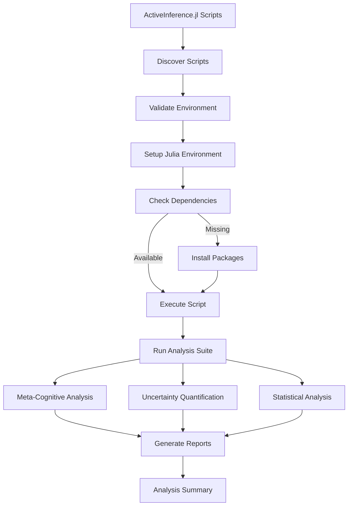

# ActiveInference.jl Execution Module

This module provides comprehensive execution and analysis capabilities for ActiveInference.jl scripts generated from GNN specifications.

## Components

### Python Components
- `activeinference_runner.py` - Python wrapper for executing ActiveInference.jl scripts
- `__init__.py` - Module initialization and exports

### Julia Analysis Suite
- `activeinference_runner.jl` - Main ActiveInference.jl runner script
- `enhanced_analysis_suite.jl` - Comprehensive analysis suite
- `statistical_analysis.jl` - Statistical analysis tools
- `uncertainty_quantification.jl` - Uncertainty quantification methods
- `meta_cognitive_analysis.jl` - Meta-cognitive analysis tools
- `adaptive_precision_attention.jl` - Adaptive precision and attention mechanisms
- `counterfactual_reasoning.jl` - Counterfactual reasoning analysis
- `multi_scale_temporal_analysis.jl` - Multi-scale temporal analysis
- `advanced_pomdp_analysis.jl` - Advanced POMDP analysis
- `enhanced_visualization.jl` - Visualization utilities
- `enhanced_integration_suite.jl` - Integration testing suite
- `export_enhancement.jl` - Enhanced export capabilities
- `visualization_utils.jl` - Visualization utility functions

## ActiveInference.jl Execution Pipeline



## Features

- **Comprehensive Analysis**: Multiple analysis types (basic, comprehensive, all)
- **Julia Integration**: Seamless execution of Julia scripts from Python
- **Performance Monitoring**: Built-in performance tracking and reporting
- **Error Handling**: Robust error handling and reporting
- **Flexible Output**: Configurable output directories and analysis types

## Usage

The module is typically used through the main pipeline (`12_execute.py`) but can also be used directly:

```python
from execute.activeinference_jl import run_activeinference_analysis

success = run_activeinference_analysis(
    pipeline_output_dir="output/",
    recursive_search=True,
    verbose=True,
    analysis_type="comprehensive"
)
```

## Requirements

- Julia programming language
- ActiveInference.jl package
- Required Julia packages (see individual scripts for dependencies)

## Analysis Types

- **basic**: Simple simulation and basic analysis
- **comprehensive**: Extended analysis with planning and learning
- **all**: Complete analysis suite with all available tools 