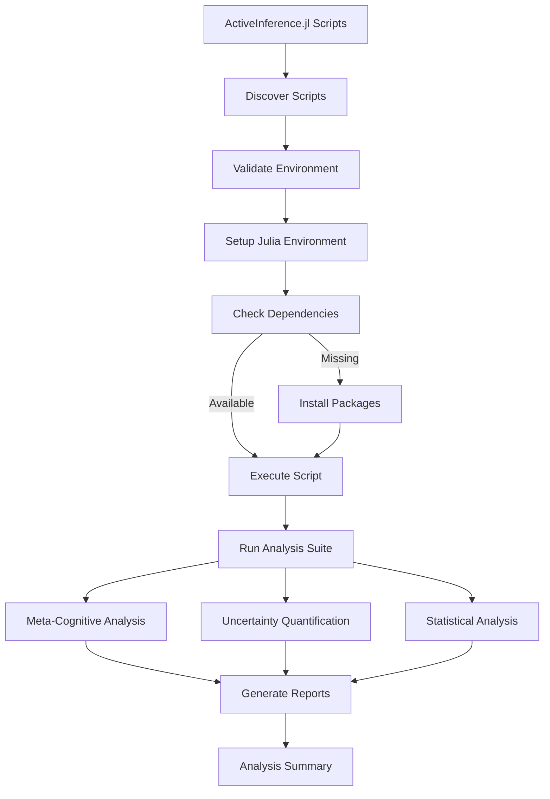

# ActiveInference.jl Execution Module

This module provides comprehensive execution and analysis capabilities for ActiveInference.jl scripts generated from GNN specifications.

## Components

### Python Components
- `activeinference_runner.py` - Python wrapper for executing ActiveInference.jl scripts
- `__init__.py` - Module initialization and exports

### Julia Analysis Suite
- `activeinference_runner.jl` - Main ActiveInference.jl runner script
- `adaptive_precision_attention.jl` - Adaptive precision and attention mechanisms
- `counterfactual_reasoning.jl` - Counterfactual reasoning analysis
- `export_enhancement.jl` - Export capabilities
- `integration_suite.jl` - Integration testing suite
- `setup_environment.jl` - Committed-environment instantiation + compat patch

## ActiveInference.jl Execution Pipeline


```mermaid
graph TD
    Scripts[ActiveInference.jl Scripts] --> Discover[Discover Scripts]
    Discover --> Validate[Validate Environment]
    
    Validate --> Setup[Setup Julia Environment]
    Setup --> Check[Check Dependencies]
    
    Check -->|Available| Execute[Execute Script]
    Check -->|Missing| Install[Install Packages]
    Install --> Execute
    
    Execute --> Analysis[Run Analysis Suite]
    Analysis --> Meta[Meta-Cognitive Analysis]
    Analysis --> Uncertainty[Uncertainty Quantification]
    Analysis --> Statistical[Statistical Analysis]
    
    Meta --> Report[Generate Reports]
    Uncertainty --> Report
    Statistical --> Report
    
    Report --> Summary[Analysis Summary]
```

## Features

- **Comprehensive Analysis**: Multiple analysis types (basic, comprehensive, all)
- **Julia Integration**: Seamless execution of Julia scripts from Python
- **Performance Monitoring**: Built-in performance tracking and reporting
- **Error Handling**: Robust error handling and reporting
- **Flexible Output**: Configurable output directories and analysis types

## Usage

The module is typically used through the main pipeline (`12_execute.py`) but can also be used directly:

```python
from execute.activeinference_jl import run_activeinference_analysis

success = run_activeinference_analysis(
    pipeline_output_dir="output/",
    recursive_search=True,
    verbose=True,
    analysis_type="comprehensive",
)
```

## Requirements

- Julia programming language
- ActiveInference.jl package
- Required Julia packages (see individual scripts for dependencies)

## Clean-start environment setup

The module pins a committed Julia environment (`Project.toml` + `Manifest.toml`
checked into this directory). On a fresh checkout the environment is not yet
instantiated (packages are not downloaded into the Julia depot). Two ways to
bring it up:

```bash
# 1) One-shot setup (instantiates the committed env, applies the
#    DistributionsAD/Julia-1.12 compat patch, and validates core packages):
julia --project=src/execute/activeinference_jl --startup-file=no \
    src/execute/activeinference_jl/setup_environment.jl

# 2) Or let the pipeline auto-setup do it: step 12 runs the same setup when
#    ``get_environment_status`` reports the environment needs setup.
```

Verify:

```bash
julia --project=src/execute/activeinference_jl --startup-file=no \
    -e 'using ActiveInference, Distributions, JSON, StatsBase; println("OK")'
```

**Julia 1.12 note.** `DistributionsAD` 0.6.58 (archived) uses an old
`@check_args` form that `Distributions >= 0.25.126` rejects, so `Project.toml`
pins `Distributions = "0.25.100 - 0.25.125"`. `setup_environment.jl`
patches the installed ReverseDiff ext file (chmod + rewrite) **before**
validation triggers precompilation, so the environment builds on a clean machine.

## Analysis Types

- **basic**: Simple simulation and basic analysis
- **comprehensive**: Extended analysis with planning and learning
- **all**: Complete analysis suite with all available tools 