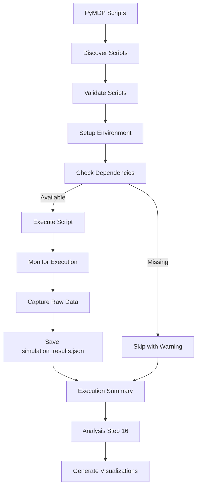

# PyMDP Execution Module

This submodule handles execution of PyMDP simulations generated by the render stage.

## Architecture Note

> **Important**: This module follows the **Render → Execute → Analyze** separation:
> - **Execute (this module)**: Runs simulations and logs **raw data only**
> - **Analysis (Step 16)**: Generates **all visualizations** from raw data
> 
> Visualization code has been moved to `src/analysis/pymdp_visualizer.py` and `src/analysis/pymdp_analyzer.py`.

## Overview

This module executes PyMDP simulation scripts, captures results, and saves raw simulation data for later analysis. All visualizations are generated by the Analysis step (Step 16).

## Module Structure

```
src/execute/pymdp/
├── __init__.py                 # Module initialization
├── README.md                   # This documentation
├── AGENTS.md                   # Detailed agent scaffolding
├── pymdp_runner.py            # Main execution runner
├── executor.py                 # Executor implementation
├── pymdp_simulation.py         # Simulation runner
├── simple_simulation.py        # Simple PyMDP simulation (raw data output)
├── pymdp_utils.py             # Utility functions
├── validator.py               # Result validation
└── test_*.py                  # Unit tests (moved to src/tests/)
```

## Core Components

### PyMDP Runner (`pymdp_runner.py`)

**Purpose**: Execute PyMDP simulation scripts and save raw data

**Key Functions**:
- `run_pymdp_scripts()` - Execute all PyMDP scripts
- `execute_single_simulation()` - Run single script
- `capture_results()` - Capture execution output
- `validate_results()` - Validate simulation results

### Simple Simulation (`simple_simulation.py`)

**Purpose**: Run basic PyMDP active inference simulations

**Key Features**:
- Creates agent from GNN specification matrices (A, B, C, D, E)
- Runs inference loop for configurable timesteps
- Saves structured trace data in `simulation_results.json`
- **No visualization** - all plots generated by Analysis step

### Executor (`executor.py`)

**Purpose**: Core PyMDP execution logic

**Features**:
- Environment setup
- Resource monitoring
- Error handling
- Result collection

## PyMDP Execution Pipeline



## Features

- Multi-script execution support
- Comprehensive error handling
- Raw data capture for analysis
- Performance monitoring
- Graceful degradation

## Usage

```python
from execute.pymdp import run_pymdp_scripts

results = run_pymdp_scripts(
    scripts_dir=Path("output/11_render_output"),
    output_dir=Path("output/12_execute_output")
)
```

## Output

Execution produces:
- `execution_results.json` - Execution summary
- `simulation_results.json` - Raw simulation trace data (for Analysis step)
- `execution_logs/` - Per-script logs

Visualizations are generated by **Analysis step** in:
- `output/16_analysis_output/pymdp_visualizations/`

## Dependencies

- `pymdp` (inferactively-pymdp) - PyMDP package (required)
- `numpy` - Numerical arrays
- `json` - Result serialization

## Error Handling

- Dependency checking
- Script validation
- Timeout handling  
- Resource cleanup
- Error recovery

## Testing

Tests are located in `src/tests/`:
- `test_execute_pymdp_simulation.py` - Simulation tests
- `test_execute_pymdp_integration.py` - Integration tests
- `test_execute_pymdp_utils.py` - Utility tests

Tests verify:
- Script execution correctness
- Result validity
- Error handling
- Resource cleanup

---

**Last Updated**: 2026-01-08
**Status**: ✅ Production Ready
**Architecture**: Render → Execute (raw data) → Analyze (visualizations)
