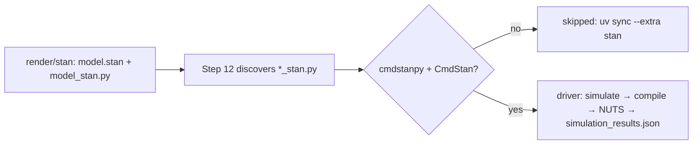

# Stan Executor

Runs the cmdstanpy drivers rendered by Step 11 for the Stan backend.



## Usage

```bash
uv sync --extra stan
uv run python -c "import cmdstanpy; cmdstanpy.install_cmdstan()"   # once
uv run python src/main.py --only-steps "3,11,12" --target-dir input/gnn_files/discrete
```

```python
from execute.stan import run_stan_scripts
results = run_stan_scripts("output/11_render_output", "output/12_execute_output")
```

Discrete models infer the per-state observation distributions (`A_est`) from a
simulated trajectory with the forward algorithm; continuous models infer an
observation-noise scale through the Kalman-filter marginal likelihood. See
`AGENTS.md` for the result schema.
