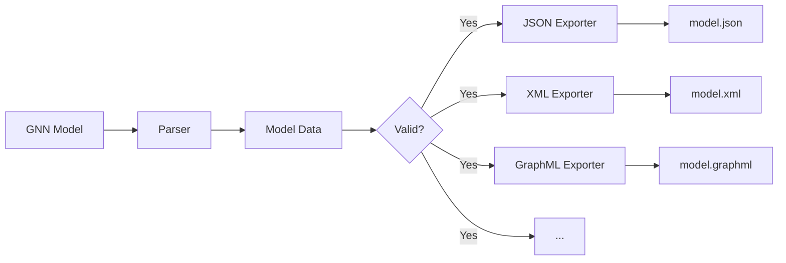

# Export Module

This module provides comprehensive multi-format export capabilities for GNN models, supporting JSON, XML, GraphML, GEXF, Pickle, and other formats with semantic preservation and cross-format compatibility.

## Module Structure

```
src/export/
├── __init__.py                    # Module initialization and exports
├── README.md                      # This documentation
├── core.py                        # Core export functionality
├── format_exporters.py            # Format-specific exporters
└── mcp.py                         # Model Context Protocol integration
```

### Export Workflow



## Core Components

### Export Functions

#### `generate_exports(target_dir: Path, output_dir: Path, verbose: bool = False) -> bool`
Main function for generating multi-format exports from GNN models.

**Features:**
- Multi-format export support
- Batch processing capabilities
- Error handling and recovery
- Progress tracking and reporting

**Returns:**
- `bool`: Success status of export operations

#### `export_single_gnn_file(gnn_file: Path, exports_dir: Path) -> Dict[str, Any]`
Exports a single GNN file to multiple formats.

**Supported Formats:**
- JSON (JavaScript Object Notation)
- XML (Extensible Markup Language)
- GraphML (Graph Markup Language)
- GEXF (Graph Exchange XML Format)
- Pickle (Python serialization)
- Plaintext summary
- Plaintext DSL (Domain Specific Language)

**Returns:**
- Dictionary containing export results and metadata

#### `parse_gnn_content(content: str) -> Dict[str, Any]`
Parses GNN content into structured data for export.

**Processing:**
- Content structure analysis
- Variable extraction and classification
- Connection pattern analysis
- Parameter parsing and validation

### Format-Specific Exporters

#### JSON Export (`export_to_json`)
Exports GNN models to JSON format with semantic preservation.

**Features:**
- Structured data representation
- Metadata preservation
- Cross-platform compatibility
- Human-readable format

**Example Output:**
```json
{
  "model_name": "example_model",
  "variables": [
    {
      "name": "A",
      "dimensions": [3, 3],
      "type": "float",
      "description": "Transition matrix"
    }
  ],
  "connections": [
    {
      "source": "A",
      "target": "B",
      "type": "directed"
    }
  ],
  "parameters": {
    "learning_rate": 0.01,
    "enabled": true
  }
}
```

#### XML Export (`export_to_xml`)
Exports GNN models to XML format with schema validation.

**Features:**
- Hierarchical structure representation
- Schema validation support
- Namespace support
- Attribute preservation

**Example Output:**
```xml
<?xml version="1.0" encoding="UTF-8"?>
<gnn_model name="example_model">
  <variables>
    <variable name="A" dimensions="3,3" type="float">
      <description>Transition matrix</description>
    </variable>
  </variables>
  <connections>
    <connection source="A" target="B" type="directed"/>
  </connections>
  <parameters>
    <parameter name="learning_rate" value="0.01"/>
    <parameter name="enabled" value="true"/>
  </parameters>
</gnn_model>
```

#### GraphML Export (`export_to_graphml`)
Exports GNN models to GraphML format for graph analysis tools.

**Features:**
- Graph structure preservation
- Node and edge attributes
- Graph analysis tool compatibility
- Network visualization support

#### GEXF Export (`export_to_gexf`)
Exports GNN models to GEXF format for network visualization.

**Features:**
- Network visualization compatibility
- Dynamic graph support
- Attribute preservation
- Gephi compatibility

#### Pickle Export (`export_to_pickle`)
Exports GNN models to Python pickle format.

**Features:**
- Python object serialization
- Binary format efficiency
- Complete object preservation
- Python-specific features

#### Plaintext Export (`export_to_plaintext_summary`, `export_to_plaintext_dsl`)
Exports GNN models to human-readable plaintext formats.

**Features:**
- Human-readable output
- Documentation generation
- DSL (Domain Specific Language) support
- Cross-platform compatibility

### Data Processing Functions

#### `_gnn_model_to_dict(gnn_content: str) -> Dict[str, Any]`
Converts GNN content to structured dictionary format.

**Processing:**
- Content parsing and validation
- Structure extraction
- Metadata preservation
- Error handling

#### `_parse_matrix_string(matrix_str: str) -> Any`
Parses matrix string representations.

**Support:**
- Nested list format
- NumPy array format
- String matrix format
- Validation and error handling

#### `_parse_free_text_section(section_content: str) -> str`
Parses free text sections from GNN content.

**Features:**
- Text extraction and cleaning
- Format preservation
- Unicode support
- Error handling

#### `_parse_key_value_section(section_content: str) -> dict`
Parses key-value sections from GNN content.

**Features:**
- Parameter extraction
- Type inference
- Validation
- Error handling

### Export Management Functions

#### `export_model(model_data: Dict[str, Any], output_dir: Path, formats: List[str] = None) -> Dict[str, Any]`
Exports model data to multiple formats.

**Parameters:**
- `model_data`: Structured model data
- `output_dir`: Output directory path
- `formats`: List of export formats (default: all formats)

**Returns:**
- Dictionary containing export results and metadata

#### `get_supported_formats() -> Dict[str, List[str]]`
Returns dictionary of supported export formats.

**Formats:**
- **JSON**: JavaScript Object Notation
- **XML**: Extensible Markup Language
- **GraphML**: Graph Markup Language
- **GEXF**: Graph Exchange XML Format
- **Pickle**: Python serialization
- **Plaintext**: Human-readable formats

## Usage Examples

### Basic Multi-Format Export

```python
from export import generate_exports

# Export GNN models to multiple formats
success = generate_exports(
    target_dir=Path("models/"),
    output_dir=Path("exports/"),
    verbose=True
)

if success:
    print("Export completed successfully")
else:
    print("Export failed")
```

### Single File Export

```python
from export import export_single_gnn_file

# Export single GNN file
results = export_single_gnn_file(
    gnn_file=Path("models/my_model.md"),
    exports_dir=Path("exports/")
)

print(f"Exported to {len(results['exported_files'])} formats")
print(f"Formats: {list(results['exported_files'].keys())}")
```

### Format-Specific Export

```python
from export.format_exporters import export_to_json, export_to_xml

# Export to specific formats
model_data = parse_gnn_content(gnn_content)

# JSON export
json_success = export_to_json(model_data, Path("output/model.json"))

# XML export
xml_success = export_to_xml(model_data, Path("output/model.xml"))

print(f"JSON export: {'Success' if json_success else 'Failed'}")
print(f"XML export: {'Success' if xml_success else 'Failed'}")
```

### Custom Export Configuration

```python
from export import export_model

# Export with custom format selection
model_data = parse_gnn_content(gnn_content)
formats = ['json', 'xml', 'graphml']

results = export_model(
    model_data=model_data,
    output_dir=Path("exports/"),
    formats=formats
)

print(f"Exported formats: {list(results['exported_files'].keys())}")
```

### Batch Processing

```python
from export import generate_exports
from pathlib import Path

# Process multiple GNN files
target_dir = Path("models/")
output_dir = Path("exports/")

success = generate_exports(
    target_dir=target_dir,
    output_dir=output_dir,
    verbose=True
)

if success:
    print("Batch export completed")
    # Check exported files
    exported_files = list(output_dir.glob("**/*"))
    print(f"Total exported files: {len(exported_files)}")
```

## Export Pipeline

### 1. Content Parsing
```python
# Parse GNN content into structured data
model_data = parse_gnn_content(gnn_content)
```

### 2. Data Validation
```python
# Validate parsed data
if not validate_model_data(model_data):
    raise ValueError("Invalid model data for export")
```

### 3. Format Selection
```python
# Select export formats
formats = get_supported_formats()
selected_formats = ['json', 'xml', 'graphml']
```

### 4. Export Generation
```python
# Generate exports for each format
for format_name in selected_formats:
    if format_name in formats:
        export_function = get_export_function(format_name)
        success = export_function(model_data, output_path)
```

### 5. Result Aggregation
```python
# Collect export results
export_results = {
    'exported_files': exported_files,
    'failed_formats': failed_formats,
    'metadata': export_metadata
}
```

## Integration with Pipeline

### Pipeline Step 7: Export
```python
# Called from 7_export.py
def process_export(target_dir, output_dir, verbose=False, **kwargs):
    # Generate multi-format exports
    success = generate_exports(target_dir, output_dir, verbose)
    
    # Generate export summary
    summary = generate_export_summary(export_results)
    
    # Save export metadata
    save_export_metadata(export_results, output_dir)
    
    return success
```

### Output Structure
```
output/7_export_output/
├── model_name.json                # JSON export
├── model_name.xml                 # XML export
├── model_name.graphml             # GraphML export
├── model_name.gexf                # GEXF export
├── model_name.pkl                 # Pickle export
├── model_name_summary.txt         # Plaintext summary
├── model_name_dsl.txt             # DSL export
├── export_metadata.json           # Export metadata
└── export_summary.md              # Export summary
```

## Export Formats

### JSON Format
- **Purpose**: Data interchange and API integration
- **Features**: Human-readable, widely supported
- **Use Cases**: Web APIs, data analysis, configuration

### XML Format
- **Purpose**: Structured data representation
- **Features**: Schema validation, hierarchical structure
- **Use Cases**: Enterprise systems, data exchange

### GraphML Format
- **Purpose**: Graph analysis and visualization
- **Features**: Graph structure preservation, tool compatibility
- **Use Cases**: Network analysis, graph visualization

### GEXF Format
- **Purpose**: Network visualization
- **Features**: Gephi compatibility, dynamic graphs
- **Use Cases**: Network visualization, social network analysis

### Pickle Format
- **Purpose**: Python object serialization
- **Features**: Binary format, complete object preservation
- **Use Cases**: Python applications, data persistence

### Plaintext Formats
- **Purpose**: Human-readable documentation
- **Features**: Cross-platform, no dependencies
- **Use Cases**: Documentation, manual review

## Data Preservation

### Semantic Preservation
- **Variable Information**: Name, dimensions, type, description
- **Connection Patterns**: Source, target, type, attributes
- **Parameter Values**: Initial values, constraints, metadata
- **Model Structure**: Hierarchical organization, relationships

### Metadata Preservation
- **Model Information**: Name, version, description
- **Creation Metadata**: Timestamp, author, source
- **Processing Information**: Export timestamp, format version
- **Validation Status**: Validation results, warnings, errors

### Cross-Format Compatibility
- **Format Conversion**: Lossless conversion between formats
- **Schema Validation**: Format-specific schema validation
- **Error Handling**: Graceful handling of format-specific issues
- **Fallback Mechanisms**: Alternative export methods

## Error Handling

### Export Failures
```python
# Handle export failures gracefully
try:
    result = export_single_gnn_file(gnn_file, exports_dir)
except ExportError as e:
    logger.error(f"Export failed: {e}")
    # Provide fallback export or error reporting
```

### Format-Specific Issues
```python
# Handle format-specific issues
for format_name in selected_formats:
    try:
        export_function = get_export_function(format_name)
        success = export_function(model_data, output_path)
    except FormatExportError as e:
        logger.warning(f"Failed to export {format_name}: {e}")
        # Continue with other formats
```

### Data Validation Issues
```python
# Validate data before export
if not validate_model_data(model_data):
    logger.error("Invalid model data for export")
    # Provide data correction or error reporting
```

## Performance Optimization

### Batch Processing
- **Parallel Export**: Export multiple formats in parallel
- **Memory Management**: Optimize memory usage for large models
- **Progress Tracking**: Track export progress for long operations
- **Resource Management**: Manage system resources during export

### Caching Strategies
- **Parsed Data Cache**: Cache parsed GNN content
- **Export Result Cache**: Cache export results for repeated exports
- **Format Cache**: Cache format-specific processing results

### Scalability
- **Large Models**: Handle models with thousands of variables
- **Multiple Files**: Process multiple files efficiently
- **Memory Optimization**: Optimize memory usage for large datasets
- **Progress Reporting**: Report progress for long-running operations

## Testing and Validation

### Unit Tests
```python
# Test individual export functions
def test_json_export():
    model_data = create_test_model_data()
    success = export_to_json(model_data, test_output)
    assert success
    assert test_output.exists()
```

### Integration Tests
```python
# Test complete export pipeline
def test_export_pipeline():
    success = generate_exports(test_dir, output_dir)
    assert success
    exported_files = list(output_dir.glob("**/*"))
    assert len(exported_files) > 0
```

### Format Validation
```python
# Test format-specific validation
def test_format_validation():
    for format_name in supported_formats:
        validator = get_format_validator(format_name)
        assert validator is not None
```

## Dependencies

### Required Dependencies
- **json**: JSON format support
- **xml.etree.ElementTree**: XML format support
- **pickle**: Python serialization
- **pathlib**: Path handling

### Optional Dependencies
- **networkx**: GraphML and GEXF support
- **lxml**: Advanced XML processing
- **yaml**: YAML format support (if needed)

## Performance Metrics

### Processing Times
- **Small Models** (< 100 variables): < 0.1 seconds
- **Medium Models** (100-1000 variables): 0.1-1.0 seconds
- **Large Models** (> 1000 variables): 1.0-10.0 seconds

### Memory Usage
- **Base Memory**: ~10MB
- **Per Model**: ~1-10MB depending on complexity
- **Peak Memory**: 1.5-2x base usage during export

### File Sizes
- **JSON**: ~1-10KB per model
- **XML**: ~2-20KB per model
- **GraphML**: ~1-15KB per model
- **GEXF**: ~1-15KB per model
- **Pickle**: ~0.5-5KB per model

## Troubleshooting

### Common Issues

#### 1. Format Export Failures
```
Error: Failed to export to XML format
Solution: Check XML schema validation or use alternative format
```

#### 2. Memory Issues
```
Error: MemoryError during large model export
Solution: Enable memory optimization or process in chunks
```

#### 3. File System Issues
```
Error: Permission denied writing export file
Solution: Check file permissions or use alternative output directory
```

#### 4. Data Validation Issues
```
Error: Invalid model data for export
Solution: Validate GNN content before export
```

### Debug Mode
```python
# Enable debug mode for detailed export information
success = generate_exports(target_dir, output_dir, verbose=True, debug=True)
```

## Future Enhancements

### Planned Features
- **Additional Formats**: Support for more export formats
- **Custom Exporters**: User-defined export formats
- **Real-time Export**: Live export during model development
- **Export Templates**: Customizable export templates

### Performance Improvements
- **Parallel Processing**: Multi-core export processing
- **Streaming Export**: Memory-efficient streaming export
- **Compression**: Export file compression
- **Caching**: Advanced caching strategies

## Summary

The Export module provides comprehensive multi-format export capabilities for GNN models, supporting JSON, XML, GraphML, GEXF, Pickle, and other formats. The module ensures semantic preservation, cross-format compatibility, and robust error handling for reliable data export in Active Inference research and development.

## License and Citation

This module is part of the GeneralizedNotationNotation project. See the main repository for license and citation information. 

## References

- Project overview: ../../README.md
- Comprehensive docs: ../../DOCS.md
- Architecture guide: ../../ARCHITECTURE.md
- Pipeline details: ../../doc/pipeline/README.md