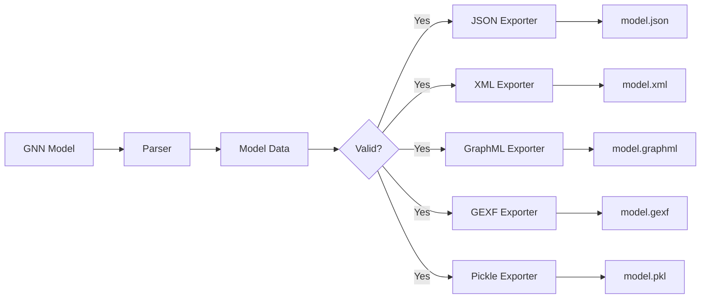
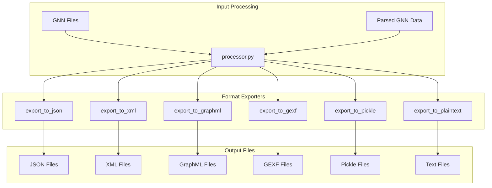
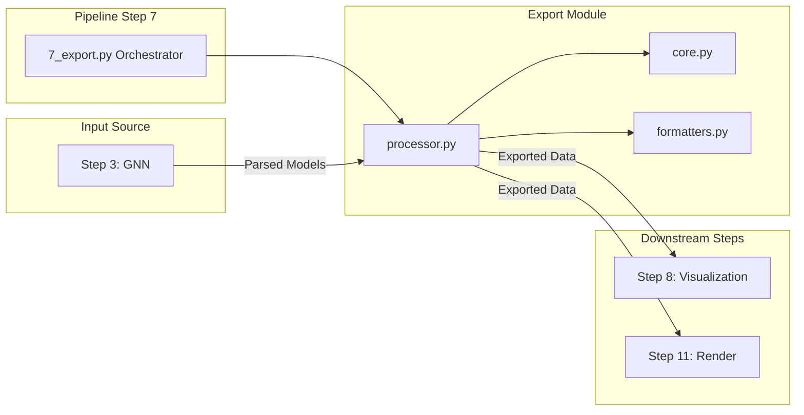

# Export Module

This module provides comprehensive multi-format export capabilities for GNN models, supporting JSON, XML, GraphML, GEXF, Pickle, and other formats with semantic preservation and cross-format compatibility.

## Module Structure

```
src/export/
├── __init__.py                    # Module initialization and exports
├── README.md                      # This documentation
├── AGENTS.md                      # Agent scaffolding documentation
├── SPEC.md                        # Module specification
├── core.py                        # Pipeline integration adapter
├── processor.py                   # Export orchestration and GNN parsing
├── formatters.py                  # Format-specific serializers
├── format_exporters.py            # Advanced GNN-aware exporters
├── registry.py                    # Canonical format registry (single source of truth)
├── utils.py                       # Module introspection utilities
└── mcp.py                         # Model Context Protocol integration
```

### Export Workflow


```mermaid
graph LR
    Input[GNN Model] --> Parser[Parser]
    Parser --> Data[Model Data]
    
    Data --> Valid{Valid?}
    Valid -->|Yes| JSON[JSON Exporter]
    Valid -->|Yes| XML[XML Exporter]
    Valid -->|Yes| GraphML[GraphML Exporter]
    Valid -->|Yes| GEXF[GEXF Exporter]
    Valid -->|Yes| Pickle[Pickle Exporter]
    
    JSON --> File1[model.json]
    XML --> File2[model.xml]
    GraphML --> File3[model.graphml]
    GEXF --> File4[model.gexf]
    Pickle --> File5[model.pkl]
```

### Export Architecture


```mermaid
graph TB
    subgraph "Input Processing"
        GNNFiles[GNN Files]
        ParsedData[Parsed GNN Data]
        Processor[processor.py]
    end
    
    subgraph "Format Exporters"
        JSONExp[export_to_json]
        XMLExp[export_to_xml]
        GraphMLExp[export_to_graphml]
        GEXFExp[export_to_gexf]
        PickleExp[export_to_pickle]
        TextExp[export_to_plaintext]
    end
    
    subgraph "Output Files"
        JSONFile[JSON Files]
        XMLFile[XML Files]
        GraphMLFile[GraphML Files]
        GEXFFile[GEXF Files]
        PickleFile[Pickle Files]
        TextFile[Text Files]
    end
    
    GNNFiles --> Processor
    ParsedData --> Processor
    
    Processor --> JSONExp
    Processor --> XMLExp
    Processor --> GraphMLExp
    Processor --> GEXFExp
    Processor --> PickleExp
    Processor --> TextExp
    
    JSONExp --> JSONFile
    XMLExp --> XMLFile
    GraphMLExp --> GraphMLFile
    GEXFExp --> GEXFFile
    PickleExp --> PickleFile
    TextExp --> TextFile
```

### Module Integration Flow


```mermaid
flowchart LR
    subgraph "Pipeline Step 7"
        Step7[7_export.py Orchestrator]
    end
    
    subgraph "Export Module"
        Processor[processor.py]
        Core[core.py]
        Formatters[formatters.py]
    end
    
    subgraph "Input Source"
        Step3[Step 3: GNN]
    end
    
    subgraph "Downstream Steps"
        Step8[Step 8: Visualization]
        Step11[Step 11: Render]
    end
    
    Step7 --> Processor
    Processor --> Core
    Processor --> Formatters
    
    Step3 -->|Parsed Models| Processor
    
    Processor -->|Exported Data| Step8
    Processor -->|Exported Data| Step11
```

## Core Components

### Export Functions

#### `generate_exports(target_dir: Path, output_dir: Path, verbose: bool = False) -> bool`

Main function for generating multi-format exports from GNN models.

**Features:**

- Multi-format export support
- Batch processing capabilities
- Error handling and recovery
- Progress tracking and reporting

**Returns:**

- `bool`: Success status of export operations

#### `export_single_gnn_file(gnn_file: Path, exports_dir: Path) -> Dict[str, Any]`

Exports a single GNN file to multiple formats.

**Supported Formats:**

- JSON (JavaScript Object Notation)
- XML (Extensible Markup Language)
- GraphML (Graph Markup Language)
- GEXF (Graph Exchange XML Format)
- Pickle (Python serialization)
- Plaintext summary
- Plaintext DSL (Domain Specific Language)

**Returns:**

- Dictionary containing export results and metadata

#### `parse_gnn_content(content: str) -> Dict[str, Any]`

Parses GNN content into structured data for export.

**Processing:**

- Content structure analysis
- Variable extraction and classification
- Connection pattern analysis
- Parameter parsing and validation

### Format-Specific Exporters

#### JSON Export (`export_to_json`)

Exports GNN models to JSON format with semantic preservation.

**Features:**

- Structured data representation
- Metadata preservation
- Cross-platform compatibility
- Human-readable format

**Example Output:**

```json
{
  "model_name": "example_model",
  "variables": [
    {
      "name": "A",
      "dimensions": [3, 3],
      "type": "float",
      "description": "Transition matrix"
    }
  ],
  "connections": [
    {
      "source": "A",
      "target": "B",
      "type": "directed"
    }
  ],
  "parameters": {
    "learning_rate": 0.01,
    "enabled": true
  }
}
```

#### XML Export (`export_to_xml`)

Exports GNN models to XML format with schema validation.

**Features:**

- Hierarchical structure representation
- Schema validation support
- Namespace support
- Attribute preservation

**Example Output:**

```xml
<?xml version="1.0" encoding="UTF-8"?>
<gnn_model name="example_model">
  <variables>
    <variable name="A" dimensions="3,3" type="float">
      <description>Transition matrix</description>
    </variable>
  </variables>
  <connections>
    <connection source="A" target="B" type="directed"/>
  </connections>
  <parameters>
    <parameter name="learning_rate" value="0.01"/>
    <parameter name="enabled" value="true"/>
  </parameters>
</gnn_model>
```

#### GraphML Export (`export_to_graphml`)

Exports GNN models to GraphML format for graph analysis tools.

**Features:**

- Graph structure preservation
- Node and edge attributes
- Graph analysis tool compatibility
- Network visualization support

#### GEXF Export (`export_to_gexf`)

Exports GNN models to GEXF format for network visualization.

**Features:**

- Network visualization compatibility
- Dynamic graph support
- Attribute preservation
- Gephi compatibility

#### Pickle Export (`export_to_pickle`)

Exports GNN models to Python pickle format.

**Features:**

- Python object serialization
- Binary format efficiency
- Complete object preservation
- Python-specific features

#### Plaintext Export (`export_to_plaintext_summary`, `export_to_plaintext_dsl`)

Exports GNN models to human-readable plaintext formats.

**Features:**

- Human-readable output
- Documentation generation
- DSL (Domain Specific Language) support
- Cross-platform compatibility

### Data Processing Functions

#### `_gnn_model_to_dict(gnn_content: str) -> Dict[str, Any]`

Converts GNN content to structured dictionary format.

**Processing:**

- Content parsing and validation
- Structure extraction
- Metadata preservation
- Error handling

#### `_parse_matrix_string(matrix_str: str) -> Any`

Parses matrix string representations.

**Support:**

- Nested list format
- NumPy array format
- String matrix format
- Validation and error handling

#### `_parse_free_text_section(section_content: str) -> str`

Parses free text sections from GNN content.

**Features:**

- Text extraction and cleaning
- Format preservation
- Unicode support
- Error handling

#### `_parse_key_value_section(section_content: str) -> dict`

Parses key-value sections from GNN content.

**Features:**

- Parameter extraction
- Type inference
- Validation
- Error handling

### Export Management Functions

#### `export_model(model_data: Dict[str, Any], output_dir: Path, formats: List[str] = None) -> Dict[str, Any]`

Exports model data to multiple formats.

**Parameters:**

- `model_data`: Structured model data
- `output_dir`: Output directory path
- `formats`: List of export formats (default: all formats)

**Returns:**

- Dictionary containing export results and metadata

#### `get_supported_formats() -> list[str]`

Returns the flat list of supported export format names (`json`, `xml`, `graphml`, `gexf`, `pickle`, `txt`, `dsl`). `get_supported_formats_dict()` groups them into `data_formats`, `graph_formats`, and `text_formats`.

## Usage Examples

### Basic Multi-Format Export

```python
from export import generate_exports

# Export GNN models to multiple formats
success = generate_exports(
    target_dir=Path("models/"), output_dir=Path("exports/"), verbose=True
)

if success:
    print("Export completed successfully")
else:
    print("Export failed")
```

### Single File Export

```python
from export import export_single_gnn_file

# Export single GNN file
results = export_single_gnn_file(
    gnn_file=Path("models/my_model.md"), exports_dir=Path("exports/")
)

print(f"Success: {results['success']}")
print(f"Formats: {list(results['exports'].keys())}")
```

### Format-Specific Export

```python
from export.formatters import export_to_json, export_to_xml

model_data = parse_gnn_content(gnn_content)

# JSON export
json_success = export_to_json(model_data, Path("output/model.json"))

# XML export
xml_success = export_to_xml(model_data, Path("output/model.xml"))

print(f"JSON export: {'Success' if json_success else 'Failed'}")
print(f"XML export: {'Success' if xml_success else 'Failed'}")
```

### Custom Export Configuration

```python
from export import export_model

# Export with custom format selection
model_data = parse_gnn_content(gnn_content)
formats = ["json", "xml", "graphml"]

results = export_model(
    model_data=model_data, output_dir=Path("exports/"), formats=formats
)

print(f"Exported formats: {list(results['exports'].keys())}")
```

### Batch Processing

```python
from export import generate_exports
from pathlib import Path

# Process multiple GNN files
target_dir = Path("models/")
output_dir = Path("exports/")

success = generate_exports(target_dir=target_dir, output_dir=output_dir, verbose=True)

if success:
    print("Batch export completed")
    # Check exported files
    exported_files = list(output_dir.glob("**/*"))
    print(f"Total exported files: {len(exported_files)}")
```

## Export Pipeline

In the pipeline, `process_export` (called by `7_export.py`) does all of this in one pass:

1. Loads parsed GNN specs from Step 3's `gnn_processing_results.json`.
2. For each file, writes the requested formats via the formatter functions.
3. Aggregates per-file results into `export_results.json` and `export_summary.json`.

There is no separate `validate_model_data` or `get_export_function` entry point.

## Integration with Pipeline

### Pipeline Step 7: Export

```python
# Called from 7_export.py
from export import process_export

success = process_export(
    target_dir=Path("input/gnn_files"),
    output_dir=Path("output/7_export_output"),
    verbose=True,
)
```

### Output Structure

```
output/7_export_output/
├── model_name/
│   ├── model_name.json
│   ├── model_name.xml
│   ├── model_name.graphml
│   ├── model_name.gexf
│   └── model_name_pickle.pkl
├── export_results.json
└── export_summary.json
```


## Data Preservation

### Semantic Preservation

- **Variable Information**: Name, dimensions, type, description
- **Connection Patterns**: Source, target, type, attributes
- **Parameter Values**: Initial values, constraints, metadata
- **Model Structure**: Hierarchical organization, relationships

### Metadata Preservation

- **Model Information**: Name, version, description
- **Creation Metadata**: Timestamp, author, source
- **Processing Information**: Export timestamp, format version
- **Validation Status**: Validation results, warnings, errors

### Cross-Format Compatibility

- **Format Conversion**: Lossless conversion between formats
- **Schema Validation**: Format-specific schema validation
- **Error Handling**: Graceful handling of format-specific issues
- **Recovery Mechanisms**: Alternative export methods

## Error Handling

- `export_single_gnn_file` and `export_model` catch per-format exceptions internally and return result dictionaries (`success`, `exports`, `errors`); they never raise.
- `process_export` logs a warning and skips unsupported format names; per-format failures are recorded in `export_results.json` and mark the file as failed.
- If the Step 3 results file is missing, `process_export` logs the expected path and returns `False`.

There are no `ExportError`/`FormatExportError` exception types.

## Testing

Tests live in `src/tests/export/` (`test_export_overall.py`, `test_export_format_writers.py`, `test_export_public_api.py`, `test_export_roundtrip.py`, `test_export_registry_and_validate.py`).

## Dependencies

### Required Dependencies

- **json**: JSON format support
- **xml.etree.ElementTree**: XML format support
- **pickle**: Python serialization
- **pathlib**: Path handling

### Optional Dependencies

- **networkx**: GraphML and GEXF support (falls back to basic XML-based graph export when unavailable)

## Summary

The Export module provides comprehensive multi-format export capabilities for GNN models, supporting JSON, XML, GraphML, GEXF, Pickle, and other formats. The module ensures semantic preservation, cross-format compatibility, and robust error handling for reliable data export in Active Inference research and development.

## License and Citation

This module is part of the GeneralizedNotationNotation project. See the main repository for license and citation information.

## References

- Project overview: ../../README.md
- Comprehensive docs: ../../DOCS.md
- Architecture guide: ../../ARCHITECTURE.md
- Pipeline details: ../../doc/pipeline/README.md


---
## Documentation
- **[README](README.md)**: Module Overview
- **[AGENTS](AGENTS.md)**: Agentic Workflows
- **[SPEC](SPEC.md)**: Architectural Specification
- **[SKILL](SKILL.md)**: Capability API


## GEO-INFER interchange

The opt-in `geo_infer` format exports explicit single-factor categorical A–E
models with state ordering, a caller-declared timestep and source SHA-256.
Use `export_model(..., formats=['geo_infer'])` with `raw_content` and
`geo_infer.step_seconds`, or `python -m export.geo_infer --help`.
[The versioned contract](geo_infer_contract.md) defines supported semantics,
separate environment setup and cross-repository conformance checks.

### GEO-INFER interchange

The opt-in `geo_infer` writer supports strict categorical v1 and discrete-time
linear Gaussian v2 artifacts. Step 7 requires explicit per-file
`geo_infer_options`; original source bytes establish provenance. See the
[interchange contract](geo_infer_contract.md) for axes, units, examples, and
failure behavior. Default pipeline formats remain unchanged.

`options.py` loads bounded, duplicate-free physical metadata for the numbered
Step 7 CLI; `geo_infer_factored.py` exports explicitly structured factored JSON.
