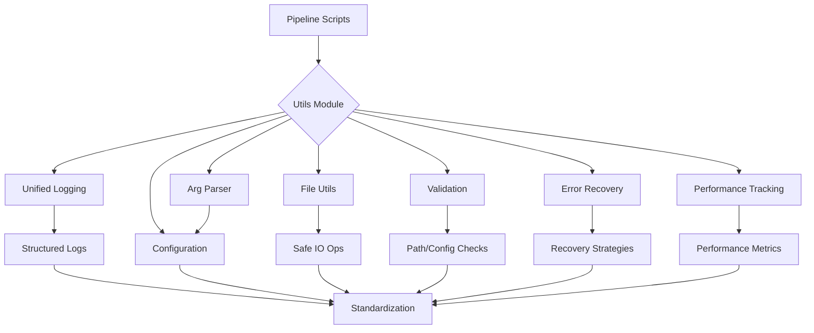

# Utils Module

This module provides core utilities used throughout the GNN pipeline, including unified logging, argument parsing, pipeline orchestration, and common helper functions that ensure consistency across all modules.

## Module Structure

```
src/gnn/utils/
├── __init__.py                      # Module initialization and exports
├── AGENTS.md                        # AI agent scaffolding documentation
├── README.md                        # This documentation
├── SPEC.md                          # Module specification
│
├── logging_utils.py                 # Logging facade (setup_step_logging, log_step_*)
├── pipeline.py                      # Pipeline utilities (get_output_dir_for_script, ...)
├── mcp.py                           # MCP integration (canonical name; see mcp/ package)
│
├── # Concern packages (S2-33/SC-38 split)
├── logging/                         # Logging subpackage (see logging/README.md)
├── arguments/                       # arg_definitions, arg_parsing, path_conversion,
│                                    #   pipeline_arguments, pipeline_config_merge, step_config
├── config_io/                       # config_loader, io_utils, path_utils, code_metrics
├── errors/                          # error_handling, error_recovery
├── observability/                   # structured_logging, performance_tracking,
│                                    #   visual_logging
├── pipeline_orchestration/          # base_processor, execution_utils,
│                                    #   pipeline_dependencies, pipeline_monitor,
│                                    #   pipeline_validator, pipeline_template,
│                                    #   pipeline_step_dependencies
├── runtime_safety/                  # dependency_validator, framework_availability,
│                                    #   jax_stack_validation, resource_manager, safe_eval,
│                                    #   timeout_manager, validation_schemas
├── system_env/                      # system_utils, venv_utils, matplotlib_setup
├── testing/                         # Test runner, categories, stages, coverage targets
└── mcp/                             # MCP dispatch (register_tools, redact_environment)
```

## Core Components



### Unified Logging System

`utils/logging_utils.py` is the canonical entry point:

#### `setup_step_logging(step_name: str, verbose: bool = False) -> logging.Logger`
Sets up standardized logging for a pipeline step with correlation-ID tracking.

#### `setup_main_logging(verbose: bool = False) -> logging.Logger`
Sets up logging for the main pipeline orchestrator.

#### `log_step_start(logger, message)` / `log_step_success(logger, message)` / `log_step_error(logger, message)` / `log_step_warning(logger, message)`
Step lifecycle logging helpers. `observability/structured_logging.py` provides richer variants (`log_step_start(logger, step_name, **context)`) with metadata support.

#### `get_performance_summary() -> Dict[str, Any]`
Returns timing/memory metrics recorded by the structured logger.

### Argument Parsing

#### `ArgumentParser` (`arguments/arg_parsing.py`, re-exported by the `arguments/` package)
Standard argument parser with pipeline-wide support.

#### `ArgumentParser.parse_step_arguments(step_name) -> argparse.Namespace`
Parses arguments for a specific pipeline step with recovery support. Standard arguments: `--target-dir`, `--output-dir`, `--verbose`, `--recursive` (plus step-specific definitions from `arg_definitions.STEP_ARGUMENTS`).

#### `build_step_command_args(step_name, args) -> List[str]`
Builds the command-line argument list for invoking a step script.

#### `gnn.utils.arguments.arg_parsing.audit_step_contracts() -> Dict[str, Any]`
Audits for drift between `STEP_ARGUMENTS`, `StepConfiguration`, parser defaults, and command-builder propagation. Exit codes are canonical: `0=success`, `1=error`, `2=success with warnings/skipped`.

### Pipeline Orchestration Utilities

#### `get_output_dir_for_script(script_name: str, base_output_dir: Optional[Path] = None) -> Path`
Gets the standardized per-step output directory (e.g. `"3_gnn.py"` → `output/3_gnn_output/`).

### Configuration

#### `load_config(config_path: Optional[Path] = None) -> GNNPipelineConfig`
Loads pipeline configuration (defaults when no path given).

#### `get_config_value(config, key) -> Any` / `set_config_value(config, key, value) -> Any`
Get/set configuration values with dot-notation keys.

### Shared Helpers

Single-source implementations shared across modules (see AGENTS.md →
Composability Notes for the full consolidation map):

#### `verify_directory_writable(directory: Path, probe_name: str = ".write_probe") -> None`
The one writable-directory probe (create temp file → atomic rename → cleanup), used by
`gnn.utils.pipeline.validate_output_directory` and `gnn.utils.pipeline_orchestration.pipeline_validator.check_pipeline_readiness`.
Raises `OSError` when the directory does not accept writes.

#### `get_memory_usage() -> float`
Canonical process-memory probe in MB (`gnn.utils.runtime_safety.resource_manager`).

#### `redact_environment() -> dict[str, str]` (`utils.mcp`)
Copy of `os.environ` with secret-carrying variable names removed
(matched case-insensitively against `SENSITIVE_ENV_KEY_MARKERS`).

## Usage Examples

### Basic Logging Setup

```python
from gnn.utils.logging_utils import (
    setup_step_logging,
    log_step_start,
    log_step_success,
    log_step_error,
)

logger = setup_step_logging("my_step", verbose=True)

log_step_start(logger, "Starting my_step")
try:
    results = perform_processing()
    log_step_success(logger, "my_step completed")
except Exception as e:
    log_step_error(logger, f"my_step failed: {e}")
    raise
```

### Argument Parsing

```python
from gnn.utils.arguments import ArgumentParser

args = ArgumentParser.parse_step_arguments("my_step")
target_dir = args.target_dir
output_dir = args.output_dir
verbose = args.verbose
```

### Pipeline Orchestration

```python
from gnn.utils.pipeline import get_output_dir_for_script

output_dir = get_output_dir_for_script("my_script.py", Path("output"))
```

### Memory Monitoring

```python
from gnn.utils.runtime_safety.resource_manager import get_current_memory_usage

memory_before = get_current_memory_usage()
# ... do some work ...
memory_after = get_current_memory_usage()
print(f"Memory delta: {memory_after - memory_before} MB")
```

## Integration with Pipeline

### Standard Module Pattern

```python
from gnn.utils.logging_utils import setup_step_logging, log_step_start, log_step_success, log_step_error
from gnn.pipeline import get_output_dir_for_script

logger = setup_step_logging("my_module", verbose=args.verbose)

def process_my_module(target_dir: Path, output_dir: Path, verbose: bool = False, **kwargs) -> bool:
    try:
        log_step_start(logger, "Starting my_module")
        # Core processing logic here
        log_step_success(logger, "my_module completed")
        return True
    except Exception as e:
        log_step_error(logger, f"my_module failed: {e}")
        return False
```

## Error Handling

`errors/error_recovery.py` provides `ErrorRecoveryManager(logger=None)` with `handle_error(context: ErrorContext) -> bool` and helpers such as `format_and_log_error(logger, error, context)`. Errors are described by `ErrorContext` objects (operation, severity, message, error_code, details).

## Testing and Validation

Tests live in `tests/utils/` (including `test_utils_core.py`, `test_new_utils.py`, and
`test_shared_helpers.py`, which pins the shared-helper behavior above).

Run: `uv run --extra dev python -m pytest tests/utils/ -v`

## Dependencies

Standard library plus `pyyaml` (config loading) and `psutil` (resource monitoring) — both core pyproject dependencies. No rich/click/pydantic/structlog requirements.

## Troubleshooting

- **No log output**: verify the `verbose` flag on `setup_step_logging` / `setup_main_logging` and that the logger is not filtered by an upstream handler.
- **Argument parsing errors**: run the step with `--help` to see the argument definitions registered in `arguments/arg_definitions.py`.
- **Debug logging**: set the logger level to `DEBUG` (`logging.getLogger().setLevel(logging.DEBUG)`) or pass `verbose=True`.

## Summary

The Utils module provides core utilities used throughout the GNN pipeline: unified logging with correlation IDs, standardized argument parsing with step contracts, pipeline orchestration helpers, configuration loading, dependency validation, and error recovery. These utilities form the foundation for consistent pipeline behavior across all 25 steps.

## License and Citation

This module is part of the GeneralizedNotationNotation project. See the main repository for license and citation information.

## References

- Project overview: ../../../README.md
- Comprehensive docs: ../../../DOCS.md
- Architecture guide: ../../../ARCHITECTURE.md
- Pipeline details: ../../../docs/pipeline/README.md

---
## Documentation
- **[README](README.md)**: Module Overview
- **[AGENTS](AGENTS.md)**: Agentic Workflows
- **[SPEC](SPEC.md)**: Architectural Specification
- **[SKILL](SKILL.md)**: Capability API

Step 7 accepts `--formats` and `--geo-infer-options-file`; argument definitions,
step configuration and `PipelineArguments` preserve these through orchestration.
