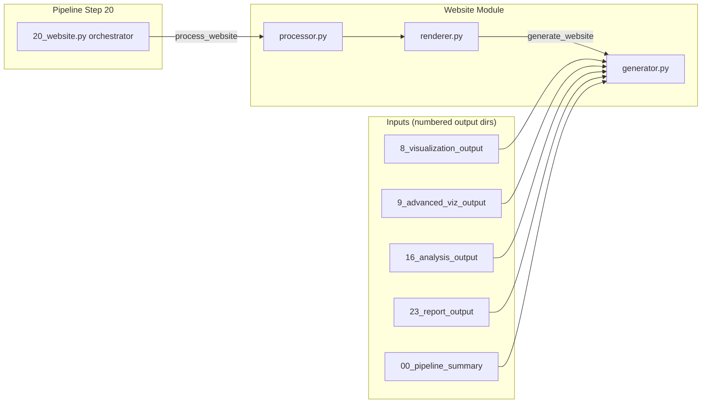

# Website Module

Static HTML website generation for the GNN pipeline: produces a premium,
dark-mode, multi-page site from pipeline artifacts (visualizations, reports,
analysis results, GNN source files, execution summaries, and the MCP tool
registry).

## Module Structure

```
src/gnn/website/
├── __init__.py        # Public exports (see API below)
├── processor.py       # Thin facade re-exporting renderer.process_website
├── renderer.py        # process_website + embed_* helpers + get_module_info
├── collection.py      # collect_website_data + private artifact collectors
├── generator.py       # WebsiteGenerator / generate_website (7-page site + per-model pages + search index)
├── inspection.py      # inspect_website / list_website_pages (pure site queries)
└── mcp.py             # MCP tool registration (6 tools)
```

No `templates/` or `static/` directory ships in the module and the generator
references neither: pages are built with inline CSS/HTML and written directly
to the output directory.

### Pipeline Integration



The site aggregates Step 8/9 visualizations, Step 16 analysis JSON, and
reports from every numbered output dir under the `pipeline_output_root`
(defaults to `output_dir.parent`). Step statuses come from
`00_pipeline_summary/pipeline_execution_summary.json`.

## API

### `process_website(target_dir: Path, output_dir: Path, verbose: bool = False, pipeline_output_root: Path | None = None, **kwargs) -> bool`

Top-level entry point called by `src/gnn/20_website.py`. Creates `output_dir`,
delegates to `generate_website`, and writes a minimal `website_results.json`
manifest. Returns `True` on success.

```python
from gnn.website import process_website
from pathlib import Path

success = process_website(
    target_dir=Path("output"),
    output_dir=Path("output/20_website_output"),
    verbose=True,
)
```

The result manifest (`website_results.json`) is written atomically with the
same temp-file-plus-rename helper the pages use.

### `generate_website(logger, input_dir, output_dir, *, pipeline_output_root=None) -> dict`

Module-level convenience in `generator.py`. Returns a result dict
`{success, pages_created, errors, warnings}` (plus `model_pages_created` /
`model_pages` when per-model pages were generated). Raises nothing — failures are
reported in `errors`.

### `WebsiteGenerator`

Class backing `generate_website`. `generate_website(website_data)` builds the
seven pages listed under Output, one detail page per parsed model under
`model/<slug>.html` — the model's FULL source (no truncation; the
3000-character cap stays only on the aggregate GNN Files listing rows) with
variables/edges tables and embedded visualization assets — plus
`search-index.json`. `create_pages(output_dir, data)` is an
alternate entry point that performs the same build.

### Embedding helpers (`renderer.py`)

All return `bool`:

- `embed_image(image_path, output_file)`
- `embed_markdown_file(md_path, output_file)`
- `embed_text_file(text_path, output_file)`
- `embed_json_file(json_path, output_file)`
- `embed_html_file(html_path, output_file)`
- `generate_html_report(content, output_file)`

### Introspection / data collection

- `get_module_info() -> dict` — module features and supported file types.
- `get_supported_file_types() -> list[str]` — flat list of extensions.
- `validate_website_config(config: dict | str) -> bool | dict` — light
  validation helper (accepts a dict or a simple string for tests).
- `collect_website_data(pipeline_output_root, input_dir, assets_dir, *, output_dir=None, user_data=None) -> dict`
  — pure aggregation of all page inputs; step statuses come from
  `00_pipeline_summary/pipeline_execution_summary.json` (dir-existence
  heuristic only as fallback); MCP page data is sourced from the
  step-21 artifacts (`21_mcp_output/mcp_processing_summary.json` and
  `registered_tools.json`), degrading to a truthful empty state when absent.
- `get_pipeline_steps() -> tuple[StepInfo, ...]` — the immutable 25-step
  catalogue derived from `gnn.pipeline.step_registry.STEPS`
  (`StepInfo(number, name, description)` + `script_name` display property
  matching the real orchestrator scripts); `PIPELINE_STEPS` is the same
  tuple as a constant.
- `steps.py` — the leaf step-catalogue module: `StepInfo` (frozen
  `number`/`name`/`description` dataclass + `script_name`/`output_dir_name`
  display properties), `PIPELINE_STEPS` (the 25-step tuple derived from
  `gnn.pipeline.step_registry.STEPS`), and `get_pipeline_steps()` live
  there; `generator.py` re-exports all three (the `gnn.website` package
  contract is unchanged) while `collection.py` imports the leaf directly —
  the `collection → steps` cycle direction that broke the former
  generator↔collection import cycle.
- `website_data_from_dict(user_data, *, output_dir=None) -> dict` — the
  pure, dict-driven composition seam: builds the full generator data dict
  from a plain user dict with NO disk access (missing keys take the
  collectors' exact empty defaults, extra keys preserved verbatim;
  `PURE_DICT_KEYS` is the known-dataset key set). Pair with
  `WebsiteGenerator.generate_website(website_data, *, filesystem=False)`,
  which skips `_collect_all_data` and renders purely from the caller dict;
  the default `filesystem=True` path and the module-level
  `generate_website(logger, input_dir, output_dir)` convenience are
  unchanged.
- `read_website_page(directory, page_name, max_chars=20000) -> dict`
  — capped read of one catalogue page's HTML from a generated site
  (`"\n\n… [truncated]"` marker when capped; graceful `success: False` +
  `error` for an unknown page key, a missing directory, or a missing page
  file). Shared implementation behind the `get_website_page` MCP tool.
- `SITE_PAGES` / `page_names()` / `is_valid_page(name)` / `page_count()` (from
  `pages.py`) — the one frozen, ordered catalogue of the site's pages
  (`PageSpec(name, title, builder, description, icon)` + `filename`); the
  builders map, sidebar navigation, and `KEY_PAGES` all derive from it.

## Output

`generate_website` writes the seven HTML pages plus one detail page per parsed
model under `model/<slug>.html` and `search-index.json`, then `website_results.json`
(keys: `success`, `pages_created`, `pages`, `errors`, `warnings`,
`generated_at`, plus `model_pages_created` and `model_pages` — site-root-relative
filenames — for the per-model pages). Every generated page (site pages and
model pages) carries a breadcrumb nav (`Home › <section>`; model pages:
`Home › GNN Files › <Model Name>`; index: a single `Home` crumb). Pages are
written independently and atomically: one bad page is recorded in `errors`
while the rest of the site stays intact, and `success` is `True` only when no
errors occurred. All pipeline-derived values are HTML-escaped:

```
output/20_website_output/
├── index.html          # Pipeline dashboard with step cards
├── pipeline.html       # Full 25-step pipeline status table
├── gnn_files.html      # GNN source file browser + client-side search box
├── analysis.html       # Statistical analysis results
├── visualization.html  # Gallery of generated visualizations
├── reports.html        # JSON/text report viewer
├── mcp.html            # MCP tools registry across all modules
├── model/              # One detail page per parsed model (model/<slug>.html; full source, no truncation)
├── search-index.json   # Client-side search index (title/url/snippet per emitted page)
├── website_results.json
└── assets/
```

## CLI

```bash
# Run only the website step
python src/gnn/20_website.py --target-dir input/gnn_files --output-dir output --verbose

# As part of the full pipeline
python src/gnn/main.py --only-steps 20 --verbose
```


## Dependencies

Stdlib only (`logging`, `pathlib`, `json`, `shutil`, `datetime`, `html`).
No optional pip extra is required to import or run this module — Jinja2,
Markdown, and Bleach are **not** used. The orchestrator relies on the core
`gnn.utils.pipeline_orchestration.pipeline_template` utility.

## MCP Tools

Registered in `mcp.py` (`register_tools`):

- `process_website`
- `build_website_from_pipeline_output`
- `get_website_status`
- `list_generated_website_pages`
- `get_website_module_info`
- `get_website_page`

## Testing

```bash
uv run --extra dev python -m pytest tests/website/ \
    --cov=src/gnn/website --cov-report=term-missing
```
Test files: `test_website_overall.py`, `test_website_public_api.py`,
`test_website_pages.py`, `test_website_index_dashboard.py`,
`test_website_generator_units.py`, `test_website_collection.py`,
`test_website_inspection.py`, `test_website_mcp_page.py`,
`test_website_gui_crosslinks.py`, `test_website_model_pages.py`.

## Troubleshooting

### Website generation fails (no HTML written)

- Confirm prior steps produced numbered output dirs under
  `pipeline_output_root` (defaults to `output_dir.parent`).
- Run with `--verbose` for per-page error logging.
- `process_website` returns `False` and logs the failing reason if
  `target_dir` does not exist.

### Embedded content missing

`embed_*` helpers return `False` when the source file is absent or unreadable;
check return values and that paths are absolute or resolvable from the cwd.

---
## Documentation
- **[README](README.md)**: Module Overview
- **[AGENTS](AGENTS.md)**: Agentic Workflows
- **[SPEC](SPEC.md)**: Architectural Specification
- **[SKILL](SKILL.md)**: Capability API