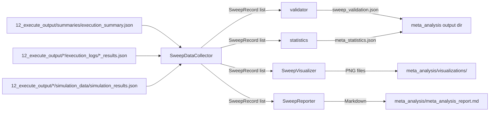

# Meta-Analysis Submodule — Agent Scaffolding

## Overview

The `meta_analysis` submodule within `integration/` provides automated analysis and
visualization of GNN pipeline parameter sweep outputs. It harvests runtime data, simulation
metrics (belief entropy, accuracy), and generates publication-grade scientific visualizations
and comprehensive markdown reports.

## Architecture

```
integration/meta_analysis/
├── __init__.py      ← Entry point: run_meta_analysis() orchestrator
├── collector.py     ← SweepDataCollector: harvests data from 12_execute_output
├── statistics.py    ← compute_meta_statistics → meta_statistics.json
├── validator.py     ← validate_sweep_records → sweep_validation.json
├── visualizer.py    ← SweepVisualizer: matplotlib-based scientific plot generation
├── reporter.py      ← SweepReporter: markdown report generation
├── AGENTS.md        ← This file
└── SPEC.md          ← Module specification
```

## Data Flow



## Generated Outputs

### Publication-Grade Visualizations

- **Scientific Theme**: High-contrast white background, bold typography, and thicker lines.
- **Statistical Annotation**: Power-law exponents ($\alpha$), correlation coefficients ($r$), and median lines.
- **Accessibility**: Standardized colors and clear legends for printed reports.

### Analytical Report

`meta_analysis_report.md` contains:
- **Sweep Configuration**: Grid geometry and framework matrix.
- **Validation summary**: Counts by severity with pointer to `sweep_validation.json`.
- **Aggregate statistics**: Short tables plus pointer to `meta_statistics.json`.
- **Step 3 serialization footprint**: When `../3_gnn_output/format_statistics.json` exists beside `12_execute_output`.
- **Performance Tables**: Runtime stats with automatic unit scaling (s/m).
- **Quality Metrics**: Simulation-derived accuracy and certainty (entropy) data.
- **Scaling Laws**: Empirical derivation of O(N^α) and O(T^β) laws.
- **Regression Data**: $R^2$ and $r$ values for performance-quality correlation.

### Machine-readable exports

Written next to `meta_analysis_report.md`:

| Artifact | Purpose |
|----------|---------|
| `sweep_validation.json` | Grid coverage, timestep mismatches vs `simulation_results.json`, benchmark coherence |
| `meta_statistics.json` | Per-framework runtime aggregates, best framework per (N,T), log-log slopes (schema_version) |

`run_meta_analysis` returns paths (`validation_json`, `statistics_json`) in addition to `records`, `plots`, and `report`.

## Data Model

### SweepRecord

```python
@dataclass
class SweepRecord:
    model_name: str
    framework: str
    num_states: Optional[int]       # N dimension
    num_timesteps: Optional[int]    # T dimension
    execution_time: float           # seconds
    success: bool
    timed_out: bool
    final_accuracy: Optional[float]
    mean_belief_entropy: Optional[float]
    efe_trace: List[float]
    vfe_trace: List[float]
    model_params: Dict[str, Any]
```

## Usage

### Automatic (via pipeline)

```bash
python src/17_integration.py --target-dir input/gnn_files --output-dir output --verbose
```

### Programmatic

```python
from integration.meta_analysis import run_meta_analysis

results = run_meta_analysis(
    execute_output_dir="output/12_execute_output",
    output_dir="output/meta_analysis",
)
```

## Dependencies

- `matplotlib` (required for visualization)
- `numpy` (required for `SweepVisualizer` and `compute_meta_statistics`)
- Standard library only for collector, reporter, and validator

---

**Last Updated**: 2026-05-05
**Version**: 1.7.0
