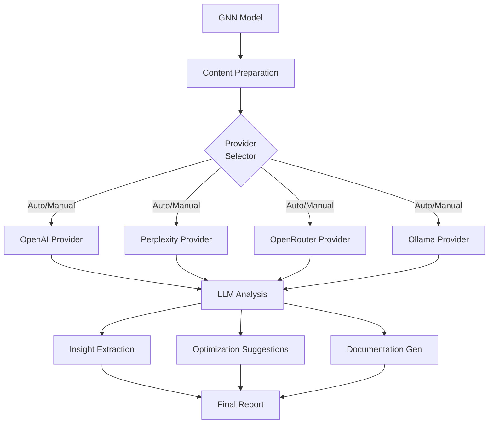

# LLM Module

This module provides comprehensive LLM (Large Language Model) integration capabilities for GNN models, including model analysis, interpretation, AI assistance, and enhanced understanding through multiple LLM providers.

## Module Structure

```
src/llm/
├── __init__.py                    # Module initialization and exports
├── README.md                      # This documentation
├── analyzer.py                    # LLM analysis system
├── demo_enhanced_llm.py          # Enhanced LLM demonstration
├── llm_operations.py             # Core LLM operations
├── llm_processor.py              # LLM processing system
├── mcp.py                        # Model Context Protocol integration
├── prompts.py                    # LLM prompt templates
└── providers/                    # LLM provider implementations
    ├── __init__.py              # Provider initialization
    ├── base_provider.py         # Base provider interface
    ├── openai_provider.py       # OpenAI provider
    ├── openrouter_provider.py   # OpenRouter provider
    ├── perplexity_provider.py   # Perplexity provider
    └── ollama_provider.py       # Ollama (local) provider
```

## Core Components

### LLM Analysis System (`analyzer.py`)

#### `analyze_gnn_model_with_llm(gnn_content: str, model_name: str, analysis_type: str = "comprehensive") -> Dict[str, Any]`
Performs comprehensive LLM analysis of GNN models.

**Analysis Types:**
- **comprehensive**: Full model analysis and interpretation
- **structural**: Model structure and architecture analysis
- **semantic**: Semantic meaning and behavior analysis
- **performance**: Performance characteristics analysis
- **optimization**: Optimization suggestions and improvements

**Returns:**
- Dictionary containing comprehensive analysis results
- Model interpretation and insights
- Performance recommendations
- Optimization suggestions

#### `interpret_model_behavior(gnn_content: str, model_name: str) -> Dict[str, Any]`
Interprets model behavior using LLM analysis.

**Features:**
- Behavioral pattern analysis
- Dynamic behavior interpretation
- Interaction pattern identification
- Performance characteristic analysis

#### `generate_model_documentation(gnn_content: str, model_name: str) -> str`
Generates comprehensive model documentation using LLM.

**Content:**
- Model overview and purpose
- Component descriptions
- Usage instructions
- Performance characteristics
- Optimization recommendations

### LLM Operations (`llm_operations.py`)

#### `process_llm_analysis(target_dir: Path, output_dir: Path, verbose: bool = False) -> bool`
Main function for processing LLM analysis of GNN models.

**Features:**
- Multi-provider LLM analysis
- Comprehensive model interpretation
- Documentation generation
- Performance optimization suggestions

#### `extract_model_insights(gnn_content: str) -> List[Dict[str, Any]]`
Extracts insights from GNN models using LLM analysis.

**Insights:**
- Model complexity analysis
- Performance characteristics
- Optimization opportunities
- Best practices recommendations

#### `generate_optimization_suggestions(gnn_content: str) -> List[Dict[str, Any]]`
Generates optimization suggestions using LLM analysis.

**Suggestions:**
- Performance improvements
- Structural optimizations
- Parameter tuning recommendations
- Best practices implementation

### LLM Provider System (`providers/`)

#### BaseProvider (`base_provider.py`)
Base interface for LLM providers.

**Key Methods:**
- `analyze_model(content: str, analysis_type: str) -> Dict[str, Any]`
- `generate_insights(content: str) -> List[Dict[str, Any]]`
- `optimize_model(content: str) -> Dict[str, Any]`
- `document_model(content: str) -> str`

#### OpenAIProvider (`openai_provider.py`)
OpenAI GPT model integration.

**Features:**
- GPT-4 and GPT-3.5-turbo support
- Advanced model analysis
- Comprehensive documentation generation
- Performance optimization suggestions

#### OpenRouterProvider (`openrouter_provider.py`)
OpenRouter multi-provider integration.

**Features:**
- Multiple LLM provider access
- Cost optimization
- Provider selection based on task
- Fallback mechanisms

#### PerplexityProvider (`perplexity_provider.py`)
Perplexity AI integration.

**Features:**
- Real-time information access
- Current best practices
- Research integration
- Performance benchmarking

### LLM Processing System (`llm_processor.py`)

#### `process_llm_request(content: str, request_type: str, provider: str = "auto") -> Dict[str, Any]`
Processes LLM requests with automatic provider selection.

**Request Types:**
- **analysis**: Model analysis and interpretation
- **optimization**: Performance optimization suggestions
- **documentation**: Model documentation generation
- **insights**: Model insights and recommendations

#### `select_optimal_provider(request_type: str, content_length: int) -> str`
Selects the optimal LLM provider based on request type and content.

**Selection Criteria:**
- Request type requirements
- Content complexity
- Cost considerations
- Performance requirements

## Usage Examples

### Basic LLM Analysis

```python
from llm import analyze_gnn_model_with_llm

# Analyze GNN model with LLM
analysis = analyze_gnn_model_with_llm(
    gnn_content=gnn_content,
    model_name="my_model",
    analysis_type="comprehensive"
)

print(f"Model complexity: {analysis['complexity']}")
print(f"Performance score: {analysis['performance_score']}")
print(f"Optimization suggestions: {len(analysis['optimizations'])}")
```

### Model Interpretation

```python
from llm import interpret_model_behavior

# Interpret model behavior
interpretation = interpret_model_behavior(
    gnn_content=gnn_content,
    model_name="my_model"
)

print(f"Behavioral patterns: {interpretation['patterns']}")
print(f"Dynamic characteristics: {interpretation['dynamics']}")
print(f"Interaction analysis: {interpretation['interactions']}")
```

### Documentation Generation

```python
from llm import generate_model_documentation

# Generate comprehensive documentation
documentation = generate_model_documentation(
    gnn_content=gnn_content,
    model_name="my_model"
)

print("Generated documentation:")
print(documentation)
```

### Provider-Specific Analysis

```python
from llm.providers import OpenAIProvider, PerplexityProvider

# Use specific providers
openai_provider = OpenAIProvider()
perplexity_provider = PerplexityProvider()

# OpenAI analysis
openai_analysis = openai_provider.analyze_model(gnn_content, "comprehensive")

# Perplexity analysis with current research
perplexity_analysis = perplexity_provider.analyze_model(gnn_content, "research")
```

### Optimization Suggestions

```python
from llm import generate_optimization_suggestions

# Generate optimization suggestions
suggestions = generate_optimization_suggestions(gnn_content)

for suggestion in suggestions:
    print(f"Optimization: {suggestion['type']}")
    print(f"Description: {suggestion['description']}")
    print(f"Expected improvement: {suggestion['improvement']}")
```

## LLM Analysis Pipeline



### 1. Content Preparation
```python
# Prepare GNN content for LLM analysis
prepared_content = prepare_content_for_llm(gnn_content)
analysis_context = create_analysis_context(model_name, analysis_type)
```

### 2. Provider Selection
```python
# Select optimal LLM provider
provider = select_optimal_provider(request_type, len(prepared_content))
llm_provider = initialize_provider(provider)
```

### 3. LLM Analysis
```python
# Perform LLM analysis
analysis_result = llm_provider.analyze_model(prepared_content, analysis_type)
insights = llm_provider.generate_insights(prepared_content)
```

### 4. Result Processing
```python
# Process and validate results
processed_results = process_llm_results(analysis_result, insights)
validated_results = validate_analysis_results(processed_results)
```

### 5. Documentation Generation
```python
# Generate comprehensive documentation
documentation = generate_comprehensive_documentation(validated_results)
optimization_report = generate_optimization_report(validated_results)
```

## Integration with Pipeline

### Pipeline Step 13: LLM Processing
```python
# Called from 13_llm.py
def process_llm(target_dir, output_dir, verbose=False, **kwargs):
    # Perform LLM analysis of GNN models
    analysis_results = analyze_gnn_models_with_llm(target_dir, verbose)
    
    # Generate insights and recommendations
    insights = generate_model_insights(analysis_results)
    
    # Create comprehensive documentation
    documentation = generate_llm_documentation(analysis_results, insights)
    
    return True
```

### Output Structure
```
output/13_llm_output/
├── model_analysis.json            # LLM analysis results
├── model_insights.json            # Model insights and recommendations
├── optimization_suggestions.json  # Optimization suggestions
├── model_documentation.md         # Generated documentation
├── performance_analysis.json      # Performance analysis
├── behavioral_analysis.json       # Behavioral analysis
└── llm_summary.md                # LLM processing summary
```

## LLM Providers

### OpenAI Provider
- **Models**: GPT-4, GPT-3.5-turbo
- **Strengths**: Advanced reasoning, comprehensive analysis
- **Use Cases**: Complex model analysis, detailed documentation
- **Cost**: Higher cost for advanced models

### OpenRouter Provider
- **Models**: Multiple providers (Anthropic, Google, etc.)
- **Strengths**: Provider selection, cost optimization
- **Use Cases**: Cost-effective analysis, provider comparison
- **Cost**: Variable based on provider selection

### Perplexity Provider
- **Models**: Real-time information access
- **Strengths**: Current research integration, live data
- **Use Cases**: Research-based analysis, current best practices
- **Cost**: Moderate cost with research benefits

## Analysis Types

### Comprehensive Analysis
- **Model Structure**: Complete model architecture analysis
- **Performance Characteristics**: Performance evaluation and benchmarking
- **Optimization Opportunities**: Identification of improvement areas
- **Best Practices**: Implementation of current best practices
- **Documentation**: Comprehensive model documentation

### Structural Analysis
- **Component Analysis**: Analysis of individual model components
- **Relationship Mapping**: Mapping of component relationships
- **Dependency Analysis**: Analysis of component dependencies
- **Complexity Assessment**: Assessment of model complexity

### Semantic Analysis
- **Meaning Interpretation**: Interpretation of model semantics
- **Behavioral Analysis**: Analysis of model behavior patterns
- **Interaction Analysis**: Analysis of component interactions
- **Purpose Understanding**: Understanding of model purpose and goals

### Performance Analysis
- **Efficiency Assessment**: Assessment of model efficiency
- **Resource Usage**: Analysis of resource utilization
- **Scalability Analysis**: Analysis of scalability characteristics
- **Optimization Recommendations**: Specific optimization suggestions

## Configuration Options

### LLM Settings
```python
# LLM configuration
config = {
    'default_provider': 'auto',     # Default LLM provider
    'analysis_depth': 'comprehensive', # Analysis depth level
    'include_research': True,       # Include current research
    'optimization_focus': True,     # Focus on optimization
    'documentation_style': 'technical', # Documentation style
    'cost_optimization': True       # Enable cost optimization
}
```

### Provider-Specific Settings
```python
# Provider-specific configuration
provider_config = {
    'openai': {
        'model': 'gpt-4',
        'temperature': 0.1,
        'max_tokens': 4000
    },
    'perplexity': {
        'include_research': True,
        'current_best_practices': True
    },
    'openrouter': {
        'cost_optimization': True,
        'provider_selection': 'auto'
    }
}
```

## Error Handling

### LLM Analysis Failures
```python
# Handle LLM analysis failures gracefully
try:
    analysis = analyze_gnn_model_with_llm(content, model_name)
except LLMAnalysisError as e:
    logger.error(f"LLM analysis failed: {e}")
    # Provide fallback analysis or error reporting
```

### Provider Failures
```python
# Handle provider failures gracefully
try:
    provider = select_optimal_provider(request_type, content_length)
    result = provider.analyze_model(content)
except ProviderError as e:
    logger.warning(f"Provider failed: {e}")
    # Fall back to alternative provider
```

### Rate Limiting Issues
```python
# Handle rate limiting issues
try:
    result = process_llm_request(content, request_type)
except RateLimitError as e:
    logger.warning(f"Rate limit exceeded: {e}")
    # Implement retry with backoff
```

## Performance Optimization

### Caching Strategies
- **Analysis Cache**: Cache LLM analysis results
- **Provider Cache**: Cache provider responses
- **Documentation Cache**: Cache generated documentation
- **Insight Cache**: Cache model insights

### Cost Optimization
- **Provider Selection**: Select cost-effective providers
- **Request Batching**: Batch multiple requests
- **Response Caching**: Cache responses to avoid repeated requests
- **Token Optimization**: Optimize token usage

### Performance Monitoring
- **Response Time**: Monitor LLM response times
- **Cost Tracking**: Track API costs
- **Quality Metrics**: Monitor analysis quality
- **Provider Performance**: Track provider performance

## Testing and Validation

### Unit Tests
```python
# Test individual LLM functions
def test_llm_analysis():
    analysis = analyze_gnn_model_with_llm(test_content, "test_model")
    assert 'complexity' in analysis
    assert 'performance_score' in analysis
    assert 'optimizations' in analysis
```

### Integration Tests
```python
# Test complete LLM pipeline
def test_llm_pipeline():
    success = process_llm_analysis(test_dir, output_dir)
    assert success
    # Verify LLM outputs
    llm_files = list(output_dir.glob("**/*"))
    assert len(llm_files) > 0
```

### Provider Tests
```python
# Test different providers
def test_provider_selection():
    providers = ['openai', 'perplexity', 'openrouter']
    for provider in providers:
        result = test_provider(provider, test_content)
        assert result['success']
```

## Dependencies

### Required Dependencies
- **ollama**: Local LLM client (recommended for default runs)
- **requests**: HTTP requests for API calls
- **json**: JSON data handling
- **pathlib**: Path handling

### Optional Dependencies
- **openai**: OpenAI API integration
- **perplexity**: Perplexity AI integration
- **openrouter**: OpenRouter integration
- **tiktoken**: Token counting for OpenAI
- **asyncio**: Asynchronous processing

## Performance Metrics

### Processing Times
- **Small Models** (< 100 variables): 5-30 seconds
- **Medium Models** (100-1000 variables): 30-120 seconds
- **Large Models** (> 1000 variables): 120-600 seconds

### Memory Usage
- **Base Memory**: ~50MB
- **Per Analysis**: ~10-50MB depending on complexity
- **Peak Memory**: 2-3x base usage during analysis

### Cost Metrics
- **OpenAI GPT-4**: ~$0.03-0.06 per 1K tokens
- **OpenAI GPT-3.5**: ~$0.002 per 1K tokens
- **Perplexity**: ~$0.01-0.02 per 1K tokens
- **OpenRouter**: Variable based on provider

## Troubleshooting

### Common Issues

#### 1. API Rate Limiting
```
Error: Rate limit exceeded for OpenAI API
Solution: Implement retry with exponential backoff or use alternative provider
```

#### 2. Token Limit Exceeded
```
Error: Token limit exceeded for model
Solution: Truncate content or use model with higher token limit
```

#### 3. Provider Failures
```
Error: Provider service unavailable
Solution: Fall back to alternative provider or implement retry logic
```

#### 4. Analysis Quality Issues
```
Error: Poor analysis quality or irrelevant results
Solution: Adjust prompts or use different provider with better context
```

### Debug Mode
```python
# Enable debug mode for detailed LLM information
analysis = analyze_gnn_model_with_llm(content, model_name, debug=True, verbose=True)
```

## Configuration for Fast Local Runs (Ollama)

Set these environment variables to use small, fast models locally:

```
OLLAMA_MODEL=smollm2:135m-instruct-q4_K_S
OLLAMA_MAX_TOKENS=256
OLLAMA_TIMEOUT=60
```

You can also point to a different host:

```
OLLAMA_HOST=http://127.0.0.1:11434
```

See models like `smollm2`, `smollm`, and `tinyllama` in the Ollama library.

- `smollm2` tiny variants: smollm2:135m-instruct-q4_K_S, 360m, 1.7b
- `smollm` family (older): smollm:135m, smollm:360m, smollm:1.7b
- `tinyllama`: tinyllama:1.1b

## Future Enhancements

### Planned Features
- **Multi-Modal Analysis**: Support for image and audio analysis
- **Real-time Analysis**: Live analysis during model development
- **Collaborative Analysis**: Multi-LLM collaborative analysis
- **Custom Training**: Custom LLM training for domain-specific analysis

### Performance Improvements
- **Async Processing**: Asynchronous LLM request processing
- **Batch Processing**: Batch processing of multiple models
- **Advanced Caching**: Advanced caching strategies for analysis results
- **Cost Optimization**: Advanced cost optimization algorithms

## Summary

The LLM module provides comprehensive LLM integration capabilities for GNN models, including model analysis, interpretation, AI assistance, and enhanced understanding through multiple LLM providers. The module supports various analysis types, optimization suggestions, and documentation generation to enhance Active Inference research and development.

## License and Citation

This module is part of the GeneralizedNotationNotation project. See the main repository for license and citation information. 