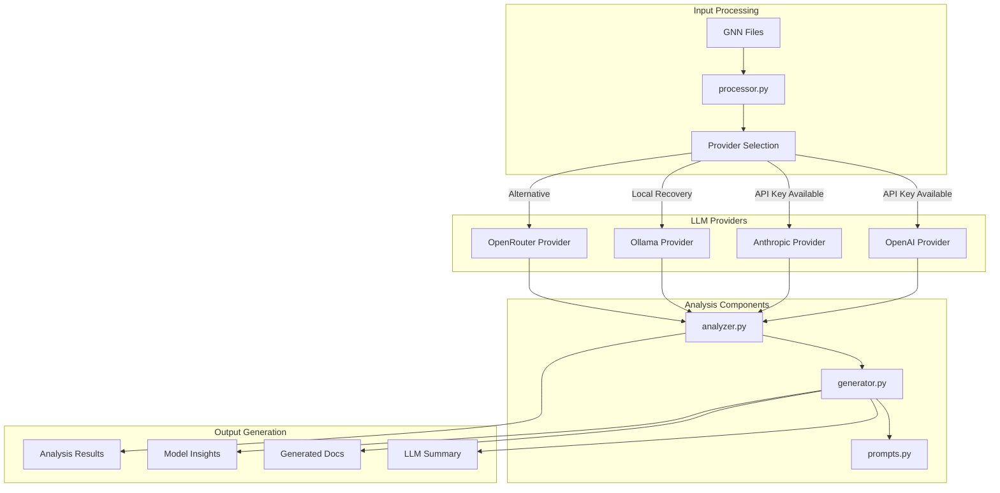
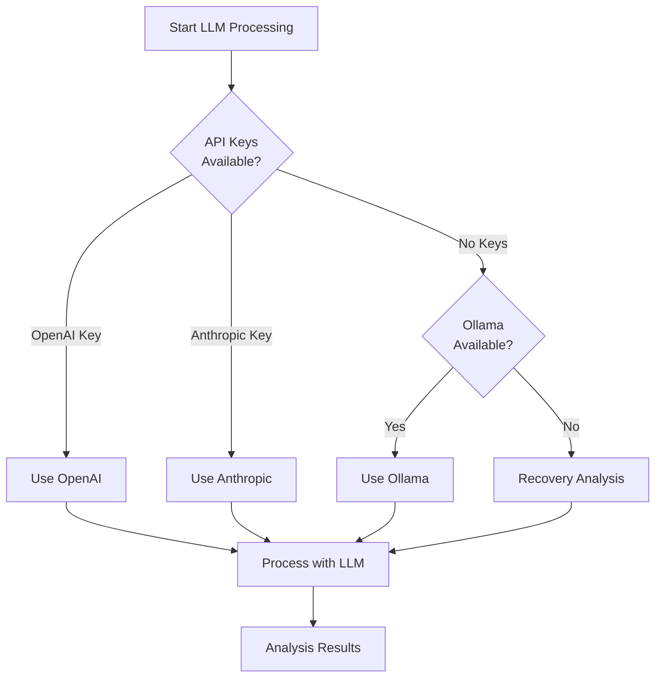
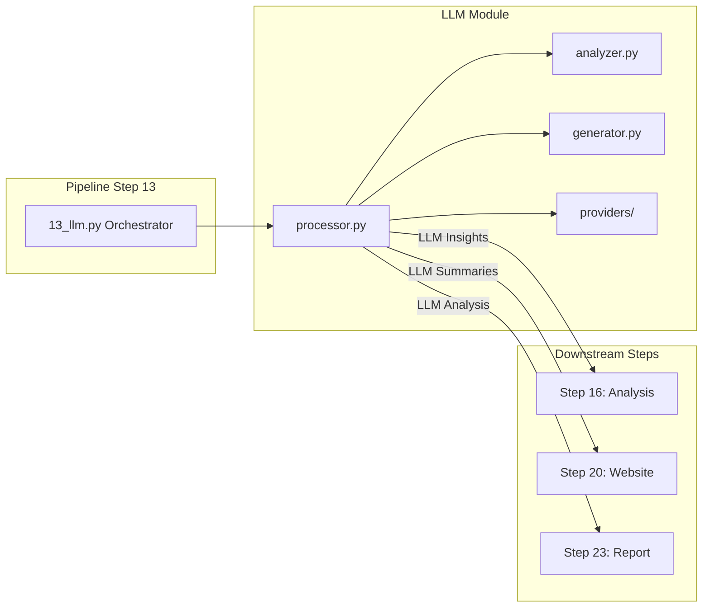
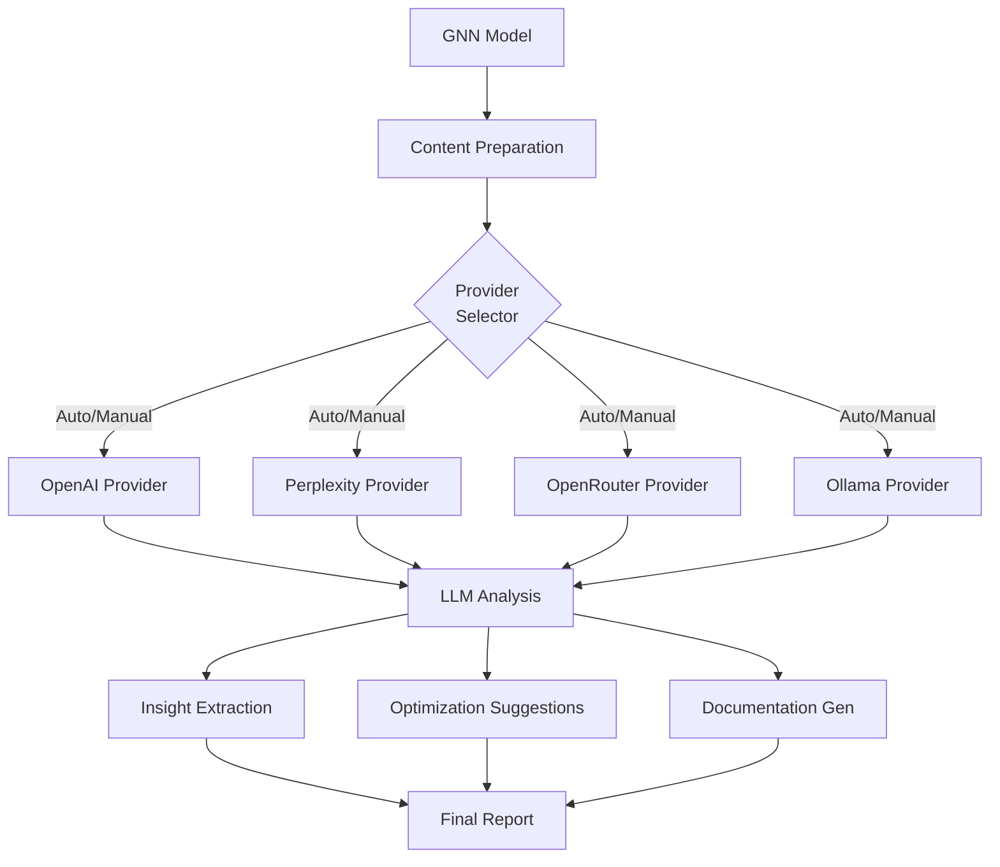

# LLM Module

Multi-provider Large-Language-Model integration for GNN models: parse, interpret,
summarise, and annotate Active Inference specifications through Ollama (local) and,
when API keys are present, OpenAI / OpenRouter / Perplexity. (`ANTHROPIC_API_KEY`
only appears in the provider matrix; there is no Anthropic provider module.)

## Module Structure

```
src/llm/
├── __init__.py                    # Module initialization and exports
├── README.md                      # This documentation
├── analyzer.py                    # LLM analysis system
├── llm_operations.py             # Core LLM operations
├── llm_processor.py              # LLM processing system
├── mcp.py                        # Model Context Protocol integration
├── prompts.py                    # LLM prompt templates
└── providers/                    # LLM provider implementations
    ├── __init__.py              # Provider initialization
    ├── base_provider.py         # Base provider interface
    ├── openai_provider.py       # OpenAI provider
    ├── openrouter_provider.py   # OpenRouter provider
    ├── perplexity_provider.py   # Perplexity provider
    └── ollama_provider.py       # Ollama (local) provider
```

## LLM Processing Architecture


```mermaid
graph TB
    subgraph "Input Processing"
        GNNFile[GNN Files]
        Processor[processor.py]
        ProviderSelect[Provider Selection]
    end
    
    subgraph "LLM Providers"
        OpenAI[OpenAI Provider]
        Anthropic[Anthropic Provider]
        Ollama[Ollama Provider]
        OpenRouter[OpenRouter Provider]
    end
    
    subgraph "Analysis Components"
        Analyzer[analyzer.py]
        Generator[generator.py]
        Prompts[prompts.py]
    end
    
    subgraph "Output Generation"
        Analysis[Analysis Results]
        Insights[Model Insights]
        Documentation[Generated Docs]
        Summary[LLM Summary]
    end
    
    GNNFile --> Processor
    Processor --> ProviderSelect
    
    ProviderSelect -->|API Key Available| OpenAI
    ProviderSelect -->|API Key Available| Anthropic
    ProviderSelect -->|Local Recovery| Ollama
    ProviderSelect -->|Alternative| OpenRouter
    
    OpenAI --> Analyzer
    Anthropic --> Analyzer
    Ollama --> Analyzer
    OpenRouter --> Analyzer
    
    Analyzer --> Generator
    Generator --> Prompts
    
    Analyzer --> Analysis
    Generator --> Insights
    Generator --> Documentation
    Generator --> Summary
```

### Provider Selection Flow


```mermaid
flowchart TD
    Start[Start LLM Processing] --> CheckKeys{API Keys<br/>Available?}
    
    CheckKeys -->|OpenAI Key| UseOpenAI[Use OpenAI]
    CheckKeys -->|Anthropic Key| UseAnthropic[Use Anthropic]
    CheckKeys -->|No Keys| CheckOllama{Ollama<br/>Available?}
    
    CheckOllama -->|Yes| UseOllama[Use Ollama]
    CheckOllama -->|No| Recovery[Recovery Analysis]
    
    UseOpenAI --> Process[Process with LLM]
    UseAnthropic --> Process
    UseOllama --> Process
    Recovery --> Process
    
    Process --> Results[Analysis Results]
```

### Module Integration Flow


```mermaid
flowchart LR
    subgraph "Pipeline Step 13"
        Step13[13_llm.py Orchestrator]
    end
    
    subgraph "LLM Module"
        Processor[processor.py]
        Analyzer[analyzer.py]
        Generator[generator.py]
        Providers[providers/]
    end
    
    subgraph "Downstream Steps"
        Step16[Step 16: Analysis]
        Step20[Step 20: Website]
        Step23[Step 23: Report]
    end
    
    Step13 --> Processor
    Processor --> Analyzer
    Processor --> Generator
    Processor --> Providers
    
    Processor -->|LLM Insights| Step16
    Processor -->|LLM Summaries| Step20
    Processor -->|LLM Analysis| Step23
```

## Core Components

### Heuristic Analysis (`analyzer.py`)

#### `analyze_gnn_file_with_llm(file_path: Path, verbose: bool = False, ollama_model: Optional[str] = None, attempt_llm: bool = True) -> Dict[str, Any] | Coroutine`
Analyzes a GNN file with heuristic extractors (variables, connections, sections, patterns)
and an optional LLM-generated summary. When an event loop is already running, a coroutine
is returned instead of the result dict.

#### `analyze_gnn_model(model_content: str | Dict) -> Dict[str, Any]`
Synchronous heuristic analysis: variables, connections, sections, complexity metrics.

### LLM Operations (`llm_operations.py`)

#### `LLMOperations.summarize_gnn(gnn_content: str, max_length: int = 500, ollama_model: Optional[str] = None) -> str`
Generates a natural-language summary via the multi-provider system; prefers the Ollama
tag supplied by the pipeline when set.

### LLM Provider System (`providers/`)

#### `BaseLLMProvider` (`base_provider.py`)
Abstract base for providers: `generate_response(messages, config) -> LLMResponse`,
`generate_stream(...)`, `initialize()`, `validate_config(config)`, plus the
`default_model` / `available_models` properties and system-prompt helpers.

#### OpenAIProvider (`openai_provider.py`)
OpenAI GPT model integration.

**Features:**
- GPT-4o family and GPT-4/GPT-3.5 model support (default model: `gpt-4o-mini`)
- Advanced model analysis
- Comprehensive documentation generation
- Performance optimization suggestions

#### OpenRouterProvider (`openrouter_provider.py`)
OpenRouter multi-provider integration.

**Features:**
- Multiple LLM provider access
- Cost optimization
- Provider selection based on task
- Recovery mechanisms

#### PerplexityProvider (`perplexity_provider.py`)
Perplexity AI integration.

**Features:**
- Real-time information access
- Current best practices
- Research integration
- Performance benchmarking

### LLM Processing System (`llm_processor.py`)

#### `LLMProcessor` (`llm_processor.py`)
Main processor coordinating multiple providers for GNN analysis. Key methods:
`get_best_provider_for_task(analysis_type)`, `get_response(...)`, `analyze_gnn(...)`,
`get_provider_info()`. A specialized `GNNLLMProcessor` wrapper adds GNN-focused
analysis entry points (`analyze_gnn_model`, `generate_explanation`, `enhance_model`).

## Usage Examples

### Analyze a GNN Model (heuristic extractors + optional LLM summary)

```python
from llm import analyze_gnn_model

# Heuristic structure analysis (variables, connections, sections, patterns)
analysis = analyze_gnn_model(gnn_content)
```

### Analyze a File with Optional Ollama Summary

```python
import asyncio
from llm import analyze_gnn_file_with_llm

result = asyncio.run(
    analyze_gnn_file_with_llm(
        Path("input/gnn_files/actinf_pomdp_agent.md"),
        ollama_model="smollm2:135m-instruct-q4_K_S",
    )
)
print(result["llm_summary"])
```

### Run the Pipeline Step

```python
from llm import process_llm

process_llm(
    Path("input/gnn_files"),
    Path("output/13_llm_output"),
    verbose=True,
)
```

### Use a Specific Provider Directly

```python
from llm.providers import get_openai_provider_class
from llm.providers.base_provider import LLMMessage

provider = get_openai_provider_class()()
provider.initialize()
response = provider.generate_response(
    [LLMMessage(role="user", content=gnn_content)]
)
print(response.content, response.model_used)
```

## LLM Analysis Pipeline


```mermaid
graph TD
    Input[GNN Model] --> Prep[Content Preparation]
    Prep --> Selector{Provider<br/>Selector}
    
    Selector -->|Auto/Manual| OpenAI[OpenAI Provider]
    Selector -->|Auto/Manual| Perplexity[Perplexity Provider]
    Selector -->|Auto/Manual| OpenRouter[OpenRouter Provider]
    Selector -->|Auto/Manual| Ollama[Ollama Provider]
    
    OpenAI --> Analysis[LLM Analysis]
    Perplexity --> Analysis
    OpenRouter --> Analysis
    Ollama --> Analysis
    
    Analysis --> Insights[Insight Extraction]
    Analysis --> Opt[Optimization Suggestions]
    Analysis --> Doc[Documentation Gen]
    
    Insights --> Report[Final Report]
    Opt --> Report
    Doc --> Report
```

The pipeline is implemented inside `llm/processor.py`: content preparation (with ontology
injection from `10_ontology_output/`), provider selection via `LLMProcessor`, per-prompt
executions with cache lookups, and per-file markdown output.

## Integration with Pipeline

### Pipeline Step 13: LLM Processing
```python
# Called from 13_llm.py
def process_llm(target_dir, output_dir, verbose=False, **kwargs):
    # Discover GNN files, select providers, run structured + custom prompts
    # per file, write results and cache entries
    return True
```

### Output Structure
```
output/13_llm_output/
├── llm_results.json               # Full processing results (per-file analyses, provider matrix, cache stats)
├── llm_summary.md                 # Human-readable processing summary
└── llm_results/<model>/prompts_*/ # Per-file prompt outputs as markdown
```

## LLM Providers

### OpenAI Provider
- **Models**: GPT-4o family, GPT-4, GPT-3.5-turbo (default `gpt-4o-mini`)
- **Strengths**: Advanced reasoning, comprehensive analysis
- **Cost**: Higher cost for advanced models

### OpenRouter Provider
- **Models**: Multiple providers (OpenAI, Anthropic, Google, Meta, etc.)
- **Strengths**: Provider selection, cost optimization
- **Cost**: Variable based on provider selection

### Perplexity Provider
- **Models**: Sonar online models (default `llama-3.1-sonar-large-128k-online`)
- **Strengths**: Current research integration, live data
- **Cost**: Moderate cost with research benefits

## Analysis Types

### Comprehensive Analysis
- **Model Structure**: Complete model architecture analysis
- **Performance Characteristics**: Performance evaluation and benchmarking
- **Optimization Opportunities**: Identification of improvement areas
- **Best Practices**: Implementation of current best practices
- **Documentation**: Comprehensive model documentation

### Structural Analysis
### OpenAI Provider
- **Models**: GPT-4o family, GPT-4, GPT-3.5-turbo (default `gpt-4o-mini`)
- **Complexity Assessment**: Assessment of model complexity

### Semantic Analysis
- **Meaning Interpretation**: Interpretation of model semantics
- **Behavioral Analysis**: Analysis of model behavior patterns
- **Interaction Analysis**: Analysis of component interactions
- **Purpose Understanding**: Understanding of model purpose and goals

### Performance Analysis
- **Efficiency Assessment**: Assessment of model efficiency
- **Resource Usage**: Analysis of resource utilization
- **Scalability Analysis**: Analysis of scalability characteristics
- **Optimization Recommendations**: Specific optimization suggestions

## Configuration Options

### LLM Settings (`input/config.yaml`, `llm:` section)
```python
# Keys read by llm/processor.py
llm_config = {
    "model": "smollm2:135m-instruct-q4_K_S",  # preferred Ollama tag
    "timeout_seconds": 600,                    # step timeout budget
    "max_files": None,                         # cap on files per run
    "prompt_timeout": 45,                      # per-prompt timeout (seconds)
}
```

### Provider-Specific Settings (environment variables)
```bash
OLLAMA_MODEL=smollm2:135m-instruct-q4_K_S
OLLAMA_MAX_TOKENS=256
OLLAMA_TIMEOUT=60
OPENAI_API_KEY=...            # enables the OpenAI provider
OPENROUTER_API_KEY=...        # enables the OpenRouter provider
PERPLEXITY_API_KEY=...        # enables the Perplexity provider
DEFAULT_PROVIDER=ollama       # preferred provider order
```

## Testing

Tests live in `src/tests/llm/` (module-level, functional, Ollama, Ollama integration).

```bash
uv run --extra dev python -m pytest src/tests/test_llm*.py -v
```

## Dependencies

### Core Dependencies (installed by `uv sync`; no dedicated pip extra)
- **openai**: OpenAI/OpenRouter API access
- **ollama** (PyPI): Local Ollama client; CLI recovery when the client is unusable

### Runtime Requirement
- **Ollama runtime** (CLI/daemon from https://ollama.com) for local inference; not a pip package

## Performance Metrics

Measure on your own hardware and model sizes; this document does not track timings or costs.


## Troubleshooting

### Common Issues

#### 1. API Rate Limiting
```
Error: Rate limit exceeded for OpenAI API
Solution: Implement retry with exponential backoff or use alternative provider
```

#### 2. Token Limit Exceeded
```
Error: Token limit exceeded for model
Solution: Truncate content or use model with higher token limit
```

#### 3. Provider Failures
```
Error: Provider service unavailable
Solution: Fall back to alternative provider or implement retry logic
```

#### 4. Analysis Quality Issues
```
Error: Poor analysis quality or irrelevant results
Solution: Adjust prompts or use different provider with better context
```

## Configuration for Fast Local Runs (Ollama)

Set these environment variables to use small, fast models locally:

```
OLLAMA_MODEL=smollm2:135m-instruct-q4_K_S
OLLAMA_MAX_TOKENS=256
OLLAMA_TIMEOUT=60
```

Default tag is also defined in code as `llm.defaults.DEFAULT_OLLAMA_MODEL`. Override with `OLLAMA_MODEL` or `input/config.yaml` `llm.model`.

`process_llm` passes the selected tag to every structured and custom prompt via `get_response(..., model_name=...)`, and into per-file summarization when Ollama is available. Summary tasks prefer Ollama before cloud providers when registered. If OpenAI returns quota errors, unset `OPENAI_API_KEY` for local-only runs.

You can also point to a different host:

```
OLLAMA_HOST=http://127.0.0.1:11434
```

Common Ollama tags: `smollm2:135m-instruct-q4_K_S`, `gemma3:4b`, `tinyllama`, and larger `llama2` variants — see https://ollama.com/library

## Summary

The module analyses GNN models with an LLM of the caller's choosing, prefers local
Ollama when no cloud keys are set, and writes per-model summary / explanation /
optimisation artifacts into `output/13_llm_output/` for downstream consumption by
steps 16, 20, and 23.

## License and Citation

This module is part of the GeneralizedNotationNotation project. See the main repository for license and citation information. 

---
## Documentation
- **[README](README.md)**: Module Overview
- **[AGENTS](AGENTS.md)**: Agentic Workflows
- **[SPEC](SPEC.md)**: Architectural Specification
- **[SKILL](SKILL.md)**: Capability API
