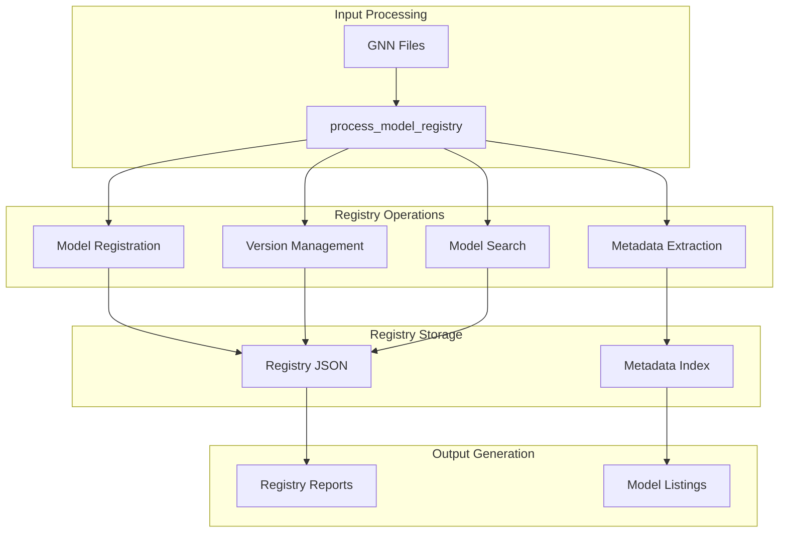
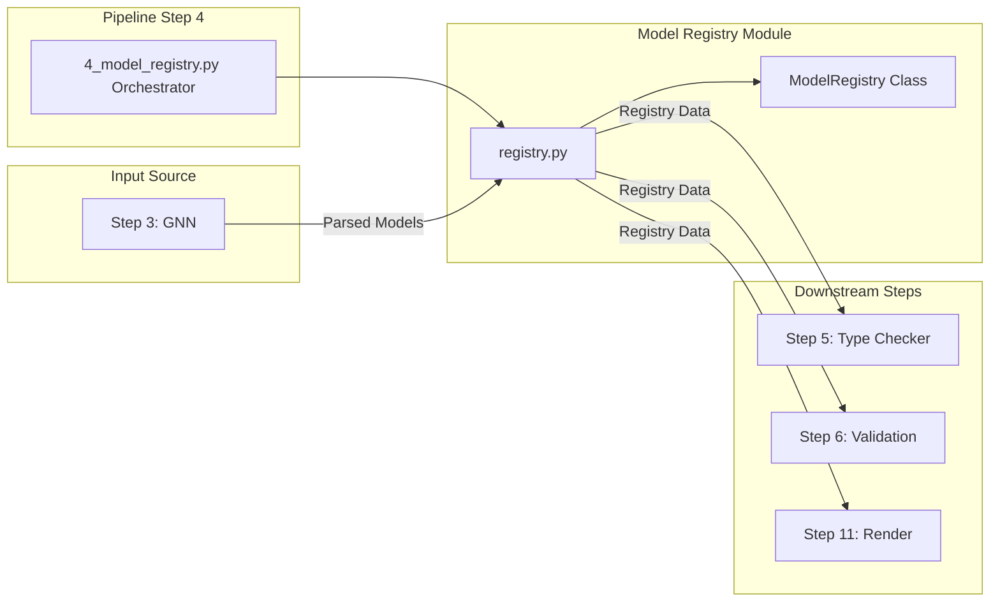
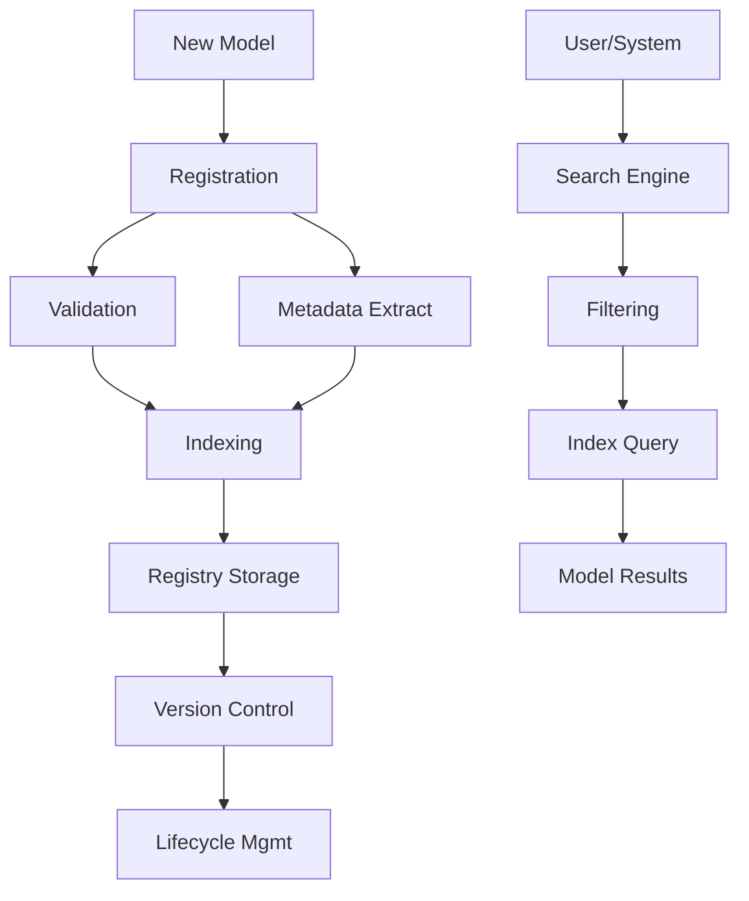

# Model Registry Module

This module provides comprehensive model registry capabilities for GNN models, including versioning, metadata management, model discovery, and lifecycle management.

## Module Structure

```
src/model_registry/
├── __init__.py                    # Module initialization and exports
├── README.md                      # This documentation
├── AGENTS.md                      # Agent scaffolding documentation
├── PAI.md                         # PAI context documentation
├── SPEC.md                        # Module specification
├── mcp.py                         # Model Context Protocol integration
└── registry.py                    # Core registry functionality
```

### Registry Architecture



### Module Integration Flow



## Core Components

### Model Registry Functions

#### `process_model_registry(target_dir: Path, output_dir: Path, **kwargs) -> Dict[str, Any]`

Main function for processing model registry tasks.

**Features:**

- Discovers all GNN `.md` files in target directory
- Registers each model with automatic metadata extraction
- Persists registry to JSON

**Returns:**

- `Dict[str, Any]`: Dictionary with `processed_files`, `successful_registrations`, `registry_path`, and `total_models`

### ModelRegistry Class Methods

#### `register_model(model_path: Path) -> bool`

Registers a GNN model in the registry with auto-extracted metadata.

**Features:**

- Automatic model name extraction from GNN `ModelName` section
- SHA-256 content hashing for integrity
- Version tracking with semantic versioning
- Metadata extraction (author, description, tags)

#### `get_model(model_id: str) -> Optional[ModelEntry]`

Retrieves a model entry by its ID.

#### `search_models(query: str) -> List[ModelEntry]`

Searches models by name, description, or tags.

**Search Behavior:**

- Case-insensitive matching
- Searches across model name, description, and tags

#### `list_models() -> List[ModelEntry]`

Returns all registered models.

#### `delete_model(model_id: str) -> bool`

Deletes a model from the registry.

#### `save() -> None`

Persists registry state to the JSON file.

#### `load() -> None`

Loads registry state from the JSON file.

### ModelEntry Methods

#### `add_version(version: ModelVersion) -> None`

Adds a new version to the model entry.

#### `get_version(version: Optional[str] = None) -> Optional[ModelVersion]`

Gets a specific version, or the current version if `None`.

#### `add_tag(tag: str) -> None`

Adds a searchable tag to the model.

#### `remove_tag(tag: str) -> None`

Removes a tag from the model.

#### `update_metadata(metadata: Dict[str, Any]) -> None`

Updates model metadata dictionary.

## Usage Examples

### Basic Model Registration

```python
from model_registry import ModelRegistry

# Create and load registry
registry = ModelRegistry(registry_path=Path("output/registry.json"))
registry.load()

# Register a GNN model
success = registry.register_model(Path("models/my_model.md"))
print(f"Registration: {'OK' if success else 'FAIL'}")

# Save the registry
registry.save()
```

### Model Search and Retrieval

```python
from model_registry import ModelRegistry

registry = ModelRegistry(Path("output/registry.json"))
registry.load()

# Search models
results = registry.search_models("active inference")
for model in results:
    print(f"Found: {model.name} (ID: {model.model_id})")

# Get specific model
model = registry.get_model("pomdp_agent")
if model:
    version = model.get_version()
    print(f"Current version: {version.version}, hash: {version.hash}")
```

### Batch Processing

```python
from model_registry import process_model_registry

results = process_model_registry(
    target_dir=Path("input/gnn_files"),
    output_dir=Path("output/4_model_registry_output")
)
print(f"Registered {results['successful_registrations']} of {results['processed_files']} files")
```

## Registry Pipeline



### 1. Model Discovery

```python
# Discover models in target directory
models = discover_models(target_dir)
model_paths = [model['path'] for model in models]
```

### 2. Metadata Extraction

```python
# Extract metadata from models
for model_path in model_paths:
    metadata = extract_model_metadata(model_path)
    validate_metadata(metadata)
```

### 3. Model Registration

```python
# Register models with metadata
for model_path, metadata in zip(model_paths, metadata_list):
    model_id = register_model(model_path, metadata)
    index_model(model_id, metadata)
```

### 4. Registry Maintenance

```python
# Maintain registry integrity
cleanup_registry()
update_indexes()
validate_registry()
```

### 5. Registry Reporting

```python
# Generate registry reports
registry_stats = generate_registry_statistics()
registry_report = create_registry_report(registry_stats)
```

## Integration with Pipeline

### Pipeline Step 4: Model Registry

```python
# Called from 4_model_registry.py
from model_registry import process_model_registry

results = process_model_registry(
    target_dir=Path("input/gnn_files"),
    output_dir=Path("output/4_model_registry_output")
)
```

### Output Structure

```
output/4_model_registry_output/
└── model_registry.json             # Complete registry data
```

## Registry Features

### Model Discovery

- **Automatic Discovery**: Automatically discover GNN models
- **Metadata Extraction**: Extract metadata from model files
- **Validation**: Validate model structure and metadata
- **Indexing**: Create searchable indexes

### Version Control

- **Semantic Versioning**: Support for semantic versioning
- **Change Tracking**: Track changes between versions
- **Migration Support**: Support for model migrations
- **Rollback Capability**: Rollback to previous versions

### Search and Discovery

- **Text Search**: Full-text search across model metadata
- **Filtered Search**: Search with multiple filters
- **Tag-based Search**: Search by model tags
- **Performance Search**: Search by performance metrics

### Lifecycle Management

- **Model States**: Active, deprecated, archived, deleted
- **State Transitions**: Controlled state transitions
- **Audit Trail**: Complete audit trail for all changes
- **Cleanup Procedures**: Automated cleanup procedures

## Configuration Options

### Registry Settings

```python
# Registry configuration
config = {
    'registry_path': 'models/registry',  # Registry storage path
    'index_enabled': True,              # Enable search indexing
    'versioning_enabled': True,         # Enable version control
    'backup_enabled': True,             # Enable automatic backups
    'cleanup_enabled': True,            # Enable automatic cleanup
    'max_versions': 10,                 # Maximum versions per model
    'archive_after_days': 365           # Archive models after days
}
```

### Metadata Settings

```python
# Metadata configuration
metadata_config = {
    'required_fields': ['name', 'description', 'author'],
    'optional_fields': ['tags', 'performance', 'dependencies'],
    'validation_rules': {
        'name': 'min_length:3',
        'description': 'min_length:10',
        'performance': 'range:0-1'
    },
    'auto_extraction': True,            # Auto-extract metadata
    'validation_enabled': True          # Enable metadata validation
}
```

## Error Handling

### Registration Failures

```python
# Handle registration failures gracefully
try:
    model_id = register_model(model_path, metadata)
except RegistrationError as e:
    logger.error(f"Model registration failed: {e}")
    # Provide fallback registration or error reporting
```

### Search Failures

```python
# Handle search failures gracefully
try:
    results = search_models(query, filters)
except SearchError as e:
    logger.warning(f"Search failed: {e}")
    # Provide fallback search or error reporting
```

### Version Management Issues

```python
# Handle version management issues
try:
    new_version = create_model_version(model_id, version)
except VersionError as e:
    logger.error(f"Version creation failed: {e}")
    # Provide fallback versioning or error reporting
```

## Performance Optimization

### Indexing Optimization

- **Incremental Indexing**: Update indexes incrementally
- **Background Indexing**: Index in background processes
- **Index Compression**: Compress indexes for storage efficiency
- **Search Optimization**: Optimize search algorithms

### Storage Optimization

- **Metadata Compression**: Compress metadata storage
- **Version Storage**: Efficient version storage
- **Cleanup Procedures**: Automated cleanup procedures
- **Backup Optimization**: Optimize backup procedures

### Search Optimization

- **Full-text Search**: Optimize full-text search
- **Filtered Search**: Optimize filtered search
- **Caching**: Cache search results
- **Pagination**: Efficient pagination for large result sets

## Testing and Validation

### Unit Tests

```python
# Test individual registry functions
def test_model_registration():
    model_id = register_model(test_model_path, test_metadata)
    assert model_id is not None
    model_info = get_model_info(model_id)
    assert model_info['name'] == test_metadata['name']
```

### Integration Tests

```python
# Test complete registry pipeline
def test_registry_pipeline():
    success = process_model_registry(test_dir, output_dir)
    assert success
    # Verify registry outputs
    registry_files = list(output_dir.glob("**/*"))
    assert len(registry_files) > 0
```

### Performance Tests

```python
# Test registry performance
def test_registry_performance():
    start_time = time.time()
    results = search_models("test query")
    end_time = time.time()
    
    assert len(results) > 0
    assert (end_time - start_time) < 1.0  # Should complete within 1 second
```

## Dependencies

### Required Dependencies

- **pathlib**: Path handling
- **json**: JSON data handling
- **hashlib**: SHA-256 hash generation
- **datetime**: Timestamp generation
- **re**: Metadata pattern extraction

### Optional Dependencies

- None required

## Performance Metrics

### Processing Times

- **Model Registration**: < 1 second per model
- **Metadata Extraction**: < 0.5 seconds per model
- **Search Operations**: < 0.1 seconds per query
- **Version Creation**: < 0.5 seconds per version

### Memory Usage

- **Base Memory**: ~20MB
- **Per Model**: ~1-5MB depending on metadata size
- **Peak Memory**: 1.5-2x base usage during operations

### Storage Requirements

- **Metadata Storage**: ~1-10KB per model
- **Index Storage**: ~5-50KB per model
- **Version Storage**: ~1-5KB per version
- **Backup Storage**: 2-3x base storage

## Troubleshooting

### Common Issues

#### 1. Registration Failures

```
Error: Model registration failed - invalid metadata
Solution: Validate metadata format and required fields
```

#### 2. Search Issues

```
Error: Search operation failed - index corruption
Solution: Rebuild search indexes or restore from backup
```

#### 3. Version Management Issues

```
Error: Version creation failed - dependency conflict
Solution: Resolve dependency conflicts or use force option
```

#### 4. Performance Issues

```
Error: Registry operations taking too long
Solution: Optimize indexes or increase system resources
```

### Debug Mode

```python
# Enable verbose output for registry operations
results = process_model_registry(target_dir, output_dir)
print(json.dumps(results, indent=2))
```

## Future Enhancements

### Planned Features

- **Distributed Registry**: Distributed registry across multiple nodes
- **Advanced Search**: Advanced search with ML-based ranking
- **Model Marketplace**: Model marketplace and sharing capabilities
- **Automated Testing**: Automated model testing and validation

### Performance Improvements

- **Advanced Indexing**: Advanced indexing strategies
- **Distributed Storage**: Distributed storage capabilities
- **Real-time Updates**: Real-time registry updates
- **Advanced Caching**: Advanced caching strategies

## Summary

The Model Registry module provides comprehensive model registry capabilities for GNN models, including versioning, metadata management, model discovery, and lifecycle management. The module ensures efficient model organization, search capabilities, and lifecycle management to support Active Inference research and development.

## License and Citation

This module is part of the GeneralizedNotationNotation project. See the main repository for license and citation information.

## References

- Project overview: ../../README.md
- Comprehensive docs: ../../DOCS.md
- Architecture guide: ../../ARCHITECTURE.md
- Pipeline details: ../../doc/pipeline/README.md
