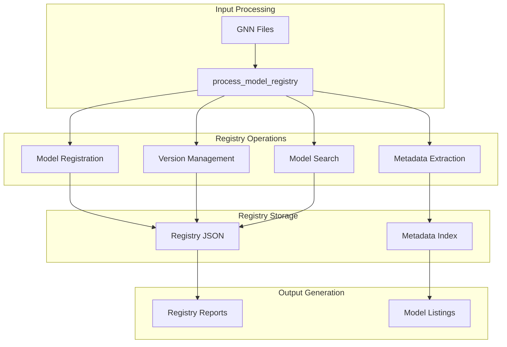
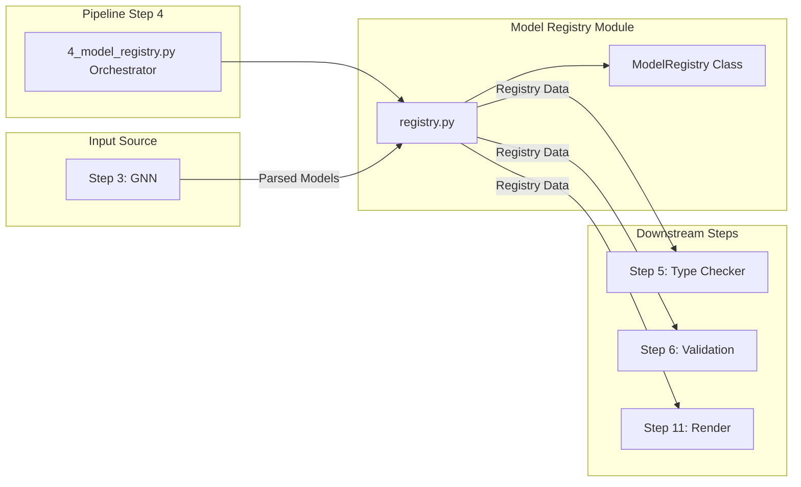

# Model Registry Module

This module provides comprehensive model registry capabilities for GNN models, including versioning, metadata management, model discovery, and lifecycle management.

## Module Structure

```
src/model_registry/
├── __init__.py                    # Module initialization and exports
├── README.md                      # This documentation
├── AGENTS.md                      # Agent scaffolding documentation
├── SPEC.md                        # Module specification
├── mcp.py                         # Model Context Protocol integration
└── registry.py                    # Core registry functionality
```

### Registry Architecture


```mermaid
graph TB
    subgraph "Input Processing"
        GNNFiles[GNN Files]
        Processor[process_model_registry]
    end
    
    subgraph "Registry Operations"
        Register[Model Registration]
        Version[Version Management]
        Metadata[Metadata Extraction]
        Search[Model Search]
    end
    
    subgraph "Registry Storage"
        RegistryFile[Registry JSON]
        MetadataDB[Metadata Index]
    end
    
    subgraph "Output Generation"
        RegistryReports[Registry Reports]
        ModelList[Model Listings]
    end
    
    GNNFiles --> Processor
    Processor --> Register
    Processor --> Version
    Processor --> Metadata
    Processor --> Search
    
    Register --> RegistryFile
    Version --> RegistryFile
    Metadata --> MetadataDB
    Search --> RegistryFile
    
    RegistryFile --> RegistryReports
    MetadataDB --> ModelList
```

### Module Integration Flow


```mermaid
flowchart LR
    subgraph "Pipeline Step 4"
        Step4[4_model_registry.py Orchestrator]
    end
    
    subgraph "Model Registry Module"
        Processor[registry.py]
        Registry[ModelRegistry Class]
    end
    
    subgraph "Input Source"
        Step3[Step 3: GNN]
    end
    
    subgraph "Downstream Steps"
        Step5[Step 5: Type Checker]
        Step6[Step 6: Validation]
        Step11[Step 11: Render]
    end
    
    Step4 --> Processor
    Processor --> Registry
    
    Step3 -->|Parsed Models| Processor
    
    Processor -->|Registry Data| Step5
    Processor -->|Registry Data| Step6
    Processor -->|Registry Data| Step11
```

## Core Components

### Model Registry Functions

#### `process_model_registry(target_dir: Path, output_dir: Path, **kwargs) -> Dict[str, Any]`

Main function for processing model registry tasks.

**Features:**

- Discovers all GNN files in target directory (`.md`, `.gnn`, `.json`, `.yaml`, `.yml`)
- Registers each model with automatic metadata extraction
- Persists registry to JSON

**Returns:**

- `Dict[str, Any]`: Dictionary with `processed_files`, `successful_registrations`, `registry_path`, and `total_models`

### ModelRegistry Class Methods

#### `register_model(model_path: Path) -> bool`

Registers a GNN model in the registry with auto-extracted metadata.

**Features:**

- Automatic model name extraction from GNN `ModelName` section
- SHA-256 content hashing for integrity
- Version tracking with semantic versioning
- Metadata extraction (author, description, tags)

#### `get_model(model_id: str) -> Optional[ModelEntry]`

Retrieves a model entry by its ID.

#### `search_models(query: str) -> List[ModelEntry]`

Searches models by name, description, or tags.

**Search Behavior:**

- Case-insensitive matching
- Searches across model name, description, and tags

#### `list_models() -> List[ModelEntry]`

Returns all registered models.

#### `delete_model(model_id: str) -> bool`

Deletes a model from the registry.

#### `save() -> None`

Persists registry state to the JSON file.

#### `load() -> None`

Loads registry state from the JSON file.

### ModelEntry Methods

#### `add_version(version: ModelVersion) -> None`

Adds a new version to the model entry.

#### `get_version(version: Optional[str] = None) -> Optional[ModelVersion]`

Gets a specific version, or the current version if `None`.

#### `add_tag(tag: str) -> None`

Adds a searchable tag to the model.

#### `remove_tag(tag: str) -> None`

Removes a tag from the model.

#### `update_metadata(metadata: Dict[str, Any]) -> None`

Updates model metadata dictionary.

## Usage Examples

### Basic Model Registration

```python
from model_registry import ModelRegistry

# Create and load registry
registry = ModelRegistry(registry_path=Path("output/registry.json"))
registry.load()

# Register a GNN model
success = registry.register_model(Path("models/my_model.md"))
print(f"Registration: {'OK' if success else 'FAIL'}")

# Save the registry
registry.save()
```

### Model Search and Retrieval

```python
from model_registry import ModelRegistry

registry = ModelRegistry(Path("output/registry.json"))
registry.load()

# Search models
results = registry.search_models("active inference")
for model in results:
    print(f"Found: {model.name} (ID: {model.model_id})")

# Get specific model
model = registry.get_model("pomdp_agent")
if model:
    version = model.get_version()
    print(f"Current version: {version.version}, hash: {version.hash}")
```

### Batch Processing

```python
from model_registry import process_model_registry

results = process_model_registry(
    target_dir=Path("input/gnn_files"),
    output_dir=Path("output/4_model_registry_output"),
)
print(
    f"Registered {results['successful_registrations']} of {results['processed_files']} files"
)
```

## Registry Workflow

1. `process_model_registry` scans `target_dir` for GNN files and calls `register_model` on each.
2. `register_model` extracts the model name, version, description, tags, and metadata from the file content, hashes the file (SHA-256), and appends a `ModelVersion` to the entry.
3. The registry is persisted to `model_registry.json` in the output directory.

There are no separate discover/index/cleanup/report entry points; everything above happens inside `process_model_registry`.

## Integration with Pipeline

### Pipeline Step 4: Model Registry

```python
# Called from 4_model_registry.py
from model_registry import process_model_registry

results = process_model_registry(
    target_dir=Path("input/gnn_files"),
    output_dir=Path("output/4_model_registry_output"),
)
```

### Output Structure

```
output/4_model_registry_output/
└── model_registry.json             # Complete registry data
```

## Features

- Model registration with automatic metadata extraction (name, version, author, date, license, tags, description)
- Version history per model via `ModelVersion` entries
- Case-insensitive search across names, descriptions, and tags
- JSON-based registry persistence
- MCP integration for programmatic access (see `mcp.py`)

## Configuration Options

`process_model_registry` accepts `registry_path` (custom registry file path) and `query_ontology` (substring filter on registered models); the step CLI exposes them as `--registry-path` and `--query-ontology`. There are no other configuration options.

## Error Handling

- `register_model` catches all exceptions (unreadable file, parse failure), logs them, and returns `False`; `process_model_registry` continues with the remaining files.
- `load` logs an error and starts with an empty registry if the JSON file is invalid.
- There is no file locking, backup, or corruption-recovery mechanism.

## Testing

Tests live in `src/tests/model_registry/` (`test_model_registry_overall.py`, `test_model_registry_roundtrip.py`, `test_model_registry_public_api.py`).

## Dependencies

Standard library only: `pathlib`, `json`, `hashlib`, `datetime`, `re`.

## Troubleshooting

- **A model is not in the registry**: check that its extension is one of `.md`, `.gnn`, `.json`, `.yaml`, `.yml` and that the file is readable; failed registrations are logged.
- **Registry looks empty**: an invalid registry JSON is treated as empty and overwritten on the next `save`.

## Summary

The Model Registry module provides model registration with metadata extraction, version history, search, and JSON persistence for GNN models.


## License and Citation

This module is part of the GeneralizedNotationNotation project. See the main repository for license and citation information.

## References

- Project overview: ../../README.md
- Comprehensive docs: ../../DOCS.md
- Architecture guide: ../../ARCHITECTURE.md
- Pipeline details: ../../doc/pipeline/README.md


---
## Documentation
- **[README](README.md)**: Module Overview
- **[AGENTS](AGENTS.md)**: Agentic Workflows
- **[SPEC](SPEC.md)**: Architectural Specification
- **[SKILL](SKILL.md)**: Capability API
