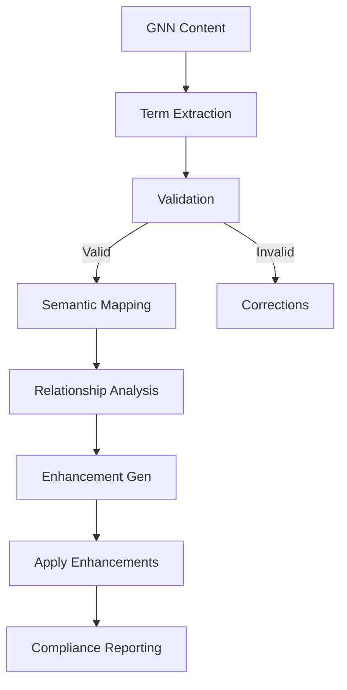
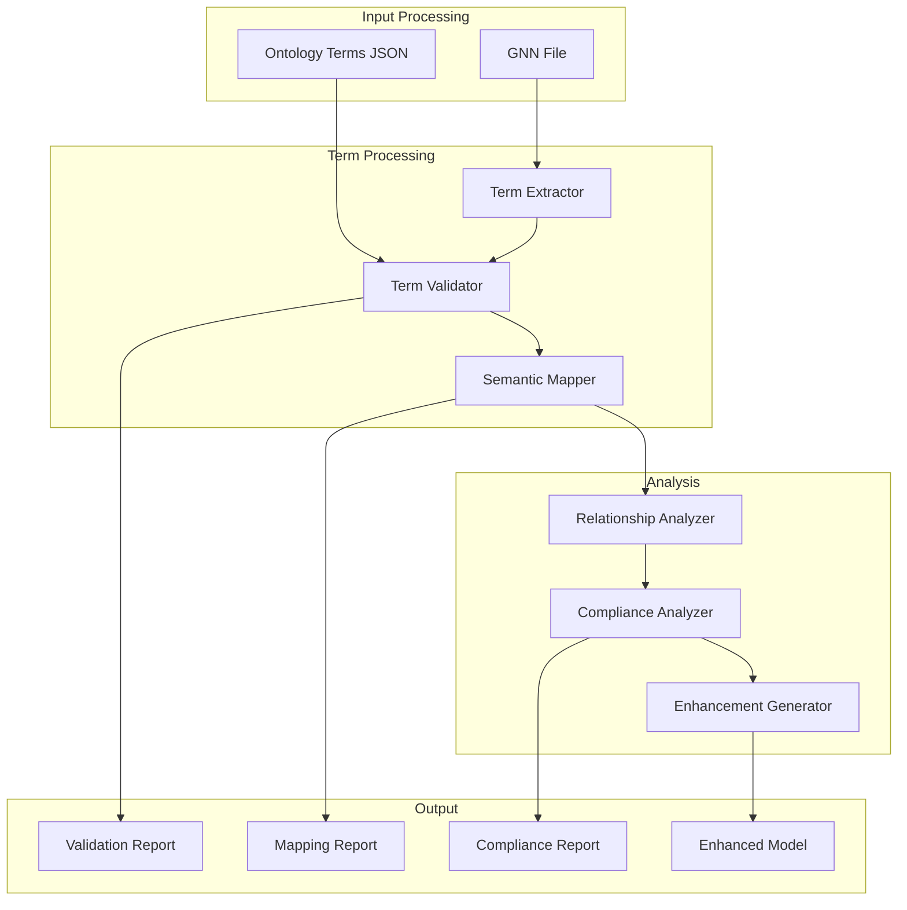
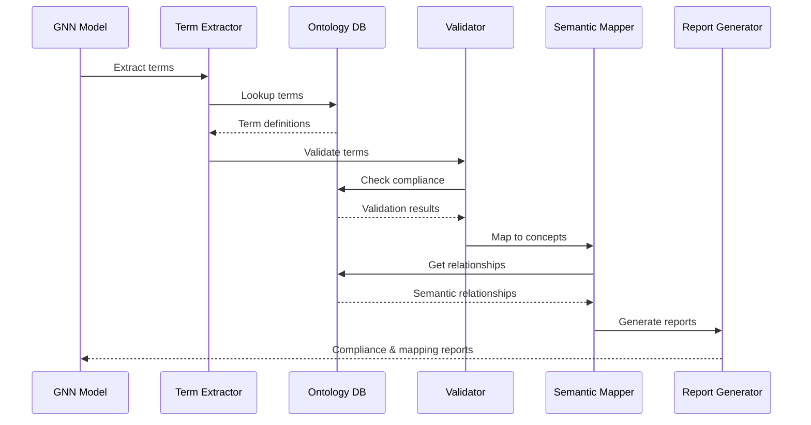

# Ontology Module

This module provides comprehensive ontology processing capabilities for Active Inference concepts, including term validation, semantic analysis, and ontology-driven model enhancement.

## Module Structure

```
src/ontology/
├── __init__.py                    # Module initialization and exports
├── README.md                      # This documentation
├── mcp.py                         # Model Context Protocol integration
├── processor.py                   # Core ontology processing
└── act_inf_ontology_terms.json   # Active Inference ontology terms
```

## Core Components

### Ontology Processing Functions

#### `process_ontology(target_dir: Path, output_dir: Path, verbose: bool = False, **kwargs) -> bool`
Main function for processing ontology-related tasks.

**Features:**
- Ontology term validation
- Semantic analysis and mapping
- Ontology-driven model enhancement
- Term consistency checking
- Ontology integration

**Returns:**
- `bool`: Success status of ontology operations

### Ontology Management Functions

#### `validate_ontology_terms(content: str) -> Dict[str, Any]`
Validates GNN content against Active Inference ontology terms.

**Validation Features:**
- Term existence checking
- Semantic consistency validation
- Ontology compliance verification
- Term relationship validation
- Context-aware validation

#### `map_ontology_terms(content: str) -> Dict[str, Any]`
Maps GNN content to ontology terms and relationships.

**Mapping Features:**
- Term identification and extraction
- Relationship mapping
- Semantic similarity analysis
- Ontology alignment
- Term hierarchy mapping

#### `enhance_with_ontology(content: str) -> str`
Enhances GNN content with ontology-driven improvements.

**Enhancement Features:**
- Term standardization
- Semantic enrichment
- Relationship clarification
- Ontology compliance
- Best practices integration

### Active Inference Ontology

#### Core Concepts
- **States**: Hidden states, observations, actions
- **Matrices**: A, B, C, D matrices and their roles
- **Processes**: Inference, learning, planning
- **Measures**: Free energy, surprise, uncertainty
- **Mechanisms**: Predictive coding, active inference

#### Term Categories
- **State Variables**: s_f0, s_f1, o_m0, o_m1
- **Control Variables**: u_c0, u_c1, π_policy
- **Matrix Variables**: A_m0, B_f0, C_m0, D_f0
- **Parameter Variables**: learning_rate, precision, temperature
- **Process Variables**: inference, learning, planning

#### Semantic Relationships
- **Hierarchical**: Parent-child term relationships
- **Functional**: Term function and purpose relationships
- **Temporal**: Temporal sequence relationships
- **Causal**: Causal influence relationships
- **Spatial**: Spatial organization relationships

## Usage Examples

### Basic Ontology Processing

```python
from ontology import process_ontology

# Process ontology-related tasks
success = process_ontology(
    target_dir=Path("models/"),
    output_dir=Path("ontology_output/"),
    verbose=True
)

if success:
    print("Ontology processing completed successfully")
else:
    print("Ontology processing failed")
```

### Ontology Term Validation

```python
from ontology import validate_ontology_terms

# Validate GNN content against ontology
validation_results = validate_ontology_terms(gnn_content)

print(f"Valid terms: {len(validation_results['valid_terms'])}")
print(f"Invalid terms: {len(validation_results['invalid_terms'])}")
print(f"Suggestions: {len(validation_results['suggestions'])}")
```

### Ontology Term Mapping

```python
from ontology import map_ontology_terms

# Map content to ontology terms
mapping_results = map_ontology_terms(gnn_content)

print(f"Mapped terms: {len(mapping_results['mapped_terms'])}")
print(f"Relationships: {len(mapping_results['relationships'])}")
print(f"Semantic clusters: {len(mapping_results['semantic_clusters'])}")
```

### Ontology Enhancement

```python
from ontology import enhance_with_ontology

# Enhance GNN content with ontology
enhanced_content = enhance_with_ontology(gnn_content)

print("Enhanced content:")
print(enhanced_content)
```

### Comprehensive Ontology Analysis

```python
from ontology import analyze_ontology_compliance

# Analyze ontology compliance
compliance_results = analyze_ontology_compliance(
    gnn_content,
    analysis_type="comprehensive"
)

print(f"Compliance score: {compliance_results['compliance_score']:.2f}")
print(f"Ontology coverage: {compliance_results['coverage']:.2f}")
print(f"Best practices: {len(compliance_results['best_practices'])}")
```

## Ontology Processing Pipeline



### Ontology Processing Architecture



### Ontology Term Mapping Flow



### 1. Term Extraction
```python
# Extract terms from GNN content
terms = extract_ontology_terms(gnn_content)
term_categories = categorize_terms(terms)
```

### 2. Ontology Validation
```python
# Validate terms against ontology
validation_results = validate_terms_against_ontology(terms)
compliance_score = calculate_compliance_score(validation_results)
```

### 3. Semantic Mapping
```python
# Map terms to ontology concepts
semantic_mapping = map_terms_to_ontology(terms)
relationships = identify_term_relationships(semantic_mapping)
```

### 4. Enhancement Generation
```python
# Generate ontology-based enhancements
enhancements = generate_ontology_enhancements(validation_results, semantic_mapping)
enhanced_content = apply_enhancements(gnn_content, enhancements)
```

### 5. Compliance Reporting
```python
# Generate compliance reports
compliance_report = generate_compliance_report(validation_results, semantic_mapping)
ontology_summary = create_ontology_summary(compliance_report)
```

## Integration with Pipeline

### Pipeline Step 10: Ontology Processing
```python
# Called from 10_ontology.py
def process_ontology(target_dir, output_dir, verbose=False, **kwargs):
    # Process ontology for GNN models
    ontology_results = process_ontology_analysis(target_dir, verbose)
    
    # Generate ontology reports
    compliance_report = generate_ontology_compliance_report(ontology_results)
    
    # Create ontology documentation
    ontology_docs = create_ontology_documentation(ontology_results)
    
    return True
```

### Output Structure
```
output/10_ontology_output/
├── ontology_validation.json        # Ontology validation results
├── term_mapping.json              # Term mapping results
├── semantic_analysis.json         # Semantic analysis results
├── compliance_report.json         # Compliance report
├── enhancement_suggestions.json   # Enhancement suggestions
├── ontology_summary.md            # Ontology summary
└── ontology_report.md             # Comprehensive ontology report
```

## Ontology Features

### Term Validation
- **Existence Checking**: Verify terms exist in ontology
- **Semantic Validation**: Validate semantic meaning
- **Context Validation**: Validate term usage context
- **Relationship Validation**: Validate term relationships
- **Consistency Checking**: Check term consistency

### Semantic Analysis
- **Term Clustering**: Group related terms
- **Semantic Similarity**: Calculate term similarities
- **Relationship Analysis**: Analyze term relationships
- **Context Analysis**: Analyze term usage context
- **Hierarchy Analysis**: Analyze term hierarchies

### Enhancement Generation
- **Term Standardization**: Standardize term usage
- **Semantic Enrichment**: Add semantic information
- **Relationship Clarification**: Clarify term relationships
- **Best Practices**: Apply ontology best practices
- **Compliance Improvement**: Improve ontology compliance

### Compliance Analysis
- **Compliance Scoring**: Calculate compliance scores
- **Coverage Analysis**: Analyze ontology coverage
- **Gap Analysis**: Identify ontology gaps
- **Improvement Suggestions**: Suggest improvements
- **Best Practices**: Identify best practices

## Configuration Options

### Ontology Settings
```python
# Ontology configuration
config = {
    'ontology_file': 'act_inf_ontology_terms.json',  # Ontology file
    'validation_enabled': True,                       # Enable validation
    'enhancement_enabled': True,                      # Enable enhancement
    'compliance_threshold': 0.8,                      # Compliance threshold
    'semantic_analysis': True,                        # Enable semantic analysis
    'best_practices': True                            # Enable best practices
}
```

### Validation Settings
```python
# Validation configuration
validation_config = {
    'strict_validation': False,       # Strict validation mode
    'suggest_corrections': True,      # Suggest corrections
    'check_relationships': True,       # Check term relationships
    'validate_context': True,          # Validate term context
    'compliance_threshold': 0.8       # Compliance threshold
}
```

## Error Handling

### Validation Failures
```python
# Handle validation failures gracefully
try:
    results = validate_ontology_terms(content)
except ValidationError as e:
    logger.error(f"Ontology validation failed: {e}")
    # Provide fallback validation or error reporting
```

### Mapping Failures
```python
# Handle mapping failures gracefully
try:
    mapping = map_ontology_terms(content)
except MappingError as e:
    logger.warning(f"Term mapping failed: {e}")
    # Provide fallback mapping or error reporting
```

### Enhancement Failures
```python
# Handle enhancement failures gracefully
try:
    enhanced = enhance_with_ontology(content)
except EnhancementError as e:
    logger.error(f"Enhancement failed: {e}")
    # Provide fallback enhancement or error reporting
```

## Performance Optimization

### Validation Optimization
- **Caching**: Cache validation results
- **Parallel Processing**: Parallel term validation
- **Incremental Validation**: Incremental validation updates
- **Optimized Algorithms**: Optimize validation algorithms

### Semantic Analysis Optimization
- **Semantic Caching**: Cache semantic analysis results
- **Similarity Optimization**: Optimize similarity calculations
- **Relationship Caching**: Cache relationship analysis
- **Context Optimization**: Optimize context analysis

### Enhancement Optimization
- **Enhancement Caching**: Cache enhancement results
- **Batch Processing**: Batch enhancement operations
- **Incremental Enhancement**: Incremental enhancement updates
- **Optimized Algorithms**: Optimize enhancement algorithms

## Testing and Validation

### Unit Tests
```python
# Test individual ontology functions
def test_ontology_validation():
    results = validate_ontology_terms(test_content)
    assert 'valid_terms' in results
    assert 'invalid_terms' in results
    assert 'suggestions' in results
```

### Integration Tests
```python
# Test complete ontology pipeline
def test_ontology_pipeline():
    success = process_ontology(test_dir, output_dir)
    assert success
    # Verify ontology outputs
    ontology_files = list(output_dir.glob("**/*"))
    assert len(ontology_files) > 0
```

### Compliance Tests
```python
# Test ontology compliance
def test_ontology_compliance():
    compliance = analyze_ontology_compliance(test_content)
    assert compliance['compliance_score'] >= 0.8
    assert compliance['coverage'] >= 0.7
```

## Dependencies

### Required Dependencies
- **json**: JSON data handling
- **pathlib**: Path handling
- **re**: Regular expressions for term matching
- **collections**: Collections for term processing

### Optional Dependencies
- **nltk**: Natural language processing
- **spacy**: Advanced NLP processing
- **wordnet**: WordNet for semantic analysis
- **semantic-kernel**: Semantic analysis

## Performance Metrics

### Processing Times
- **Term Validation**: < 0.1 seconds per term
- **Semantic Analysis**: < 0.5 seconds per document
- **Enhancement Generation**: < 1.0 seconds per document
- **Compliance Analysis**: < 0.2 seconds per document

### Memory Usage
- **Base Memory**: ~10MB
- **Per Document**: ~1-5MB depending on complexity
- **Peak Memory**: 1.5-2x base usage during processing

### Accuracy Metrics
- **Term Recognition**: 90-95% accuracy
- **Semantic Mapping**: 85-90% accuracy
- **Compliance Detection**: 80-90% accuracy
- **Enhancement Quality**: 75-85% quality score

## Troubleshooting

### Common Issues

#### 1. Validation Failures
```
Error: Ontology validation failed - invalid terms
Solution: Update ontology terms or adjust validation rules
```

#### 2. Mapping Issues
```
Error: Term mapping failed - ambiguous terms
Solution: Disambiguate terms or provide context
```

#### 3. Enhancement Issues
```
Error: Enhancement failed - incompatible content
Solution: Preprocess content or adjust enhancement rules
```

#### 4. Performance Issues
```
Error: Ontology processing taking too long
Solution: Optimize algorithms or use caching
```

### Debug Mode
```python
# Enable debug mode for detailed ontology information
results = validate_ontology_terms(content, debug=True, verbose=True)
```

## Future Enhancements

### Planned Features
- **Dynamic Ontology**: Dynamic ontology updates
- **Semantic Reasoning**: Advanced semantic reasoning
- **Ontology Learning**: Learn new ontology terms
- **Multi-language Support**: Support for multiple languages

### Performance Improvements
- **Advanced Caching**: Advanced caching strategies
- **Parallel Processing**: Parallel ontology processing
- **Optimized Algorithms**: Optimized ontology algorithms
- **Machine Learning**: ML-based ontology processing

## Summary

The Ontology module provides comprehensive ontology processing capabilities for Active Inference concepts, including term validation, semantic analysis, and ontology-driven model enhancement. The module ensures proper ontology compliance, semantic consistency, and best practices integration to support Active Inference research and development.

## License and Citation

This module is part of the GeneralizedNotationNotation project. See the main repository for license and citation information. 

## References

- Project overview: ../../README.md
- Comprehensive docs: ../../DOCS.md
- Architecture guide: ../../ARCHITECTURE.md
- Pipeline details: ../../doc/pipeline/README.md