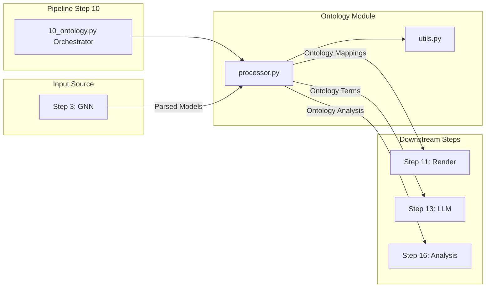

# Ontology Module

This module validates GNN model ontology annotations against the Active Inference ontology term set and writes per-file compliance reports.

## Module Structure

```
src/ontology/
├── __init__.py                    # Module exports and convenience wrappers
├── README.md                      # This documentation
├── mcp.py                         # MCP tool registration
├── processor.py                   # Core ontology processing
├── utils.py                       # Module metadata helpers
└── act_inf_ontology_terms.json   # Active Inference ontology terms
```

### Module Integration Flow


```mermaid
flowchart LR
    subgraph "Pipeline Step 10"
        Step10[10_ontology.py Orchestrator]
    end

    subgraph "Ontology Module"
        Processor[processor.py]
        Utils[utils.py]
    end

    subgraph "Input Source"
        Step3[Step 3: GNN]
    end

    subgraph "Downstream Steps"
        Step11[Step 11: Render]
        Step13[Step 13: LLM]
        Step16[Step 16: Analysis]
    end

    Step10 --> Processor
    Processor --> Utils

    Step3 -->|Parsed Models| Processor

    Processor -->|Ontology Mappings| Step11
    Processor -->|Ontology Terms| Step13
    Processor -->|Ontology Analysis| Step16
```

## Core Components

### Ontology Processing Functions

#### `process_ontology(target_dir: Path, output_dir: Path, verbose: bool = False, **kwargs) -> bool`
Main pipeline entry point (`processor.py`), called by `10_ontology.py`. Discovers GNN files, parses each file's `ActInfOntologyAnnotation` section, validates the annotations against `act_inf_ontology_terms.json`, and writes reports.

Consumed `**kwargs`: `strict_validation` (default `False`), `recursive` (default `True`), `ontology_terms_file` (default `src/ontology/act_inf_ontology_terms.json`).

**Returns:** `bool` — success status.

#### `parse_gnn_ontology_section(content: str) -> Dict[str, Any]`
Extracts the ontology annotation section from GNN Markdown content.

#### `load_defined_ontology_terms(ontology_terms_file: Path | None = None, *, search_paths: Sequence[Path] | None = None) -> Dict[str, Any]`
Loads the ontology term dictionary (default: bundled `act_inf_ontology_terms.json`). An explicit file is authoritative and fails closed; the optional `search_paths` keyword is a dependency-injection hook for tests and alternate installs (warn-and-continue on misses, then built-in defaults).

#### `parse_annotation(annotation: str) -> ParsedAnnotation`
Parses a single annotation string such as `A=LikelihoodMatrix` into a `ParsedAnnotation` NamedTuple (`key`, `value`, `comment`) — still a 3-tuple, so positional unpacking keeps working.

#### `validate_annotations(annotations, ontology_terms: Dict[str, Any] | None = None) -> Dict[str, Any]`
Validates annotation strings against the known term set (case-insensitive match). Returns valid/invalid annotations plus correction suggestions via Levenshtein-distance matching. Internally delegates to the pure helpers `_build_term_lookup`, `_term_matches`, and `suggest_terms`.

#### `process_gnn_ontology(gnn_file: str, ontology_terms: Dict[str, Any] | None = None) -> Dict[str, Any]`
Reads a single GNN file, parses its ontology section, and validates the annotations. Delegates to `analyze_ontology_content`.

#### `analyze_ontology_content(content: str, ontology_terms: Dict[str, Any] | None = None) -> Dict[str, Any]`
Single pure entry point: parse GNN content + load terms + validate annotations, returning `{"ontology_data", "validation_result", "ontology_terms"}`. Shared by `process_gnn_ontology` and `OntologyProcessor.process_ontology`.

#### `suggest_terms(annotations, ontology_terms=None, *, max_distance=3) -> List[Dict[str, Any]]`
Returns nearest-ontology-term suggestions for unknown annotations, each `{"annotation", "suggested_term", "description", "distance"}` ranked closest-first. Reuses the same heuristic as `validate_annotations`, exposed for LLM/report consumers.

#### `summarise_coverage(validation_result: Dict[str, Any]) -> str`
Renders a `validate_annotations` result as a compact coverage line (e.g. `"3/4 annotations valid (coverage 75.0%); 1 suggestion"`).

#### `build_ontology_terms(terms, *, descriptions=None, uris=None) -> Dict[str, Any]`
Builds a normalized ontology-terms dictionary in memory (the shape `load_defined_ontology_terms` returns) without writing a JSON file. Rejects empty names, exact duplicates, and case-folded duplicates (e.g. `["A", "a"]`) to uphold the case-insensitive lookup invariant.

#### `generate_ontology_report_for_file(gnn_file: Path, output_dir: Path, *, ontology_terms: Dict[str, Any] | None = None) -> Dict[str, Any]`
Writes `<file_stem>_ontology_report.json` for a single GNN file.

#### `validate_ontology_terms(terms: List[str] | str | None = None) -> bool`
Convenience boolean validator for terms/annotations.

### Convenience Classes

#### `OntologyProcessor`
Wraps `process_ontology()` (content-based) and `validate_terms()`.

#### `OntologyValidator`
Exposes `validate(annotations)`, `validate_ontology(content)`, and `check_consistency(annotations)` for quick boolean checks.

#### `OntologyTermIndex`
Prebuilt case-insensitive index over a vocabulary for batch callers: `OntologyTermIndex(terms)`, `.from_file(path)`, or `.from_names(...)`; then `lookup(value)`, `known_terms()`, `validate(annotations)`, `suggest(annotations)`, `len()`, and `in` checks.

### Active Inference Ontology

#### Core Concepts
- **States**: Hidden states, observations, actions
- **Matrices**: A, B, C, D matrices and their roles
- **Processes**: Inference, learning, planning
- **Measures**: Free energy, surprise, uncertainty

## Usage Examples

### Basic Ontology Processing

```python
from pathlib import Path
from ontology import process_ontology

success = process_ontology(
    target_dir=Path("models/"), output_dir=Path("ontology_output/"), verbose=True
)
```

### Annotation Validation

```python
from ontology import validate_annotations, load_defined_ontology_terms

terms = load_defined_ontology_terms()
result = validate_annotations(["A=LikelihoodMatrix", "B=TransitionTensor"], terms)
print(result["invalid_annotations"])   # misspellings land here
print(result.get("suggestions", {}))   # nearest-term suggestions
```

### Single-File Processing

```python
from ontology import process_gnn_ontology

result = process_gnn_ontology("input/gnn_files/discrete/simple_mdp.md")
print(result["success"], result.get("validation_result", {}))
```

## Integration with Pipeline

`10_ontology.py` calls `process_ontology()` only. It reads GNN files (preferably step-3 output) and writes validation reports to the step-10 output directory.

### Output Structure
```
output/10_ontology_output/
├── ontology_results.json                          # Aggregate summary across processed files
└── <model>_ontology_report.json                   # One per processed model
```

## Configuration

No module-level configuration file. Options are passed as `**kwargs` on `process_ontology()` (`ontology_terms_file`, `strict_validation`, `recursive`); correction suggestions are computed with Levenshtein distance in `processor.py`.

## Error Handling

Entry points catch failures internally and return error/status dicts instead of raising. A missing or malformed terms file falls back to the bundled `act_inf_ontology_terms.json`; unreadable GNN models are skipped and logged while remaining files are processed.

## Testing and Validation

Tests live in `src/tests/ontology/`:

- `test_ontology_overall.py` — module-level behavior
- `test_ontology_annotations.py` — annotation parsing/validation
- `test_ontology_public_api.py` — public export surface
- `test_ontology_composability.py` — composability helpers, vocabulary dedup invariant, MCP real-vocabulary behavior

Run: `uv run --extra dev python -m pytest src/tests/ontology/ -v`

## Dependencies

Standard library only (`json`, `pathlib`, `re`, `collections`). No external NLP dependencies.

## Troubleshooting
- **Validation fails for valid terms**: check that `src/ontology/act_inf_ontology_terms.json` exists, is valid JSON, and includes the terms; term matching is case-insensitive (case-folded), so `hiddenstate` and `HiddenState` are equivalent.
- **No reports produced**: run step 3 first so GNN files are parsed, and pass `verbose=True` for per-file logs.

## Summary

The Ontology module validates GNN `ActInfOntologyAnnotation` sections against the Active Inference ontology term set and reports per-model compliance. Downstream steps consume these reports for render, LLM, and analysis work.

## License and Citation

This module is part of the GeneralizedNotationNotation project. See the main repository for license and citation information.

## References

- Project overview: ../../README.md
- Comprehensive docs: ../../DOCS.md
- Architecture guide: ../../ARCHITECTURE.md
- Pipeline details: ../../doc/pipeline/README.md

---
## Documentation
- **[README](README.md)**: Module Overview
- **[AGENTS](AGENTS.md)**: Agentic Workflows
- **[SPEC](SPEC.md)**: Architectural Specification
- **[SKILL](SKILL.md)**: Capability API
