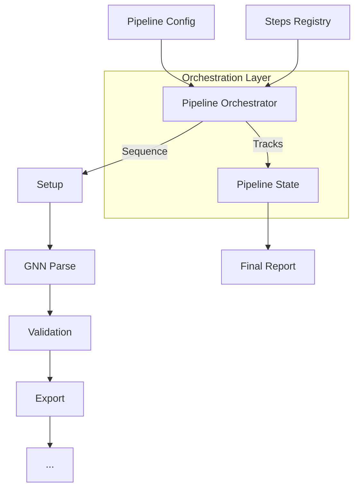
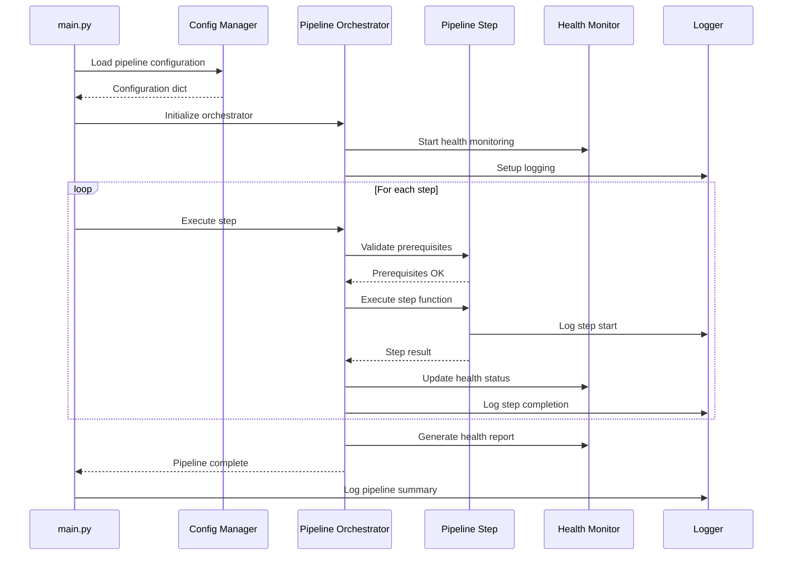
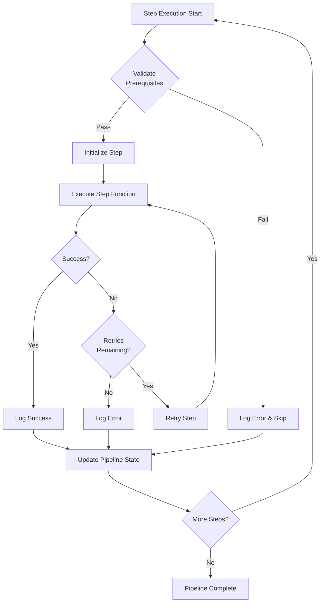

# Pipeline Module

This module provides core pipeline orchestration, configuration management, and step coordination for the GNN processing pipeline. It manages the 25-step pipeline execution, configuration handling, and inter-module communication.

## Module Structure

```
src/pipeline/
├── __init__.py                    # Module initialization and exports
├── README.md                      # This documentation
├── AGENTS.md                      # Agent scaffolding documentation
├── config.py                      # Pipeline configuration management
├── pipeline_validation.py        # Pipeline validation utilities
├── pipeline_validator.py         # Pipeline validator
├── pipeline_step_template.py    # Pipeline step template
├── health_check.py               # Pipeline health checker
├── diagnostic_enhancer.py        # Diagnostic enhancement
├── execution.py                   # Pipeline execution
├── discovery.py                  # Pipeline discovery
├── mcp.py                        # MCP integration
├── verify_pipeline.py            # Pipeline verification
├── durable_streams.py            # v3: stream manifests + replayable execution traces
├── run_session.py                # v3: resumable run sessions (checkpoint/resume/cleanup)
├── container_plan.py             # v3: auditable container plans + static security review
```

### v3.0.0 Long-Running Orchestration (safe-by-design)

Three modules provide the foundation for long-running, resumable, deployable-by-plan runs **without
any live infrastructure mutation** (no container execution, no cluster/sensor calls):

- **`durable_streams.py`** — `StreamManifest` (file/array, content-checksummed) and `ExecutionTrace`
  with integrity checks + deterministic replay.
- **`run_session.py`** — `RunSession` manifests with atomic checkpoint/resume, status inspection, and
  path-safe cancellation cleanup.
- **`container_plan.py`** — hardened container plan generation, static `security_review`
  (CRITICAL/HIGH/MEDIUM/LOW), rollback descriptors, and deterministic plan hashes.

Full reference: [`doc/pipeline/v3_orchestration.md`](../../doc/pipeline/v3_orchestration.md). Acceptance
gate: `PYTHONPATH=src uv run python scripts/run_v3_orchestration_acceptance.py --strict`.

### Pipeline Flow



### Pipeline Orchestration Architecture



### Step Execution Flow



## Core Components

### Pipeline Configuration Management (`config.py`)

#### `get_pipeline_config() -> dict`
Returns the pipeline configuration as a plain dict (steps, timeout, parallel).

#### `set_pipeline_config(config: PipelineConfig) -> None`
Saves a new pipeline configuration.

#### `get_output_dir_for_script(script_name: str, base_output_dir: Path) -> Path`
Returns the standardized per-step output directory (e.g. `output/3_gnn_output/`).

### Pipeline Execution (`execution.py`)

#### `run_pipeline(target_dir, output_dir, steps=None, **kwargs) -> bool`
Executes the pipeline for a target directory (see `run_pipeline` in `execution.py`).

#### `execute_pipeline_step(step_name, target_dir, output_dir, **kwargs) -> StepExecutionResult`
Executes one step, returning a result object with success, duration, output files, and errors.

#### `execute_pipeline_steps(step_names, target_dir, output_dir, **kwargs)`
Executes an ordered list of steps.

#### `get_pipeline_status() -> dict`
Returns current pipeline execution status and statistics.

#### `validate_pipeline_config(config: dict) -> bool`
Validates a pipeline configuration dict.

### Step Ordering (`dag.py`)

#### `resolve_execution_order(step_names, ...) -> List[str]`
Topological sort over the step dependency DAG.

#### `visualize_dag(step_names, output_path) -> bool`
Writes a Mermaid or DOT rendering of the DAG.

### Step Registry (`step_registry.py`)

The canonical `STEPS` list (25 `StepInfo` entries) with lookups `step_for_name`,
`step_for_stem`, tag filters `get_core_steps()` / `get_llm_steps()`, and stage
definitions in `STAGE_DEFINITIONS`. Step-level prerequisites are validated by
`pipeline/pipeline_validator.py`; there are no `register_step` / `get_step_status`
/ `reset_step` runtime registration APIs — steps are declared in `STEPS`.

## Usage Examples

### Running Steps Through `main.py`

In practice the pipeline runs through `src/main.py` (CLI flags `--only-steps`,
`--skip-steps`, etc.); the `pipeline.execution` helpers below are programmatic
wrappers around that entry point.

```python
from pipeline.execution import run_pipeline, execute_pipeline_step, get_pipeline_status

# Execute the pipeline for a target directory (returns a compact summary dict)
summary = run_pipeline(
    target_dir="input/gnn_files",
    output_dir="output",
    steps="all",
)

# Execute a single step
result = execute_pipeline_step(
    step_name="6_validation",
    target_dir=Path("input/gnn_files"),
    output_dir=Path("output"),
)

# Inspect pipeline status
status = get_pipeline_status()
```

### DAG-Based Ordering

```python
from pipeline.dag import resolve_execution_order

order = resolve_execution_order(["render", "gnn", "execute"])
print(f"Resolved order: {order}")
```

### Configuration

```python
from pipeline.config import get_pipeline_config, get_output_dir_for_script
from pathlib import Path

config = get_pipeline_config()
print(f"Steps: {config['steps']}")

output_dir = get_output_dir_for_script("3_gnn.py", Path("output"))
print(f"GNN output directory: {output_dir}")
```

## Pipeline Structure

### 25-Step Pipeline (Current)
The pipeline consists of exactly 25 steps (steps 0-24), executed in order:

1. **0_template.py** → `src/template/` - Pipeline template and initialization
2. **1_setup.py** → `src/setup/` - UV environment setup and dependency management
3. **2_tests.py** → `src/tests/` - Comprehensive test suite execution
4. **3_gnn.py** → `src/gnn/` - GNN file discovery, multi-format parsing, and validation
5. **4_model_registry.py** → `src/model_registry/` - Model registry management and versioning
6. **5_type_checker.py** → `src/type_checker/` - GNN syntax validation and resource estimation
7. **6_validation.py** → `src/validation/` - Advanced validation and consistency checking
8. **7_export.py** → `src/export/` - Multi-format export (JSON, XML, GraphML, GEXF, Pickle)
9. **8_visualization.py** → `src/visualization/` - Graph and matrix visualization generation
10. **9_advanced_viz.py** → `src/advanced_visualization/` - Advanced visualization and interactive plots
11. **10_ontology.py** → `src/ontology/` - Active Inference Ontology processing and validation
12. **11_render.py** → `src/render/` - Code generation for PyMDP, RxInfer, ActiveInference.jl, JAX, PyTorch, NumPyro, DisCoPy, bnlearn, and Stan-supported render paths
13. **12_execute.py** → `src/execute/` - Execute rendered simulation scripts with result capture
14. **13_llm.py** → `src/llm/` - LLM-enhanced analysis, model interpretation, and AI assistance
15. **14_ml_integration.py** → `src/ml_integration/` - Machine learning integration and model training
16. **15_audio.py** → `src/audio/` - Audio generation (SAPF, Pedalboard, and other backends)
17. **16_analysis.py** → `src/analysis/` - Advanced analysis and statistical processing
18. **17_integration.py** → `src/integration/` - System integration and cross-module coordination
19. **18_security.py** → `src/security/` - Security validation and access control
20. **19_research.py** → `src/research/` - Research tools and experimental features
21. **20_website.py** → `src/website/` - Static HTML website generation from pipeline artifacts
22. **21_mcp.py** → `src/mcp/` - Model Context Protocol processing and tool registration
23. **22_gui.py** → `src/gui/` - Interactive GUI for constructing/editing GNN models
24. **23_report.py** → `src/report/` - Comprehensive analysis report generation
25. **24_intelligent_analysis.py** → `src/intelligent_analysis/` - AI-powered pipeline analysis and executive reports

### Execution Flow (conceptual)

1. Load configuration (`input/config.yaml` via `src/main.py`)
2. Discover steps (`pipeline/step_registry.py`) and resolve dependencies (`pipeline/dag.py`)
3. Execute routed steps per testing matrix, writing per-step outputs
4. Write `00_pipeline_summary/pipeline_execution_summary.json`

## Configuration Options

Real configuration lives in `input/config.yaml` (testing matrix, `pipeline.skip_steps`,
LLM settings) plus `PipelineConfig` defaults in `pipeline/config.py`
(`timeout: 3600`, `retries: 3`, `parallel: True`). The illustrative dicts that
previously appeared here are not literal schema — check `pipeline/config.py`
and `utils/arg_parsing.py` for the accepted keys.

## Error Handling

Step failures are handled by `main.py` per the safe-to-fail contract: steps
log, write artifacts, and return structured exit codes (0 / 1 / 2) rather than
raising. `pipeline/execution.py` `run_pipeline` returns a compact summary dict;
`execute_pipeline_step` returns a `StepExecutionResult` with success/duration/
errors. There are no `PipelineError` / `StepError` / `ConfigError` exception
classes in this module.

## Performance Optimization

- **Parallel Execution**: `execution_workers` controls script-level parallelism in Step 12; `PipelineConfig.parallel` covers orchestration
- **Caching**: `gnn/parse_cache.py` caches parse results for reuse
- **Incremental Processing**: matrix routing runs per-folder step lists from `input/config.yaml`

## Testing and Validation

```bash
uv run --extra dev python -m pytest src/tests/pipeline/ -q --tb=short
```

Key suites: `test_pipeline_integration.py`, `test_pipeline_functionality.py`,
`test_pipeline_performance.py`.

## Dependencies

### Required Dependencies
- **pathlib**: Path handling
- **json**: JSON configuration handling
- **logging**: Logging functionality
- **typing**: Type hints
- **time**: Time utilities

### Optional Dependencies
- **yaml**: YAML configuration parsing

## Performance

Per-step timeouts live in `pipeline/step_timeouts.py` (overridable via
`GNN_STEP_TIMEOUT_{N}` and `GNN_STEP_TIMEOUT_SCALE`). Run-to-run timing,
memory, and pass/fail counts are recorded in each run's
`00_pipeline_summary/pipeline_execution_summary.json` and per-step summaries —
consult those for measurements instead of the static ranges some older docs printed.

## Summary

The Pipeline module provides orchestration, configuration, step coordination,
and the canonical step registry for the 25-step GNN pipeline.

## License and Citation

This module is part of the GeneralizedNotationNotation project. See the main repository for license and citation information. 

## References

- Project overview: ../../README.md
- Comprehensive docs: ../../DOCS.md
- Architecture guide: ../../ARCHITECTURE.md
- Pipeline details: ../../doc/pipeline/README.md

---
## Documentation
- **[README](README.md)**: Module Overview
- **[AGENTS](AGENTS.md)**: Agentic Workflows
- **[SPEC](SPEC.md)**: Architectural Specification
- **[SKILL](SKILL.md)**: Capability API
