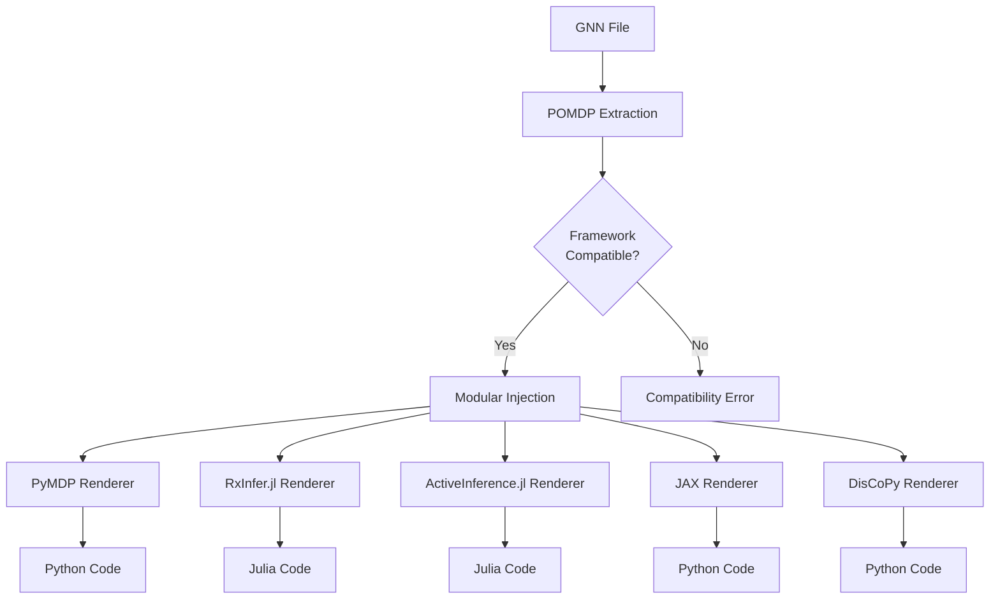
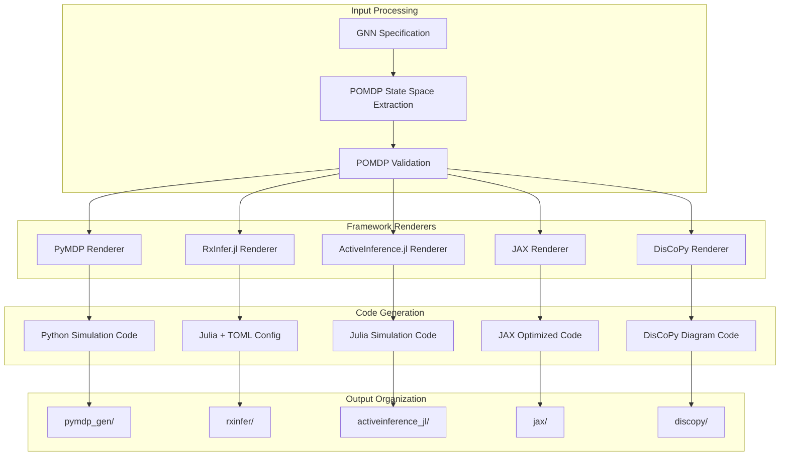
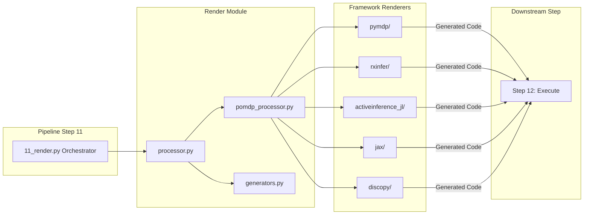

# POMDP-Aware Render Module

This module provides **POMDP-aware code generation** for GNN models. It translates parsed GNN/POMDP specifications into executable simulation code for multiple frameworks including PyMDP, RxInfer.jl, ActiveInference.jl, JAX, DisCoPy, and (when available) PyTorch, NumPyro, and Stan.

## Key Features

- **POMDP state space extraction**: extracts Active Inference matrices (A, B, C, D, E) and dimensions from GNN specs.
- **Modular injection**: injects extracted state spaces into framework-specific renderers with compatibility checks.
- **Implementation-specific outputs**: organizes code under per-model/per-framework subfolders.
- **Structured summaries**: writes `render_processing_summary.json` and overview README content under the output directory.

## POMDP Processing Pipeline


```mermaid
graph TD
    GNN[GNN File] --> Extract[POMDP Extraction]
    Extract --> Check{Framework<br/>Compatible?}
    
    Check -->|Yes| Inject[Modular Injection]
    Check -->|No| Error[Compatibility Error]
    
    Inject --> PyMDP[PyMDP Renderer]
    Inject --> RxInfer[RxInfer.jl Renderer]
    Inject --> ActInf[ActiveInference.jl Renderer]
    Inject --> JAX[JAX Renderer]
    Inject --> DisCoPy[DisCoPy Renderer]
    
    PyMDP --> Code1[Python Code]
    RxInfer --> Code2[Julia Code]
    ActInf --> Code3[Julia Code]
    JAX --> Code4[Python Code]
    DisCoPy --> Code5[Python Code]
```

### Framework Rendering Architecture


```mermaid
graph TB
    subgraph "Input Processing"
        GNNFile[GNN Specification]
        POMDPExtract[POMDP State Space Extraction]
        Validate[POMDP Validation]
    end
    
    subgraph "Framework Renderers"
        PyMDPRenderer[PyMDP Renderer]
        RxInferRenderer[RxInfer.jl Renderer]
        ActInfRenderer[ActiveInference.jl Renderer]
        JAXRenderer[JAX Renderer]
        DisCoPyRenderer[DisCoPy Renderer]
    end
    
    subgraph "Code Generation"
        PyMDPCode[Python Simulation Code]
        RxInferCode[Julia + TOML Config]
        ActInfCode[Julia Simulation Code]
        JAXCode[JAX Optimized Code]
        DisCoPyCode[DisCoPy Diagram Code]
    end
    
    subgraph "Output Organization"
        PyMDPOut[pymdp_gen/]
        RxInferOut[rxinfer/]
        ActInfOut[activeinference_jl/]
        JAXOut[jax/]
        DisCoPyOut[discopy/]
    end
    
    GNNFile --> POMDPExtract
    POMDPExtract --> Validate
    Validate --> PyMDPRenderer
    Validate --> RxInferRenderer
    Validate --> ActInfRenderer
    Validate --> JAXRenderer
    Validate --> DisCoPyRenderer
    
    PyMDPRenderer --> PyMDPCode
    RxInferRenderer --> RxInferCode
    ActInfRenderer --> ActInfCode
    JAXRenderer --> JAXCode
    DisCoPyRenderer --> DisCoPyCode
    
    PyMDPCode --> PyMDPOut
    RxInferCode --> RxInferOut
    ActInfCode --> ActInfOut
    JAXCode --> JAXOut
    DisCoPyCode --> DisCoPyOut
```

### Module Integration Flow


```mermaid
flowchart LR
    subgraph "Pipeline Step 11"
        Step11[11_render.py Orchestrator]
    end
    
    subgraph "Render Module"
        Processor[processor.py]
        POMDPProc[pomdp_processor.py]
        Generators[generators.py]
    end
    
    subgraph "Framework Renderers"
        PyMDP[pymdp/]
        RxInfer[rxinfer/]
        ActInf[activeinference_jl/]
        JAX[jax/]
        DisCoPy[discopy/]
    end
    
    subgraph "Downstream Step"
        Step12[Step 12: Execute]
    end
    
    Step11 --> Processor
    Processor --> POMDPProc
    Processor --> Generators
    
    POMDPProc --> PyMDP
    POMDPProc --> RxInfer
    POMDPProc --> ActInf
    POMDPProc --> JAX
    POMDPProc --> DisCoPy
    
    PyMDP -->|Generated Code| Step12
    RxInfer -->|Generated Code| Step12
    ActInf -->|Generated Code| Step12
    JAX -->|Generated Code| Step12
    DisCoPy -->|Generated Code| Step12
```

## Module Structure

```
src/render/
├── __init__.py                    # Module initialization and exports
├── README.md                      # This documentation
├── mcp.py                         # Model Context Protocol integration
├── render.py                      # Core rendering functionality
├── processor.py                   # Main render processor (Step 11 entry)
├── generators.py                  # Code generation utilities
├── pomdp_processor.py             # POMDP state space injection into renderers
├── pymdp_template.py              # PyMDP template definitions
├── visualization_suite.py         # Render visualization suite
├── pymdp/                         # PyMDP code generation
│   ├── __init__.py               # PyMDP module initialization
│   ├── pymdp_renderer.py         # PyMDP renderer
│   ├── pymdp_converter.py        # GNN to PyMDP converter
│   ├── pymdp_templates.py        # PyMDP code templates
│   └── pymdp_utils.py            # PyMDP utilities
├── rxinfer/                       # RxInfer.jl code generation
│   ├── __init__.py               # RxInfer module initialization
│   ├── rxinfer_renderer.py       # RxInfer renderer
│   ├── gnn_parser.py             # GNN parser for RxInfer
│   └── toml_generator.py         # TOML configuration generator
├── activeinference_jl/            # ActiveInference.jl code generation
│   ├── __init__.py               # ActiveInference.jl module initialization
│   └── activeinference_renderer.py # ActiveInference.jl renderer
├── jax/                           # JAX code generation
│   ├── __init__.py               # JAX module initialization
│   ├── jax_renderer.py           # JAX renderer
│   └── templates/                 # JAX code templates
│       ├── __init__.py           # Templates initialization
│       ├── combined_template.py   # Combined JAX template
│       ├── general_template.py    # General JAX template
│       └── pomdp_template.py     # POMDP JAX template
└── discopy/                       # DisCoPy code generation
    ├── __init__.py               # DisCoPy module initialization
    ├── discopy_renderer.py       # DisCoPy renderer
    ├── translator.py              # GNN to DisCoPy translator
```

## Core Components

### Step 11 entrypoint (`processor.py`)

The pipeline calls:

- `render.process_render(target_dir, output_dir, verbose=False, frameworks=None, strict_validation=True, **kwargs) -> bool`

In POMDP-aware mode, `process_render` delegates per-model/per-framework rendering to `POMDPRenderProcessor` in `pomdp_processor.py`.

### Framework backends

Backend-specific renderers live under:

- `src/render/pymdp/`
- `src/render/rxinfer/`
- `src/render/activeinference_jl/`
- `src/render/jax/`
- `src/render/discopy/`
- optional: `src/render/pytorch/`, `src/render/numpyro/`, `src/render/stan/`

The supported framework inventory for the module is reflected by `src/render/health.py` and the export surface in `src/render/__init__.py`.

## Usage Examples

### Basic Code Generation

```python
from pathlib import Path
from render import process_render

success = process_render(
    target_dir=Path("input/gnn_files"),
    output_dir=Path("output/11_render_output"),
    verbose=True,
)
print("ok" if success else "render completed with issues")
```

### Framework-Specific Rendering

```python
from pathlib import Path
from render import render_gnn_spec

success, msg, artifacts = render_gnn_spec(
    gnn_spec=parsed_spec,
    target="pymdp",
    output_directory=Path("output/11_render_output/single/pymdp"),
)
print(success, msg, artifacts)
```

### Multi-Framework Generation

```python
from pathlib import Path
from render import process_render

process_render(
    target_dir=Path("input/gnn_files"),
    output_dir=Path("output/11_render_output"),
    frameworks=["pymdp", "jax", "discopy"],
    strict_validation=True,
)
```

## Rendering Pipeline

Rendering is driven by:

- extraction + normalization (`gnn.pomdp_extractor`, `render.processor.normalize_matrices`)
- per-framework rendering (`render.pomdp_processor.POMDPRenderProcessor`)
- structured summaries (`render_processing_summary.json` and per-framework README files)

## Integration with Pipeline

### Pipeline Step 11: Code Rendering

`src/11_render.py` is a thin orchestrator that calls `render.process_render(...)`.

### Output Structure

The POMDP-aware render system creates **implementation-specific output subfolders** for organized code generation:

```
output/11_render_output/
├── [model_name]/                          # Model-specific directory
│   ├── pymdp/                            # PyMDP implementation
│   │   ├── [model_name]_pymdp.py         # Generated simulation script
│   │   ├── README.md                     # Framework-specific documentation
│   │   └── processing_summary.json       # Processing details
│   ├── rxinfer/                          # RxInfer.jl implementation  
│   │   ├── [model_name]_rxinfer.jl       # Generated Julia script
│   │   ├── README.md                     # Framework-specific documentation
│   │   └── processing_summary.json       # Processing details
│   ├── activeinference_jl/               # ActiveInference.jl implementation
│   │   ├── [model_name]_activeinference.jl # Generated Julia script
│   │   ├── README.md                     # Framework-specific documentation
│   │   └── processing_summary.json       # Processing details
│   ├── jax/                              # JAX implementation
│   │   ├── [model_name]_jax.py           # Generated JAX script
│   │   ├── README.md                     # Framework-specific documentation
│   │   └── processing_summary.json       # Processing details
│   ├── discopy/                          # DisCoPy implementation
│   │   ├── [model_name]_discopy.py       # Generated diagram script
│   │   ├── README.md                     # Framework-specific documentation
│   │   └── processing_summary.json       # Processing details
│   └── processing_summary.json           # Overall model processing summary
├── README.md                             # Overall processing documentation
└── render_processing_summary.json        # Complete processing results
```

## POMDP Processing Features

### POMDP State Space Extraction (`gnn.pomdp_extractor`)

The system automatically extracts Active Inference structures from GNN specifications:

**Extracted Components:**

- **A Matrix**: Likelihood mapping P(o|s) - observations given states
- **B Matrix**: Transition dynamics P(s'|s,a) - next states given current states and actions
- **C Vector**: Preferences over observations (log-probabilities)
- **D Vector**: Prior beliefs over initial hidden states
- **E Vector**: Policy priors (habits) over actions

**State Space Variables:**

- Hidden states, observations, actions with dimensions and types
- Connections and relationships between variables
- Ontology mappings to Active Inference concepts

**Example POMDP Extraction:**

```python
from gnn.pomdp_extractor import extract_pomdp_from_file

# Extract POMDP from GNN file
pomdp_space = extract_pomdp_from_file("input/gnn_files/actinf_pomdp_agent.md")

print(f"Model: {pomdp_space.model_name}")
print(f"States: {pomdp_space.num_states}")
print(f"Observations: {pomdp_space.num_observations}")  
print(f"Actions: {pomdp_space.num_actions}")
print(f"A Matrix: {len(pomdp_space.A_matrix)} x {len(pomdp_space.A_matrix[0])}")
```

### Modular Injection System (`pomdp_processor.py`)

The processor validates POMDP compatibility and injects state spaces into framework renderers:

**Compatibility Validation:**

- Checks required matrices are present for each framework
- Validates matrix dimensions and consistency
- Warns about framework limitations (e.g., multi-modality support)

**Framework-Specific Processing:**

```python
from render.pomdp_processor import process_pomdp_for_frameworks

# Process for all frameworks
results = process_pomdp_for_frameworks(
    pomdp_space=pomdp_space,
    output_dir="output/11_render_output/",
    frameworks=["pymdp", "activeinference_jl", "rxinfer"],
    strict_validation=True
)

# Results include success/failure for each framework
for framework, result in results['framework_results'].items():
    status = "✅" if result['success'] else "❌"
    print(f"{status} {framework}: {result['message']}")
```

### Structured Documentation Generation

Each framework rendering includes:

- **Model Information**: Extracted from GNN annotations
- **POMDP Dimensions**: States, observations, actions
- **Active Inference Matrices**: Available matrices with dimensions
- **Generated Files**: List of created simulation scripts
- **Usage Instructions**: Framework-specific execution guidance
- **Warnings**: Any compatibility or processing issues

## Framework Features

### PyMDP Framework

- **Purpose**: Python-based Active Inference simulation
- **Strengths**: Easy to use, comprehensive documentation
- **Use Cases**: Research, prototyping, education
- **Integration**: NumPy, SciPy, Matplotlib

### RxInfer.jl Framework

- **Purpose**: Julia-based probabilistic programming
- **Strengths**: High performance, type safety
- **Use Cases**: Advanced research, high-performance computing
- **Integration**: Julia ecosystem, ReactiveMP

### ActiveInference.jl Framework

- **Purpose**: Julia-based Active Inference implementation
- **Strengths**: Native Julia, high performance
- **Use Cases**: Research, advanced simulations
- **Integration**: Julia ecosystem, optimization

### JAX Framework

- **Purpose**: High-performance numerical computing
- **Strengths**: GPU acceleration, automatic differentiation
- **Use Cases**: Research, custom algorithms
- **Integration**: NumPy, TensorFlow, optimization

### DisCoPy Framework

- **Purpose**: Categorical quantum computing
- **Strengths**: Diagrammatic reasoning, quantum algorithms
- **Use Cases**: Quantum computing, categorical methods
- **Integration**: TensorFlow, quantum libraries

## Configuration Options

### Rendering Settings

```python
# Rendering configuration
config = {
    'default_framework': 'pymdp',    # Default rendering framework
    'template_enabled': True,         # Enable template-based rendering
    'validation_enabled': True,       # Enable code validation
    'documentation_enabled': True,    # Enable documentation generation
    'testing_enabled': True,          # Enable test generation
    'optimization_enabled': True      # Enable code optimization
}
```

### Framework-Specific Settings

```python
# Framework-specific configuration
framework_config = {
    'pymdp': {
        'version': '0.4.0',
        'include_visualization': True,
        'include_testing': True
    },
    'rxinfer': {
        'julia_version': '1.9',
        'include_benchmarks': True,
        'include_documentation': True
    },
    'jax': {
        'jax_version': '0.4.0',
        'include_gpu_support': True,
        'include_optimization': True
    }
}
```

## Error Handling

### Rendering Failures

```python
# Handle rendering failures gracefully
try:
    results = render_gnn_model(content, framework, output_dir)
except RenderingError as e:
    logger.error(f"Rendering failed: {e}")
    # Provide recovery rendering or error reporting
```

### Framework Issues

```python
# Handle framework-specific issues
try:
    renderer = select_renderer(framework)
    results = renderer.render_model(content, output_dir)
except FrameworkError as e:
    logger.warning(f"Framework failed: {e}")
    # Fall back to alternative framework
```

### Template Issues

```python
# Handle template issues
try:
    template = load_template(template_name)
    results = render_with_template(content, template)
except TemplateError as e:
    logger.error(f"Template failed: {e}")
    # Use default template or error reporting
```

## Performance Optimization

### Code Generation Optimization

- **Template Caching**: Cache rendered templates
- **Parallel Generation**: Parallel code generation
- **Incremental Generation**: Incremental code updates
- **Optimized Algorithms**: Optimize generation algorithms

### Framework Optimization

- **Framework Selection**: Optimize framework selection
- **Code Optimization**: Optimize generated code
- **Memory Management**: Optimize memory usage
- **Performance Monitoring**: Monitor generation performance

### Validation Optimization

- **Validation Caching**: Cache validation results
- **Parallel Validation**: Parallel code validation
- **Incremental Validation**: Incremental validation updates
- **Optimized Validation**: Optimize validation algorithms

## Testing and Validation

### Unit Tests

```python
# Test individual rendering functions
def test_pymdp_rendering():
    results = render_gnn_model(test_content, "pymdp", test_dir)
    assert 'main_script' in results
    assert 'config_file' in results
    assert results['main_script'].exists()
```

### Integration Tests

```python
# Test complete rendering pipeline
def test_rendering_pipeline():
    success = process_render(test_dir, output_dir)
    assert success
    # Verify rendering outputs
    rendering_files = list(output_dir.glob("**/*"))
    assert len(rendering_files) > 0
```

### Framework Tests

```python
# Test different frameworks
def test_framework_rendering():
    frameworks = ["pymdp", "rxinfer", "jax"]
    for framework in frameworks:
        results = render_gnn_model(test_content, framework, test_dir)
        assert results['success']
```

## Dependencies

### Required Dependencies

- Standard library + `numpy` (used in render processors and matrix normalization)

This module uses Python string templates and code-generation helpers; it does not rely on Jinja2.

### Optional Dependencies

- **black**: Code formatting for Python
- **julia**: Julia language support
- **jax**: JAX framework support
- **discopy**: DisCoPy framework support

## Performance

Performance and success metrics are tracked by the pipeline summaries and per-step logs. Avoid hard-coded numeric claims in docs unless sourced from current benchmark outputs.

## Troubleshooting

### Common Issues

#### 1. Framework Compatibility

```
Error: Framework not supported for model type
Solution: Use compatible framework or adjust model structure
```

#### 2. Template Issues

```
Error: Template rendering failed - invalid syntax
Solution: Check template syntax or use default template
```

#### 3. Code Generation Issues

```
Error: Code generation failed - invalid model structure
Solution: Validate model structure or use simpler framework
```

#### 4. Performance Issues

```
Error: Code generation taking too long
Solution: Optimize model complexity or use faster framework
```

### Debug Mode

```python
from pathlib import Path
from render import process_render

process_render(Path("input/gnn_files"), Path("output/11_render_output"), verbose=True)
```

## Future Enhancements

### Planned Features

- **Additional Frameworks**: Support for more simulation frameworks
- **Custom Templates**: User-defined code templates
- **Real-time Rendering**: Live code generation during development
- **Advanced Optimization**: Advanced code optimization techniques

### Performance Improvements

- **Parallel Generation**: Multi-core code generation
- **Incremental Updates**: Incremental code updates
- **Advanced Caching**: Advanced caching strategies
- **Machine Learning**: ML-based code generation

## Summary

The Render module provides POMDP-aware code generation for multiple frameworks and writes structured outputs intended for execution (Step 12) and downstream analysis/reporting steps.

## License and Citation

This module is part of the GeneralizedNotationNotation project. See the main repository for license and citation information.

## References

- Project overview: ../../README.md
- Comprehensive docs: ../../DOCS.md
- Architecture guide: ../../ARCHITECTURE.md
- Pipeline details: ../../doc/pipeline/README.md


---
## Documentation
- **[README](README.md)**: Module Overview
- **[AGENTS](AGENTS.md)**: Agentic Workflows
- **[SPEC](SPEC.md)**: Architectural Specification
- **[SKILL](SKILL.md)**: Capability API
