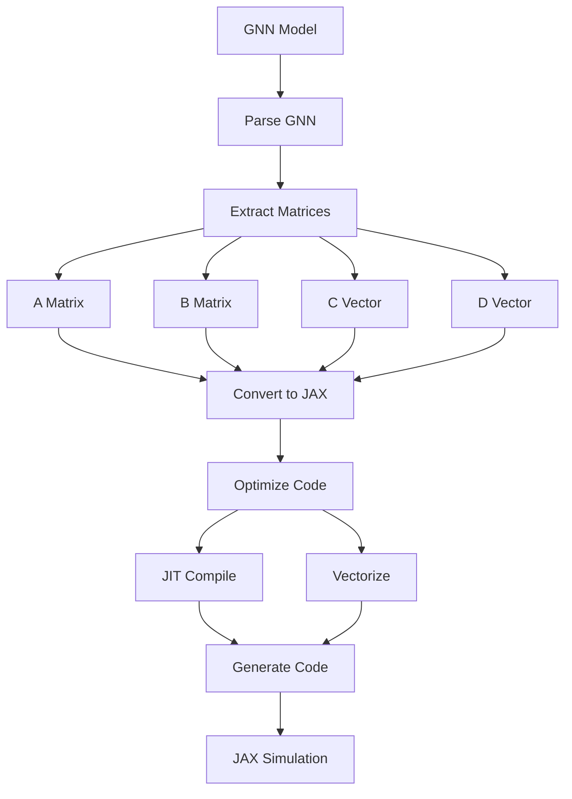

# JAX Renderer for GNN Specifications

This module generates **JAX-based Python scripts** from parsed GNN specifications, with support for:

- a general Active Inference–style model (pure JAX script),
- a JAX POMDP solver,
- a combined hierarchical / multi-agent / continuous variant.

## JAX Rendering Pipeline



## Features

- **JAX POMDP Solver**: Complete POMDP implementation with JIT compilation, vmap, and pmap
- **Belief Updates**: Bayesian belief updates with numerical stability
- **Value Iteration**: Alpha vector backup with vectorization
- **GNN Integration**: Automatic extraction of \(A, B, C, D\) matrices from supported GNN internal formats

## Requirements

### Core Dependencies
- **JAX** and **jaxlib**: required for all generated scripts.
- **NumPy**: used by the generator and imported by the generated scripts.

Additional dependencies depend on the generator:

- **`render_gnn_to_jax` (general model)**: emits a script that uses **only** `jax`, `jax.numpy`, and `numpy`.
- **`render_gnn_to_jax_pomdp` (POMDP solver)**: emits a script that uses `jax` and attempts to import **Optax** (with a “continue without” fallback).
- **`render_gnn_to_jax_combined` (combined model)**: emits a script that uses **Flax** and **Optax**.

### Hardware Support
- **CPU**: `uv pip install --upgrade jax[cpu]`
- **GPU (CUDA 12.x)**: `uv pip install --upgrade "jax[cuda12]" -f https://storage.googleapis.com/jax-releases/jax_cuda_releases.html`
- **TPU**: `uv pip install --upgrade "jax[tpu]" -f https://storage.googleapis.com/jax-releases/libtpu_releases.html`

## Usage

### Basic POMDP Rendering

```python
from render.jax import render_gnn_to_jax_pomdp
from pathlib import Path

# Render GNN specification to JAX POMDP solver
success, message, files = render_gnn_to_jax_pomdp(
    gnn_spec=parsed_gnn_spec,
    output_path=Path("output/pomdp_solver.py"),
    options={"optimization_level": "high"}
)
```

### General JAX Model Rendering

```python
from render.jax import render_gnn_to_jax
from pathlib import Path

# Render GNN specification to general JAX model
success, message, files = render_gnn_to_jax(
    gnn_spec=parsed_gnn_spec,
    output_path=Path("output/jax_model.py")
)
```

### Combined Model Rendering

```python
from render.jax import render_gnn_to_jax_combined
from pathlib import Path

# Render GNN specification to combined JAX model
success, message, files = render_gnn_to_jax_combined(
    gnn_spec=parsed_gnn_spec,
    output_path=Path("output/combined_model.py")
)
```

## Templates

`src/render/jax/templates/` contains string templates for alternative JAX code layouts.

**Current status**: the active renderer implementation in `src/render/jax/jax_renderer.py` does **not** import or use these templates; it generates code directly in Python. The templates remain documented and available for future refactors.

## Generated Code Features

### POMDP Solver
- **JIT-compiled belief updates** for maximum performance
- **Alpha vector backup** with vectorization
- **Value iteration** with convergence checking
- **Numerical stability** in all operations
- **Device-agnostic** execution (CPU/GPU/TPU)

### Model Architecture
- **Flax-based** neural network components
- **Learnable parameters** from GNN matrices
- **Type hints** and comprehensive documentation
- **Error handling** and validation

## Performance Optimizations

### JIT Compilation
```python
@partial(jit, static_argnums=(0,))
def belief_update(self, belief, action, observation):
    # JIT-compiled belief update
    pass
```

### Vectorization
```python
# Vectorized operations across belief points
beliefs = vmap(self.belief_update)(belief_points, actions, observations)
```

### Distributed Computing
```python
# Multi-device execution
@partial(pmap, static_broadcasted_argnums=(0,))
def distributed_backup(self, belief_points, alpha_vectors):
    return self.alpha_vector_backup(belief_points, alpha_vectors)
```

## GNN Matrix Extraction

The renderer automatically extracts and parses matrices from GNN specifications:

- **A Matrix**: Observation model P(o|s)
- **B Matrix**: Transition model P(s'|s,u)
- **C Vector**: Preferences over observations
- **D Vector**: Prior over initial states

## Examples

### Simple 2-State POMDP
```python
# GNN specification with 2 states, 2 observations, 2 actions
gnn_spec = {
    "ModelName": "SimplePOMDP",
    "InitialParameterization": """
        A = [0.8, 0.2; 0.2, 0.8]
        B = [0.9, 0.1; 0.1, 0.9], [0.1, 0.9; 0.9, 0.1]
        C = [0.0, 1.0]
        D = [0.5, 0.5]
    """
}

# Generate JAX POMDP solver
render_gnn_to_jax_pomdp(gnn_spec, Path("simple_pomdp.py"))
```

### Running Generated Code
```python
# Execute generated POMDP solver
import subprocess
result = subprocess.run(["python", "simple_pomdp.py"], capture_output=True, text=True)
print(result.stdout)
```

## Integration with Pipeline

The JAX renderer is integrated into the pipeline as a Step 11 backend:

1. **Step 11 (Render)**: Generates JAX code from GNN specifications
2. **Step 12 (Execute)**: Runs generated JAX scripts with performance monitoring
3. **Setup**: Installs dependencies; some generated scripts also include minimal self-install logic as a recovery path.

## Resources

- [JAX Documentation](https://github.com/google/jax)
- [Optax Documentation](https://optax.readthedocs.io)
- [Flax Documentation](https://flax.readthedocs.io)
- [PFJAX Documentation](https://pfjax.readthedocs.io)
- [POMDP Theory](https://arxiv.org/abs/1304.1118)
- [Point-Based Value Iteration](https://www.cs.cmu.edu/~ggordon/jpineau-ggordon-thrun.ijcai03.pdf)

## Troubleshooting

### Common Issues

1. **JAX Installation**: Ensure correct version for your hardware
2. **Memory Issues**: Use gradient checkpointing for large models
3. **Performance**: Enable JIT compilation and use appropriate devices
4. **Numerical Stability**: Check for NaN values in belief updates

### Debug Mode
```python
import jax
jax.config.update('jax_debug_nans', True)
jax.config.update('jax_debug_infs', True)
```

## Contributing

When extending the JAX renderer:

1. Follow JAX best practices for performance
2. Keep public API limited to re-exported functions from `src/render/jax/__init__.py`
3. Add type hints and error handling
4. Test with various GNN specifications
5. Document new features in this README
